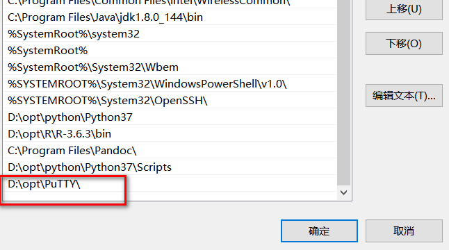
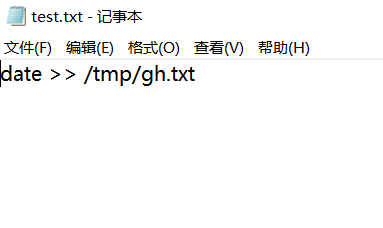
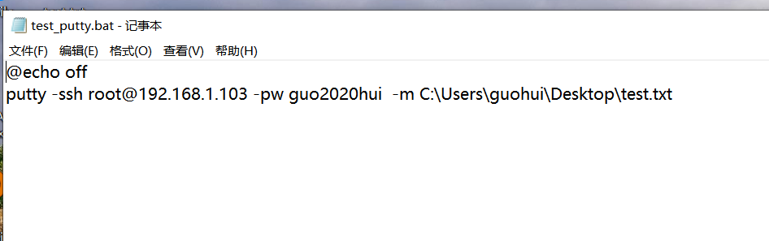

[toc]

# Putty:命令行调用 linux 执行命令

**document support**

ysys

**date**

2015-03-01

**label**

putty,window,linux


## Background

​	kettle要调用某些linux脚本，可是kettle部署在windows上，不太好实现，想着利用xshell或者其他工具实现，后来发现putty比较简单,xshell暂时没有找到具体命令，后面在整理吧。


## Command

windows上调用命令

```
D:\opt\PuTTY>putty -ssh root@192.168.1.103 -pw password  -m C:\Users\gh\Desktop\test.txt
```

test.txt

```
date >> /tmp/gh.txt
```


```
192.168.1.103.xsh
```


```
D:\opt\NetSarang\Xshell 6>Xshell -url ssh://C:/Users/guohui/Documents/NetSarang Computer/6/Xshell/Sessions/192.168.1.103.xsh
```


## Operation


### 下载Putty软件

https://www.chiark.greenend.org.uk/~sgtatham/putty/latest.html

​	请参考自己系统适配的版本

### 安装到本地,配置环境变量

​	环境变量

```
D:\opt\Putty\
```




### 将需要在linux上执行的命令添加到文件中

​	建议现在linux上进行测试，如

```
# date >> /tmp/gh.txt
# cat /tmp/gh.txt
Tue Nov 17 04:31:22 EST 2020
Tue Nov 17 05:08:29 EST 2020
```

​	之后将命令拷贝到windows上某个文件

```
date >> /tmp/gh.txt
```



### 现在开始执行命令

```
C:\Users\guohui>putty -ssh root@192.168.1.103 -pw guo2020hui  -m C:\Users\guohui\Desktop\test.txt
```

​	测试成功后，建议将该命令改为bat脚本，方便别人调用


### 改为bat脚本

```
@echo off
putty -ssh root@192.168.1.103 -pw guo2020hui  -m C:\Users\guohui\Desktop\test.txt
```

