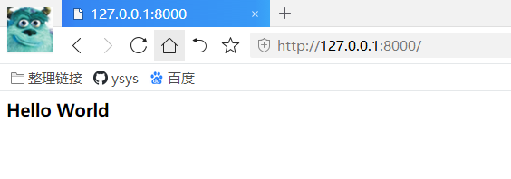
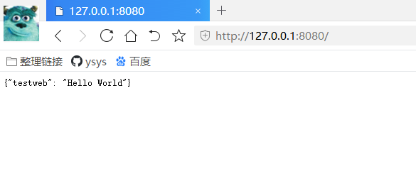

[toc]

# 第5章 HTTP服务器与客户端编程

**document support**

ysys

**date**

2015-12-01

**label**

python,《Python 网络编程从入门到精通》


## Knowledge

​	本章从HTTP协议开始，介绍通过HTTP协议实现服务器与客户端的通信，包括HTTP请求端口，Cookie，实现具体的GET和POST请求，以及Python网络编程中标准库的使用。

- HTTP协议
- HTTP服务器实现
- HTTP请求
- 异步通信方式
- 服务器框架


## 5.1 HTTP协议介绍

​	超文本传输协议HTTP(Hyper Text Transfer Protocol),是用于从WWW服务器传输超文本到本地浏览器的传送协议。它可以是网络传输减少，让浏览器更加高效。它不仅保证计算机正确快速地传输超文本文档，还可以传输文档中内容显示的先后顺序。HTTP是一个应用层协议，由请求和响应组成，是一个标准的客户端服务器模型，现在流行的版本是HTTP 1.1

​	客户端与服务器使用HTTP协议进行通信的工作分为以下5个步骤。

​	步骤01:建立客户端与服务器的连接

​	步骤02:客户端发送一个请求给服务器，请求方式的格式为：统一资源标识符(URL),协议版本号，MIME信息（包括请求修饰符，客户机信息和可能的信息)

​	步骤03：服务器接到请求后，给予相应的响应信息，其格式为一个状态行，包括信息的协议版本好，一个成功或错误的代码，MIME信息(包括服务器信息，实体信息和可能的内容)

​	步骤04：客户端接受服务器返回的信息通过浏览器显示出来

​	步骤05：客户端与服务器断开连接

​	整个过程HTTP会自动完成，用户只需发送请求和接受响应结果即可。


### 5.1.1 HTTP认证

​	要实现HTTP通信，客户端需要认证，HTTP认证有Basic认证,Digest认证，SSL Client认证和表单认证。


**1.Basic认证**

​	当客户端相HTTP服务器端发送请求的时候，如果客户端未认证，HTTP服务器会使用Basic认证对客户端的用户名及密码进行验证，客户端在接受到HTTP服务器的身份认证要求后，会提示输入用户名及密码，然后以Base64方式加密，加密后的密文将附加与请求信息中，并与每次请求数据时，将密文附加与请求头中。HTTP服务器在每次收到请求包后，更具协议取得客户端附加的用户信息，解开请求报。对用户名及密码进行验证，如果用户名及密码正确，则根据客户端请求，返回客户端所需要的数据；否则，返回错误代码或重新要求客户端提供用户名及密码。这种方式在使用中很容易被破解，实际使用中常配合SSL使用。


**2.Digest认证**

​	Digest认证是为了解决Basic认证不安全的问题。认证过程分为以下3个步骤。

​	步骤01：客户端访问HTTP资源服务器，服务器返回两个重要字段nonce(随机数)和reaim。

​	步骤02：客户端构造Authoriazation请求头，值包含username,realm，nouce,uri和response的字段信息。其中realm和nouce就是第一步返回的值。nouce只能被服务器使用一次。uri(digest-uri)即Request-URL的值，但考虑到经代理转发后Request-URL的值可能被修改，因此事先会复制一次副本保存在uri内，response也可以叫做Request-digest,存放经过MD5运算后的密码字符串，形成响应码。


**3.SSL Client认证**

​	SSL client认证相对于Basic认证和Digest认证，安全级别较高，但有证书费用，认证过程分为如下5个步骤.

步骤01：客户端向服务器端发送请求，服务器端要求客户端出示数字证书

步骤02：客户端发送数字证书

步骤03：服务器端通过数字证书机构的公钥验证数字证书的合法性，验证通过后取出证书的密钥

步骤04：服务器端随机生成一个数为对称密钥，并使用非对称算法和整数公钥加密。

步骤05：客户端使用非对称解密算法和证书私钥获取服务器端发送的对称公钥。

SSL Client认证由于安装，升级整数麻烦以及收取证书费用等原因，在实际中使用的并不多。


**4.表单认证**

​	基于表单的认证方式并不存在于HTTP规范中，所以实现方式也就呈现多样化，表单认证一般需要配合Cookie+sessionId使用，现在绝大多数的Web站点都使用次认证方式。用户在登陆页面中填写用户名和密码，服务端认证通过后将sessionId返回给浏览器端，浏览器会保存sessionId到浏览器的Cookie中。因为HTTP是无状态的，所以浏览器使用Cookie来保存sessionId，下次客户端发送的请求中会包含sessionId值，服务端发送sessionId存在并认证郭，则会提供资源访问。


### 5.1.2 Cookies操作

​	客户端通过Internet向服务器发送请求，服务器为了认证用户身份，进行session跟踪而存储在客户端上的数据(通常经过加密)，就是Cookies。

​	Python中内置urilib和http模块，用户可以使用import导入http.cookiejar和urllib.request,然后对Cookies进行操作。对Coookies的操作主要包括两个方面：从网页上获取Cookies；将Cookies文件存储为txt文件，然后读取它

**1.从网页获取Cookies**

```
#coding=utf-8
import http.cookiejar
import urllib.request

cookie = http.cookiejar.LWPCookieJar() #创建CookieJar对象
# 使用HTTPCookieProcessor创建cookie处理器
handler = urllib.request.HTTPCookieProcessor(cookie)
openner = urllib.request.build_opener(handler) # 创建openner对象

# 向http://www.baidu.com发送请求

request = urllib.request.Request('http://www.baidu.com')
response = openner.open(request) # open对象使用open方法打开请求
for item in cookie:
    print(item.name+'='+item.value) 
```

```
BAIDUID=F96B021E0C13C95D1AB304EFF25E5D41:FG=1
BIDUPSID=F96B021E0C13C95D352BD1CB194EEDF0
H_PS_PSSID=32812_1450_33076_32945_33060_31254_32971_32723_33098_33100_32961_32846_26350_22158
PSTM=1605402246
BDSVRTM=0
BD_HOME=1
```


**2.将Cookie以文本格式保存后在读取**


```
#coding=utf-8
import http.cookiejar
import urllib.request

filename = 'cookies.txt'

cookie = http.cookiejar.LWPCookieJar(filename) 
handler = urllib.request.HTTPCookieProcessor()
openner = urllib.request.build_opener(handler) 
response = openner.open('http://www.baidu.com')
cookie.save(ignore_discard=True,ignore_expires=True)
# 读取cookie文件
cookie = http.cookiejar.LWPCookieJar()
cookie.load('cookies.txt',ignore_expires=True,ignore_discard=True)
handler = urllib.request.HTTPCookieProcessor(cookie)
openner = urllib.request.build_opener(handler)
response = openner.open('http://www.baidu.com')
print(response.read().decode('utf-8'))
```

```
...
```


### 5.1.3 主机与编码

​	数据在计算机的表现形式都是以二进制的方式呈现，程序运行期间，Python完全影藏了内部实现及存储的细节，用户只能开到外部的表现。网络通讯不同，用户需要考虑传输过过程中中的数据表示形式，如果想要通过套接字传输一个符号串，就需要使用某种编码方法为每个符号分配一个确切的字节值。

​	ASCII是最流行的编码方式。ASCII码使用指定的7位或8位二进制数组合来表示128或256种可能的字符。标准的ASCII码，使用7位二进制数来表示所有的大写和小写字母，数字0-9，标点符号，以及在美式英语中使用的特殊控制符号。后128个字符称为ASCII扩展码。许多基于X86的系统都支持使用扩展ASCII.ASCII扩展码允许将每个字符的第8位用于确定附件的128个特殊符号字符，外来语字母和图形符号。Python内置的多数单字节编码方式都是ASCII扩展码。

​	Python 3.x的字符串包含的字符远不止ASCII码字符，主要源于它支持unicode,python把字符串看成是由Unicode字符组成的序列。他隐藏了Python字符串在内存中的实现，但是在处理文件和网络上的数据时，必须考虑字符的外部表现。

**1.字符串的编码和解码**

```
#coding=utf-8
text = 'guoh真棒'
bytetext = text.encode()
print(bytetext)
print(bytetext.decode())
```

```
b'guoh\xe7\x9c\x9f\xe6\xa3\x92'
guoh真棒
```

​	Python通过encode()编码函数将字符串进行编码，然后通过decode对其进行解码

​	encode和decode函数可以将字符串按照指定编码方式进行编码

```
u = '字符串'
str = u.encode('gb2312')
str1 = u.encode('gbk')
str2 = u.encode('utf-8')
u1 = str.decode('gb2312')
print(u1)

u2 = str.decode('utf-8')
print(u2)

```

```
Traceback (most recent call last):
  File "D:\data\java\workspace\PythonLearn\src\character_encode_decode.py", line 13, in <module>
    u2 = str.decode('utf-8')
UnicodeDecodeError: 'utf-8' codec can't decode byte 0xd7 in position 0: invalid continuation byte
```

​	

**2.文件的编码和解码**

​	单个字符串，不管用什么样的编码方式和解码方式来操作都很简单，但如果是一个文件的编码和解码就没有想象中的那么容易了。

​	其实在一个文件保存的时候，它的编码方式就已经形成了，解码方式应该根据保存时的编码方式选择


**3.struct模块**

​	网络传输都是以二进制的方式进行，struct模块提供了用于将数据与二进制格式进行相互转换的各种操作。如果想使用网络套接字传输二进制数据可以使用struct模块生成网络传输的二进制数据，接受方接受到数据后使用struct模块进行解码。struct.pack()实现数据编码过程，struct.unpack()实现数据解码过程


## 5.2 HTTP服务器实现

​	由于HTTP协议的广泛应用，Python开发人员实现了许多的方案，这些方案实现了主要的服务器模式，Python标准库提供了一个内置的HTTP服务器实现，可以从命令行启动该服务


### 5.2.1 http.server 搭建服务器

​	在Python 3.x中搭建服务器都是使用Python自带的http.server，搭建服务器步骤如下。

​	步骤01:首先进入需要做服务器的目录(目录里可以放一个用于测试的静态网页index.html),然后输入如下命令

```
python -m http.server
```

​	如果在命令的后面不加端口号，默认是8000，如果向更改端口可以用如下命令

```
python -m http.server --cgi 端口号
```

​	步骤02:在浏览器中输入`http://localhost:8000/`,浏览器会显示目录里存放的index.html文件

```
python -m http.server
Serving HTTP on 0.0.0.0 port 8000 (http://0.0.0.0:8000/) ...
127.0.0.1 - - [17/Nov/2020 23:04:53] code 404, message File not found
127.0.0.1 - - [17/Nov/2020 23:04:53] "GET /favicon.ico HTTP/1.1" 404 -
127.0.0.1 - - [17/Nov/2020 23:04:54] code 404, message File not found
```



### 5.2.2 BaseHTTPRequestHandler

​	python 在标准库中加入了http.server模块，使用该模块来实现服务时，可以编写子类来继承BaseHTTPRequestHandler，并添加do_GET()和do_POST()方法。

```
#coding=utf-8

from http.server import HTTPServer,BaseHTTPRequestHandler

import json

data = {'testweb':'Hello World'}
host = ('localhost',8080)

class Resquest(BaseHTTPRequestHandler):
	def do_GET(self):
		self.send_response(200)
		self.send_header('Content-type','application/json')
		self.end_headers()
		self.wfile.write(json.dumps(data).encode())
		
		
if __name__ =='__main__':
	server = HTTPServer(host, Resquest)
	print("Starting server,listen at: %s：%s" % host)
	server.serve_forever()

```

```
Starting server,listen at: localhost：8080
127.0.0.1 - - [17/Nov/2020 23:29:45] "GET /favicon.ico HTTP/1.1" 200 -
127.0.0.1 - - [17/Nov/2020 23:29:45] "GET / HTTP/1.1" 200 -
127.0.0.1 - - [17/Nov/2020 23:29:45] "GET /favicon.ico HTTP/1.1" 200 -
```



## 5.3 HTTP请求

​	Python 3.x处理HTTP请求的包有http.client,urllib,urllib3和requests。http.client比较基础，urllib属于标准库，urllib3与urllib类似，拥有一些重要特性，但是属于扩展库，需要安装。

​	request基于urllib3,不属于标准库.Python定义了GET，POST,DELETE,PUT4种与服务器交互的方法，接下来一一说明。


### 5.3.1 GET 请求

​	向服务器发送GET请求，根据服务器的URL地址连接服务器，地址栏的URL地址会加上`'?'`及后面的信息数据，这些数据就是使用GET请求得到的数据。http.client,urllib和urllib3都提供了方法以便用户访问服务器


**1.使用http.client的GET请求**

​	使用http.client发送GET请求，GET作为request的参数存在，

```
#coding=utf-8
import http.client
con = http.client.HTTPConnection('www.baidu.com')
con.request("GET","/index.html",'',{})
resu = con.getresponse()
print("resu.status=",resu.status)
print(resu.read())
```

```
...
```


**2.urllib的GET请求**

​	urllib是使用request来发送GET请求的

```
#coding=utf-8
from urllib import request
req = request.Request('http://www.baidu.com/')
req.add_header('User-Agent', '')
with request.urlopen(req) as f:
    print('Status:',f.status,f.reason)
    for k,v in f.getheaders():
        print('%s: %s' % (k,v))
```

```
Status: 200 OK
Accept-Ranges: bytes
Cache-Control: no-cache
Content-Length: 14615
Content-Type: text/html
Date: Wed, 18 Nov 2020 15:28:35 GMT
P3p: CP=" OTI DSP COR IVA OUR IND COM "
P3p: CP=" OTI DSP COR IVA OUR IND COM "
Pragma: no-cache
Server: BWS/1.1
Set-Cookie: BAIDUID=02BBCDD9E299A997C95A10F12BE64E70:FG=1; expires=Thu, 31-Dec-37 23:55:55 GMT; max-age=2147483647; path=/; domain=.baidu.com
Set-Cookie: BIDUPSID=02BBCDD9E299A997C95A10F12BE64E70; expires=Thu, 31-Dec-37 23:55:55 GMT; max-age=2147483647; path=/; domain=.baidu.com
Set-Cookie: PSTM=1605713315; expires=Thu, 31-Dec-37 23:55:55 GMT; max-age=2147483647; path=/; domain=.baidu.com
Set-Cookie: BAIDUID=02BBCDD9E299A997C3D2C6A15EA430CB:FG=1; max-age=31536000; expires=Thu, 18-Nov-21 15:28:35 GMT; domain=.baidu.com; path=/; version=1; comment=bd
Traceid: 1605713315238956673010670027880993888763
Vary: Accept-Encoding
X-Ua-Compatible: IE=Edge,chrome=1
Connection: close

```


### 5.3.2 POST请求

​	POST请求与GET请求相比要隐蔽很多，必须通过向浏览器提交数据才会返回完整的界面，POST请求是将提交的数据放在HTTP的包体中，这无疑增加了数据的安全性，常见的账号密码登陆过程，就是典型的POST请求。它不像GET请求那样，用户可以直接跳转的URL就可以查看向服务器发送的数据。另外POST请求除了提交数据外，还可以提交文件，这点也是GET请求做不到的。


