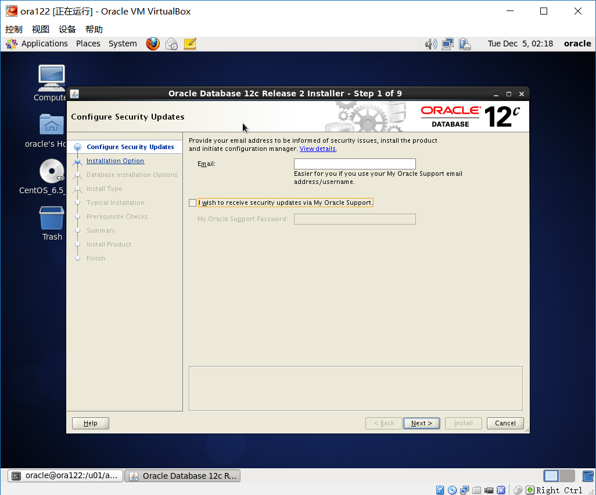
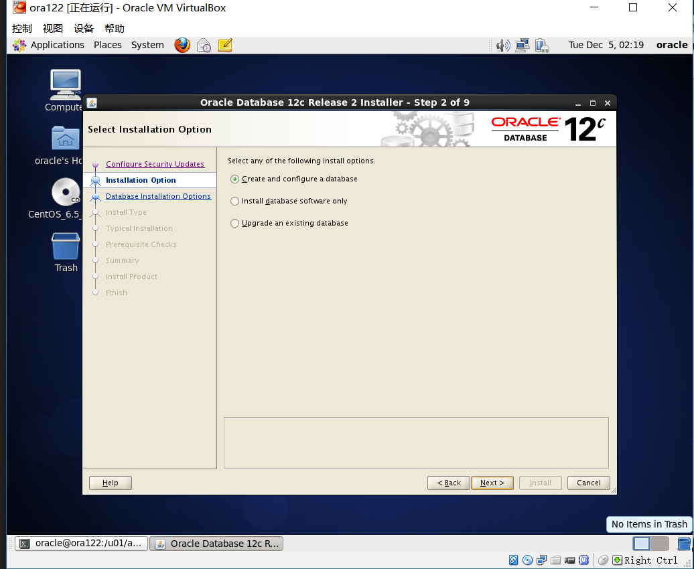
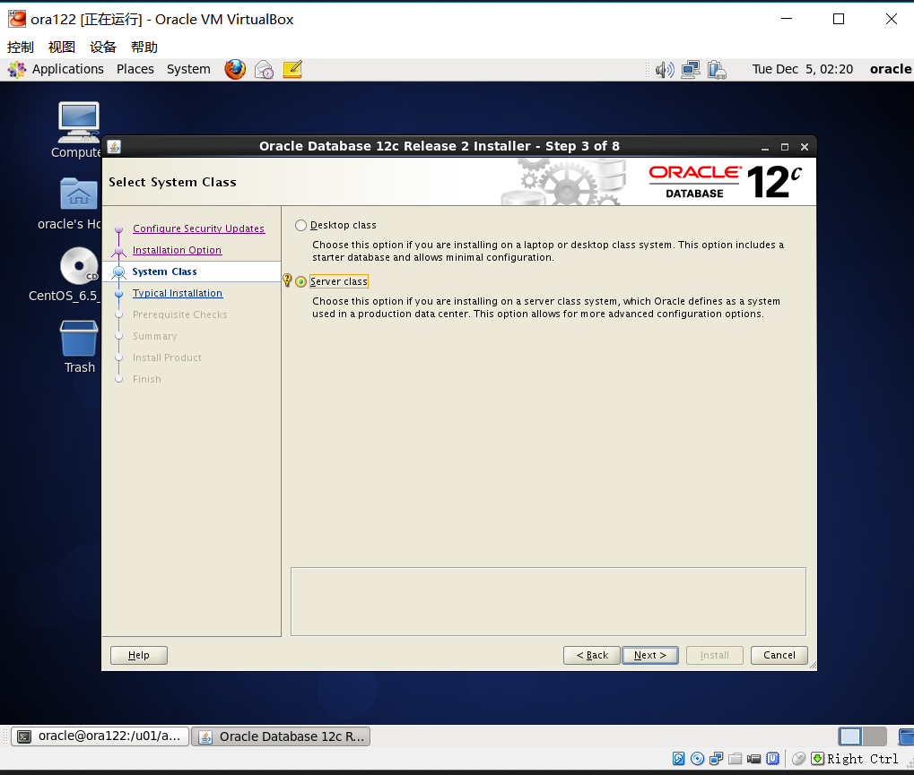
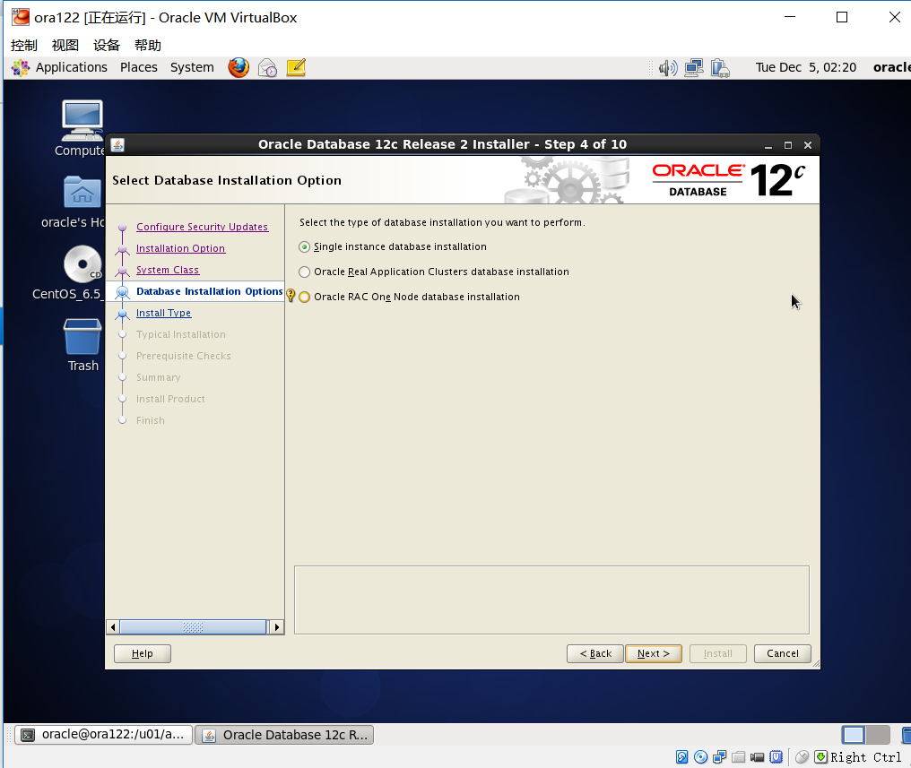
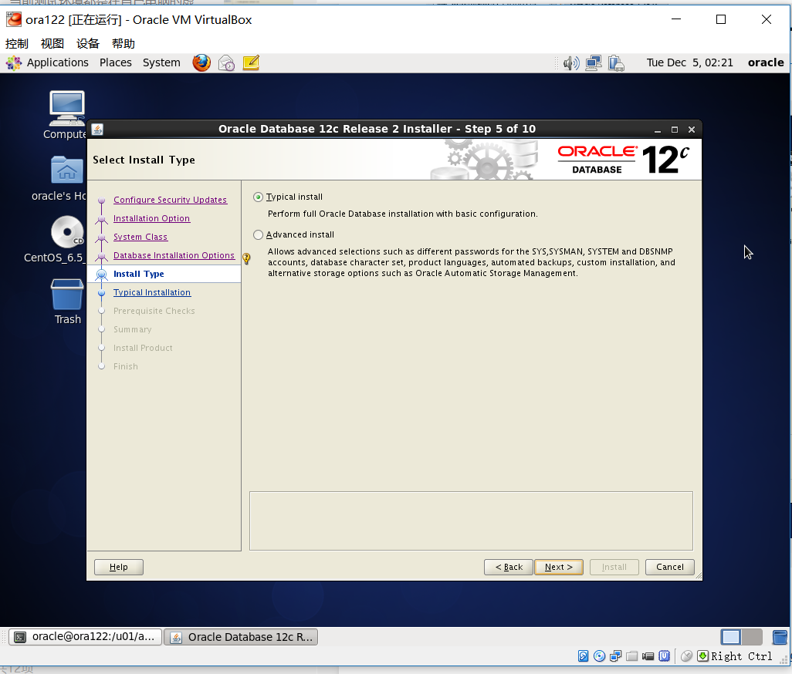
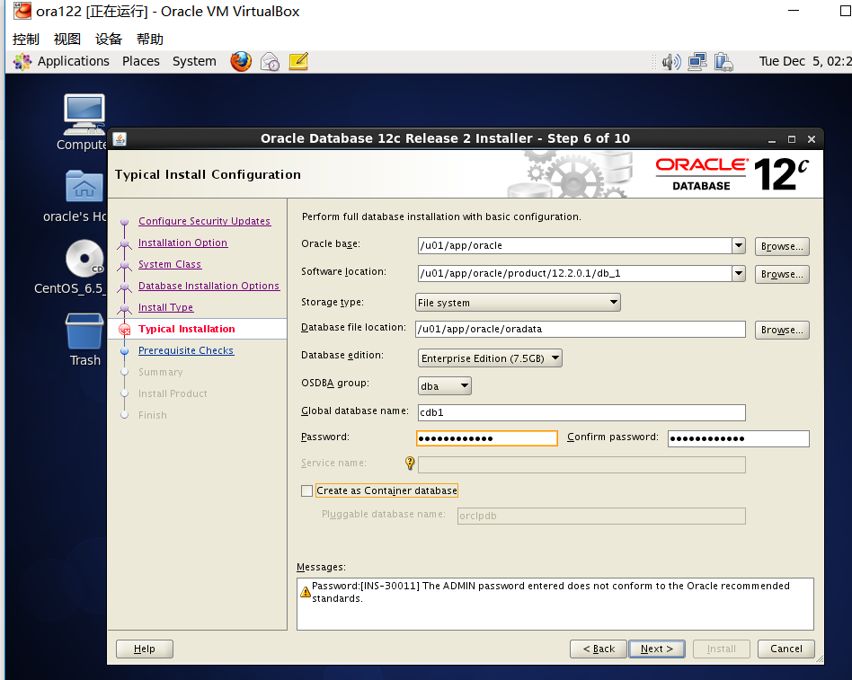
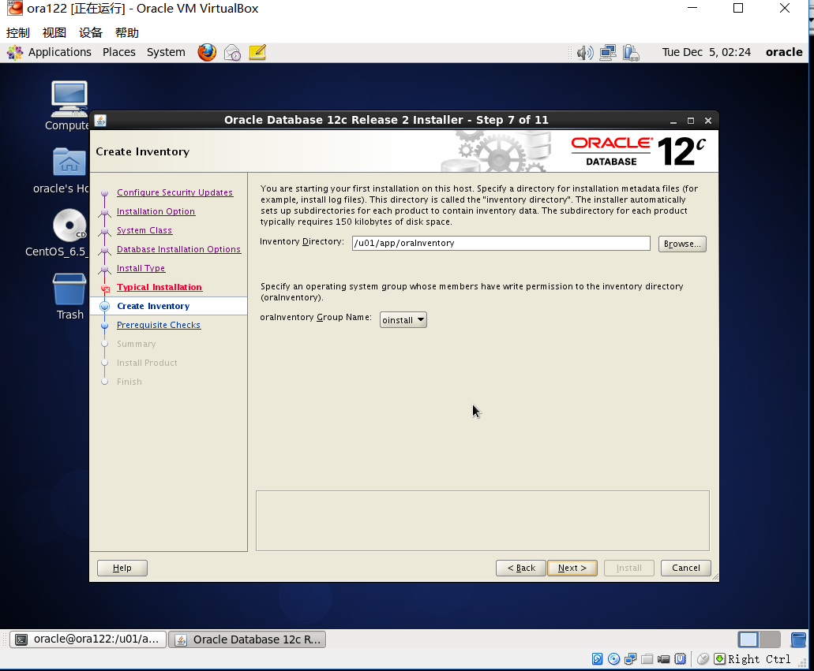
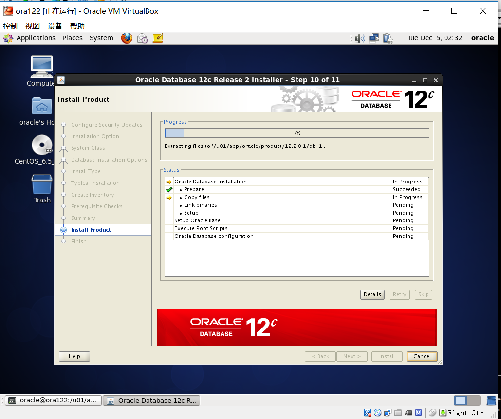

[TOC]

# install oracle 12c single in linux 

**document support**

ysys

**date**
2017-04-01

**label**

oracle,oracle 12c,install

**level**

simple

## Background

## Operation

​	当前测试环境都是在自己电脑的虚拟机上，可能与真实环境不是很一致，这点要先明确出来

1、修改主机名，网络

参考链接：[linux  virtualbox copy.note](note://B0EAA5B5DCCF4FF598CAD462978BAC01)

2、关闭防火墙和selinux

参考链接:[ install oracle 11g single in linux.note](note://ADBDD57535C94C7D88740ECD7CD93173)

3、添加yum并安装rpm包

yum安装:[linux yum configuration.note](note://1E3BD86AF6AE450A8369A011F03FB0EB)

vim pkg_run.sh

chmod 777 pkg_run.sh

4、修改内核相关配置

[root@localhost /]# vi /etc/sysctl.conf

[root@localhost /]# /sbin/sysctl -p

[root@localhost /]# vi /etc/security/limits.conf

5、添加用户并修改用户配置

6、在oracle修改参数

su - oracle

vim .bash_profile

source .bash_profile

7、图形化安装

参考文档：

<https://oracle-base.com/articles/12c/oracle-db-12cr2-installation-on-oracle-linux-6-and-7>