[TOC]

# windows 安装 datastage 客户端

**document support**

ysys

**date**

2017-05-01

**label**

windows,

## Before

## 环境介绍

操作系统：win7_64

软件：ds_client9.1

安装客户端软件前需要安装Net FrameWork 4，否则会报错

## 操作步骤

解压Client安装包，并将Bundle spec file复制到安装程序所在目录，执行setup.exe

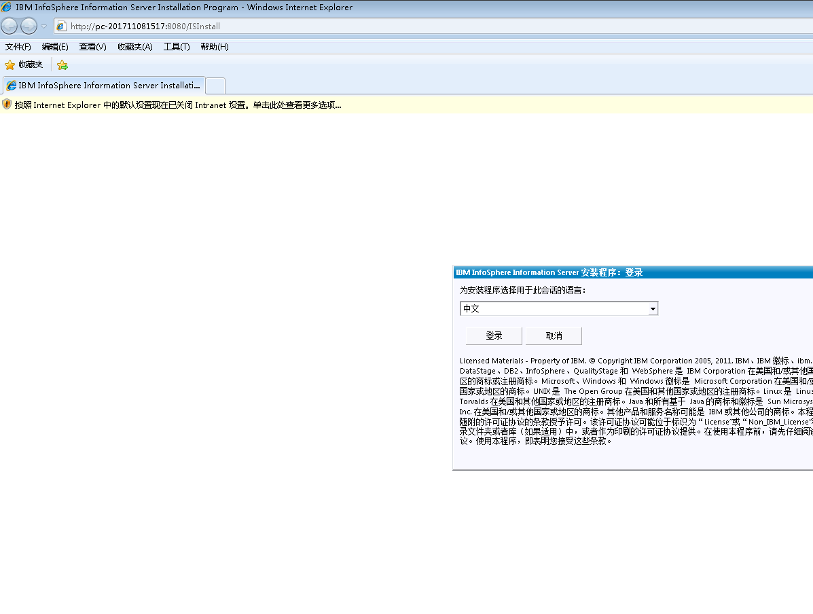

下一步：

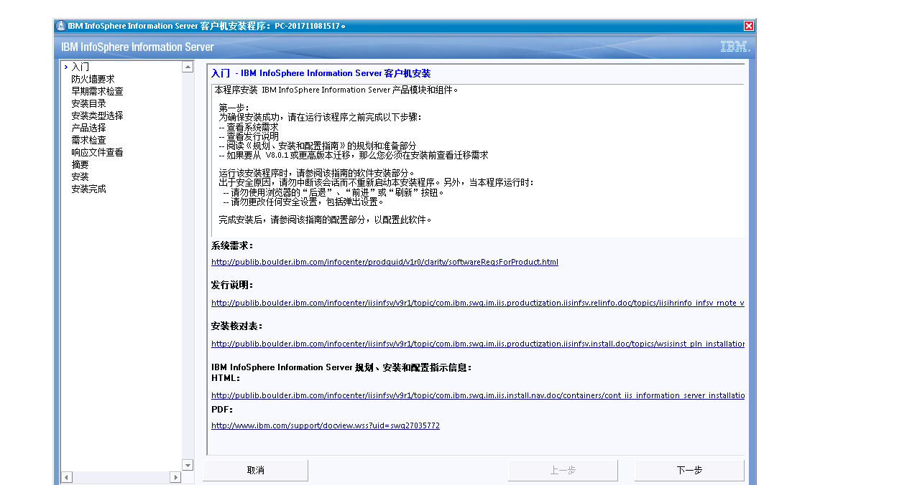

下一步

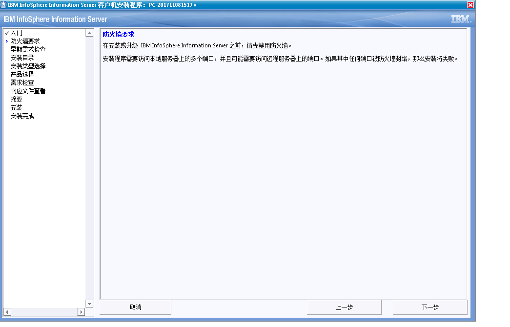

下一步

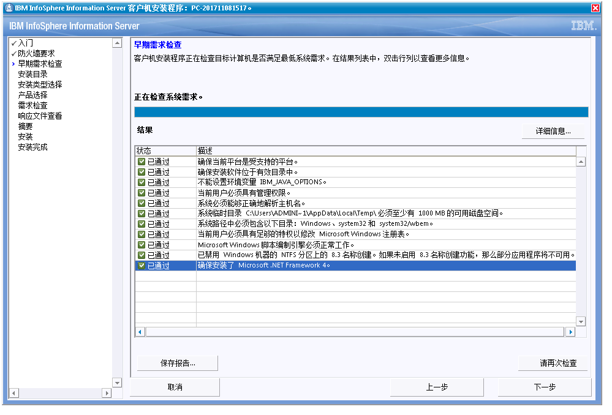

下一步

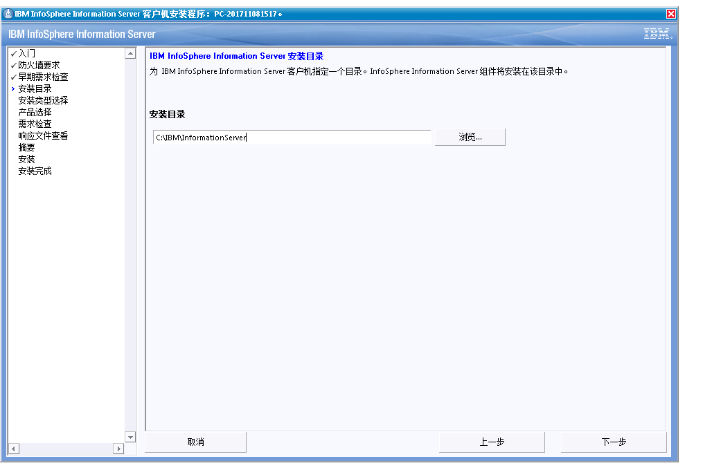

下一步：

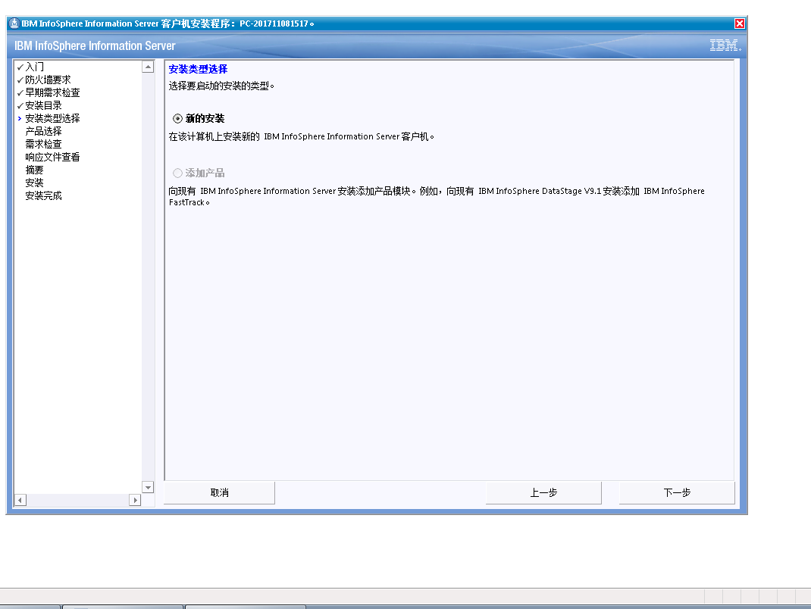

下一步：选择产品，如只用DataStage，则只选择DataStage即可

下一步接受

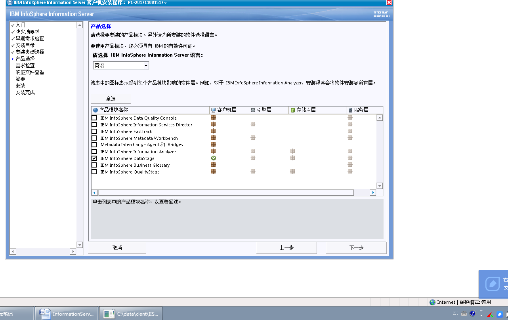

下一步

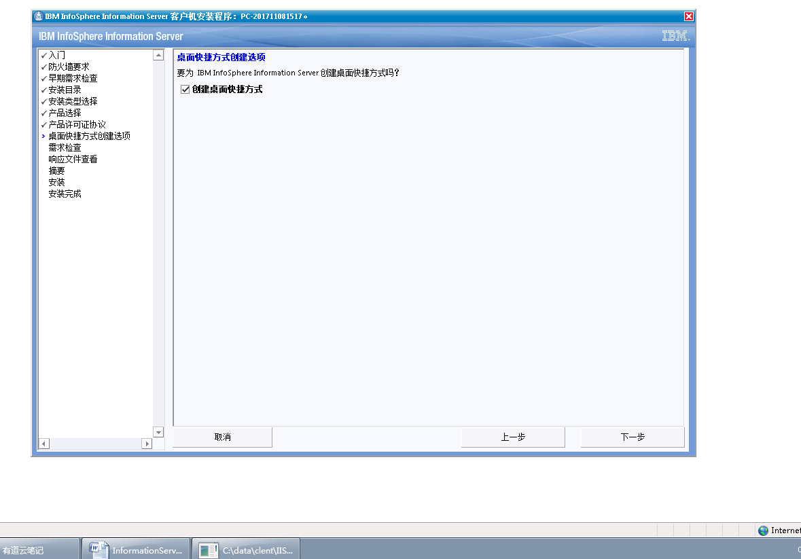

下一步检查如果没有问题就执行下一步

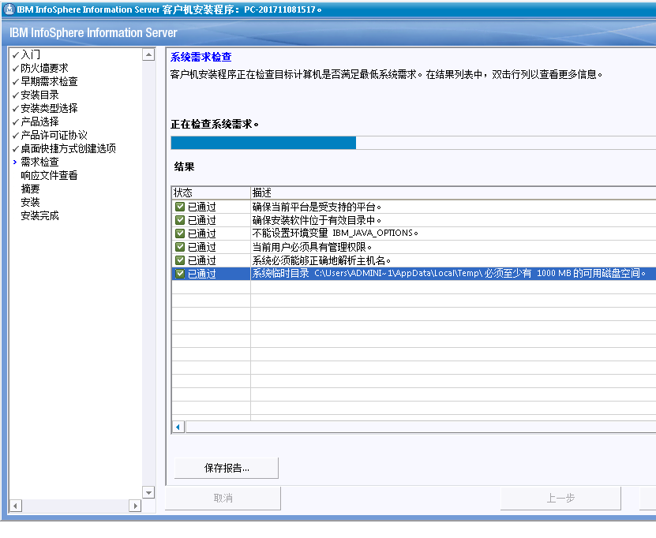

下一步：

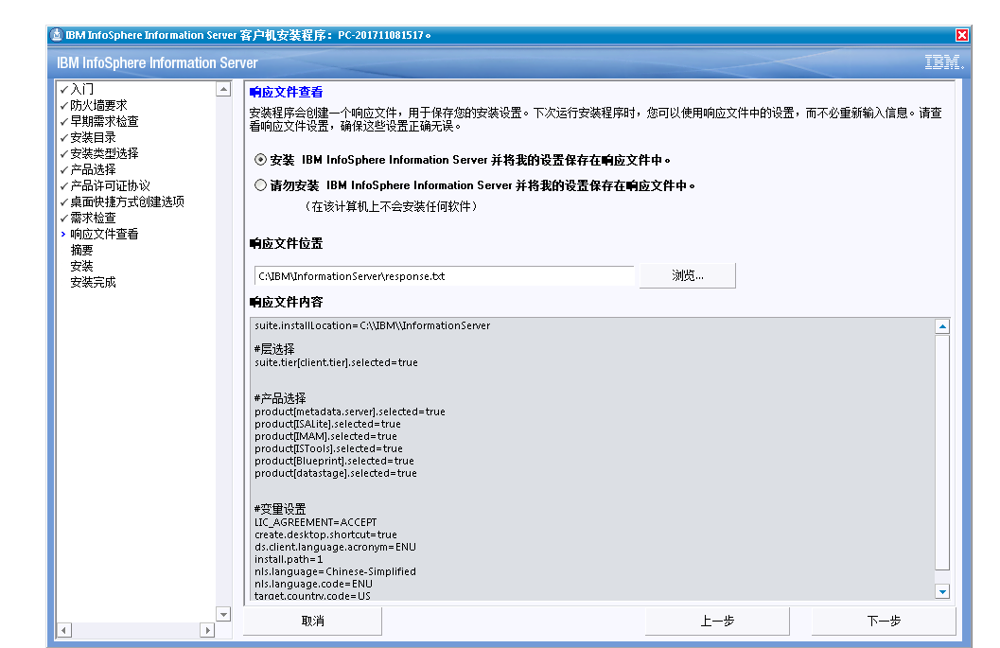

下一步：

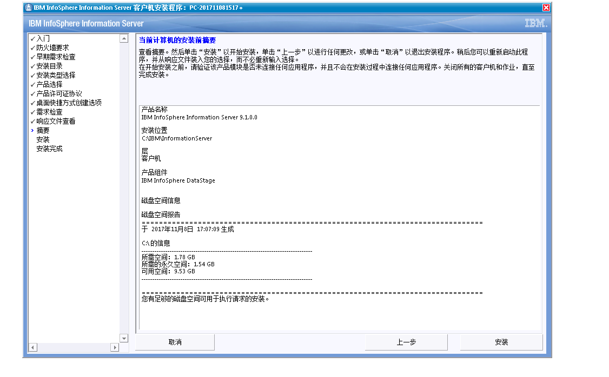

下一步：安装等待时间可能久一点

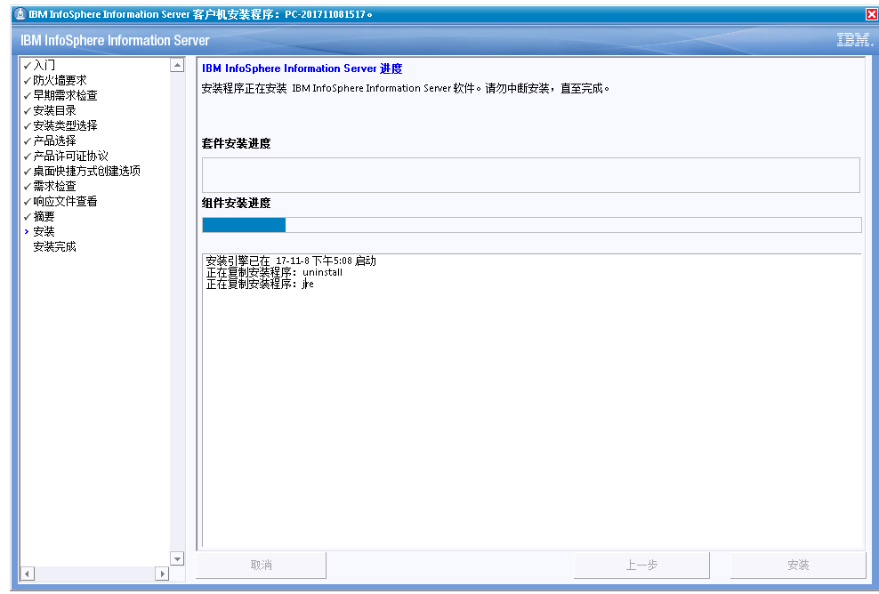

下一步完成

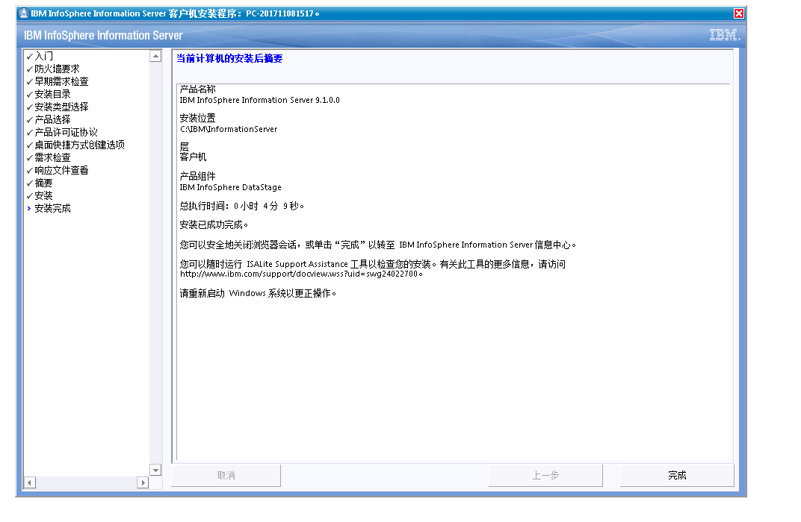

完成后就可以进行相关客户端操作