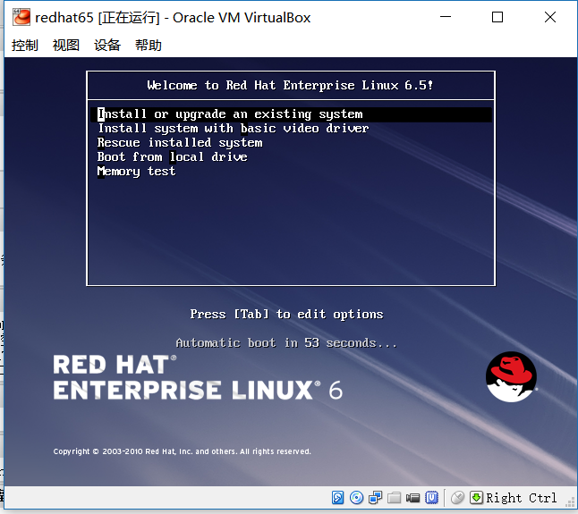
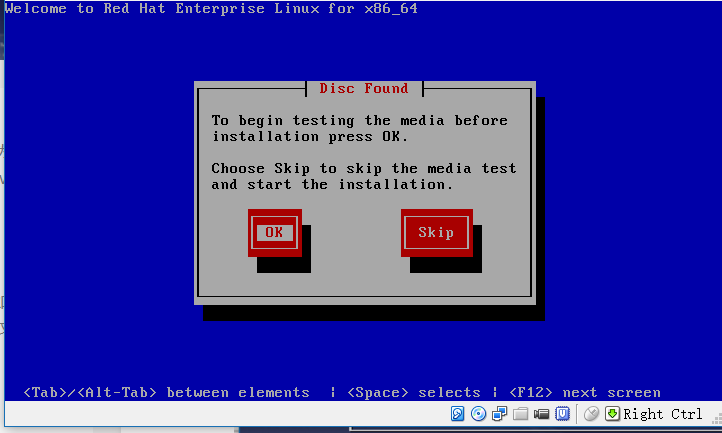

[TOC]

# REDHAT 6.5 INSTALL

**document support**

ysys

**date**

2017-06-03

**label**

linux,

## Before

软件：rhel-server-6.5-x86_64-dvd.iso

1、选择第二个命令”Install system with basic video driver"

2、选择跳过监测光盘“SKIP”

 

3 参考centos6.5安装

## link

