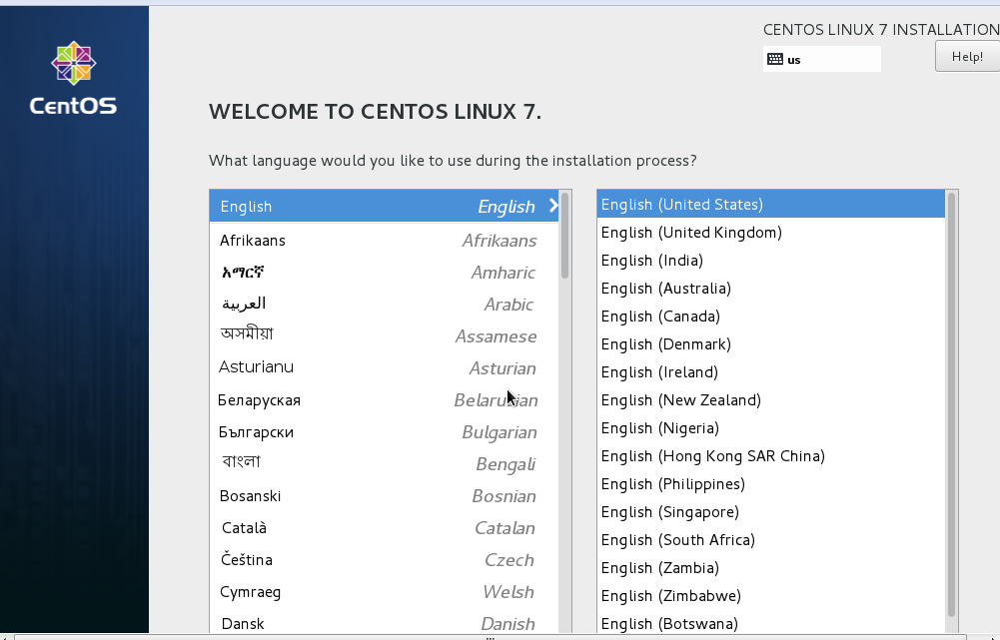
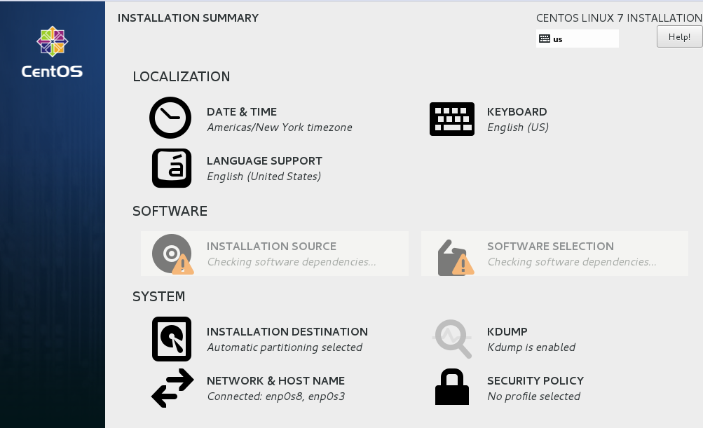
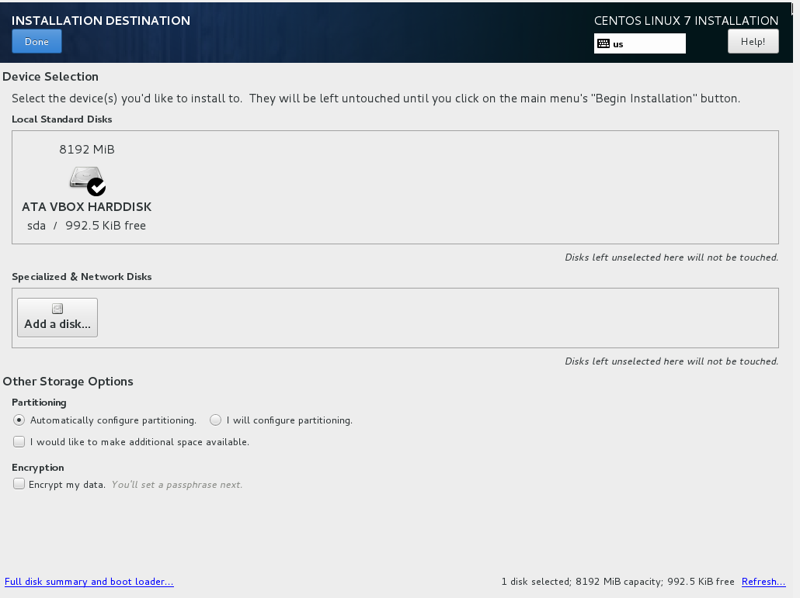
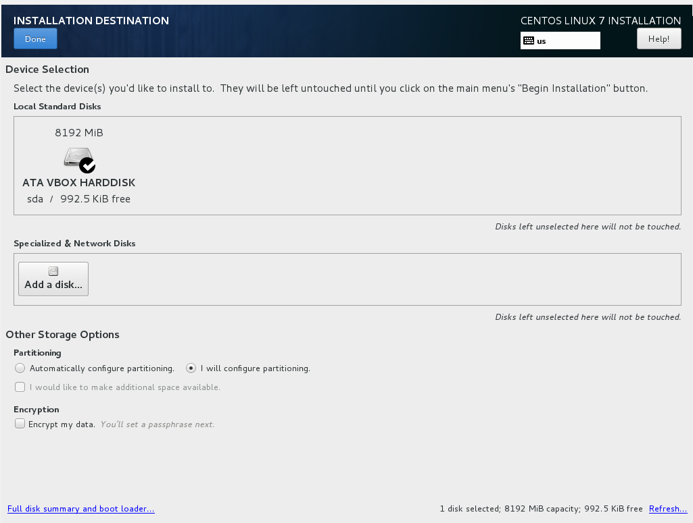
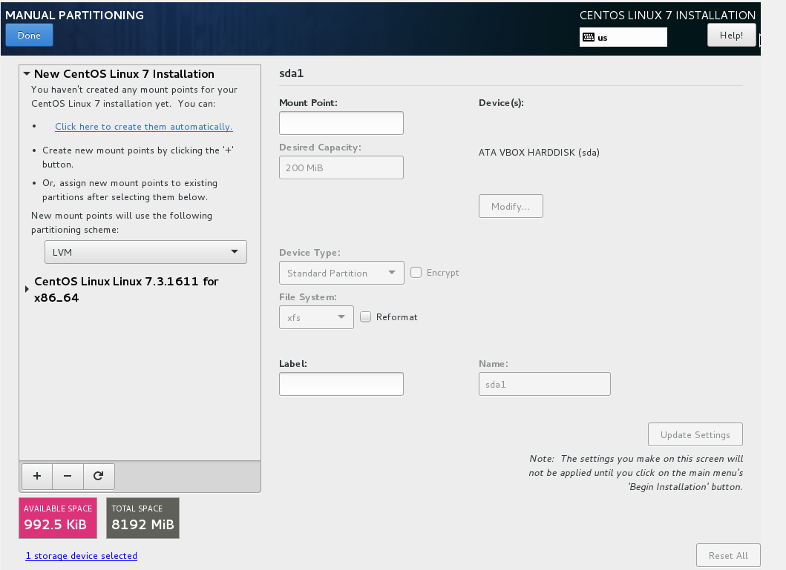
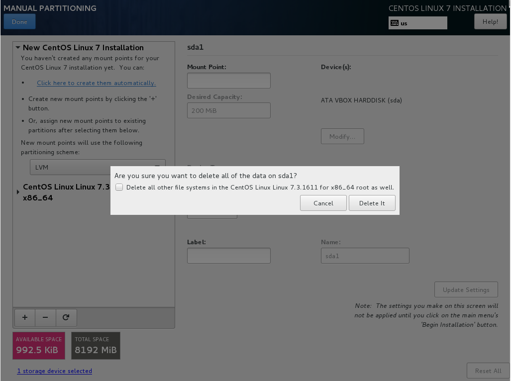
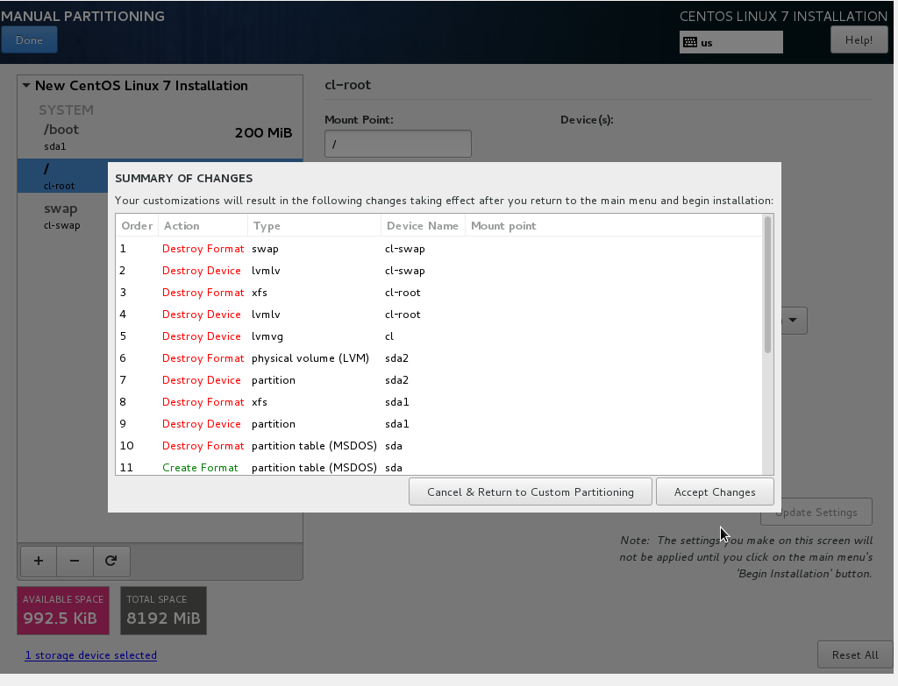
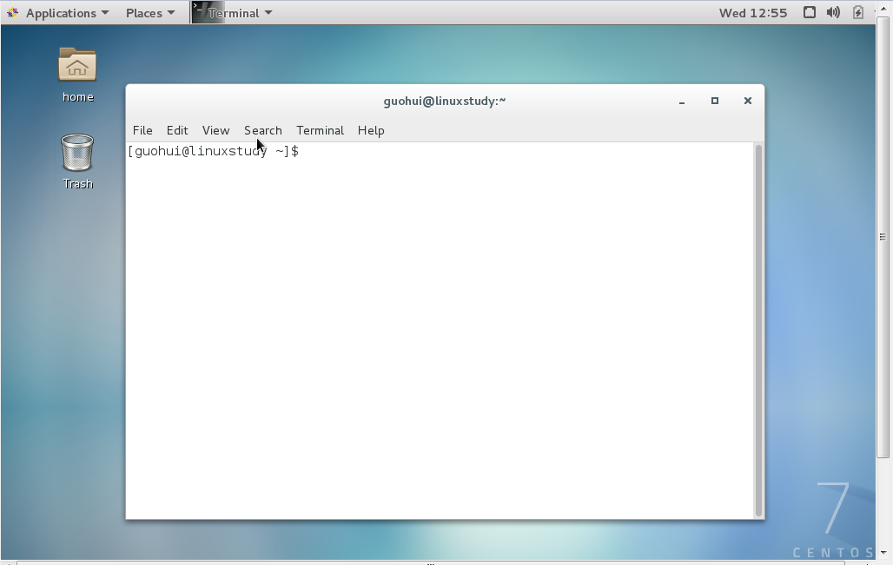

[TOC]

# Centos 7.x:centos 7.2 install

**document support**

ysys

**date**

2017-06-05

**label**

centos,7,7.2,install

## Before

安装版本：CentOS-7-x86_64-DVD-1611.iso

安装流程

software和system的各个组件都要点击可以下

首先选择《installation destination》

选择《other storage options》中的《I will configure partitioning》

选择DONE

如果出现Centos Linux 7.xxxx for x86_64 ,点击它并且选择删除键

选择“+”号分配环境/boot.swap,/

其实这个为我们自动创建了逻辑卷

选择DONE,选择ACCEPT CHANGE

后面比较简单，暂不描述

说明一下，centos7的系统和redhat6系列的系统安装确实不同，刚开始不是很熟练，但是内容近似