[TOC]

# postgresql dba 3

**document support**

ysys

**date**

2018-07-23

**label**

postgresq,dba


## Before

​	目标

​	1、熟悉使用psql

​	2、熟悉字段类型

​	3、了解pgadmin


## psql

​	配置好环境变量后，可以执行`psql --help`，查看一些帮助文档，或者执行 `man help`。在测试环境中`man psql`没有显示帮助文档，后续会跟进这个问题


```
[osdba@mysql45 ~]$ psql --help
psql is the PostgreSQL interactive terminal.

Usage:
  psql [OPTION]... [DBNAME [USERNAME]]

General options:
  -c, --command=COMMAND    run only single command (SQL or internal) and exit
  -d, --dbname=DBNAME      database name to connect to (default: "osdba")
  -f, --file=FILENAME      execute commands from file, then exit
  -l, --list               list available databases, then exit
  -v, --set=, --variable=NAME=VALUE
                           set psql variable NAME to VALUE
  -V, --version            output version information, then exit
  -X, --no-psqlrc          do not read startup file (~/.psqlrc)
  -1 ("one"), --single-transaction
                           execute as a single transaction (if non-interactive)
  -?, --help               show this help, then exit

Input and output options:
  -a, --echo-all           echo all input from script
  -e, --echo-queries       echo commands sent to server
  -E, --echo-hidden        display queries that internal commands generate
  -L, --log-file=FILENAME  send session log to file
  -n, --no-readline        disable enhanced command line editing (readline)
  -o, --output=FILENAME    send query results to file (or |pipe)
  -q, --quiet              run quietly (no messages, only query output)
  -s, --single-step        single-step mode (confirm each query)
  -S, --single-line        single-line mode (end of line terminates SQL command)

Output format options:
  -A, --no-align           unaligned table output mode
  -F, --field-separator=STRING
                           field separator for unaligned output (default: "|")
  -H, --html               HTML table output mode
  -P, --pset=VAR[=ARG]     set printing option VAR to ARG (see \pset command)
  -R, --record-separator=STRING
                           record separator for unaligned output (default: newline)
  -t, --tuples-only        print rows only
  -T, --table-attr=TEXT    set HTML table tag attributes (e.g., width, border)
  -x, --expanded           turn on expanded table output
  -z, --field-separator-zero
                           set field separator for unaligned output to zero byte
  -0, --record-separator-zero
                           set record separator for unaligned output to zero byte

Connection options:
  -h, --host=HOSTNAME      database server host or socket directory (default: "local socket")
  -p, --port=PORT          database server port (default: "5432")
  -U, --username=USERNAME  database user name (default: "osdba")
  -w, --no-password        never prompt for password
  -W, --password           force password prompt (should happen automatically)

For more information, type "\?" (for internal commands) or "\help" (for SQL
commands) from within psql, or consult the psql section in the PostgreSQL
documentation.

Report bugs to <pgsql-bugs@postgresql.org>.

```

​		

​	因为man psql没有展现任何信息，无法看到环境变量名称


1. psql -l：列出当前环境下所有数据库

```
[osdba@mysql45 data]$ psql -l
                               List of databases
    Name    | Owner | Encoding |   Collate   |    Ctype    | Access privileges 
------------+-------+----------+-------------+-------------+-------------------
 etl_0511   | osdba | UTF8     | en_US.UTF-8 | en_US.UTF-8 | 
 etl_kettle | osdba | UTF8     | en_US.UTF-8 | en_US.UTF-8 | 
 etl_pg     | osdba | UTF8     | en_US.UTF-8 | en_US.UTF-8 | 
 gh_etl     | osdba | UTF8     | en_US.UTF-8 | en_US.UTF-8 | 
 osdba      | osdba | UTF8     | en_US.UTF-8 | en_US.UTF-8 | 
 postgres   | osdba | UTF8     | en_US.UTF-8 | en_US.UTF-8 | 
 template0  | osdba | UTF8     | en_US.UTF-8 | en_US.UTF-8 | =c/osdba         +
            |       |          |             |             | osdba=CTc/osdba
 template1  | osdba | UTF8     | en_US.UTF-8 | en_US.UTF-8 | =c/osdba         +
            |       |          |             |             | osdba=CTc/osdba
 tutorial   | osdba | UTF8     | en_US.UTF-8 | en_US.UTF-8 | =Tc/osdba        +
            |       |          |             |             | osdba=CTc/osdba  +
            |       |          |             |             | learn1=C/osdba
(9 rows)


```

2、psql -h ip -d database -U username -P port:按照当前参数登陆数据库


## 快捷命令


\?:快捷命令

```
osdba=# \?
General
  \copyright             show PostgreSQL usage and distribution terms
  \g [FILE] or ;         execute query (and send results to file or |pipe)
  \gset [PREFIX]         execute query and store results in psql variables
  \h [NAME]              help on syntax of SQL commands, * for all commands
  \q                     quit psql
  \watch [SEC]           execute query every SEC seconds

Query Buffer
  \e [FILE] [LINE]       edit the query buffer (or file) with external editor
  \ef [FUNCNAME [LINE]]  edit function definition with external editor
  \p                     show the contents of the query buffer
  \r                     reset (clear) the query buffer
  \s [FILE]              display history or save it to file
  \w FILE                write query buffer to file

Input/Output
  \copy ...              perform SQL COPY with data stream to the client host
  \echo [STRING]         write string to standard output
  \i FILE                execute commands from file
  \ir FILE               as \i, but relative to location of current script
  \o [FILE]              send all query results to file or |pipe
  \qecho [STRING]        write string to query output stream (see \o)

Informational
  (options: S = show system objects, + = additional detail)
  \d[S+]                 list tables, views, and sequences
  \d[S+]  NAME           describe table, view, sequence, or index
  \da[S]  [PATTERN]      list aggregates
  \db[+]  [PATTERN]      list tablespaces
  \dc[S+] [PATTERN]      list conversions
  \dC[+]  [PATTERN]      list casts
  \dd[S]  [PATTERN]      show object descriptions not displayed elsewhere
  \ddp    [PATTERN]      list default privileges
  \dD[S+] [PATTERN]      list domains
  \det[+] [PATTERN]      list foreign tables
  \des[+] [PATTERN]      list foreign servers
  \deu[+] [PATTERN]      list user mappings
  \dew[+] [PATTERN]      list foreign-data wrappers
  \df[antw][S+] [PATRN]  list [only agg/normal/trigger/window] functions
  \dF[+]  [PATTERN]      list text search configurations
  \dFd[+] [PATTERN]      list text search dictionaries
  \dFp[+] [PATTERN]      list text search parsers
  \dFt[+] [PATTERN]      list text search templates
  \dg[+]  [PATTERN]      list roles
  \di[S+] [PATTERN]      list indexes
  \dl                    list large objects, same as \lo_list
  \dL[S+] [PATTERN]      list procedural languages
  \dm[S+] [PATTERN]      list materialized views
  \dn[S+] [PATTERN]      list schemas
  \do[S]  [PATTERN]      list operators
  \dO[S+] [PATTERN]      list collations
  \dp     [PATTERN]      list table, view, and sequence access privileges
  \drds [PATRN1 [PATRN2]] list per-database role settings
  \ds[S+] [PATTERN]      list sequences
  \dt[S+] [PATTERN]      list tables
  \dT[S+] [PATTERN]      list data types
  \du[+]  [PATTERN]      list roles
  \dv[S+] [PATTERN]      list views
  \dE[S+] [PATTERN]      list foreign tables
  \dx[+]  [PATTERN]      list extensions
  \dy     [PATTERN]      list event triggers
  \l[+]   [PATTERN]      list databases
  \sf[+] FUNCNAME        show a function's definition
  \z      [PATTERN]      same as \dp

Formatting
  \a                     toggle between unaligned and aligned output mode
  \C [STRING]            set table title, or unset if none
  \f [STRING]            show or set field separator for unaligned query output
  \H                     toggle HTML output mode (currently off)
  \pset [NAME [VALUE]]   set table output option
                         (NAME := {format|border|expanded|fieldsep|fieldsep_zero|footer|null|
                         numericlocale|recordsep|recordsep_zero|tuples_only|title|tableattr|pager})
  \t [on|off]            show only rows (currently off)
  \T [STRING]            set HTML <table> tag attributes, or unset if none
  \x [on|off|auto]       toggle expanded output (currently off)

Connection
  \c[onnect] [DBNAME|- USER|- HOST|- PORT|-]
                         connect to new database (currently "osdba")
  \encoding [ENCODING]   show or set client encoding
  \password [USERNAME]   securely change the password for a user
  \conninfo              display information about current connection

Operating System
  \cd [DIR]              change the current working directory
  \setenv NAME [VALUE]   set or unset environment variable
  \timing [on|off]       toggle timing of commands (currently off)
  \! [COMMAND]           execute command in shell or start interactive shell

Variables
  \prompt [TEXT] NAME    prompt user to set internal variable
  \set [NAME [VALUE]]    set internal variable, or list all if no parameters
  \unset NAME            unset (delete) internal variable

Large Objects
  \lo_export LOBOID FILE
  \lo_import FILE [COMMENT]
  \lo_list
  \lo_unlink LOBOID      large object operations

```


\h command：补提命令或者提醒相关参数

```
osdba=# \h CREATE TABLE
Command:     CREATE TABLE
Description: define a new table
Syntax:
CREATE [ [ GLOBAL | LOCAL ] { TEMPORARY | TEMP } | UNLOGGED ] TABLE [ IF NOT EXISTS ] table_name ( [
  { column_name data_type [ COLLATE collation ] [ column_constraint [ ... ] ]
    | table_constraint
    | LIKE source_table [ like_option ... ] }
    [, ... ]
] )
[ INHERITS ( parent_table [, ... ] ) ]
[ WITH ( storage_parameter [= value] [, ... ] ) | WITH OIDS | WITHOUT OIDS ]
[ ON COMMIT { PRESERVE ROWS | DELETE ROWS | DROP } ]
[ TABLESPACE tablespace_name ]

CREATE [ [ GLOBAL | LOCAL ] { TEMPORARY | TEMP } | UNLOGGED ] TABLE [ IF NOT EXISTS ] table_name
    OF type_name [ (
  { column_name WITH OPTIONS [ column_constraint [ ... ] ]
    | table_constraint }
    [, ... ]
) ]
[ WITH ( storage_parameter [= value] [, ... ] ) | WITH OIDS | WITHOUT OIDS ]
[ ON COMMIT { PRESERVE ROWS | DELETE ROWS | DROP } ]
[ TABLESPACE tablespace_name ]

where column_constraint is:

[ CONSTRAINT constraint_name ]
{ NOT NULL |
  NULL |
  CHECK ( expression ) [ NO INHERIT ] |
  DEFAULT default_expr |
  UNIQUE index_parameters |
  PRIMARY KEY index_parameters |
  REFERENCES reftable [ ( refcolumn ) ] [ MATCH FULL | MATCH PARTIAL | MATCH SIMPLE ]
    [ ON DELETE action ] [ ON UPDATE action ] }
[ DEFERRABLE | NOT DEFERRABLE ] [ INITIALLY DEFERRED | INITIALLY IMMEDIATE ]

and table_constraint is:

[ CONSTRAINT constraint_name ]
{ CHECK ( expression ) [ NO INHERIT ] |
  UNIQUE ( column_name [, ... ] ) index_parameters |
  PRIMARY KEY ( column_name [, ... ] ) index_parameters |
  EXCLUDE [ USING index_method ] ( exclude_element WITH operator [, ... ] ) index_parameters [ WHERE ( pr
edicate ) ] |
  FOREIGN KEY ( column_name [, ... ] ) REFERENCES reftable [ ( refcolumn [, ... ] ) ]
    [ MATCH FULL | MATCH PARTIAL | MATCH SIMPLE ] [ ON DELETE action ] [ ON UPDATE action ] }
[ DEFERRABLE | NOT DEFERRABLE ] [ INITIALLY DEFERRED | INITIALLY IMMEDIATE ]

and like_option is:

{ INCLUDING | EXCLUDING } { DEFAULTS | CONSTRAINTS | INDEXES | STORAGE | COMMENTS | ALL }

index_parameters in UNIQUE, PRIMARY KEY, and EXCLUDE constraints are:

[ WITH ( storage_parameter [= value] [, ... ] ) ]
[ USING INDEX TABLESPACE tablespace_name ]

exclude_element in an EXCLUDE constraint is:

{ column_name | ( expression ) } [ opclass ] [ ASC | DESC ] [ NULLS { FIRST | LAST } ]

```


\dtS+:展示系统表

```
\dtS+
 pg_catalog | pg_seclabels                           | view              | osdba | 0 bytes    | 
 pg_catalog | pg_settings                            | view              | osdba | 0 bytes    | 
 pg_catalog | pg_shadow                              | view              | osdba | 0 bytes    | 
 pg_catalog | pg_shdepend                            | table             | osdba | 40 kB      | 
 pg_catalog | pg_shdescription                       | table             | osdba | 48 kB      | 
 pg_catalog | pg_shseclabel                          | table             | osdba | 0 bytes    | 
 pg_catalog | pg_stat_activity                       | view              | osdba | 0 bytes    | 
 pg_catalog | pg_stat_all_indexes                    | view              | osdba | 0 bytes    | 
 pg_catalog | pg_stat_all_tables                     | view              | osdba | 0 bytes    | 
 pg_catalog | pg_stat_archiver                       | view              | osdba | 0 bytes    | 
 pg_catalog | pg_stat_bgwriter                       | view              | osdba | 0 bytes    | 
 pg_catalog | pg_stat_database                       | view              | osdba | 0 bytes    | 

```


\set VERBOSITY verbose:设置详细的打印输出

```
osdba=# \set VERBOSITY verbose
osdba=# select * from test_1.a;
ERROR:  42P01: relation "test_1.a" does not exist
LINE 1: select * from test_1.a;
                      ^
LOCATION:  parserOpenTable, parse_relation.c:965
osdba=# 

```


## 数据类型

在数据存储时，通过`\d+ tablename`后在字段storage中出现这么几种可能的存储方式：

| exterval | extended |
| -------- | -------- |
| plain    | main     |

plain:表示数据不压缩，不行外存储

main:表示数据压缩，不行外存储

exterval:表示数据不压缩，行外存储

extended:表示数据压缩，行外存储

这些存储方式和pg_toast有关系，后面章节介绍[pg_toast](../201807/20180715_01.md)。


### 数值型

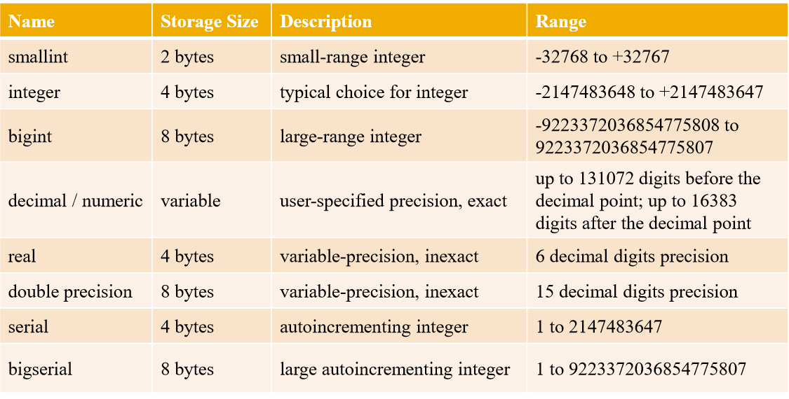

一般情况下，创建整数型时，可以直接使用int4,或者int类型，都是integer类型；创建小数型时，建议使用numeric，不要使用numeric(n,m),如果精度超过m，可能无法保证数据的准确值(四舍五入)。

字段类型是serial,bigserial，就是为其创建了一个序列，如果后续需要一个主键，建议使用序列，或者uuid

```
tutorial=# create table test1(id serial,age int4);
CREATE TABLE
tutorial=# \d test1;
                         Table "public.test1"
 Column |  Type   |                     Modifiers                      
--------+---------+----------------------------------------------------
 id     | integer | not null default nextval('test1_id_seq'::regclass)
 age    | integer | 
```


### 字符串

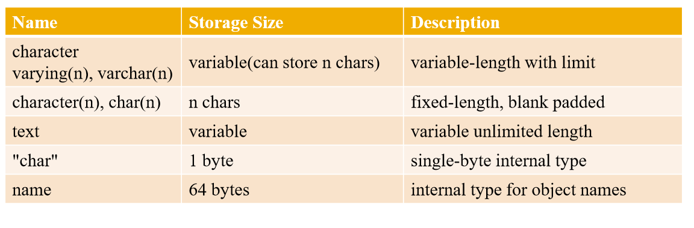

 	在某些数据库中定长的字段查询返回比较快，而在postgresql数据库定长或者变长的字符串并不会有太大却别，建议直接使用变长字符串。

​	character varying(n),character(n),text都是以字符类存储的，而`"char"`和name类型都是以字节存储的。

```
tutorial=# drop table test1;
DROP TABLE
tutorial=# create table test1(info varchar(2));
CREATE TABLE
tutorial=# insert into test1 values('gh'),('国会');
INSERT 0 2
tutorial=# select length(info),info from test1 ;
 length | info 
--------+------
      2 | gh
      2 | 国会
(2 rows)

tutorial=# select length(info),pg_column_size(info),info from test1 ;
 length | pg_column_size | info 
--------+----------------+------
      2 |              3 | gh
      2 |              7 | 国会
(2 rows)

tutorial=# 

```

​	text的空间大小最大是1G


### 时间类型

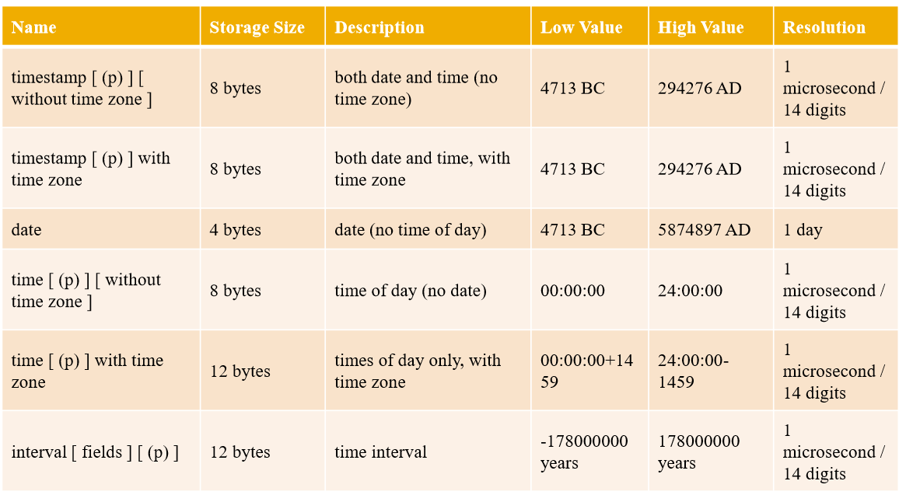


```
tutorial=# select '20180101 09:34:22'::timestamp,'20180128'::date,'09:02:04'::time ;
      timestamp      |    date    |   time   
---------------------+------------+----------
 2018-01-01 09:34:22 | 2018-01-28 | 09:02:04
tutorial=# select to_char(now(),'yyyymmddhh24:mi:ss');
     to_char      
------------------
 2018072409:35:18
(1 row)

```

#### 特殊时间值

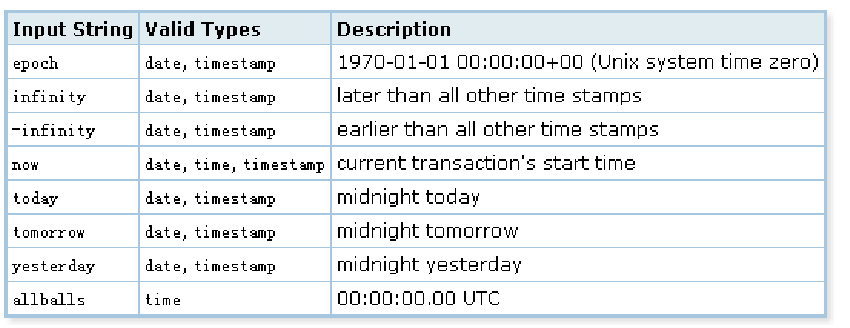

```
select timestamp 'epoch',date 'infinity',time 'now',date 'today',time 'allballs'; 
      timestamp      |   date   |      time       |    date    |   time   
---------------------+----------+-----------------+------------+----------
 1970-01-01 00:00:00 | infinity | 09:28:34.938764 | 2018-07-24 | 00:00:00

```

#### 时间输入输出格式

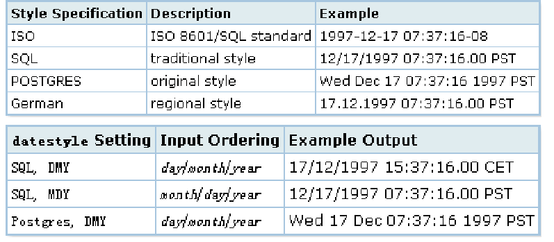

```
tutorial=# show datestyle;
 DateStyle 
-----------
 ISO, MDY
(1 row)

tutorial=# select now();
              now              
-------------------------------
 2018-07-24 09:38:06.344252+08
(1 row)
tutorial=# set datestyle = 'SQL,DMY';
SET
tutorial=# select now();
              now               
--------------------------------
 24/07/2018 09:38:57.693791 CST
(1 row)
tutorial=# set datestyle = 'ISO,YMD';
SET
tutorial=# select now();
              now              
-------------------------------
 2018-07-24 09:42:58.390804+08
(1 row)

```

建议改成`datestyle='ISO,YMD'时间展现格式`,`vim postgresql.conf中的datestyle = 'iso, ymd'`就可以了

```


tutorial=# show datestyle;
 DateStyle 
-----------
 ISO, YMD
(1 row)

```

#### 间隔表示


year(s):一年为1 year,两年为 2 years

mon(s):一月为1 mon,两个月为 2 mons

week(s):一周为 1 week,两周为 2 weeks

day(s):一天为 1 day,两天为 2 days


```
tutorial=# show intervalStyle;
 IntervalStyle 
---------------
 postgres
(1 row)
tutorial=# select now() + interval '1 year 2 mons';
           ?column?            
-------------------------------
 2019-09-24 09:51:15.499966+08
(1 row)

tutorial=# select now() - interval '1 year 2 mons';
           ?column?            
-------------------------------
 2017-05-24 09:51:23.005948+08
(1 row)

tutorial=# select now() + interval ' 3 days';
           ?column?            
-------------------------------
 2018-07-27 09:51:46.356803+08
(1 row)

tutorial=# select now() + interval ' 2 weeks';
           ?column?            
-------------------------------
 2018-08-07 09:52:03.789803+08
(1 row)

tutorial=# select now() - interval ' 5 weeks';
           ?column?            
-------------------------------
 2018-06-19 09:52:24.086816+08
(1 row)

tutorial=# select now();
             now             
-----------------------------
 2018-07-24 10:11:04.6798+08
(1 row)

tutorial=# select now() + interval '04:05:06';
           ?column?            
-------------------------------
 2018-07-24 14:16:13.345092+08
(1 row)

```


### BOOLEAN

​	true,false

### ENUM

​	create type type_name as ENUM();

```
tutorial=# create type ty_feel_gh as ENUM('sad','ok','happy');
CREATE TYPE
tutorial=# create table person(name text,current_feel ty_feel_gh);
CREATE TABLE
tutorial=# insert into person values('gh','happy');
INSERT 0 1
tutorial=# insert into person values('gh','sad');
INSERT 0 1
tutorial=# select * from person;
 name | current_feel 
------+--------------
 gh   | happy
 gh   | sad
(2 rows)

```

​	如果插入或者查询的字段没有enum中的值就会报错

```
tutorial=# insert into person values('gh','sad1');
ERROR:  invalid input value for enum ty_feel_gh: "sad1"
LINE 1: insert into person values('gh','sad1');

tutorial=# select * from person where current_feel = 'sad1';
ERROR:  invalid input value for enum ty_feel_gh: "sad1"
LINE 1: select * from person where current_feel = 'sad1';

```

​	可以在查询时，将enum值转换为text类型

```
tutorial=# select * from person where current_feel::text = 'sad1';
 name | current_feel 
------+--------------
(0 rows)

```

​	枚举的类型每一行占有4bytes

```
tutorial=# select pg_column_size(current_feel),* from person;
 pg_column_size | name | current_feel 
----------------+------+--------------
              4 | gh   | happy
              4 | gh   | sad
(2 rows)

```

​	查看枚举ty_feel_gh的结构

```
tutorial=# select oid,typname from pg_type where typname = 'ty_feel_gh';
  oid  |  typname   
-------+------------
 81610 | ty_feel_gh
(1 row)

tutorial=# select * from pg_enum where enumtypid = 81610;
 enumtypid | enumsortorder | enumlabel 
-----------+---------------+-----------
     81610 |             1 | sad
     81610 |             2 | ok
     81610 |             3 | happy
(3 rows)

```

​	在枚举ty_feel_gh添加新的参数值

​	 ALTER TYPE name ADD VALUE new_enum_value [ { BEFORE | AFTER } existing_enum_value ] 

​	 This form adds a new value to an enum type. If the new value's place in the enum's ordering is not specified using BEFORE or AFTER, then the new item is placed at the end of the list of values.

```
tutorial=# alter type ty_feel_gh add value 'cool';
ALTER TYPE
tutorial=# select * from pg_enum where enumtypid = 81610;
 enumtypid | enumsortorder | enumlabel 
-----------+---------------+-----------
     81610 |             1 | sad
     81610 |             2 | ok
     81610 |             3 | happy
     81610 |             4 | cool
(4 rows)

```

​	 注意事项, 添加枚举元素时尽量不要改动原来的元素的位置, 即尽量新增值插到最后.

​	否则可能会带来性能问题. 

​	ALTER TYPE ... ADD VALUE (the form that adds a new value to an enum type) cannot be executed inside a transaction block. 

​	 Comparisons involving an added enum value will sometimes be slower than comparisons involving only original members of the enum type. This will usually only occur if BEFORE or AFTER is used to set the new value's sort position somewhere other than at the end of the list. However, sometimes it will happen even though the new value is added at the end (this occurs if the OID counter "wrapped around" since the original creation of the enum type). The slowdown is usually insignificant; but if it matters, optimal performance can be regained by dropping and recreating the enum type, or by dumping and reloading the database.


### money

​	money类型只是为其在数字后添加一个符号

```
tutorial=# show lc_monetary;
 lc_monetary 
-------------
 en_US.UTF-8
(1 row)

tutorial=# select '12.233'::money;
 money  
--------
 $12.23
(1 row)

tutorial=# set lc_monetary='zh_CN';
SET
tutorial=# select '12.233'::money;
  money  
---------
 ￥12.23
(1 row)

```


### bytea


​	oracle blob对应该字段 bytea


### 几何类型

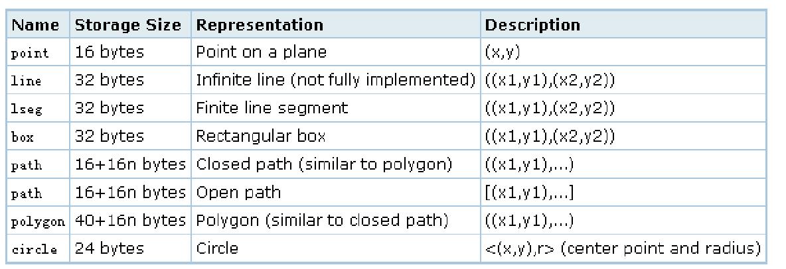


### 网络地址类型

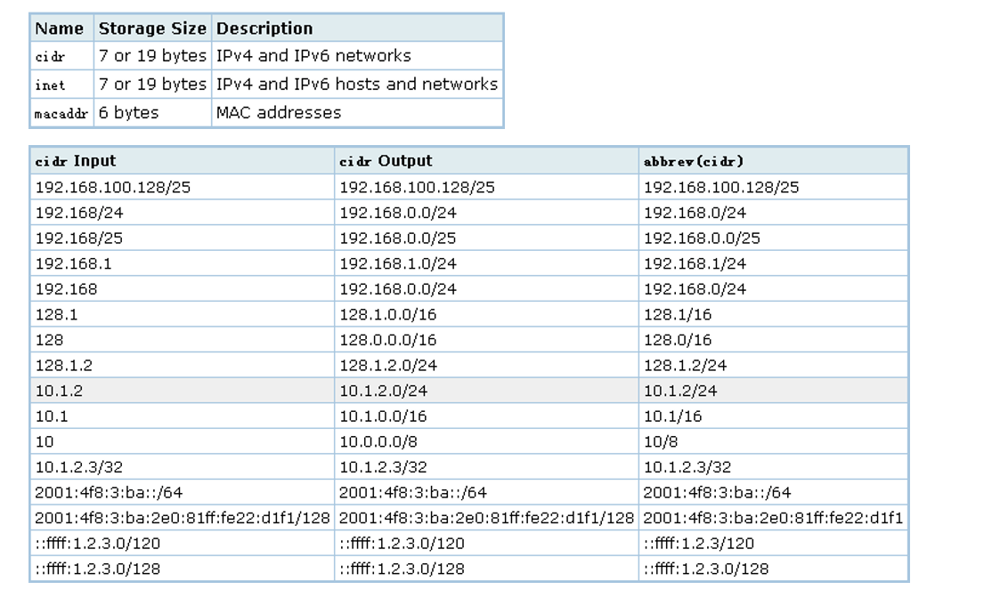

```
tutorial=# create table test_1(id int4,start_ip inet,end_ip inet);
CREATE TABLE
tutorial=# insert into test_1 values(1,'192.168.1.0','192.168.1.255');
INSERT 0 1
tutorial=# insert into test_1 values(2,'192.168.2.0','192.168.3.6');
INSERT 0 1
tutorial=# insert into test_1 values(4,'192.168.3.254','192.168.4.6');
INSERT 0 1
tutorial=# select id,generate_series(0,end_ip-start_ip)+start_ip from test_1 where id = 4;
 id |   ?column?    
----+---------------
  4 | 192.168.3.254
  4 | 192.168.3.255
  4 | 192.168.4.0
  4 | 192.168.4.1
  4 | 192.168.4.2
  4 | 192.168.4.3
  4 | 192.168.4.4
  4 | 192.168.4.5
  4 | 192.168.4.6
(9 rows)
```


### BIT

​	变长

​	定长


### 全文检索

​	

#### tsvector

​	去除重复分词后按分词顺序存储

​	可以存储位置信息和权重信息

#### tsquery

​	存储查询的分词，可存储权重信息

```
tutorial=# select * from pg_ts_dict;
    dictname     | dictnamespace | dictowner | dicttemplate |                  dictinitoption                   
-----------------+---------------+-----------+--------------+---------------------------------------------------
 simple          |            11 |        10 |         3727 | 
 danish_stem     |            11 |        10 |        12422 | language = 'danish', stopwords = 'danish'
 dutch_stem      |            11 |        10 |        12422 | language = 'dutch', stopwords = 'dutch'
 english_stem    |            11 |        10 |        12422 | language = 'english', stopwords = 'english'
 finnish_stem    |            11 |        10 |        12422 | language = 'finnish', stopwords = 'finnish'
 french_stem     |            11 |        10 |        12422 | language = 'french', stopwords = 'french'
 german_stem     |            11 |        10 |        12422 | language = 'german', stopwords = 'german'
 hungarian_stem  |            11 |        10 |        12422 | language = 'hungarian', stopwords = 'hungarian'
 italian_stem    |            11 |        10 |        12422 | language = 'italian', stopwords = 'italian'
 norwegian_stem  |            11 |        10 |        12422 | language = 'norwegian', stopwords = 'norwegian'
 portuguese_stem |            11 |        10 |        12422 | language = 'portuguese', stopwords = 'portuguese'
 romanian_stem   |            11 |        10 |        12422 | language = 'romanian'
 russian_stem    |            11 |        10 |        12422 | language = 'russian', stopwords = 'russian'
 spanish_stem    |            11 |        10 |        12422 | language = 'spanish', stopwords = 'spanish'
 swedish_stem    |            11 |        10 |        12422 | language = 'swedish', stopwords = 'swedish'
 turkish_stem    |            11 |        10 |        12422 | language = 'turkish', stopwords = 'turkish'
(16 rows)

```


​	查看pg_type下是否存在两种类型

```
tutorial=# select oid,typname from pg_type where typname in ('tsvector','tsquery');
 oid  | typname  
------+----------
 3614 | tsvector
 3615 | tsquery
(2 rows)

```

​	插入数据

```
tutorial=# create table test1(id int,info_v tsvector,info_q tsquery);
CREATE TABLE
tutorial=# insert into test1 values(1,$$df dfd ; dfd ada dfda good fdd$$,'fat & cat'::tsquery);
INSERT 0 1
tutorial=# select * from test1;
 id |                  info_v                  |    info_q     
----+------------------------------------------+---------------
  1 | ';' 'ada' 'df' 'dfd' 'dfda' 'fdd' 'good' | 'fat' & 'cat'
(1 row)

```


​	'column value'::tsvector,to_tsvector('column value') 返回不一样

​	

[pg 全文检索](../201808/20180807_05.md)


### UUID


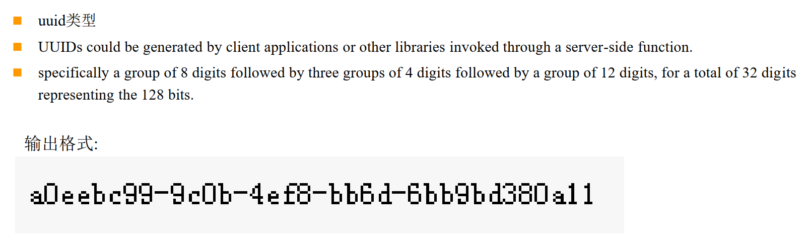


### XML


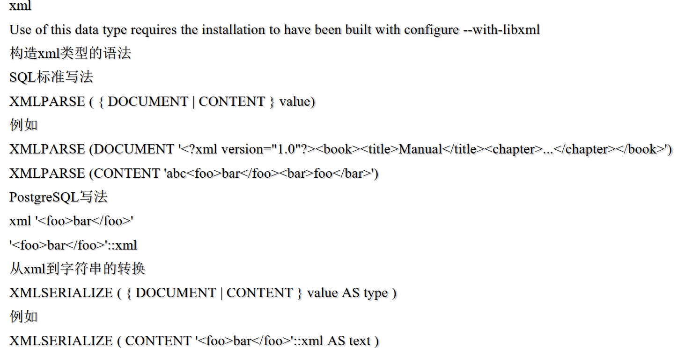


### array

​	

​	后续会单独开一个小结来介绍array数组


### 复合类型

​	

#### 创建

create type typname as (command)

```
tutorial=# create type rysx as (name text,age int4,price numeric);
CREATE TYPE
tutorial=# create table person(person_rysx rysx,salary int);
CREATE TABLE

```

#### 插入 

insert into table values(row(),...)

```
tutorial=# insert into person VALUES(row('guohui',12,132.3),111);
INSERT 0 1
tutorial=# select * from person;
    person_rysx    | salary 
-------------------+--------
 (guohui,12,132.3) |    111
(1 row)

```

insert into table(type.a,type.b) values(a,b,...)复合类型中没有传入值就默认存入NULL

```
tutorial=# insert into person(person_rysx.name,person_rysx.age,salary) values('guokai',122,111);
INSERT 0 1
tutorial=# select * from person;
    person_rysx    | salary 
-------------------+--------
 (guohui,12,132.3) |    111
 (guokai,122,)     |    111
(2 rows)

```

#### 查询

select * from table where (column).typea=value;

```
tutorial=# select * from person where (person_rysx).name = 'guokai';
  person_rysx  | salary 
---------------+--------
 (guokai,122,) |    111
(1 row)

tutorial=# select * from person where (person.person_rysx).name = 'guohui';
    person_rysx    | salary 
-------------------+--------
 (guohui,12,132.3) |    111
(1 row)

```

#### 更新

update table set column=row()

```
tutorial=# update person set person_rysx=row('guose',12,12) where (person_rysx).name = 'guohui';
UPDATE 1
tutorial=# select * from person;
  person_rysx  | salary 
---------------+--------
 (guokai,122,) |    111
 (guose,12,12) |    111
(2 rows)

```

update table set column.typea = value 

```
tutorial=# update person set person_rysx.name = 'gousheng' where (person_rysx).name = 'guokai';
UPDATE 1
tutorial=# select * from person;
   person_rysx   | salary 
-----------------+--------
 (guose,12,12)   |    111
 (gousheng,122,) |    111
(2 rows)

```


#### 删除

delete from table where (column).typea= '';


### 其他数据类型

​	

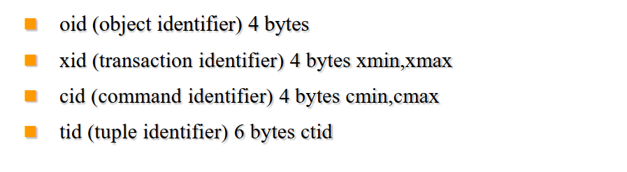


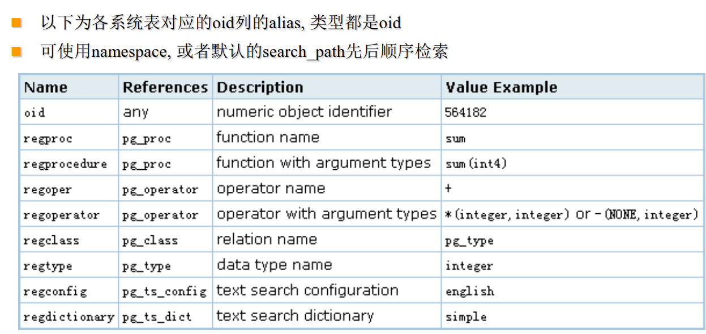

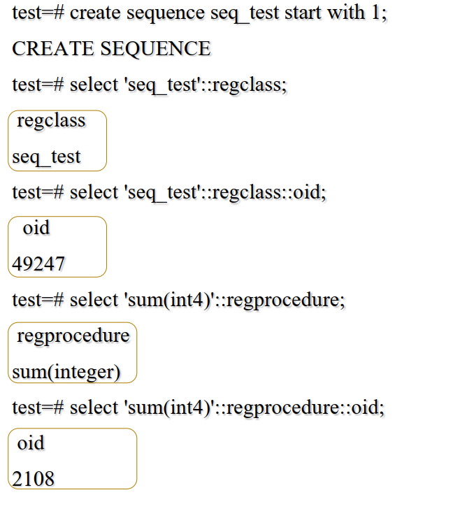


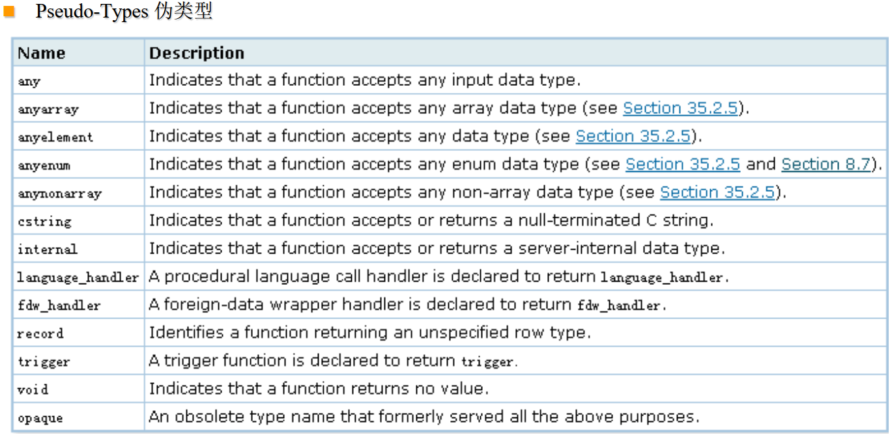


## 表操作


查询语句操作语句 

关键字大写(SELECT FROM WHERE LIMIT)

pg_class, relname,表名,对象名,列名


隐式转换

E'digoal\\' 

$$digoal\$$ 

$tag$digoal\$tag$ 

 B'1010101' 

 10 or +10

-23.4 

+100.1 or 100.1

10e-1 

98e+10 or 98e10


显示转换

type ‘string’   

time '12:00:00' 

'string'::type  

'1 hour'::interval 

CAST ( 'string' AS type ) 

CAST('127.0.0.1' AS inet


操作符

+-*/


特殊符号

$,:,.,...


## 事务操作


 ```
begin
commit
rollback
savepoint a
rollback to a
 ```

savepoint作用是什么？

```
tutorial=# truncate table test1;
TRUNCATE TABLE
tutorial=# begin;
BEGIN
tutorial=# insert into test1(id,info) values(1,'11');
INSERT 0 1
tutorial=# select * from test1;
 id | info 
----+------
  1 | 11
(1 row)

tutorial=# savepoint a;
SAVEPOINT
tutorial=# update test1 set id = 2 where id = 1;
UPDATE 1
tutorial=# savepoint b;
SAVEPOINT
tutorial=# select * from test1;
 id | info 
----+------
  2 | 11
(1 row)

tutorial=# select ctid,cmin,cmax,xmin,xmax ,* from test1;
 ctid  | cmin | cmax | xmin | xmax | id | info 
-------+------+------+------+------+----+------
 (0,2) |    1 |    1 | 7271 |    0 |  2 | 11
(1 row)

tutorial=# delete from test1 where id = 2;
DELETE 1
tutorial=# savepoint c;
SAVEPOINT
tutorial=# select * from test1;
 id | info 
----+------
(0 rows)

tutorial=# rollback to a;
ROLLBACK
tutorial=# select * from test1;
 id | info 
----+------
  1 | 11
(1 row)

tutorial=# 

```


二阶事务

 prepare transaction 

 rollback prepared 

commit prepared


psql相关的事务模式变量

ON_ERROR_ROLLBACK,ON_ERROR_STOP

如何开启ON_ERROR_ROLLBACK,会在每一条sql前设置隐形的savepoint,可以继续下面的sql而不用全部回滚


postgresql 一个事务中可以包含DML,DDL,DCL

除了一下

CREATE TABLESPACE

CREATE DATABASE

使用concurrently并行创建索引

其他未尽情况略


## 单条SQL插入多行的性能最高


INSERT INTO tb1(c1,...,cn) values(...),(...),(...)

## 查询

### join


内连接 inner join on 

左连接 left join on 

右连接 right join on

全连接 full join on 

自然连接 natural join on --针对两个相同字段，帮助自动取消掉一个


### alias

table alias

column alias

subquery alias


### table as function's return data type

#### return table's row type

```
tutorial=# create table test1(id int,name text,crt_time timestamp(0));
CREATE TABLE
tutorial=# create or replace function f_test1(i_id int) returns 
tutorial-# setof test1 as $$
tutorial$# declare
tutorial$# begin
tutorial$# return query select * from test1 where id = i_id;
tutorial$# return;
tutorial$# end;
tutorial$# $$
tutorial-# language plpgsql;
CREATE FUNCTION
tutorial=# insert into test1 values(1,'guohiu',now());
INSERT 0 1
tutorial=# insert into test1 values(1,'guoh==iu',now());
INSERT 0 1
tutorial=# select * from f_test1(1);
 id |   name   |      crt_time       
----+----------+---------------------
  1 | guohiu   | 2018-08-01 05:08:04
  1 | guoh==iu | 2018-08-01 05:08:10
(2 rows)

tutorial=# select * from f_test1(2);
 id | name | crt_time 
----+------+----------
(0 rows)

```

setof：这个是指的是什么？

#### return composite type

```
tutorial=# create type tp_test1 as (id int,name text,crt_time timestamp(0));
CREATE TYPE
tutorial=# create or replace function f_tp_test1(i_id int) returns 
setof tp_test1 as $$
declare
begin
return query select * from test1 where id = i_id;
return;
end;
$$
language plpgsql;
CREATE FUNCTION
tutorial=# select * from f_tp_test1(1);
 id |   name   |      crt_time       
----+----------+---------------------
  1 | guohiu   | 2018-08-01 05:08:04
  1 | guoh==iu | 2018-08-01 05:08:10
(2 rows)

tutorial=# select * from f_tp_test1(2);
 id | name | crt_time 
----+------+----------
(0 rows)


```

#### return record

```
tutorial=# create or replace function f_re_test1(i_id int) returns 
setof record as $$
declare
begin
return query select * from test1 where id = i_id;
return;
end;
$$
language plpgsql;
CREATE FUNCTION
tutorial=# select * from f_re_test1(1) as(id int,name text,crt_time timestamp(0));
 id |   name   |      crt_time       
----+----------+---------------------
  1 | guohiu   | 2018-08-01 05:08:04
  1 | guoh==iu | 2018-08-01 05:08:10
(2 rows)


```

record:弹性结构


###  group by 

### distinct

distinct column(column value is null then enqul)

```
tutorial=# SELECT * FROM test1;
 id |   name   |      crt_time       
----+----------+---------------------
  1 | guohiu   | 2018-08-01 05:08:04
  1 | guoh==iu | 2018-08-01 05:08:10
    | guoh==iu | 2018-08-01 05:26:12
    | guohiu   | 2018-08-01 05:26:21
(4 rows)

tutorial=# select distinct id from test1;
 id 
----
   
  1
(2 rows)

```

distinct on (column,...) 

 SELECT DISTINCT ON (expression [, expression ...]) select_list ...  -- ON()里面必须出现在 order by中作为前导列 

**Here expression is an arbitrary value expression that is evaluated for all rows. A set of rows for which all the expressions are equal are considered duplicates, and only the first row of the set is kept in the output. Note that the "first row" of a set is unpredictable unless the query is sorted on enough columns to guarantee a unique ordering of the rows arriving at the DISTINCT filter. (DISTINCT ON processing occurs after ORDER BY sorting.)**

distinct on (column,..)只取一行

```
tutorial=# select distinct on (id) id ,name ,crt_time from test1;
 id |   name   |      crt_time       
----+----------+---------------------
  1 | guohiu   | 2018-08-01 05:08:04
    | guoh==iu | 2018-08-01 05:26:12
(2 rows)

tutorial=# select distinct on (id) id ,name ,crt_time from test1 order by name;
ERROR:  SELECT DISTINCT ON expressions must match initial ORDER BY expressions
LINE 1: select distinct on (id) id ,name ,crt_time from test1 order ...
                            ^
tutorial=# select distinct on (id) id ,name ,crt_time from test1 order by id;
 id |   name   |      crt_time       
----+----------+---------------------
  1 | guohiu   | 2018-08-01 05:08:04
    | guoh==iu | 2018-08-01 05:26:12
(2 rows)

tutorial=# select distinct on (id) id ,name ,crt_time from test1 order by id desc;
 id |   name   |      crt_time       
----+----------+---------------------
    | guoh==iu | 2018-08-01 05:26:12
  1 | guohiu   | 2018-08-01 05:08:04
(2 rows)

tutorial=# select distinct on (id,name) id ,name ,crt_time from test1 order by id ,name,crt_time;
 id |   name   |      crt_time       
----+----------+---------------------
  1 | guohiu   | 2018-08-01 05:08:04
  1 | guoh==iu | 2018-08-01 05:08:10
    | guohiu   | 2018-08-01 05:26:21
    | guoh==iu | 2018-08-01 05:26:12
(4 rows)

tutorial=# select distinct on (id,name) id ,name ,crt_time from test1 order by id ,name,crt_time desc;
 id |   name   |      crt_time       
----+----------+---------------------
  1 | guohiu   | 2018-08-01 05:08:04
  1 | guoh==iu | 2018-08-01 05:08:10
    | guohiu   | 2018-08-01 05:26:21
    | guoh==iu | 2018-08-01 05:26:12
(4 rows)

```


```
tutorial=# create table window_test(id int,name text,subject text,score numeric);
CREATE TABLE
tutorial=#  INSERT INTO window_test VALUES (1,'digoal','数学',99.5), (2,'digoal','语文',89.5),(3,'digoal','英语',79.5), (4,'digoal','物理',99.5), (5,'digoal','化学',98.5), (6,'刘德华','数学',89.5), (7,'刘德华','语文',99.5), (8,'刘德华','英语',79.5),  (9,'刘德华','物理',89.5), (10,'刘德华','化学',69.5), (11,'张学友','数学',89.5), (12,'张学友','语文',91.5), (13,'张学友','英语',92.5), (14,'张学友','物理',93.5), (15,' 张学友','化学',94.5);
INSERT 0 15
tutorial=# select distinct on (subject) id,name,subject,score from window_test order by subject,score desc;
 id |  name  | subject | score 
----+--------+---------+-------
  5 | digoal | 化学    |  98.5
  1 | digoal | 数学    |  99.5
  4 | digoal | 物理    |  99.5
 13 | 张学友 | 英语    |  92.5
  7 | 刘德华 | 语文    |  99.5
(5 rows)

tutorial=#  select * from (select id,name,subject,score, row_number() over(partition by subject order by score desc) as mm from window_test) as f where f.mm = 1;
 id |  name  | subject | score | mm 
----+--------+---------+-------+----
  5 | digoal | 化学    |  98.5 |  1
  1 | digoal | 数学    |  99.5 |  1
  4 | digoal | 物理    |  99.5 |  1
 13 | 张学友 | 英语    |  92.5 |  1
  7 | 刘德华 | 语文    |  99.5 |  1


```


### combining query

union /union all

INTERSECT /INTERSECT ALL

EXCEPT /EXCEPT ALL


### sort

### limit 

limit 10 offset 12

从第十二行开始取出10条


### with

#### 语法

```
tutorial=# \h with
Command:     WITH
Description: retrieve rows from a table or view
Syntax:
[ WITH [ RECURSIVE ] with_query [, ...] ]
SELECT [ ALL | DISTINCT [ ON ( expression [, ...] ) ] ]
    [ * | expression [ [ AS ] output_name ] [, ...] ]
    [ FROM from_item [, ...] ]
    [ WHERE condition ]
    [ GROUP BY expression [, ...] ]
    [ HAVING condition [, ...] ]
    [ WINDOW window_name AS ( window_definition ) [, ...] ]
    [ { UNION | INTERSECT | EXCEPT } [ ALL | DISTINCT ] select ]
    [ ORDER BY expression [ ASC | DESC | USING operator ] [ NULLS { FIRST | LAST } ] [, ...] ]
    [ LIMIT { count | ALL } ]
    [ OFFSET start [ ROW | ROWS ] ]
    [ FETCH { FIRST | NEXT } [ count ] { ROW | ROWS } ONLY ]
    [ FOR { UPDATE | NO KEY UPDATE | SHARE | KEY SHARE } [ OF table_name [, ...] ] [ NOWAIT ] [...] ]

where from_item can be one of:

    [ ONLY ] table_name [ * ] [ [ AS ] alias [ ( column_alias [, ...] ) ] ]
    [ LATERAL ] ( select ) [ AS ] alias [ ( column_alias [, ...] ) ]
    with_query_name [ [ AS ] alias [ ( column_alias [, ...] ) ] ]
    [ LATERAL ] function_name ( [ argument [, ...] ] )
                [ WITH ORDINALITY ] [ [ AS ] alias [ ( column_alias [, ...] ) ] ]
    [ LATERAL ] function_name ( [ argument [, ...] ] ) [ AS ] alias ( column_definition [, ...] )
    [ LATERAL ] function_name ( [ argument [, ...] ] ) AS ( column_definition [, ...] )
    [ LATERAL ] ROWS FROM( function_name ( [ argument [, ...] ] ) [ AS ( column_definition [, ...] ) ] [, ...] )
                [ WITH ORDINALITY ] [ [ AS ] alias [ ( column_alias [, ...] ) ] ]
    from_item [ NATURAL ] join_type from_item [ ON join_condition | USING ( join_column [, ...] ) ]

and with_query is:

    with_query_name [ ( column_name [, ...] ) ] AS ( select | values | insert | update | delete )

TABLE [ ONLY ] table_name [ * ]


```


#### 递归语句

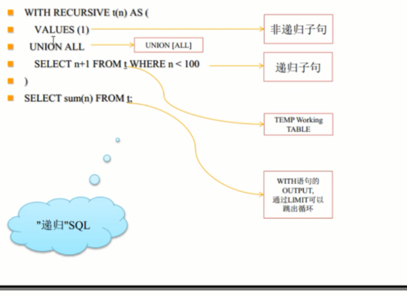


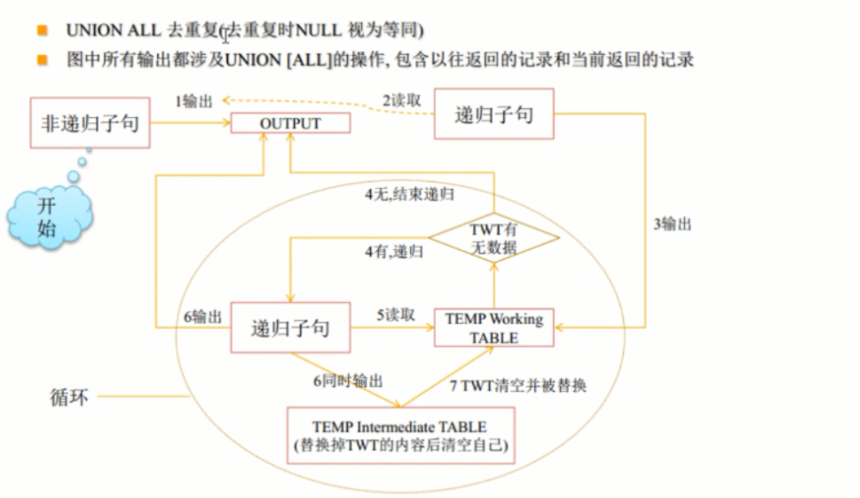


temp working table 没有隐藏字段(ctid,xmin,xmax..)


详情参考:[pg with](../201808/20180806_02.md)


## 函数三态

非常重要的函数三态 

Immutable

Stable

Volatile

稳定性

immutable > stable > volatitle


