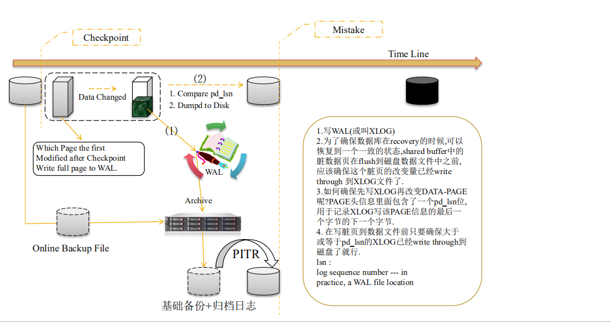

[TOC]

# pg dba 7


​	postgresql 备份 还原

​	

## 数据库热备份与还原


### 物理备份与还原

备份$PGDATA,归档文件，以及所有表空间目录,适用于跨小版本的恢复，但是不能跨平台

需要开启归档

**目前PG还不支持基于数据文件数据块变更的增量备份，仅仅支持数据文件+归档的备份的备份方式**


### 数据库物理备份开启


#### 开启归档

首先要开启归档，日志模式>=`archive`,步骤如下

```
$ vim postgresql.conf
wal_level = hot_standby                 # minimal, archive, or hot_standby
                                        # (change requires restart)
```

**创建归档目录**

```
# mkdir -p /home/backup/arch
# chown -R ysys:ysys /home/backup/arch
```

**配置归档命令**

* %p 表示xlog文件名 $PGDATA的相对路径，如`pg_xlog/000000010000000000000005`
* %f 表示xlog文件名，如`000000010000000000000005`

```
# vim postgresql.conf

archive_mode = on               # allows archiving to be done
                                # (change requires restart)
archive_command = 'DATE=`date +%Y%m%d`;DIR="/home/backup/arch/$DATE";(test -d $DIR||mkdir -p $DIR)&& cp %p $DIR/%f'   
```

​	上面的archive_command，每天生成一个当前日期的文件夹，并将xlog文件拷贝到当前目录下

```
$ psql
psql (9.2.4)
Type "help" for help.

ysys=# checkpoint;
CHECKPOINT
ysys=# select pg_switch_xlog();
 pg_switch_xlog 
----------------
 0/30D84A8
(1 row)

ysys=# \q
```

​	上面使用`checkpoint`和`pg_switch_xlog()`切换xlog日志，检查xlog日志是否到归档目录下

**测试归档是否正常**

```
$ ls -ls /home/backup/arch/20181121
total 16384
16384 -rw------- 1 ysys ysys 16777216 Nov  6 15:07 000000010000000000000013
```

​	检查后发现归档日志放在当前目录下


#### 物理备份

​	当数据库处于归档环境下，还需要对数据库做一个物理备份-基础备份

##### 流复制协议pg_basebackup

```
create role rep replication login password 'rep';
```

```
$ vim pg_hba.conf
host    replication     rep             0.0.0.0/0               md5
```

在另外一台服务器只要有pg环境,就可以执行流复制协议

```
$  pg_basebackup -F t -x -D ./191204 -h 192.168.1.11 -p 5432 -U rep
```

查看内容

```
$ tar -tvf base.tar | less
-rw------- postgres/postgres 206 2019-12-03 17:59 backup_label
drwx------ postgres/postgres   0 2019-12-03 17:59 global/
-rw------- postgres/postgres 512 2019-12-03 15:29 global/pg_filenode.map
-rw------- postgres/postgres 8192 2019-12-03 17:59 global/12799
-rw------- postgres/postgres 16384 2019-12-03 17:51 global/12801
-rw------- postgres/postgres 16384 2019-12-03 17:51 global/12802
-rw------- postgres/postgres     0 2019-12-03 15:29 global/12933
...
```

去源头查看确实如此

```
$ cd global/
$ ls -ls
total 444
 8 -rw------- 1 ysys ysys  8192 Dec  3 17:59 12799
24 -rw------- 1 ysys ysys 24576 Dec  3 15:29 12799_fsm
 8 -rw------- 1 ysys ysys  8192 Dec  3 17:51 12799_vm
16 -rw------- 1 ysys ysys 16384 Dec  3 17:51 12801
16 -rw------- 1 ysys ysys 16384 Dec  3 17:51 12802
 0 -rw------- 1 ysys ysys     0 Dec  3 15:29 12933
 0 -rw------- 1 ysys ysys     0 Dec  3 15:29 12935
 8 -rw------- 1 ysys ysys  8192 Dec  3 15:29 12937
 8 -rw------- 1 ysys ysys  8192 Dec  3 15:29 12938
 8 -rw------- 1 ysys ysys  8192 Dec  3 15:29 12939
24 -rw------- 1 ysys ysys 24576 Dec  3 15:29 12939_fsm
 8 -rw------- 1 ysys ysys  8192 Dec  3 15:29 12939_vm
16 -rw------- 1 ysys ysys 16384 Dec  3 15:29 12941
16 -rw------- 1 ysys ysys 16384 Dec  3 15:29 12942
```


##### 手动拷贝pg_start_backup

```
 --首先要打开强制检查点
 
 select pg_start_backup(now()::text);
 
 --是否正在备份
 
 select pg_is_in_backup();
 
 --备份$PGDATA和表空间目录
 
 select pg_stop_backup();
 
 --最后拷贝强制检查点之间的所有归档文件, 确保备份有效性
```


#### 物理还原

​	考虑到可以还原到多种模式，会使用几个单独的文件记录

[postgresql physical restore with  using pg_basebackup and archive log ](../201912/20191204_01.md):异地基础备份+异地归档+还原操作

​	

##### recovery.conf

recovery.conf参数介绍

命名的还原点，如果前后都有相同的名字时，第一个就会停止
recovery_target_name = ''	# e.g. '2018013122'

基于时间点的还原
recovery_target_time = ''	# e.g. '2018-01-31 13:54:41.416102+08'
=# select now();

基于xid的还原
recovery_target_xid = '1821'
=# select txid_current();

recovery_target_inclusive = true 

表示包含在这个时间点所有提交的事务，如果为false，遇到第一个事务提交或者回滚截至(影响两个参数recovery_target_xid，recovery_target_time )


##### 物理还原原理




## 逻辑备份与还原

 备份数据,适用于跨版本数据库还原


### pg_dump

-F c 备份为二进制格式, 压缩存储. 并且可被pg_restore用于精细还原 

-F p 备份为文本, 大库不推荐 

```
$ pg_dump --help
pg_dump dumps a database as a text file or to other formats.

Usage:
  pg_dump [OPTION]... [DBNAME]

General options:
  -f, --file=FILENAME          output file or directory name
  -F, --format=c|d|t|p         output file format (custom, directory, tar,
                               plain text (default))
  -j, --jobs=NUM               use this many parallel jobs to dump
  -v, --verbose                verbose mode
  -V, --version                output version information, then exit
  -Z, --compress=0-9           compression level for compressed formats
  --lock-wait-timeout=TIMEOUT  fail after waiting TIMEOUT for a table lock
  -?, --help                   show this help, then exit

Options controlling the output content:
  -a, --data-only              dump only the data, not the schema
  -b, --blobs                  include large objects in dump
  -c, --clean                  clean (drop) database objects before recreating
  -C, --create                 include commands to create database in dump
  -E, --encoding=ENCODING      dump the data in encoding ENCODING
  -n, --schema=SCHEMA          dump the named schema(s) only
  -N, --exclude-schema=SCHEMA  do NOT dump the named schema(s)
  -o, --oids                   include OIDs in dump
  -O, --no-owner               skip restoration of object ownership in
                               plain-text format
  -s, --schema-only            dump only the schema, no data
  -S, --superuser=NAME         superuser user name to use in plain-text format
  -t, --table=TABLE            dump the named table(s) only
  -T, --exclude-table=TABLE    do NOT dump the named table(s)
  -x, --no-privileges          do not dump privileges (grant/revoke)
  --binary-upgrade             for use by upgrade utilities only
  --column-inserts             dump data as INSERT commands with column names
  --disable-dollar-quoting     disable dollar quoting, use SQL standard quoting
  --disable-triggers           disable triggers during data-only restore
  --exclude-table-data=TABLE   do NOT dump data for the named table(s)
  --if-exists                  use IF EXISTS when dropping objects
  --inserts                    dump data as INSERT commands, rather than COPY
  --no-security-labels         do not dump security label assignments
  --no-synchronized-snapshots  do not use synchronized snapshots in parallel jobs
  --no-tablespaces             do not dump tablespace assignments
  --no-unlogged-table-data     do not dump unlogged table data
  --quote-all-identifiers      quote all identifiers, even if not key words
  --section=SECTION            dump named section (pre-data, data, or post-data)
  --serializable-deferrable    wait until the dump can run without anomalies
  --use-set-session-authorization
                               use SET SESSION AUTHORIZATION commands instead of
                               ALTER OWNER commands to set ownership

Connection options:
  -d, --dbname=DBNAME      database to dump
  -h, --host=HOSTNAME      database server host or socket directory
  -p, --port=PORT          database server port number
  -U, --username=NAME      connect as specified database user
  -w, --no-password        never prompt for password
  -W, --password           force password prompt (should happen automatically)
  --role=ROLENAME          do SET ROLE before dump

If no database name is supplied, then the PGDATABASE environment
variable value is used.

Report bugs to <pgsql-bugs@postgresql.org>.
```


### pg_dumpall

​	可以备份全局元数据对象, 例如用户密码, 数据库, 表空间

​	只支持文本格式

```
$ pg_dumpall --help
pg_dumpall extracts a PostgreSQL database cluster into an SQL script file.

Usage:
  pg_dumpall [OPTION]...

General options:
  -f, --file=FILENAME          output file name
  -V, --version                output version information, then exit
  --lock-wait-timeout=TIMEOUT  fail after waiting TIMEOUT for a table lock
  -?, --help                   show this help, then exit

Options controlling the output content:
  -a, --data-only              dump only the data, not the schema
  -c, --clean                  clean (drop) databases before recreating
  -g, --globals-only           dump only global objects, no databases
  -o, --oids                   include OIDs in dump
  -O, --no-owner               skip restoration of object ownership
  -r, --roles-only             dump only roles, no databases or tablespaces
  -s, --schema-only            dump only the schema, no data
  -S, --superuser=NAME         superuser user name to use in the dump
  -t, --tablespaces-only       dump only tablespaces, no databases or roles
  -x, --no-privileges          do not dump privileges (grant/revoke)
  --binary-upgrade             for use by upgrade utilities only
  --column-inserts             dump data as INSERT commands with column names
  --disable-dollar-quoting     disable dollar quoting, use SQL standard quoting
  --disable-triggers           disable triggers during data-only restore
  --if-exists                  use IF EXISTS when dropping objects
  --inserts                    dump data as INSERT commands, rather than COPY
  --no-security-labels         do not dump security label assignments
  --no-tablespaces             do not dump tablespace assignments
  --no-unlogged-table-data     do not dump unlogged table data
  --quote-all-identifiers      quote all identifiers, even if not key words
  --use-set-session-authorization
                               use SET SESSION AUTHORIZATION commands instead of
                               ALTER OWNER commands to set ownership

Connection options:
  -d, --dbname=CONNSTR     connect using connection string
  -h, --host=HOSTNAME      database server host or socket directory
  -l, --database=DBNAME    alternative default database
  -p, --port=PORT          database server port number
  -U, --username=NAME      connect as specified database user
  -w, --no-password        never prompt for password
  -W, --password           force password prompt (should happen automatically)
  --role=ROLENAME          do SET ROLE before dump

If -f/--file is not used, then the SQL script will be written to the standard
output.

Report bugs to <pgsql-bugs@postgresql.org>.
```


### copy

```
# \h copy
# copy (select * from test_2) to '/home/ysys/test_1.sql';
```


二进制格式的备份只能使用pg_restore来还原, 可以指定还原的表, 编辑TOC文件, 定制还原的顺序, 表, 索引等. 

文本格式的备份还原, 直接使用用户连接到对应的数据库执行备份文本即可, 例如psql dbname -f bak.sql 


## error

1、在执行pg_basebackup,报错`pg_basebackup: could not connect to server: FATAL:  number of requested standby connections exceeds max_wal_senders (currently 0)`

```
$ vim postgresql.conf

$ cat postgresql.conf|grep max_wal_senders
max_wal_senders = 4		# max number of walsender processes
```

​	是max_wal_senders发送文件进程