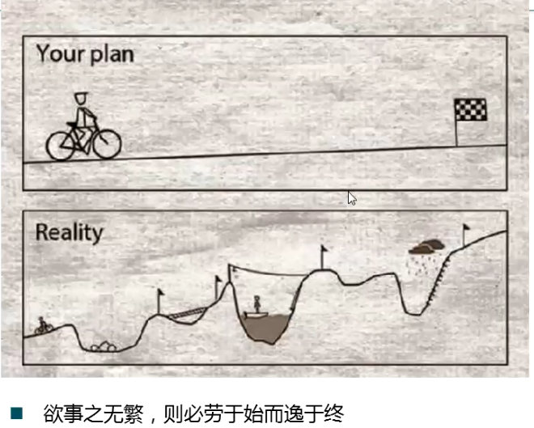

[TOC]

# dba的分工和工作内容

**document support**

ysys

**date**

2018-11-20

**label**

oracle dba

## dba 

### Oracle版本

### 10g,11g的g的含义

**GRID**

**存储 ASM**

**数据库服务 RAC**

**应用 STREAM**

**管理 GRID Control**

### oracle 荣誉层级

OCA

OCP

OCM

ACE

### 关于去IOE

阿里巴巴：IBM小型机,ORACLE数据库,EMC存储设备

斯诺登事件

银监会

### DBA角色和分工

https://github.com/gh95533/mrwd/tree/master/20170401

**多学习**

