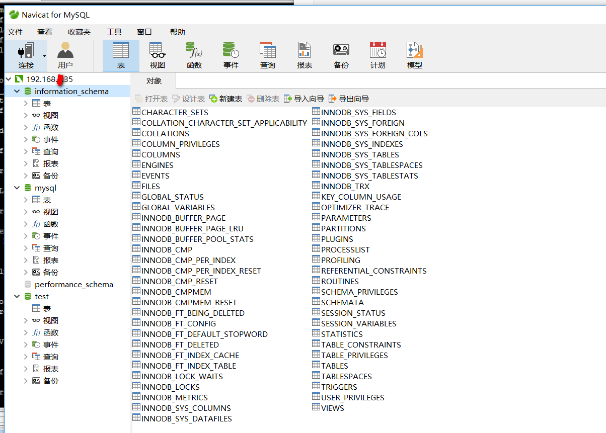

[TOC]

# centos 7.3 install mysql5.6

**document support**

ysys

**date**

2018-12-20

**label**

centos7.3,mysql.5.6 install


## 安装失败一般操作

```
# rm /etc/my.cnf
# userdel -r mysql
```

```
# rpm -qa|grep mysql
# rpm -e {你的mysql包}
```


## 创建用户

```
# groupadd mysql
# useradd -m -s /bin/bash/ -d /home/mysql -g mysql mysql
# passwd mysql
```


## 上传文件解压文件

```
# cd /software
# tar -zxvf mysql-5.6.41-linux-glibc2.12-x86_64.tar.gz 
# mkdir /usr/local/mysql
# cp -R mysql-5.6.41-linux-glibc2.12-x86_64/* /usr/local/mysql
```


## 拷贝修改启动文件

```
# cd /usr/local/mysql
# cd support-files/
# cp my-default.cnf /etc/my.cnf
# vim /etc/my.cnf


[mysql]
default-character-set=utf8 
socket=/var/lib/mysql/mysql.sock

[mysqld]
skip-name-resolve
basedir =/usr/local/mysql
datadir =/usr/local/mysql/data
port =3306 
socket =/var/lib/mysql/mysql.sock
max_connections=200
character-set-server=utf8
default-storage-engine=INNODB
lower_case_table_names=1
max_allowed_packet=16M


sql_mode=NO_ENGINE_SUBSTITUTION,STRICT_TRANS_TABLES 

```

## 授权文件

```
# chown -R mysql:mysql /usr/local/mysql/
# chown -R mysql:mysql /usr/local/mysql/
```


## 安装脚本

```
# cd /usr/local/mysql
# ./scripts/mysql_install_db --user=mysql --basedir=/usr/local/mysql/ -datadir=/usr/local/mysql/data/
```

./scripts/mysql_install_db --user=mysql --basedir=/usr/local/mysql/ -datadir=/usr/local/mysql/data/

## 后续操作

```
# chmod 644 /etc/my.cnf
# cp /usr/local/mysql/support-files/mysql.server /etc/rc.d/init.d/mysqld
# chmod +x /etc/rc.d/init.d/mysqld 
# chkconfig --add mysqld
# chkconfig --list mysqld
# service mysqld start
```

## 修改环境变量

```
# cd ~
# vim .bash_profile

PATH=$PATH:$HOME/bin:/usr/local/mysql/bin
export PATH=$PATH:/usr/local/mysql/bin

# source .bash_profile
```


## 修改密码

```
# mysql -uroot -p
> use mysql
> update user set password=password('dragon') where user='root';
> update user set host='%' where user='root' and host='localhost';
> grant all privileges on *.* to root@localhost identified by 'dragon' with grant option; 
> flush PRIVILEGES;
> exit
```




## error

1、Perl modules

```
FATAL ERROR: please install the following Perl modules before executing 
./scripts/mysql_install_db:Data::Dumper
```

解决方法

```
# yum -y install autoconf
```


2、Warning: World-writable config file '/etc/my.cnf' is ignored

发现如果给`/etc/my.cnf`权限为777，默认数据库不会通过它来进入到数据库，所以配置文件不会生效

```
# chown -R mysql:mysql /etc/my.cnf
# chmod 644 /etc/my.cnf
# mkdir -p /var/lib/mysql/
# chown -R mysql:mysql /var/lib/mysql
# service mysqld start
Starting MySQL. SUCCESS! 
# mysql -uroot -p
Enter password: 
Welcome to the MySQL monitor.  Commands end with ; or \g.
Your MySQL connection id is 1
Server version: 5.6.41 MySQL Community Server (GPL)

Copyright (c) 2000, 2018, Oracle and/or its affiliates. All rights reserved.

Oracle is a registered trademark of Oracle Corporation and/or its
affiliates. Other names may be trademarks of their respective
owners.

Type 'help;' or '\h' for help. Type '\c' to clear the current input statement.
```


## 参考链接地址

https://www.cnblogs.com/lunatic-cto/p/6123490.html