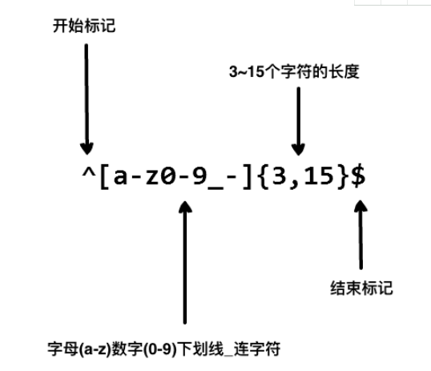

[TOC]

# Regular Expression 

**document support**

ysys

**date**

2019-02-12

**label**

knowledge,cainiao,Regular Expression,synopsis

此小节内容来自于菜鸟教程

## synopsis

​	`?`:匹配文件名中的0个或1个字符

​	`*`:匹配零个或多个字符

​	尽管这两个搜索方法比较有用，但依然有限，通过理解`*`通配符的工作原理，引入了正则表达式所依赖的概念，但正则表达式功能更强大，而且更加灵活

**demo**

`^ 为匹配输入字符串开始位置`

`[0-9]+匹配多个数字，[0-9]匹配单个数字，+匹配一个或者多个`

`abc$匹配字母abc并以abc结尾,$为匹配输入字符串的结束位置`

​	在很多地方填写注册表或者密码时，只允许用户名包含字符，数字，下划线和连接字符(-),并设置用户名的长度，就可以通过正则表达式来设定

### ｗhy use regular expression

​	测试字符串的模式

​	替换文本

​	基于模式匹配从字符串中提取子字符串

## link

http://www.runoob.com/regexp/regexp-intro.html