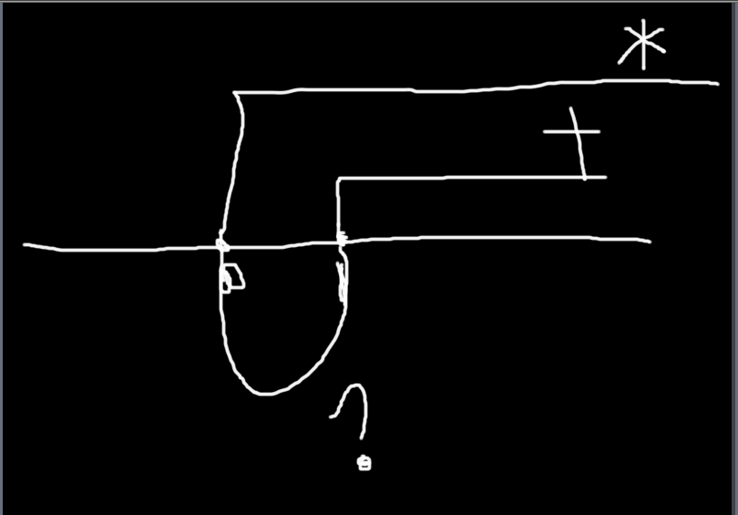

[TOC]

# Regular Expression 

**document support**

ysys

**date**

2019-02-12

**label**

knowledge,cainiao,Regular Expression

## expression

​	此小节内容来自于菜鸟教程	

​	正则表达式描述了一种字符串匹配的模式(pattern),可以用来检查一个串是否含有某种子串，将匹配的子串替换或者从某个串中取出符合某个条件的子串等。

​	**demo**

`runoo+b`,可以匹配`runoob,runoob,runooooob`等，+号代表前面的字符必须至少出现一次(1次或者多次)

`runoo*b`,可以匹配`runob,runoob,runooob`等，*号代表字符可以不出现，也可以出现一次或者多次(0次，1次，或多次)

`runoo?b`,可以匹配runoob,或者runooob,?问号代表前面的字符最多只可以出现一次(0次，1次)

​	正则表达式是由普通字符(a-z等)以及特殊字符(称为元字符)组成的文字模式。模式描述在搜索文本时要匹配的一个或多个字符串。正则表达式作为一个模版，将某个字符模式与所搜索的字符串进行匹配

​	

### nomal character

​	普通字符包含没有显示指定为元字符的所有可打印和不可打印字符，这包含所有大写和小写字母，所有数字，所有标点符号和一些其他符号

| 字符   | 描述                                                         |
| :----- | :----------------------------------------------------------- |
| [ABC]  | 匹配 **[...]** 中的所有字符，例如 **[aeiou]** 匹配字符串 "google runoob taobao" 中所有的 e o u a 字母。 |
| [^ABC] | 匹配除了 **[...]** 中字符的所有字符，例如 **[^aeiou]** 匹配字符串 "google runoob taobao" 中除了 e o u a 字母的所有字母。 |
| [A-Z]  | [A-Z] 表示一个区间，匹配所有大写字母，[a-z] 表示所有小写字母。 |
| .      | 匹配除换行符（\n、\r）之外的任何单个字符，相等于 [^\n\r]。 |
| [\s\S] | 匹配所有。\s 是匹配所有空白符，包括换行，\S 非空白符，包括换行。 |
| \w     | 匹配字母、数字、下划线。等价于 [A-Za-z0-9_] |

### not print character

​	非打印字符也可以是正则表达式的组成部分。

| 字符 | 描述                                                         |
| ---- | ------------------------------------------------------------ |
| \cx  | 匹配由x指明的控制字符。例如， \cM 匹配一个 Control-M 或回车符。x 的值必须为 A-Z 或 a-z 之一。否则，将 c 视为一个原义的 'c' 字符。 |
| \f   | 匹配一个换页符。等价于 \x0c 和 \cL。                         |
| \n   | 匹配一个换行符。等价于 \x0a 和 \cJ。                         |
| \r   | 匹配一个回车符。等价于 \x0d 和 \cM。                         |
| \s   | 匹配任何空白字符，包括空格、制表符、换页符等等。等价于 [ \f\n\r\t\v]。注意 Unicode 正则表达式会匹配全角空格符。 |
| \S   | 匹配任何非空白字符。等价于 [^ \f\n\r\t\v]。                  |
| \t   | 匹配一个制表符。等价于 \x09 和 \cI。                         |
| \v   | 匹配一个垂直制表符。等价于 \x0b 和 \cK。                     |

### super character

​	所谓特殊字符，就是有特殊含义的字符，如上面说的`runoo*b`中的`*`简单的说就是表示任何字符串的意思。如果要查找字符串的`*`符号，则需要对`*`进行转义，即在其前加一个`\`。

| 特别字符 | 描述                                                         |
| -------- | ------------------------------------------------------------ |
| $        | 匹配输入字符串的结尾位置。如果设置了 RegExp 对象的 Multiline 属性，则 $ 也匹配 '\n' 或 '\r'。要匹配 $ 字符本身，请使用 \$。 |
| ( )      | 标记一个子表达式的开始和结束位置。子表达式可以获取供以后使用。要匹配这些字符，请使用 \( 和 \)。 |
| *        | 匹配前面的子表达式零次或多次。要匹配 * 字符，请使用 \*。     |
| +        | 匹配前面的子表达式一次或多次。要匹配 + 字符，请使用 \+。     |
| .        | 匹配除换行符 \n 之外的任何单字符。要匹配 . ，请使用 \. 。    |
| [        | 标记一个中括号表达式的开始。要匹配 [，请使用 \[。            |
| ?        | 匹配前面的子表达式零次或一次，或指明一个非贪婪限定符。要匹配 ? 字符，请使用 \?。 |
| \        | 将下一个字符标记为或特殊字符、或原义字符、或向后引用、或八进制转义符。例如， 'n' 匹配字符 'n'。'\n' 匹配换行符。序列 '\\' 匹配 "\"，而 '\(' 则匹配 "("。 |
| ^        | 匹配输入字符串的开始位置，除非在方括号表达式中使用，此时它表示不接受该字符集合。要匹配 ^ 字符本身，请使用 \^。 |
| {        | 标记限定符表达式的开始。要匹配 {，请使用 \{。                |
| \|       | 指明两项之间的一个选择。要匹配 \|，请使用 \|。               |

​	

### qualifier character

​	限定号用来指定正则表达式的一个给定组件必须要出现多少次才能满足匹配

| 字符  | 描述                                                         |
| ----- | ------------------------------------------------------------ |
| *     | 匹配前面的子表达式零次或多次。例如，zo* 能匹配 "z" 以及 "zoo"。* 等价于{0,}。 |
| +     | 匹配前面的子表达式一次或多次。例如，'zo+' 能匹配 "zo" 以及 "zoo"，但不能匹配 "z"。+ 等价于 {1,}。 |
| ?     | 匹配前面的子表达式零次或一次。例如，"do(es)?" 可以匹配 "do" 、 "does" 中的 "does" 、 "doxy" 中的 "do" 。? 等价于 {0,1}。 |
| {n}   | n 是一个非负整数。匹配确定的 n 次。例如，'o{2}' 不能匹配 "Bob" 中的 'o'，但是能匹配 "food" 中的两个 o。 |
| {n,}  | n 是一个非负整数。至少匹配n 次。例如，'o{2,}' 不能匹配 "Bob" 中的 'o'，但能匹配 "foooood" 中的所有 o。'o{1,}' 等价于 'o+'。'o{0,}' 则等价于 'o*'。 |
| {n,m} | m 和 n 均为非负整数，其中n <= m。最少匹配 n 次且最多匹配 m 次。例如，"o{1,3}" 将匹配 "fooooood" 中的前三个 o。'o{0,1}' 等价于 'o?'。请注意在逗号和两个数之间不能有空格。 |

### location character

​	定位符能够将正则表达式固定到行首或行尾

| 字符 | 描述                                                         |
| ---- | ------------------------------------------------------------ |
| ^    | 匹配输入字符串开始的位置。如果设置了 RegExp 对象的 Multiline 属性，^ 还会与 \n 或 \r 之后的位置匹配。 |
| $    | 匹配输入字符串结尾的位置。如果设置了 RegExp 对象的 Multiline 属性，$ 还会与 \n 或 \r 之前的位置匹配。 |
| \b   | 匹配一个单词边界，即字与空格间的位置。                       |
| \B   | 非单词边界匹配。                                             |

**注意**：不能将限定符与定位符一起使用。由于在紧靠换行或者单词边界的前面或后面不能有一个以上位置，因此不允许诸如 **^\*** 之类的表达式。

若要匹配一行文本开始处的文本，请在正则表达式的开始使用 **^** 字符。不要将 **^** 的这种用法与中括号表达式内的用法混淆。

若要匹配一行文本的结束处的文本，请在正则表达式的结束处使用 **$** 字符。

## link

http://www.runoob.com/regexp/regexp-syntax.html