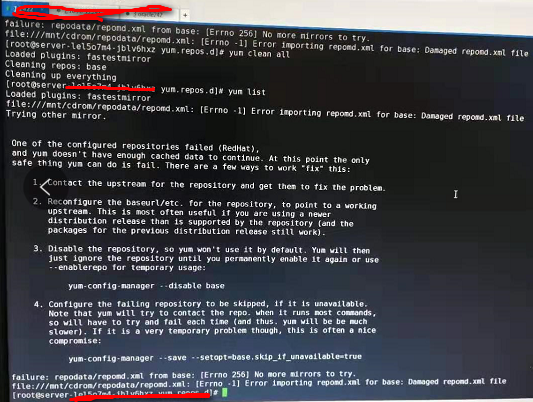

[TOC]

# Yum Not Use Because Of Repomd.xml Missing Data

**document support**

ysys

**date**

2019-02-22

**label**

yum,repomd.xml,not use


## background

​	同事给我打电话说当前的yum无法执行命令，当时按照正常的排查顺序没有解决，后面我自己上去服务器看了一下，发现repomd.xml文件内容居然是空的，有意思。


## solution

​	将yum按照正常配置后，执行`yum list`后，出现如下报错

`file:///mnt/cdrom/repodata/repomd.xml:[Error -l] Error importing repomd.xml for base:Damaged repomd.xml file`



​	提示我们repomd.xml文件损害，那么检查repomd.xml,发现是0字节，就需要重新为其创建repomd.xml，为了更好的排查问题，将Packages的rpm文件全部拷贝到其他路径下去

```
cp * /opt/ysys/
cd /opt/ysys
createrepo -v .
```

​	在这中间发现没有这个createrepo命令，首先要安装几个依赖包分别是`python-deltarpm{v},createrepo{v},deltarpm{v}`,`{v}`:代表当前rpm下的版本，在7.2版本中执行上面命令一直再报错，执行了强制命令居然可以生效,需要引起重视

`rpm -ivh python-deltarpm-3.6-3.el7.x86_64.rpm createrepo-0.9.9-23.el7.noarch.rpm deltrapm-3.6-3.el7.x86_64.rpm --force --nodeps`

​	后面执行命令,就可以了

```
yum list 
```


