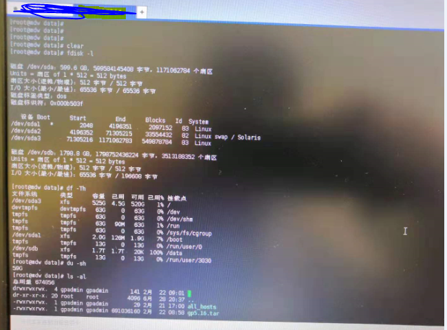
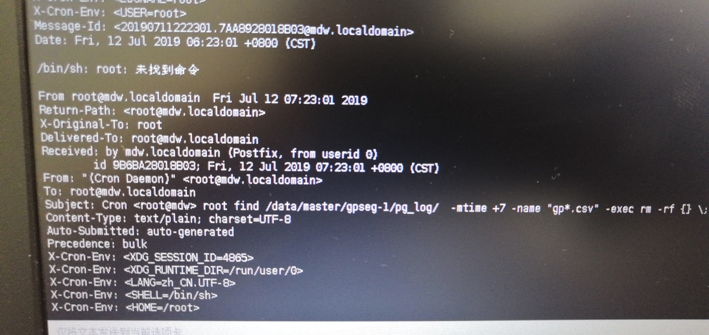

[TOC]

# 文件删除，空间未释放

**documment support**

ysys

**date**

2019-07-12

**label**

question,df -Th,du -sh


## 问题

​	今天同事在微信上问我，为什么服务器上空间使用完了，可是实际上文件空间很多，他是分别使用命令 df -Th ,du -sh 来进行确定的。


## 排查问题


### 执行df -Th，检查空间使用情况

```
# df -Th
```


查看到了`/data`路径为100%，理论上无法存入数据了。


### du -sh 查看当前路径下的大小

```
# du -sh
```

​	查看到了当前路径下的大小为56G,那么1.7T的空间去哪里了


**发觉问题排查不下去了，为什么两个反馈结果如此不同**

​	

### 求助贵爷，贵爷给的建议是umount 挂载点,并搭载到另外的挂载点


​	因为是数据库服务器，没有具体操作，不过在切换路径时，突然有个消息打印出来"you have message in /var/spoon/root/..."中，想到可能某些情况在里面就到日志中检查，发现如下报错



​	使用命令 crontab -l 发现一个脚本一直在定点执行

```
# crontab -l
```

​	想到可能是某些进程一直将一些删除文件不释放(真实删除，但是系统认为没有删除)

```
如果有一个进程在打开一个大文件的时候,这个大文件直接被rm 或者mv掉，则du会更新统计数值，df不会更新统计数值,还是认为空间没有释放。直到这个打开大文件的进程被Kill掉。
```

### 给出解决方案

```
1、正常关闭数据库
2、重启此服务器
3、检查磁盘情况
```

​	后面发现正常，根本原因在于 du -sh 和 df -Th 统计的信息不是一致，而操作系统对外反应是 df -Th,也就是说当应用系统向服务器申请磁盘空间写入数据时，首先服务器会执行命令'df -Th',这个命令。


## links

https://blog.csdn.net/qq_30336433/article/details/80986087
