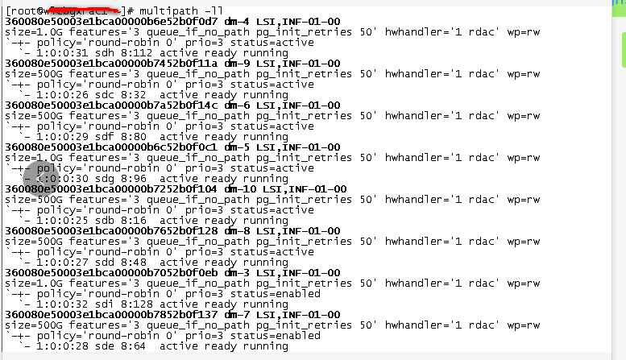
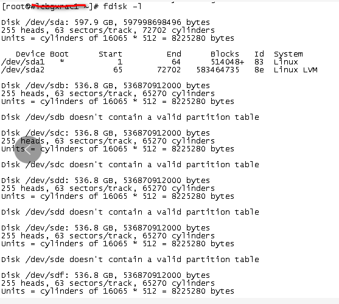

[TOC]

# oracle rac not open crs-1714:unable to discover any voting files

**document support**

ysys

**date**

2019-11-12

**label**

oracle,oracle rac,oracle 11g rac,error,not open,crs-1714:unable to discover any voting files


## question

​	今天在上午在启动集群时，发现数据库总是无法启动起来，然后检查日志发现出现了错误`crs-1714:unable to discover any voting files`

​	

## solution

###  check /etc/sysconfig/oracleasm

```
ORACLEASM_SCANORDER="dm"
ORACLEASM_SCANEXCLUDE="sd"
```

当前文件的参数也是这样吗？那么猜猜可能存储没有挂接上来


### multipath -ll /fdisk -l

```
multipath -ll

fdisk -l

```

 发现没有明显存储挂载

可能与存储有关，后面会持续追踪这个问题。


第二天同事说交换机可能有问题，它就直接使用网线连接，重新执行脚本

```
multipath -ll
```



```
fdisk -l
```



​	

目前对于存储挂载还不是很了解，后面还要继续学习，不过可以看到这个情况，可以帮助存储是否挂载

后面挂载好存储后，数据库就能正常启动了。