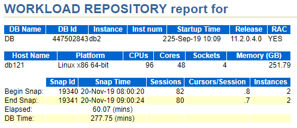
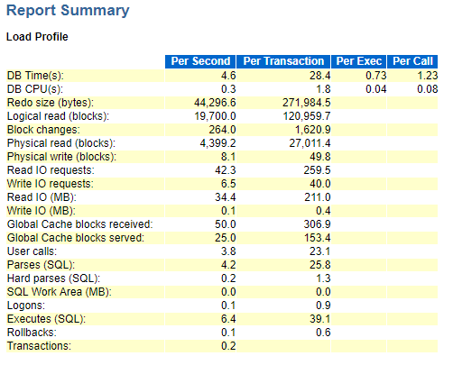

[TOC]

# A province oracle awr learn

**document support**

ysys

**date**

2019-11-18(补)

**label**

oracle,awr

## oracle awr 

### WORDLOAD REPOSITORY report for 

​	工作负载报告

​	DB name:数据库名称

​	Instance:实例名称

​	RAC:是否集群

​	Host Name:机器名

​	Platform:操作系统版本

​	CPUs:

​    Cores：

​	对于核数和cpu数不理解

​    Sockets:

​	Memory(GB):内存

​	Elapsed:逝去时间,就是当前`end snap`-`begin snap`

​	DB time:不包括Oracle后台进程消耗的时间。如果DB Time远远小于Elapsed时间，说明数据库比较空闲。

​	db time= cpu time + wait time（不包含空闲等待） （非后台进程）
​	说白了就是db time就是记录的服务器花在数据库运算(非后台进程)和等待(非空闲等待)上的时间
​	DB time = cpu time + all of nonidle wait event time

​	可以这样理解，假设一个会话在cpu上跑了10秒，另外一个会话在另一个cpu上跑了20秒，那么db time=30s

​	上面图片信息可以这样理解

​	在60分钟里（其间收集了1次快照数据），数据库耗时277分钟，数据中显示系统有96个逻辑CPU（48个物理CPU），平均每个CPU耗时2.9分钟，CPU利用率只有大约4%（2.9/60）。说明系统压力非常小。

​	

​	**注意点：可是对于批量系统，数据库的工作负载总是集中在一段时间内。如果快照周期不在这一段时间内，或者快照周期跨度太长而包含了大量的数据库空闲时间，所得出的分析结果是没有意义的.这也说明选择分析时间段很关键，要选择能够代表性能问题的时间段。**

### Report Summary

​	

​	Redo size：每秒产生的日志大小(单位字节)，可标志数据变更频率, 数据库任务的繁重与否。

​	Logical reads：每秒/每事务逻辑读的块数.平决每秒产生的逻辑读的block数。Logical Reads= Consistent Gets + DB Block Gets

​	Block changes：每秒/每事务修改的块数

​    Physical reads：每秒/每事务物理读的块数

​    Physical writes：每秒/每事务物理写的块数

​    User calls：每秒/每事务用户call次数

​	Parses：SQL解析的次数.每秒解析次数，包括fast parse，soft parse和hard parse三种数量的综合。 
​	软解析每秒超过300次意味着你的"应用程序"效率不高，调整session_cursor_cache。
​	在这里，fast parse指的是直接在PGA中命中的情况（设置了session_cached_cursors=n）；
​	

​	soft parse是指在shared pool中命中的情形；hard parse则是指都不命中的情况。

​	Hard parses：其中硬解析的次数，硬解析太多，说明SQL重用率不高。
​	每秒产生的硬解析次数, 每秒超过100次，就可能说明你绑定使用的不好，也可能是共享池设置不合理。
​	这时候可以启用参数cursor_sharing=similar|force，该参数默认值为exact。但该参数设置为similar时，存在	bug，可能导致执行计划的不优。

​    Sorts：每秒/每事务的排序次数   

​    Logons：每秒/每事务登录的次数

​    Executes：每秒/每事务SQL执行次数

 Transactions：每秒事务数.每秒产生的事务数，反映数据库任务繁重与否。

​    Blocks changed per Read：表示逻辑读用于修改数据块的比例.在每一次逻辑读中更改的块的百分比。

​    Recursive Call：递归调用占所有操作的比率.递归调用的百分比，如果有很多PL/SQL，那么这个值就会比较高。

   Rollback per transaction：每事务的回滚率.看回滚率是不是很高，因为回滚很耗资源 ,如果回滚率过高,
可能说明你的数据库经历了太多的无效操作 ,过多的回滚可能还会带来Undo Block的竞争 
该参数计算公式如下: Round(User rollbacks / (user commits + user rollbacks) ,4)* 100% 。

   Rows per Sort：每次排序的行数

## link

https://blog.csdn.net/demonson/article/details/79474133