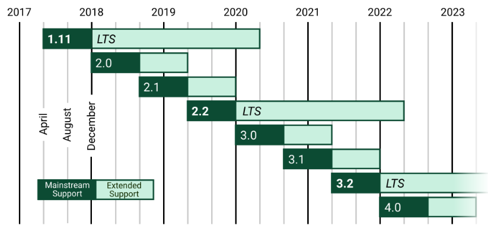

[toc]

# Django:Django 教程

**document support**

ysys

**date**

2020-10-25

**label**

python,django,菜鸟教程

## Knowledge

​	Python有许多款不同的Web框架，Django是重量级选手中最具有代表性的一位，许多成功的网站和APP都基于Django.

​	Django是一个开放源代码的Web应用框架，由Python写成。

​	Django遵循BSD版权

​	Django采用MVT的软件设计模式，即模型，视图，模板

### Django对应Python版本

| Django 版本 | Python 版本              |
| :---------- | :----------------------- |
| 1.8         | 2.7, 3.2 , 3.3, 3.4, 3.5 |
| 1.9, 1.10   | 2.7, 3.4, 3.5            |
| 1.11        | 2.7, 3.4, 3.5, 3.6       |
| 2.0         | 3.4, 3.5, 3.6, 3.7       |
| 2.1, 2.2    | 3.5, 3.6, 3.7            |

## Link

https://www.runoob.com/django/django-tutorial.html