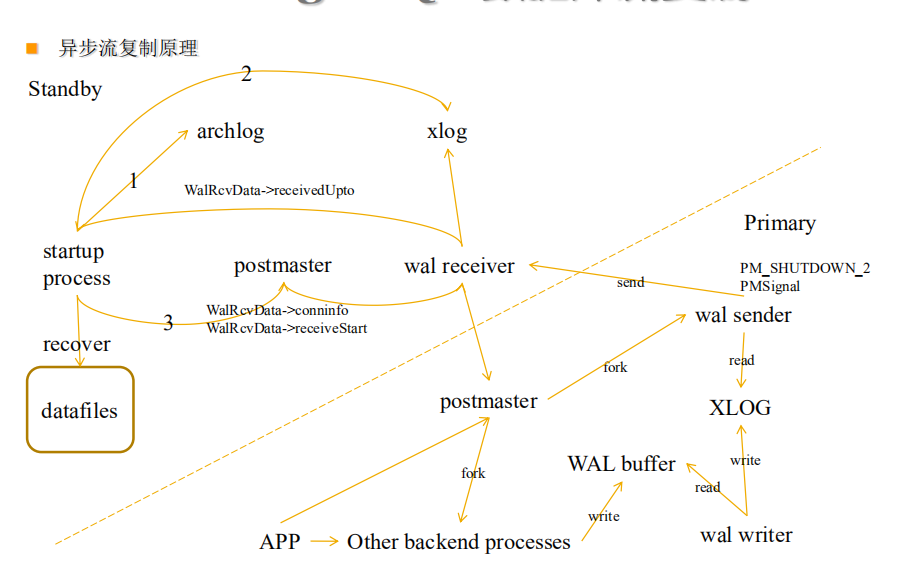
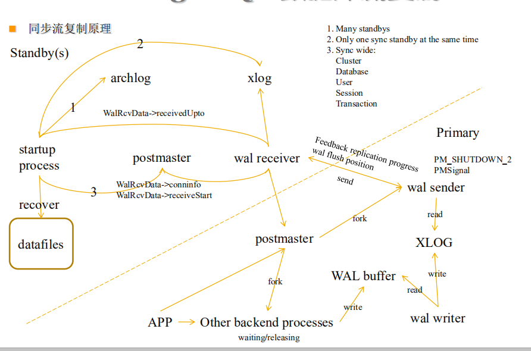

[TOC]

# postgresql dba 8

**document support**

ysys

**date**

2019-12-04

**label**

postgres,dba


## 数据库流复制


```
数据库流复制
9.0开始支持1+n的异步流复制.
9.1支持1+1+n的同步和异步流复制
9.2开始支持级联流复制
9.3开始支持跨平台的流复制协议(目前可用于接收xlog).
9.3开始流复制协议增加了时间线文件传输的协议, 支持自动切换时间线
```


## 异步流复制




[异步流复制步骤](../201912/20191205_01.md)


## 同步流复制





[同步流复制](20191207_01.md)

