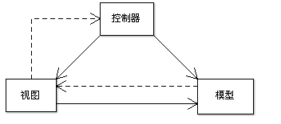
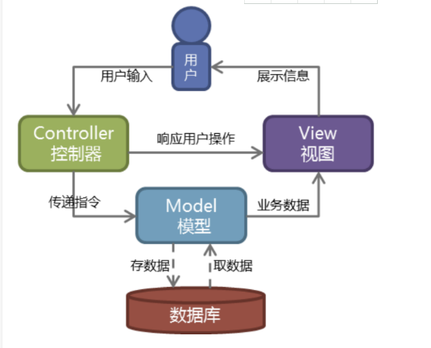
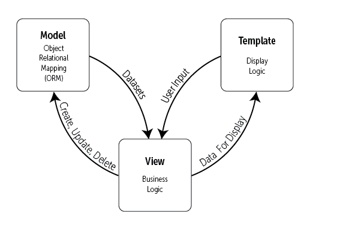
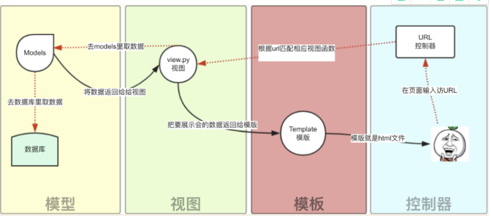

[toc]

# Django:Django 简介

**document support**

ysys

**date**

2020-10-25

**label**
python,django,菜鸟教程

## Knowledge

### 基本介绍

​	Django是一个由Python编写的一个开放源代码的Web应用框架。

​	使用Django,只要很少的代码,Python的程序开放人员就可以轻松地完成一个正式网站所需要的大部分内容，并进一步开发处全功能的Web服务。

​	Django本身基于MVC模型，即Model(模型)+View(视图)+Controller(控制器)设计模式，MVC模式使用后对程序的修改和扩展简化，并且使程序某一部分的重复利用成为可能

​	MVC优势：

- 低耦合

- 开发快捷

- 部署方便

- 可重用性高

- 维护成本低

- ...

  Python加上Django是快速开发，设计，部署网站的最佳组合

### 特点

- 强大的数据库功能
- 自带强大的后台功能
- 优雅的网址

### MVC与MTV模型

#### MVC 模型

MVC 模式（Model–view–controller）是软件工程中的一种软件架构模式，把软件系统分为三个基本部分：模型（Model）、视图（View）和控制器（Controller）。

MVC 以一种插件式的、松耦合的方式连接在一起。

- 模型（M）- 编写程序应有的功能，负责业务对象与数据库的映射(ORM)。
- 视图（V）- 图形界面，负责与用户的交互(页面)。
- 控制器（C）- 负责转发请求，对请求进行处理。

简易图：

用户操作流程图:

#### MTV模型

Django 的 MTV 模式本质上和 MVC 是一样的，也是为了各组件间保持松耦合关系，只是定义上有些许不同，Django 的 MTV 分别是指：

- M 表示模型（Model）：编写程序应有的功能，负责业务对象与数据库的映射(ORM)。
- T 表示模板 (Template)：负责如何把页面(html)展示给用户。
- V 表示视图（View）：负责业务逻辑，并在适当时候调用 Model和 Template。

除了以上三层之外，还需要一个 URL 分发器，它的作用是将一个个 URL 的页面请求分发给不同的 View 处理，View 再调用相应的 Model 和 Template，MTV 的响应模式如下所示：

简易图：

用户操作流程图

**解析：**

用户通过浏览器向我们的服务器发起一个请求(request)，这个请求会去访问视图函数：

- a.如果不涉及到数据调用，那么这个时候视图函数直接返回一个模板也就是一个网页给用户。
- b.如果涉及到数据调用，那么视图函数调用模型，模型去数据库查找数据，然后逐级返回。

视图函数把返回的数据填充到模板中空格中，最后返回网页给用户。

## Link

https://www.runoob.com/django/django-intro.html