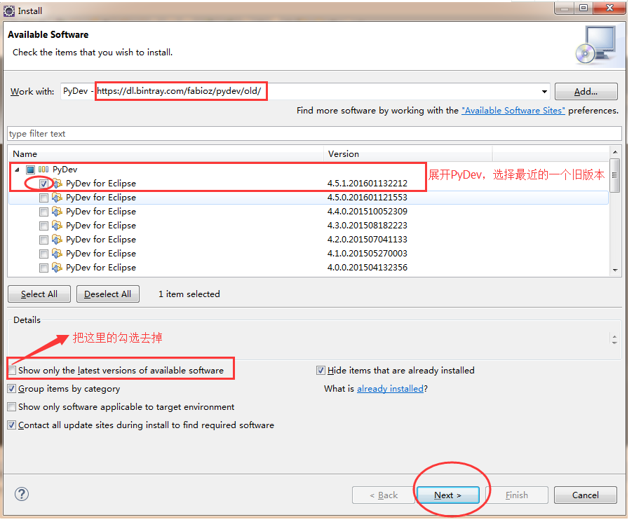

[toc]

# Question:The selected wizard could not be started.Plug-in org.python.pydev was unable to load class org.python.pydev.ui.wizards.project.PythonProjectWizard.
An error occurred while automatically activating bundle org.python.pydev (506).
**document support**

ysys

**date**
2020-09-29

**label**

eclipse,python,pydev,configuration


## Question

```
Plug-in org.python.pydev was unable to load class org.python.pydev.ui.wizards.project.PythonProjectWizard.
An error occurred while automatically activating bundle org.python.pydev (506).
```


## Solution

安装旧版PyDev，路径Location=https://dl.bintray.com/fabioz/pydev/old/



​	

## Link

https://blog.csdn.net/qq_23090489/article/details/91378551

https://www.e-learn.cn/content/qita/1179876