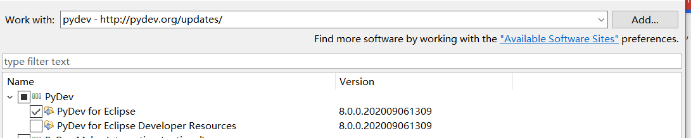

[toc]

# Eclipse Python Pydev Configuration

**document support**

ysys

**date**
2020-09-29

**label**

eclipse,python,pydev,configuration

**level**

simple


## Background


## Summary


## Question


## Operation




## Error

- one:pydev 版本过高

```The selected wizard could not be started.
Plug-in org.python.pydev was unable to load class org.python.pydev.ui.wizards.project.PythonProjectWizard.
An error occurred while automatically activating bundle org.python.pydev (506).
```

​	链接:安装旧版PyDev，路径Location=https://dl.bintray.com/fabioz/pydev/old/

## Link

https://blog.csdn.net/qq_23090489/article/details/91378551

https://www.e-learn.cn/content/qita/1179876