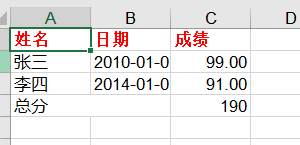
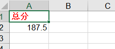

[toc]

# Python:Excel 格式转换

**document support**

ysys

**date**
2020-10-03

**label**

python,excel,format convertor


## Background

​	平时使用Excel时会对数据进行一下优化，或者样式设置。

## Summary

## Question

## Operation

```
pip install xlrd xlwt xlutils
```

```
#coding=utf-8

#导入xlwt库
import xlwt

#设置写出格式字体红色变粗
styleBR = xlwt.easyxf("font:name Times New Roman,color-index red,bold on")

#设置数字型格式为小数点后保留两位
styleNum = xlwt.easyxf(num_format_str='#,##0.00')

#设置日期型格式显示为YYYY-MM-DD
styleDate = xlwt.easyxf(num_format_str='YYYY-MM-DD')

#创建xls文件对象
wb = xlwt.Workbook()

#新增两个表单页
sh1 = wb.add_sheet('成绩')
sh2 = wb.add_sheet('汇总')

# 按照位置添加数据，第一个参数是行，第二个参数是列
sh1.write(0,0,'姓名',styleBR)
sh1.write(0,1,'日期',styleBR)
sh1.write(0,2,'成绩',styleBR)

# 插入数据
sh1.write(1,0,'张三')
sh1.write(1,1,'2010-01-01',styleDate)
sh1.write(1,2,99,styleNum)
sh1.write(2,0,'李四')
sh1.write(2,1,'2014-01-01',styleDate)
sh1.write(2,2,91,styleNum)


# 设置单元格内容居中的格式

alignment = xlwt.Alignment()
alignment.horz =xlwt.Alignment.HORZ_CENTER
style = xlwt.XFStyle()
style.alignent = alignment

## 合并A4,B4单元格,并将内容设置为居中
sh1.write_merge(3,3,0,1,'总分',style)

## 通过公式，计算C2+C3单元格的和
sh1.write(3,2,xlwt.Formula("C2+C3"))

# 对sheet2写入数据
sh2.write(0,0,'总分',styleBR)
sh2.write(1,0,187.5)
#最后保存文件即可
wb.save('test_w3.xls')

```




