[toc]

# 第15章 生成数据

**document support**

ysys

**date**
2020-01-01

**label**

python,《Python编程：从入门到实践》


## Knowledge

​	数据可视化指的是通过可视化表示来探索数据，它与数据挖掘紧密相关，而数据挖掘指的是使用代码探索数据集的规律和关联。


## 15.1 安装matplotlib

### 15.1.1 在Linux系统中安装matplotlib

### 15.1.2 在OS X系统中安装matplotlib

### 15.1.3 在Windows系统中安装matplotlib

​	在Windows系统中，需要先要安装Virsual Studio,Visual Studio Community

```
> pip install matplotlib
```

​	如果比较慢的话，可以选择阿里的镜像

```
> pip install matplotlib -i http://mirrors.aliyun.com/pypi/simple/ --trusted-host mirrors.aliyun.com
```

### 15.1.4 测试matplotlib

```
python
>>> import matplotlib
>>>
```


### 15.1.5 matplotlib画廊

​	链接地址：http://matplotlib.org/

## 15.2 绘制简单的折线图

```
import matplotlib.pyplot as plt
squares = [1,4,9,16,25]
plt.plot(squares)
plt.show()

```


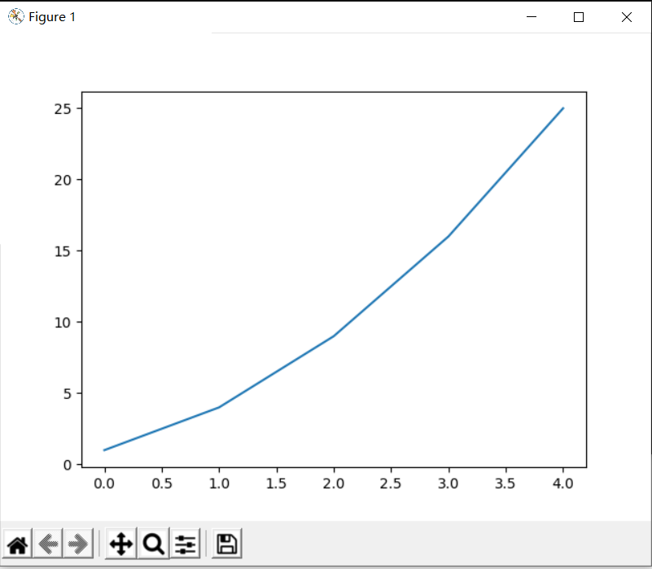


### 15.2.1 修改标签文字和线条粗细

```
import matplotlib.pyplot as plt
squares = [1,4,9,16,25]
plt.plot(squares,linewidth=5)
plt.title("Square Numbers",fontsize=24)
plt.xlabel("Value",fontsize=14)
plt.ylabel("Square Of Value",fontsize=14)
plt.tick_params(axis='both',labelsize=14)
plt.show()

```

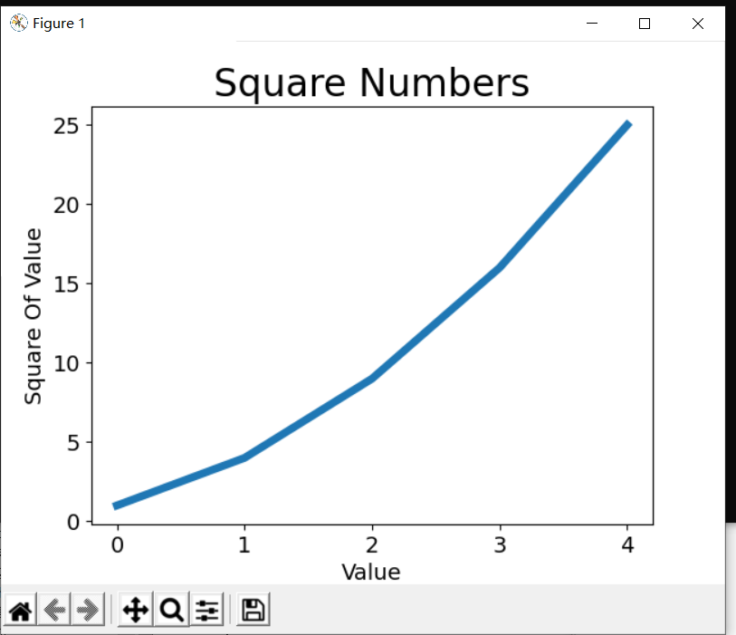


### 15.2.2 校正图形

​		修改默认的(0,0),可以给plot()同时提供输入值和输出值

```
import matplotlib.pyplot as plt
input_values=[1,2,3,4,5]
squares = [1,4,9,16,25]
plt.plot(input_values,squares,linewidth=5)
plt.show()
```

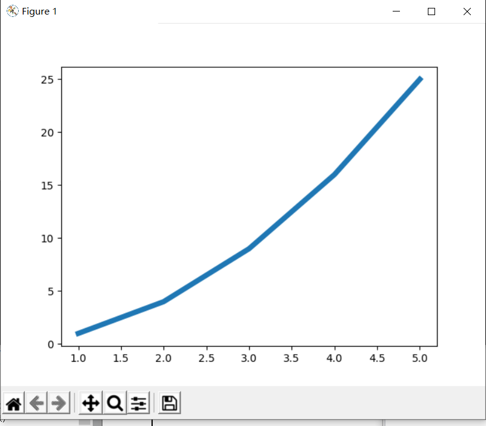


### 15.2.3 使用scatter()绘制散点图并设置其样式

```
import matplotlib.pyplot as pit
pit.scatter(2,4)
pit.show()
```

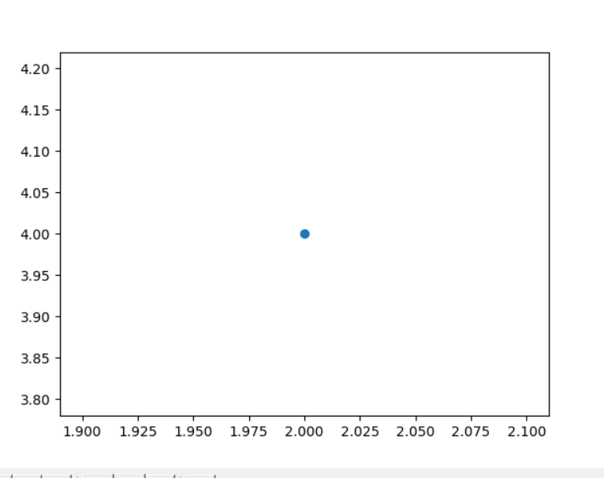

​	设置输出的样式

```！
import matplotlib.pyplot as plt


plt.scatter(2,4,s=200)

plt.title("Square Numbers",fontsize=24)
plt.xlabel("Value",fontsize=14)
plt.ylabel("Square Of Value",fontsize=14)
plt.tick_params(axis='both',which='major',labelsize=14)

plt.show()

```

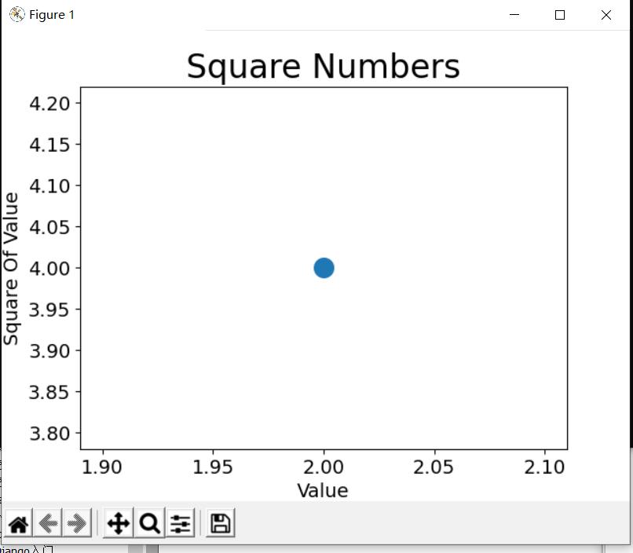


### 15.2.4 使用scatter()绘制一系列点

​	scatter()传递两个分别包含x值和y值的列表

```
import matplotlib.pyplot as plt

x_value = [1,2,3,4,5]
y_value = [1,4,9,16,25]

plt.scatter(x_value,y_value,s=200)

plt.title("Square Numbers",fontsize=24)
plt.xlabel("Value",fontsize=14)
plt.ylabel("Square Of Value",fontsize=14)
plt.tick_params(axis='both',which='major',labelsize=14)

plt.show()

```

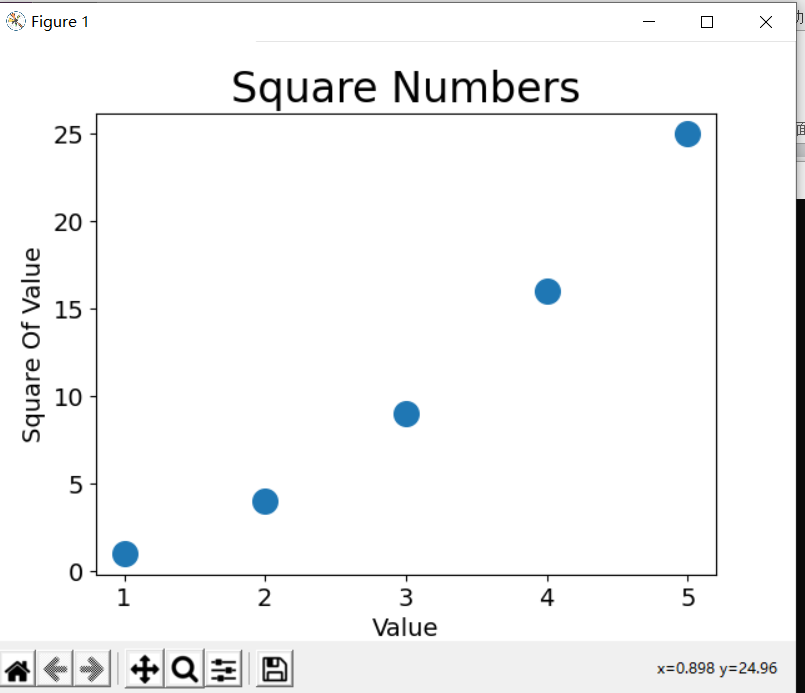


### 15.2.5 自动计算数据


```
import matplotlib.pyplot as plt

x_values = list(range(1,1001))
y_values = [x**2 for x in x_values]

plt.scatter(x_values,y_values,s=200)

plt.title("Square Numbers",fontsize=24)
plt.xlabel("Value",fontsize=14)
plt.ylabel("Square Of Value",fontsize=14)
plt.tick_params(axis='both',which='major',labelsize=14)
plt.axis([0,1100,0,1100000])
plt.show()

```

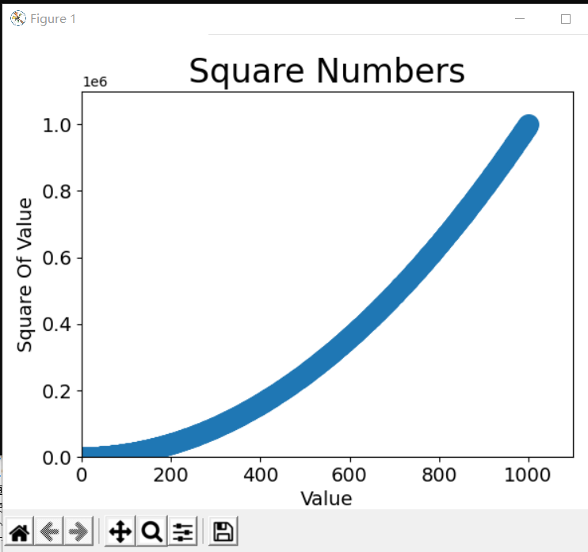


### 15.2.6 删除数据点的轮廓

​	要删除数据点的轮廓，可在调用scatter()传递实参`edgecolor='none'`

```
plt.scatter(x_values,y_values,edgecolor='none',s=200)
```


### 15.2.7 自定义颜色

​	要修改数据点的颜色,可向scatter()传递参数c,并将其设置微要使用的颜色的名称

```
plt.scatter(x_values,y_values,c='red',edgecolor='none',s=200)
```

​	也可以使用RGB颜色模式自定义颜色，要指定自定义颜色，可传递参数c，并将其设置微一个元组，其中包含三个0~1之间的小数值，它们分别表示红色，绿色和蓝色分量。

```
plt.scatter(x_values,y_values,c=(0,0,0.8),edgecolor='none',s=200)
```

​	

### 15.2.8 使用颜色映射

​	颜色映射(colormap)是一系列颜色,它们从起始颜色渐变到结果颜色。

​	pyplot内置了一组颜色映射。

```
plt.scatter(x_values,y_values,c=y_values,cmap=plt.cm.Blues,edgecolor='none',s=200)
```

​	将参数c设置成了一个y值列表，并使用cmap使用那个颜色映射

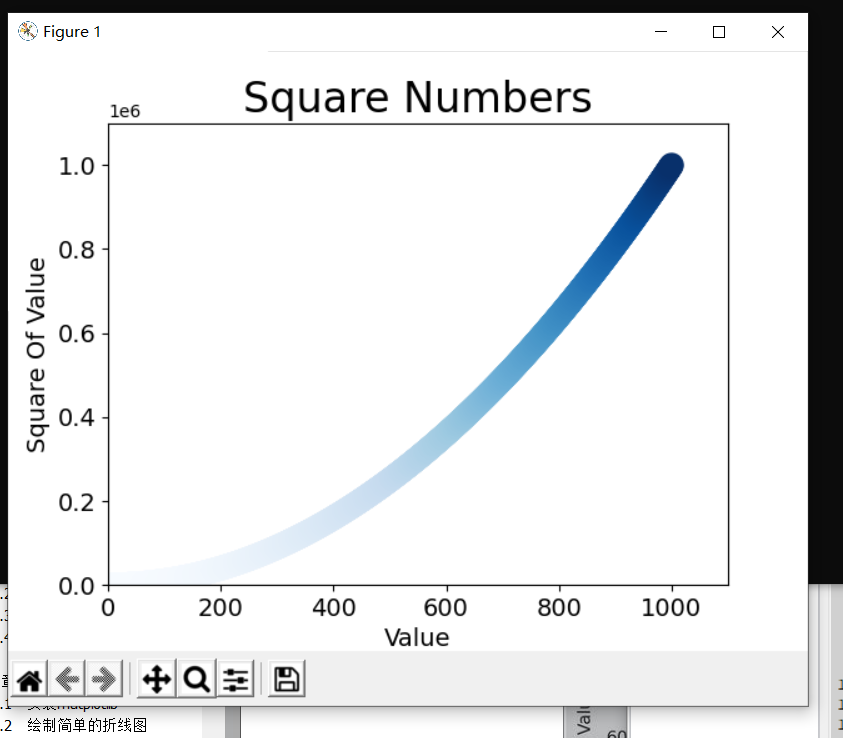


### 15.2.9 自动保存图表

​	要让程序自动将图表保存在文件中，可对plt.show()的调用替换为plt.savefig()的调用

```
#plt.show()
plt.savefig('sequares_plot.png',bbox_inches='tight')
```


## 15.3 随机漫步

​	随机漫步是这样行走得到的路径；每次行走都完全是随机的，没有明确的方向。

### 15.3.1 创建RandomWalk类

```
  
from random import choice

class RandomWalk():
	"""一个生成随机漫步的类"""
	def __init__(self,num_points=5000):
		"""初始化随机漫步的属性"""
		self.num_points=num_points
		
		# 所有随机漫步都始于(0,0)
		self.x_values=[0]
		self.y_values=[0]
		
```

### 15.3.2 选择方向

```
	def fill_walk(self):
		"""计算随机漫步包含的所有点"""

		# 不断漫步，知道列达到指定的长度
		while len(self.x_values)<self.num_points:
			#决定前进方向以及沿这个方向前进的距离
			x_direction = choice([1,-1])
			x_distnace = choice([0,1,2,3,4])
			x_step = x_direction * x_distance
			
			y_direction = choice([1,-1])
			y_distnace = choice([0,1,2,3,4])
			y_step = y_direction * y_distance
			
			if x_step == 0 and y_step ==0:
				continue
			
			next_x = self.x_values[-1]+x_step
			next_y = self.y_values[-1]+y_step
			
			self.x_values.append(next_x)
			self.y_values.append(next_y)

```


### 15.3.3 绘制随机漫步图

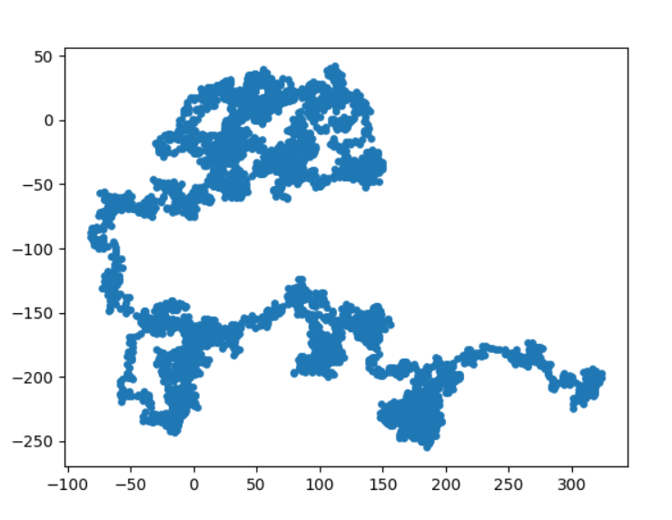


### 15.3.4 模拟多次随机漫步


```
import matplotlib.pyplot as plt
from random_walk import RandomWalk

while True:
	rw = RandomWalk()
	rw.fill_walk()
	plt.scatter(rw.x_values,rw.y_values,s=15)
	plt.show()
	
	keep_running = input("Make another walk?(y/n): ")
	if keep_running == 'n':
		break

```

​	关闭结果时，会提示你是否查看下次结果


### 15.3.5 设置随机漫步图的样式


### 15.3.6 给点着色

```
import matplotlib.pyplot as plt
from random_walk import RandomWalk

while True:
	rw = RandomWalk()
	rw.fill_walk()
	
	
	point_numbers = list(range(rw.num_points))
	plt.scatter(rw.x_values,rw.y_values,c=point_numbers,cmap=plt.cm.Blues,edgecolor='none',s=15)
	plt.show()
	
	keep_running = input("Make another walk?(y/n): ")
	if keep_running == 'n':
		break

```

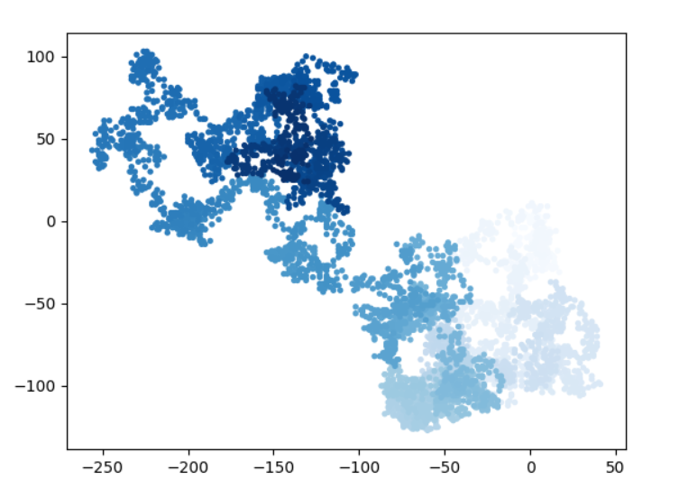

### 15.3.7 重新绘制起点和终点

```
import matplotlib.pyplot as plt
from random_walk import RandomWalk


while True:
	rw = RandomWalk()
	rw.fill_walk()
	
	
	point_numbers = list(range(rw.num_points))
	plt.scatter(rw.x_values,rw.y_values,c=point_numbers,cmap=plt.cm.Blues,edgecolor='none',s=15)
	
	plt.scatter(0,0,edgecolors='none',s=100)
	plt.scatter(rw.x_values[-1],rw.y_values[-1],edgecolors='none',s=100)
	
	plt.show()
	
	keep_running = input("Make another walk?(y/n): ")
	if keep_running == 'n':
		break

```


### 15.3.8 隐藏坐标轴


```
import matplotlib.pyplot as plt
from random_walk import RandomWalk


while True:
	rw = RandomWalk()
	rw.fill_walk()
	
	
	point_numbers = list(range(rw.num_points))
	plt.scatter(rw.x_values,rw.y_values,c=point_numbers,cmap=plt.cm.Blues,edgecolor='none',s=15)
	
	plt.scatter(0,0,edgecolors='none',s=100)
	plt.scatter(rw.x_values[-1],rw.y_values[-1],edgecolors='none',s=100)
	
	plt.axes().get_xaxis().set_visible(False)
	plt.axes().get_yaxis().set_visible(False)
	
	plt.show()
	
	keep_running = input("Make another walk?(y/n): ")
	if keep_running == 'n':
		break
```


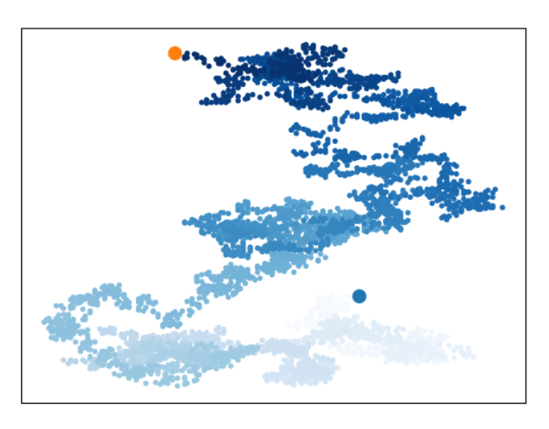


### 15.3.9 增加点数

```
import matplotlib.pyplot as plt
from random_walk import RandomWalk


while True:
	rw = RandomWalk(50000)
	rw.fill_walk()
	
	
	point_numbers = list(range(rw.num_points))
	plt.scatter(rw.x_values,rw.y_values,c=point_numbers,cmap=plt.cm.Blues,edgecolor='none',s=15)
	
	plt.scatter(0,0,edgecolors='none',s=100)
	plt.scatter(rw.x_values[-1],rw.y_values[-1],edgecolors='none',s=100)
	
	plt.axes().get_xaxis().set_visible(False)
	plt.axes().get_yaxis().set_visible(False)
	
	plt.show()
	
	keep_running = input("Make another walk?(y/n): ")
	if keep_running == 'n':
		break
```


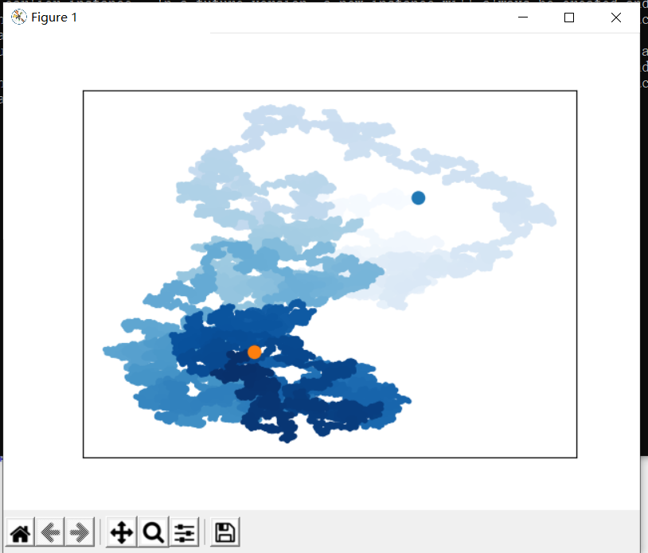


### 15.3.10 调整尺寸以适合屏幕


```
import matplotlib.pyplot as plt
from random_walk import RandomWalk

while True:
	rw = RandomWalk()
	rw.fill_walk()
	
	plt.figure(figsize=(10,6))
	point_numbers = list(range(rw.num_points))
	plt.scatter(rw.x_values,rw.y_values,c=point_numbers,cmap=plt.cm.Blues,edgecolor='none',s=15)
	
	plt.scatter(0,0,edgecolors='none',s=100)
	plt.scatter(rw.x_values[-1],rw.y_values[-1],edgecolors='none',s=100)
	
	plt.axes().get_xaxis().set_visible(False)
	plt.axes().get_yaxis().set_visible(False)
	
	
	plt.show()
	
	keep_running = input("Make another walk?(y/n): ")
	if keep_running == 'n':
		break

```


## 15.4 使用Pygal模拟骰子


### 15.4.1 安装Pygal

```
> pip install pygal
```

```
> pip install pygal -i http://mirrors.aliyun.com/pypi/simple/ --trusted-host mirrors.aliyun.com
```


### 15.4.2 Pygal画廊

​	链接：http://www.pygal.org/

### 15.4.3 创建Die类

```
#coding=utf-8

from random import randint

class Die():
	
	def __init__(self,num_sides=6):
		self.num_sides = num_sides
	
	def roll(self):
		return randint(1,self.num_sides)

```


### 15.4.4 掷骰子

```
#coding=utf-8

from die import Die

die = Die()

results = []

for roll_num in range(100):
	result=die.roll()
	results.append(result)
	
print(results)

```

```
[6, 1, 4, 6, 4, 6, 1, 3, 1, 2, 1, 4, 2, 4, 4, 5, 6, 2, 2, 5, 6, 3, 1, 1, 2, 5, 2, 6, 6, 1, 2, 2, 4, 4, 1, 3, 4, 5, 6, 1, 4, 4, 3, 1, 1, 1, 2, 3, 5, 1, 3, 5, 3, 1, 1, 1, 2, 5, 1, 6, 4, 4, 1, 5, 1, 4, 5, 3, 2, 3, 2, 4, 5, 5, 1, 6, 2, 5, 3, 2, 4, 5, 3, 1, 3, 3, 6, 1, 3, 6, 4, 5, 2, 4, 6, 2, 6, 5, 3, 2]
```


### 15.4.5 分析结果


```

from die import Die
import pygal

die = Die()

results = []

for roll_num in range(100):
	result=die.roll()
	results.append(result)

frequencies = []
for value in range(1,die.num_sides+1):
	frequency = results.count(value)
	frequencies.append(frequency)

print(frequencies)

```

```
[13, 13, 20, 23, 16, 15]
```


### 15.4.6 绘制直方图

```
#coding=utf-8

from die import Die
import pygal

die = Die()

results = []

for roll_num in range(100):
	result=die.roll()
	results.append(result)

frequencies = []
for value in range(1,die.num_sides+1):
	frequency = results.count(value)
	frequencies.append(frequency)


hist = pygal.Bar()
hist.title="Results of rolling one D6 1000 times"
hist.x_labels=['1','2','3','4','5','6']
hist.x_title="Result"
hist.y_title="Frequency of Results"
hist.add('D6',frequencies)
hist.render_to_file('die_visual.svg')
```

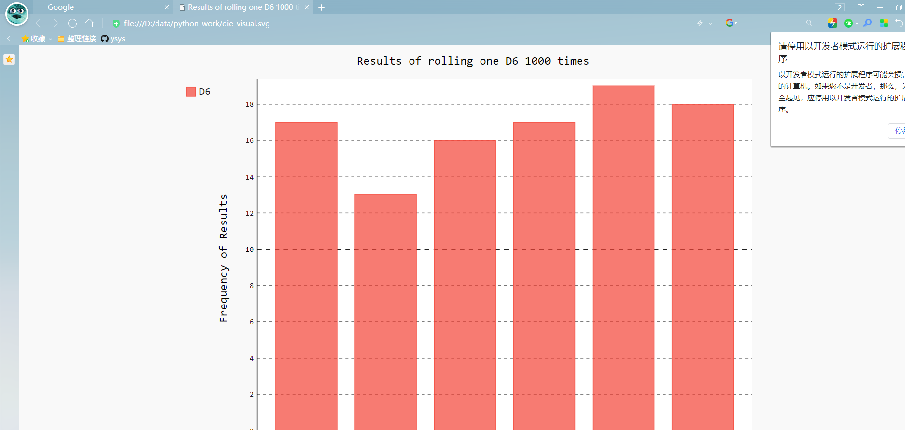


### 15.4.7 同时掷两个骰子

```
#coding=utf-8

from die import Die
import pygal

die_1 = Die()
die_2 = Die()
results = []

for roll_num in range(100):
	result=die_1.roll()+die_2.roll()
	results.append(result)

frequencies = []
max_result = die_1.num_sides + die_2.num_sides
for value in range(1,max_result+1):
	frequency = results.count(value)
	frequencies.append(frequency)


hist = pygal.Bar()
hist.title="Results of rolling one D6 1000 times"
hist.x_labels=['2','3','4','5','6','7','8','9','10','11','12']
hist.x_title="Result"
hist.y_title="Frequency of Results"
hist.add('D6 + D6',frequencies)
hist.render_to_file('die_visual1.svg')
```

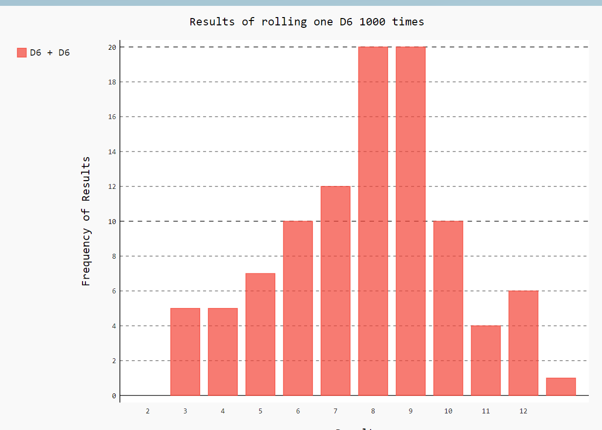


### 15.4.8 同时掷两个面数不同的骰子

```
#coding=utf-8

from die import Die
import pygal

die_1 = Die()
die_2 = Die(10)
results = []

for roll_num in range(100):
	result=die_1.roll()+die_2.roll()
	results.append(result)

frequencies = []
max_result = die_1.num_sides + die_2.num_sides
for value in range(1,max_result+1):
	frequency = results.count(value)
	frequencies.append(frequency)


hist = pygal.Bar()
hist.title="Results of rolling one D6 1000 times"
hist.x_labels=['2','3','4','5','6','7','8','9','10','11','12','13','14','15','16']
hist.x_title="Result"
hist.y_title="Frequency of Results"
hist.add('D6 + D10',frequencies)
hist.render_to_file('die_visual2.svg')
```

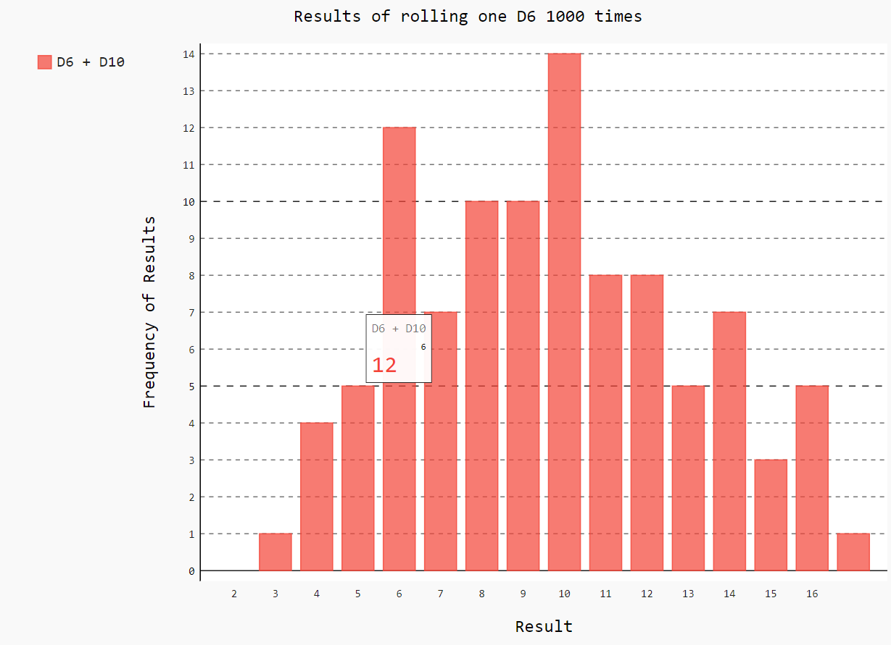


## 15.5 小结

