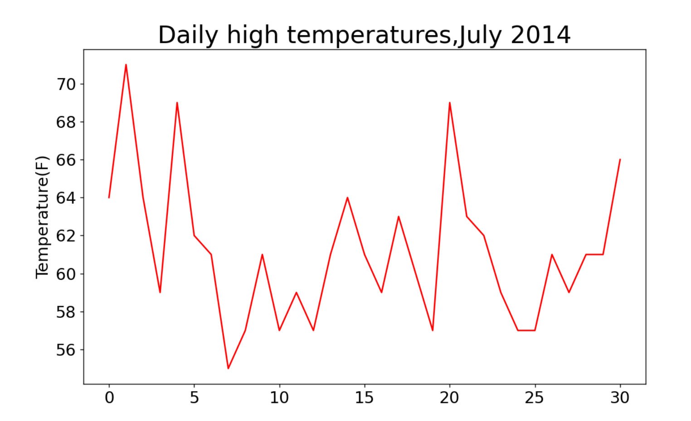
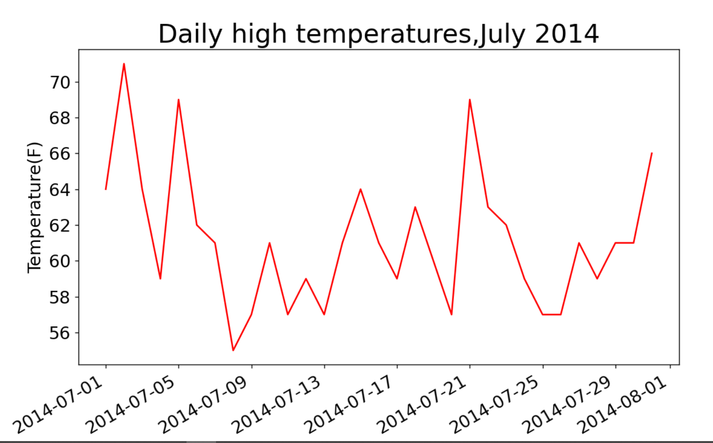
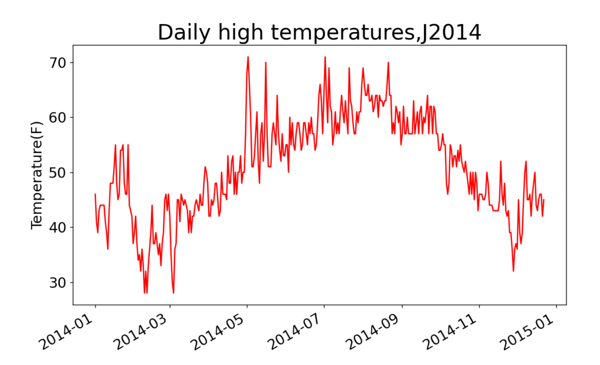
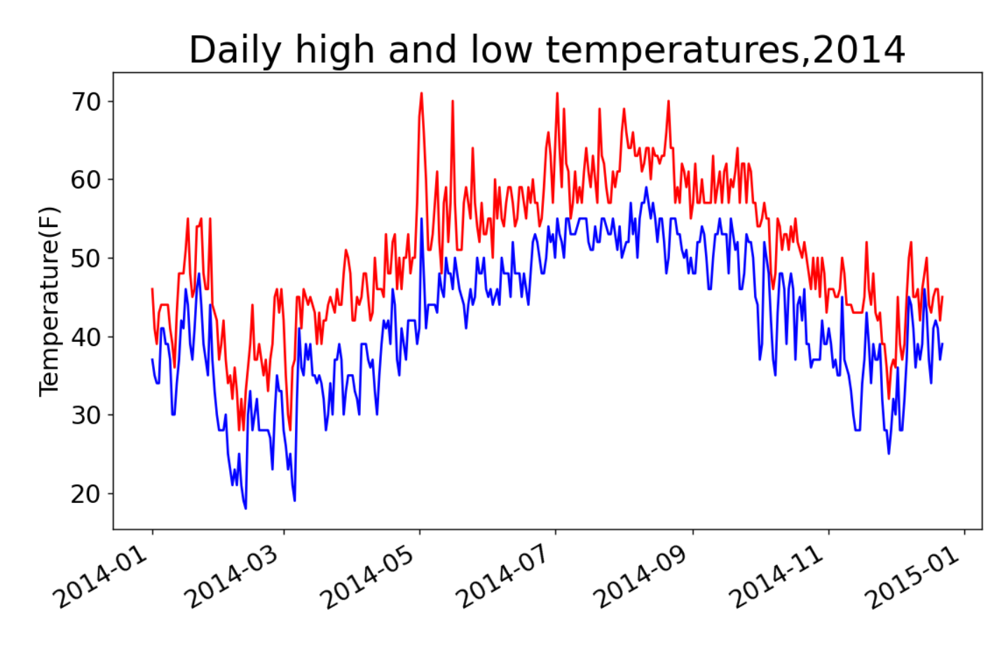
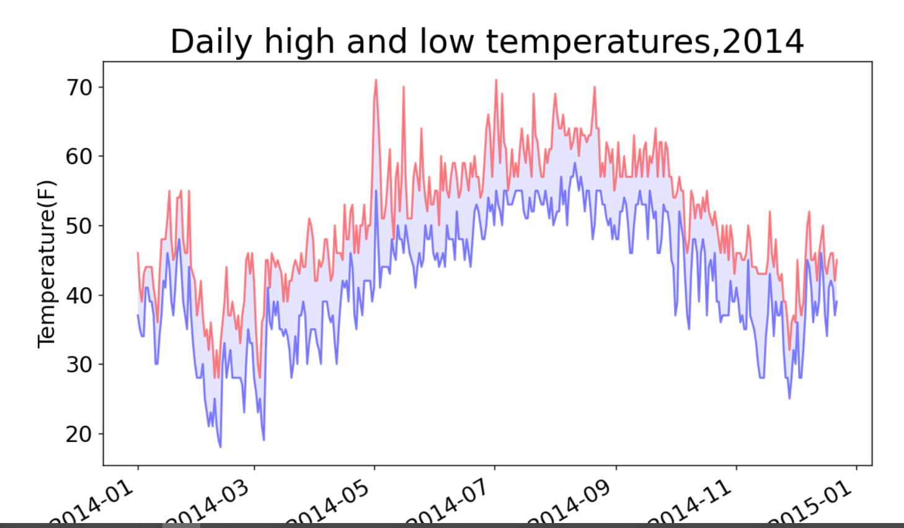
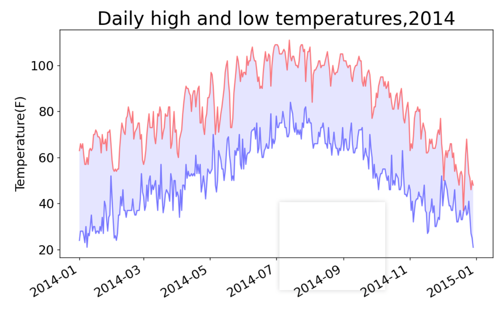

[toc]

# 第16章 下载数据

**document support**

ysys

**date**

2020-10-03

**label**

python,《Python编程：从入门到实践》

**level**

middle


## 概览

​	将在网上下载数据，并对这些数据进行可视化。

​	两种常见格式存储的数据:CSV和JSON


## 16.1 CSV文件格式

​	逗号分隔符号

```
2014-1-3,23,333,4444,2222
```


### 16.1.1 分析CSV文件头

​	csv模块包含在Python标准库，可用于分析CSV文件的数据行，能够提取感兴趣的值。

```
#coding=utf-8

import csv

filename = 'sitka_weather_07-2014.csv'
with open(filename) as f:
	reader=csv.reader(f)
	header_row = next(reader)
	print(header_row)
```

```
['AKDT', 'Max TemperatureF', 'Mean TemperatureF', 'Min TemperatureF', 'Max Dew PointF', 'MeanDew PointF', 'Min DewpointF', 'Max Humidity', ' Mean Humidity', ' Min Humidity', ' Max Sea Level PressureIn', ' Mean Sea Level PressureIn', ' Min Sea Level PressureIn', ' Max VisibilityMiles', ' Mean VisibilityMiles', ' Min VisibilityMiles', ' Max Wind SpeedMPH', ' Mean Wind SpeedMPH', ' Max Gust SpeedMPH', 'PrecipitationIn', ' CloudCover', ' Events', ' WindDirDegrees']
```


### 16.1.2 打印文件头及其位置

```
#coding=utf-8

import csv

filename = 'sitka_weather_07-2014.csv'
with open(filename) as f:
	reader=csv.reader(f)
	header_row = next(reader)
	for index,column_header in enumerate(header_row):
		print(index,column_header)
```

```
0 AKDT
1 Max TemperatureF
2 Mean TemperatureF
3 Min TemperatureF
4 Max Dew PointF
5 MeanDew PointF
6 Min DewpointF
7 Max Humidity
8  Mean Humidity
9  Min Humidity
10  Max Sea Level PressureIn
11  Mean Sea Level PressureIn
12  Min Sea Level PressureIn
13  Max VisibilityMiles
14  Mean VisibilityMiles
15  Min VisibilityMiles
16  Max Wind SpeedMPH
17  Mean Wind SpeedMPH
18  Max Gust SpeedMPH
19 PrecipitationIn
20  CloudCover
21  Events
22  WindDirDegrees
```

​	enumerate()获取每个元素的索引和它的值


### 16.1.3 提起并读取数据

```
#coding=utf-8

import csv

filename = 'sitka_weather_07-2014.csv'
with open(filename) as f:
	reader=csv.reader(f)
	header_row = next(reader)
	highs = []
	for row in reader:
		highs.append(row[1])
	print(highs)

```

```
['64', '71', '64', '59', '69', '62', '61', '55', '57', '61', '57', '59', '57', '61', '64', '61', '59', '63', '60', '57', '69', '63', '62', '59', '57', '57', '61', '59', '61', '61', '66']
```

将string的数值类型转化int类型

```
#coding=utf-8

import csv


filename = 'sitka_weather_07-2014.csv'
with open(filename) as f:
	reader=csv.reader(f)
	header_row = next(reader)
	highs = []
	for row in reader:
		high = int(row[1])
		highs.append(high)
	print(highs)

```

```
[64, 71, 64, 59, 69, 62, 61, 55, 57, 61, 57, 59, 57, 61, 64, 61, 59, 63, 60, 57, 69, 63, 62, 59, 57, 57, 61, 59, 61, 61, 66]
```


### 16.1.4 绘制气温图表

​	matplotlib创建一个显示每日最高气温的简单图形

```
#coding=utf-8

import csv
from matplotlib import pyplot as plt


filename = 'sitka_weather_07-2014.csv'
with open(filename) as f:
	reader=csv.reader(f)
	header_row = next(reader)
	highs = []
	for row in reader:
		high = int(row[1])
		highs.append(high)
	
fig = plt.figure(dpi=128,figsize=(10,6))
plt.plot(highs,c='red')
plt.title("Daily high temperatures,July 2014",fontsize=24)
plt.xlabel('',fontsize=16)
plt.ylabel('Temperature(F)',fontsize=16)
plt.tick_params(axis='both',which='major',labelsize=16)
plt.show()	
```




### 16.1.5 模块datatime

​	下面要在图表中添加日期

```
datatime.strptime(?,'%Y-%m-%d')
```


### 16.1.6 在图表中添加日期

```
#coding=utf-8

import csv
from datetime import datetime
from matplotlib import pyplot as plt


filename = 'sitka_weather_07-2014.csv'
with open(filename) as f:
	reader=csv.reader(f)
	header_row = next(reader)
	highs = []
	dates = []
	for row in reader:
		current_date = datetime.strptime(row[0],'%Y-%m-%d')
		dates.append(current_date)
		high = int(row[1])
		highs.append(high)
	
fig = plt.figure(dpi=128,figsize=(10,6))
plt.plot(dates,highs,c='red')
plt.title("Daily high temperatures,July 2014",fontsize=24)
plt.xlabel('',fontsize=16)
fig.autofmt_xdate() # 倾斜日期格式
plt.ylabel('Temperature(F)',fontsize=16)
plt.tick_params(axis='both',which='major',labelsize=16)
plt.show()	
```




### 16.1.7 涵盖更长的时间


```
#coding=utf-8

import csv
from datetime import datetime
from matplotlib import pyplot as plt


filename = 'sitka_weather_2014.csv'
with open(filename) as f:
	reader=csv.reader(f)
	header_row = next(reader)
	highs = []
	dates = []
	for row in reader:
		current_date = datetime.strptime(row[0],'%Y-%m-%d')
		dates.append(current_date)
		high = int(row[1])
		highs.append(high)
	
fig = plt.figure(dpi=128,figsize=(10,6))
plt.plot(dates,highs,c='red')
plt.title("Daily high temperatures,J2014",fontsize=24)
plt.xlabel('',fontsize=16)
fig.autofmt_xdate()
plt.ylabel('Temperature(F)',fontsize=16)
plt.tick_params(axis='both',which='major',labelsize=16)
plt.show()	
```




### 16.1.8 再绘制一个数据系列

```
#coding=utf-8

import csv
from datetime import datetime
from matplotlib import pyplot as plt


filename = 'sitka_weather_2014.csv'
with open(filename) as f:
	reader=csv.reader(f)
	header_row = next(reader)
	dates,highs,lows=[],[],[]
	for row in reader:
		current_date = datetime.strptime(row[0],'%Y-%m-%d')
		dates.append(current_date)
		high = int(row[1])
		highs.append(high)
		low = int(row[3])
		lows.append(low)
	
fig = plt.figure(dpi=128,figsize=(10,6))
plt.plot(dates,highs,c='red')
plt.plot(dates,lows,c='blue')
plt.title("Daily high and low temperatures,2014",fontsize=24)
plt.xlabel('',fontsize=16)
fig.autofmt_xdate()
plt.ylabel('Temperature(F)',fontsize=16)
plt.tick_params(axis='both',which='major',labelsize=16)
plt.show()	
```




### 16.1.9 给图标区域着色

```
#coding=utf-8

import csv
from datetime import datetime
from matplotlib import pyplot as plt


filename = 'sitka_weather_2014.csv'
with open(filename) as f:
	reader=csv.reader(f)
	header_row = next(reader)
	dates,highs,lows=[],[],[]
	for row in reader:
		current_date = datetime.strptime(row[0],'%Y-%m-%d')
		dates.append(current_date)
		high = int(row[1])
		highs.append(high)
		low = int(row[3])
		lows.append(low)
	
fig = plt.figure(dpi=128,figsize=(10,6))
plt.plot(dates,highs,c='red',alpha=0.5)
plt.plot(dates,lows,c='blue',alpha=0.5)
plt.fill_between(dates,highs,lows,facecolor='blue',alpha=0.1)
plt.title("Daily high and low temperatures,2014",fontsize=24)
plt.xlabel('',fontsize=16)
fig.autofmt_xdate()
plt.ylabel('Temperature(F)',fontsize=16)
plt.tick_params(axis='both',which='major',labelsize=16)
plt.show()	
```



 alpha 指定颜色的透明度


### 16.1.10 错误检查

```
#coding=utf-8

import csv
from datetime import datetime
from matplotlib import pyplot as plt


filename = 'death_valley_2014.csv'
with open(filename) as f:
	reader=csv.reader(f)
	header_row = next(reader)
	dates,highs,lows=[],[],[]
	for row in reader:
		current_date = datetime.strptime(row[0],'%Y-%m-%d')
		dates.append(current_date)
		high = int(row[1])
		highs.append(high)
		low = int(row[3])
		lows.append(low)
	
fig = plt.figure(dpi=128,figsize=(10,6))
plt.plot(dates,highs,c='red',alpha=0.5)
plt.plot(dates,lows,c='blue',alpha=0.5)
plt.fill_between(dates,highs,lows,facecolor='blue',alpha=0.1)
plt.title("Daily high and low temperatures,2014",fontsize=24)
plt.xlabel('',fontsize=16)
fig.autofmt_xdate()
plt.ylabel('Temperature(F)',fontsize=16)
plt.tick_params(axis='both',which='major',labelsize=16)
plt.show()	
```

```
Traceback (most recent call last):
  File "highs_lows.py", line 16, in <module>
    high = int(row[1])
ValueError: invalid literal for int() with base 10: ''
```

​	无法将空字符串转换为int类型


```
#coding=utf-8

import csv
from datetime import datetime
from matplotlib import pyplot as plt

#coding=utf-8

import csv
from datetime import datetime
from matplotlib import pyplot as plt


filename = 'death_valley_2014.csv'
with open(filename) as f:
	reader=csv.reader(f)
	header_row = next(reader)
	dates,highs,lows=[],[],[]
	for row in reader:
		try:
			current_date = datetime.strptime(row[0],'%Y-%m-%d')
			high = int(row[1])
			low = int(row[3])
		except ValueError:
			print(current_date,'missing date')
		else:
			dates.append(current_date)
			highs.append(high)
			lows.append(low)
	
fig = plt.figure(dpi=128,figsize=(10,6))
plt.plot(dates,highs,c='red',alpha=0.5)
plt.plot(dates,lows,c='blue',alpha=0.5)
plt.fill_between(dates,highs,lows,facecolor='blue',alpha=0.1)
plt.title("Daily high and low temperatures,2014",fontsize=24)
plt.xlabel('',fontsize=16)
fig.autofmt_xdate()
plt.ylabel('Temperature(F)',fontsize=16)
plt.tick_params(axis='both',which='major',labelsize=16)
plt.show()	
```

```
2014-02-16 00:00:00 missing date
```




## 16.2 制作世界人口地图:JSON格式


### 16.2.1 下载世界人口数据


### 16.2.2 提取相关的数据

