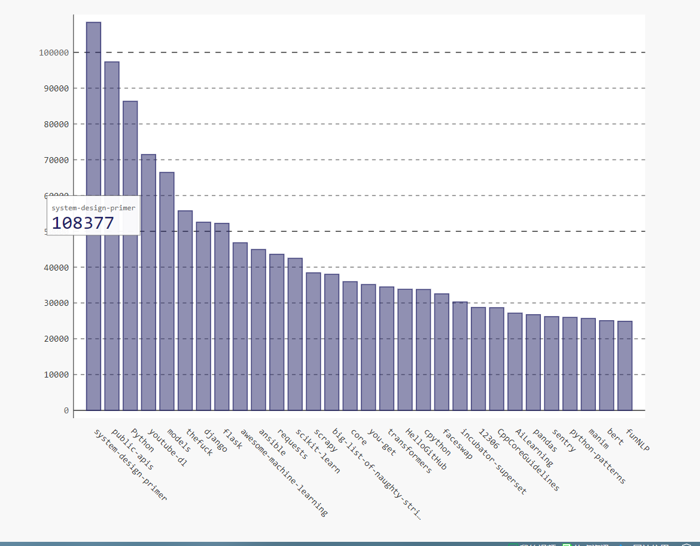
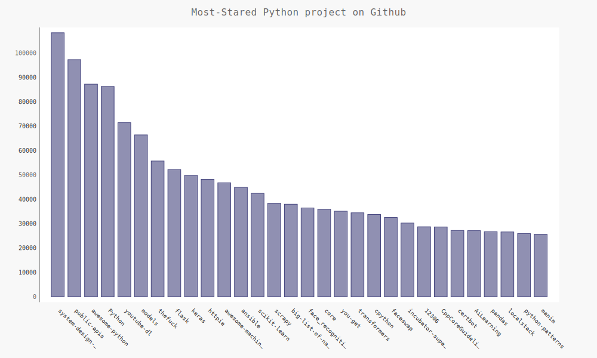
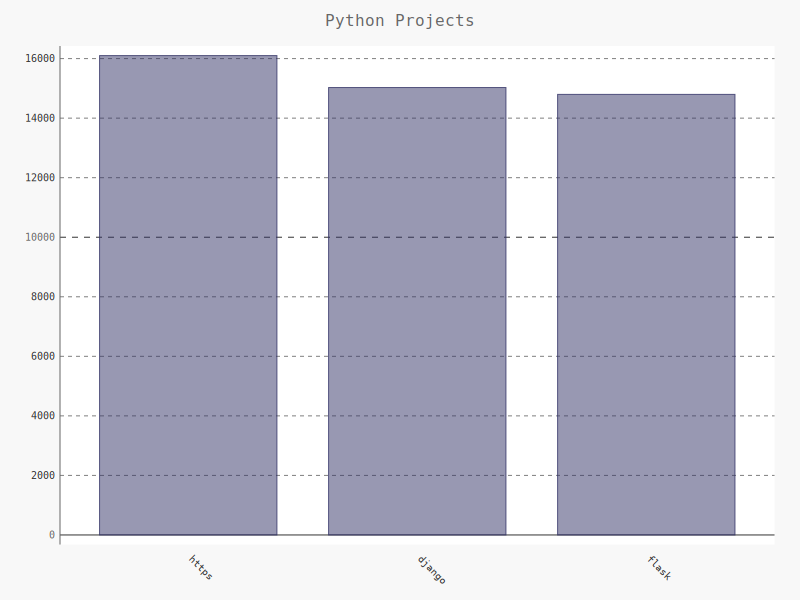
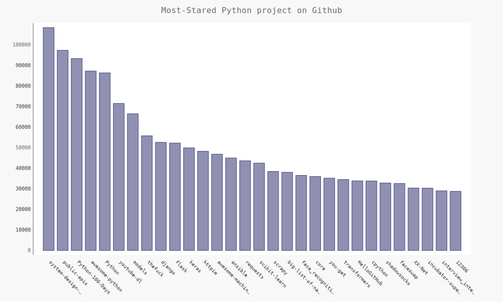

[toc]

# 第17章 使用API

**document support**

ysys

**date**

2020-10-03

**label**

python,《Python编程：从入门到实践》

**level**

middle


## 概览

​	编写一个独立的程序，并对其获取的数据进行可视化。

## 17.1 使用Web API

​	API调用

### 17.1.1 Git和GitHub

​	本章的可视化将基于来自GitHub的信息，这是一个让程序员能够协助开发项目的网站。

### 17.1.2 使用API调用请求数据

```
https://api.github.com/search/repositories?q=language:python&sort=stars
```

​	这个调用返回了GitHub当前托管了多少个Python项目,还有有关最受欢迎的Python仓库的信息。

```
{
  "total_count": 5617270,
  "incomplete_results": true,
  "items": [
    {
      "id": 63476337,
      "node_id": "MDEwOlJlcG9zaXRvcnk2MzQ3NjMzNw==",
      "name": "Python",
      "full_name": "TheAlgorithms/Python",
```

### 17.1.3 安装requests

```
pip install requests
```


### 17.1.4 处理API相应

```
import requests

url ='https://api.github.com/search/repositories?q=language:python&sort=stars'
r =requests.get(url)
print("Status code:",r.status_code)

response_dict = r.json()
print(response_dict.keys())

```

```
Status code: 200
dict_keys(['total_count', 'incomplete_results', 'items'])
```


### 17.1.5 处理相应字典

```
import requests

url ='https://api.github.com/search/repositories?q=language:python&sort=stars'
r =requests.get(url)
print("Status code:",r.status_code)

response_dict = r.json()
print("Total repositories:",response_dict['total_count'])


repo_dicts = response_dict['items']
print("Reponsitories.returned:",len(repo_dicts))


repo_dict = repo_dicts[0]
print("\nKeys:",len(repo_dict))
for key in sorted(repo_dict.keys()):
	print(key)
```


```
Status code: 200
Total repositories: 5678536
Reponsitories.returned: 30

Keys: 74
archive_url
archived
assignees_url
blobs_url
branches_url
clone_url
--snip--
```

```
import requests

url ='https://api.github.com/search/repositories?q=language:python&sort=stars'
r =requests.get(url)
print("Status code:",r.status_code)

response_dict = r.json()
print("Total repositories:",response_dict['total_count'])


repo_dicts = response_dict['items']
print("Reponsitories.returned:",len(repo_dicts))


repo_dict = repo_dicts[0]
print("\nKeys:",len(repo_dict))
for key in sorted(repo_dict.keys()):
	print(key)

print("\nSelected information about first repository:")
print('Name:',repo_dict['name'])
print('Owner:',repo_dict['owner']['login'])
print('Stars',repo_dict['stargazers_count'])
print('Repository:',repo_dict['html_url'])
print('Created:',repo_dict['created_at'])
print('Updated:',repo_dict['updated_at'])
print('Description:',repo_dict['description'])

```


```
Status code: 200
Total repositories: 5982054
Reponsitories.returned: 30

Keys: 74
archive_url
archived
assignees_url
blobs_url
branches_url
clone_url
collaborators_url
comments_url
commits_url
compare_url
contents_url
contributors_url
created_at
default_branch
deployments_url
description
disabled
downloads_url
events_url
fork
forks
forks_count
forks_url
full_name
git_commits_url
git_refs_url
git_tags_url
git_url
has_downloads
has_issues
has_pages
has_projects
has_wiki
homepage
hooks_url
html_url
id
issue_comment_url
issue_events_url
issues_url
keys_url
labels_url
language
languages_url
license
merges_url
milestones_url
mirror_url
name
node_id
notifications_url
open_issues
open_issues_count
owner
private
pulls_url
pushed_at
releases_url
score
size
ssh_url
stargazers_count
stargazers_url
statuses_url
subscribers_url
subscription_url
svn_url
tags_url
teams_url
trees_url
updated_at
url
watchers
watchers_count

Selected information about first repository:
Name: system-design-primer
Owner: donnemartin
Stars 108374
Repository: https://github.com/donnemartin/system-design-primer
Created: 2017-02-26T16:15:28Z
Updated: 2020-10-03T02:00:16Z
Description: Learn how to design large-scale systems. Prep for the system design interview.  Includes Anki flashcards.
```


### 17.1.6 概述最受欢迎的仓库

```
import requests


url ='https://api.github.com/search/repositories?q=language:python&sort=stars'
r =requests.get(url)
print("Status code:",r.status_code)

response_dict = r.json()
print("Total repositories:",response_dict['total_count'])


repo_dicts = response_dict['items']
print("Reponsitories.returned:",len(repo_dicts))


print("\nSelected information about first repository:")
for repo_dict in repo_dicts:
	print("\nSelected information about first repository:")
	print('Name:',repo_dict['name'])
	print('Owner:',repo_dict['owner']['login'])
	print('Stars',repo_dict['stargazers_count'])
	print('Repository:',repo_dict['html_url'])
	print('Created:',repo_dict['created_at'])
	print('Updated:',repo_dict['updated_at'])
	print('Description:',repo_dict['description'])

```

```
Status code: 200
Total repositories: 5342776
Reponsitories.returned: 30

Selected information about first repository:

Selected information about first repository:
Name: system-design-primer
Owner: donnemartin
Stars 108377
Repository: https://github.com/donnemartin/system-design-primer
Created: 2017-02-26T16:15:28Z
Updated: 2020-10-03T02:25:15Z
Description: Learn how to design large-scale systems. Prep for the system design interview.  Includes Anki flashcards.

```

### 17.1.7 监视API的速率限制

https://api.github.com/rate_limit

```
{"resources":{"core":{"limit":60,"remaining":59,"reset":1601692339,"used":1},"graphql":{"limit":0,"remaining":0,"reset":1601695376,"used":0},"integration_manifest":{"limit":5000,"remaining":5000,"reset":1601695376,"used":0},"search":{"limit":10,"remaining":10,"reset":1601691836,"used":0}},"rate":{"limit":60,"remaining":59,"reset":1601692339,"used":1}}
```


## 17.2 使用Pygal可视化仓库

```
import requests
import pygal
from pygal.style import LightColorizedStyle as LCS,LightenStyle as LS
import time


URL ='https://api.github.com/search/repositories?q=language:python&sort=stars'
r =requests.get(URL)
print("Status code:",r.status_code)

response_dict = r.json()
print("Total repositories:",response_dict['total_count'])


repo_dicts = response_dict['items']
names,stars = [],[]

for repo_dict in repo_dicts:
	time.sleep(1)
	names.append(repo_dict['name'])
	stars.append(repo_dict['stargazers_count'])

my_style=LS('#222266',base_style=LCS)
chart = pygal.Bar(style=my_style,x_label_rotation=45,show_legend=False)
chart.x_labels = names

chart.add('',stars)
chart.render_to_file('python_repos.svg')

```




### 17.2.1 改进Pygal图表

```
import requests
import pygal
from pygal.style import LightColorizedStyle as LCS,LightenStyle as LS
import time


URL ='https://api.github.com/search/repositories?q=language:python&sort=stars'
r =requests.get(URL)
print("Status code:",r.status_code)

response_dict = r.json()
print("Total repositories:",response_dict['total_count'])


repo_dicts = response_dict['items']
names,stars = [],[]

for repo_dict in repo_dicts:
	time.sleep(2)
	names.append(repo_dict['name'])
	stars.append(repo_dict['stargazers_count'])

my_style=LS('#222266',base_style=LCS)

my_config = pygal.Config()
my_config.x_label_rotation = 45
my_config.show_legend = False
my_config.title_font_size = 24
my_config.label_font_size = 14
my_config.major_label_font_size = 18
my_config.truncate_label = 15
my_config.show_y_guides = False
my_config.width = 1000

chart = pygal.Bar(my_config,style=my_style)
chart.title = "Most-Stared Python project on Github"
chart.x_labels = names

chart.add('',stars)
chart.render_to_file('python_repos.svg')
```




### 17.2.2 添加自定义工具提示

```
import pygal
from pygal.style import LightColorizedStyle as LCS,LightenStyle as LS

my_style = LS('#333366',base_style=LCS)
chart = pygal.Bar(style=my_style,x_label_rotation=45,show_legend=False)

chart.title = 'Python Projects'
chart.x_labels = ['https','django','flask']

plot_dicts = [
{'value':16101,'label':'Description of httpie.'},
{'value':15028,'label':'Description of django.'},
{'value':14798,'label':'Description of flask.'}
]

chart.add('',plot_dicts)
chart.render_to_file('bar_desciptions.svg')

```




### 17.2.3 根据数据绘图


```
import requests
import pygal
from pygal.style import LightColorizedStyle as LCS,LightenStyle as LS
import time


URL ='https://api.github.com/search/repositories?q=language:python&sort=stars'
r =requests.get(URL)
print("Status code:",r.status_code)

response_dict = r.json()
print("Total repositories:",response_dict['total_count'])


repo_dicts = response_dict['items']
names,plot_dicts = [],[]

for repo_dict in repo_dicts:
	time.sleep(2)
	names.append(repo_dict['name'])
	plot_dict ={
	'value':repo_dict['stargazers_count'],
	'label':str(repo_dict['description']),
	}
	plot_dicts.append(plot_dict)
	
my_style=LS('#222266',base_style=LCS)

my_config = pygal.Config()
my_config.x_label_rotation = 45
my_config.show_legend = False
my_config.title_font_size = 24
my_config.label_font_size = 14
my_config.major_label_font_size = 18
my_config.truncate_label = 15
my_config.show_y_guides = False
my_config.width = 1000

chart = pygal.Bar(my_config,style=my_style)
chart.title = "Most-Stared Python project on Github"
chart.x_labels = names

chart.add('',plot_dicts)
chart.render_to_file('python_repos3.svg')


```


### 17.2.4 在图表中添加可单击的链接


```
import requests
import pygal
from pygal.style import LightColorizedStyle as LCS,LightenStyle as LS
import time


URL ='https://api.github.com/search/repositories?q=language:python&sort=stars'
r =requests.get(URL)
print("Status code:",r.status_code)
response_dict = r.json()
print("Total repositories:",response_dict['total_count'])
repo_dicts = response_dict['items']
names,plot_dicts = [],[]
for repo_dict in repo_dicts:
	time.sleep(2)
	names.append(repo_dict['name'])
	plot_dict ={
	'value':repo_dict['stargazers_count'],
	'label':str(repo_dict['description']),
	'xlink':repo_dict['html_url'],
	}
	plot_dicts.append(plot_dict)
	
my_style=LS('#222266',base_style=LCS)
my_config = pygal.Config()
my_config.x_label_rotation = 45
my_config.show_legend = False
my_config.title_font_size = 24
my_config.label_font_size = 14
my_config.major_label_font_size = 18
my_config.truncate_label = 15
my_config.show_y_guides = False
my_config.width = 1000

chart = pygal.Bar(my_config,style=my_style)
chart.title = "Most-Stared Python project on Github"
chart.x_labels = names

chart.add('',plot_dicts)
chart.render_to_file('python_repos4.svg')
```




## 17.3 Hacker News API

​	为了探索如何使用其他网站的API调用

```
https://hacker-news.firebaseio.com/v0/item/9884165.json
```

​	响应是一个字典

```
{"by":"nns","descendants":297,"id":9884165,"kids":[9885099,9884723,9885165,9884789,9885604,9884137,9886151,9885220,9885790,9884661,9885844,9885029,9884817,9887342,9884545,9884372,9884499,9884881,9884109,9886496,9884342,9887832,9885023,9884334,9884707,9887008,9885348,9885131,9887539,9885880,9884196,9884640,9886534,9885152],"score":558,"time":1436875181,"title":"New Horizons: Nasa spacecraft speeds past Pluto","type":"story","url":"http://www.bbc.co.uk/news/science-environment-33524589"}
```


```
import requests

from operator import itemgetter

# Make an API call, and store the response.
url = 'https://hacker-news.firebaseio.com/v0/topstories.json'
r = requests.get(url)
print("Status code:", r.status_code)

# Process information about each submission.
submission_ids = r.json()
submission_dicts = []
for submission_id in submission_ids[:30]:
    # Make a separate API call for each submission.
    url = ('https://hacker-news.firebaseio.com/v0/item/' +
            str(submission_id) + '.json')
    submission_r = requests.get(url)
    print(submission_r.status_code)
    response_dict = submission_r.json()
    
    submission_dict = {
        'title': response_dict['title'],
        'link': 'http://news.ycombinator.com/item?id=' + str(submission_id),
        'comments': response_dict.get('descendants', 0)
        }
    submission_dicts.append(submission_dict)
    
submission_dicts = sorted(submission_dicts, key=itemgetter('comments'),
                            reverse=True)

for submission_dict in submission_dicts:
    print("\nTitle:", submission_dict['title'])
    print("Discussion link:", submission_dict['link'])
    print("Comments:", submission_dict['comments'])

```

```
Status code: 200
200
200
200
200
200
200
200
200
200
200
200
200
200
200
200
200
200
200
200
200
200
200
200
200
200
200
200
200
200
200

Title: What is the best dumb TV?
Discussion link: http://news.ycombinator.com/item?id=24666968
Comments: 366

Title: Loss of smell could be a 'highly reliable indicator' of Covid-19, research says
Discussion link: http://news.ycombinator.com/item?id=24662119
Comments: 228

Title: Apple Watch momentum is building
Discussion link: http://news.ycombinator.com/item?id=24668270
Comments: 193

Title: Pressing YubiKeys
Discussion link: http://news.ycombinator.com/item?id=24663989
Comments: 183

Title: Google: “Any harm Epic has suffered is not irreparable and is of its own making”
Discussion link: http://news.ycombinator.com/item?id=24668643
Comments: 170

Title: Hacking Grindr Accounts with Copy and Paste
Discussion link: http://news.ycombinator.com/item?id=24667213
Comments: 144

Title: Logging Everyone Out
Discussion link: http://news.ycombinator.com/item?id=24664643
Comments: 142

Title: Tokyo Stock Exchange Blackout: One Piece of Hardware Took Down a Market
Discussion link: http://news.ycombinator.com/item?id=24664645
Comments: 83

Title: Escaping strings in Bash using !:q
Discussion link: http://news.ycombinator.com/item?id=24659282
Comments: 68

Title: Publishers worry as ebooks fly off libraries' virtual shelves
Discussion link: http://news.ycombinator.com/item?id=24649798
Comments: 67

Title: “Fungi Can Teach Us a New Way of Looking at the World”
Discussion link: http://news.ycombinator.com/item?id=24666521
Comments: 52

Title: Hacktoberfest Is Now Opt-In
Discussion link: http://news.ycombinator.com/item?id=24669043
Comments: 51

Title: Python typosquatting is about more than typos
Discussion link: http://news.ycombinator.com/item?id=24649729
Comments: 43

Title: Paying ransomware demands could land you in hot water with the feds
Discussion link: http://news.ycombinator.com/item?id=24661211
Comments: 41

Title: Bead Sort
Discussion link: http://news.ycombinator.com/item?id=24659668
Comments: 34

Title: BPG Image Format
Discussion link: http://news.ycombinator.com/item?id=24650130
Comments: 32

Title: RaspberryPi 4 home lab with LXD cluster
Discussion link: http://news.ycombinator.com/item?id=24666526
Comments: 26

Title: Einstein's description of gravity just got much harder to beat
Discussion link: http://news.ycombinator.com/item?id=24661092
Comments: 25

Title: Raycasting engine in Factorio 1.0 (unmodded) [video]
Discussion link: http://news.ycombinator.com/item?id=24668360
Comments: 22

Title: The future of garbage collection is pneumatic tubes
Discussion link: http://news.ycombinator.com/item?id=24661826
Comments: 18

Title: An Honest Review of Gatsby
Discussion link: http://news.ycombinator.com/item?id=24670252
Comments: 15

Title: Iron, How Did They Make It, Part III: Hammer-Time
Discussion link: http://news.ycombinator.com/item?id=24668125
Comments: 13

Title: Startup Hiring 101: A Founder's Guide
Discussion link: http://news.ycombinator.com/item?id=24666580
Comments: 13

Title: JQuery to React: How we rewrote the HelloSign editor
Discussion link: http://news.ycombinator.com/item?id=24669539
Comments: 11

Title: Copper: A statically-typed, loose syntax programming language
Discussion link: http://news.ycombinator.com/item?id=24657699
Comments: 7

Title: Deep links to opt-out of data sharing by 60 companies
Discussion link: http://news.ycombinator.com/item?id=24669681
Comments: 3

Title: What Makes People Feel Upbeat at Work (2016)
Discussion link: http://news.ycombinator.com/item?id=24637631
Comments: 3

Title: Tom Stoppard: A Life
Discussion link: http://news.ycombinator.com/item?id=24657775
Comments: 3

Title: How to build an open source business
Discussion link: http://news.ycombinator.com/item?id=24654427
Comments: 2

Title: Bitmovin (YC S15) Is Hiring Software Developers with Video Focus
Discussion link: http://news.ycombinator.com/item?id=24670176
Comments: 0
```


## 17.4 小结

