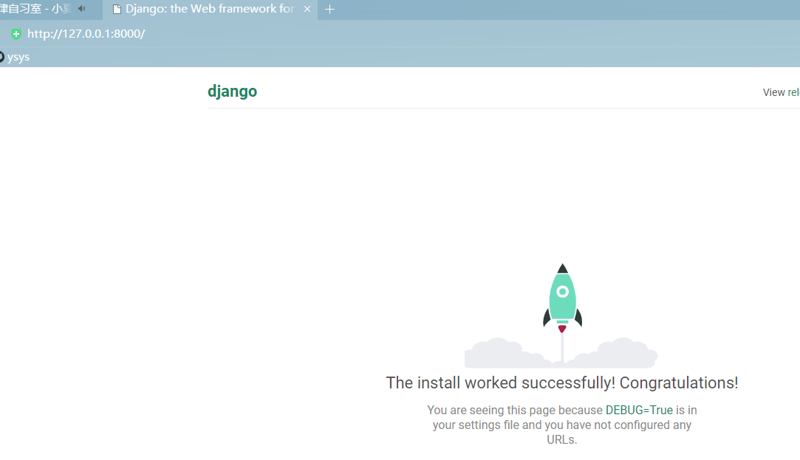
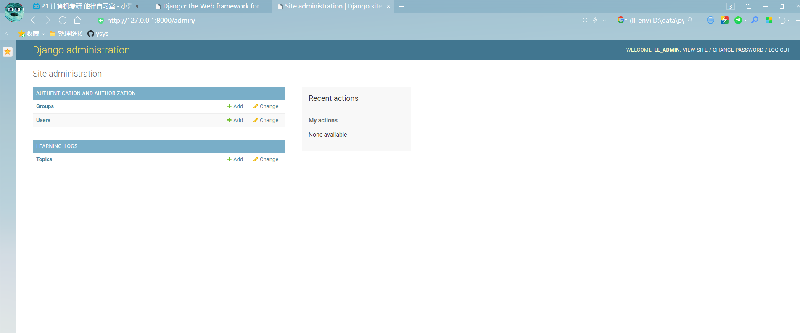
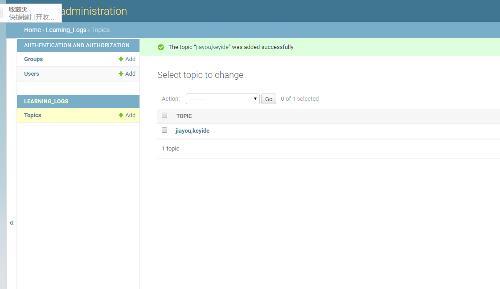
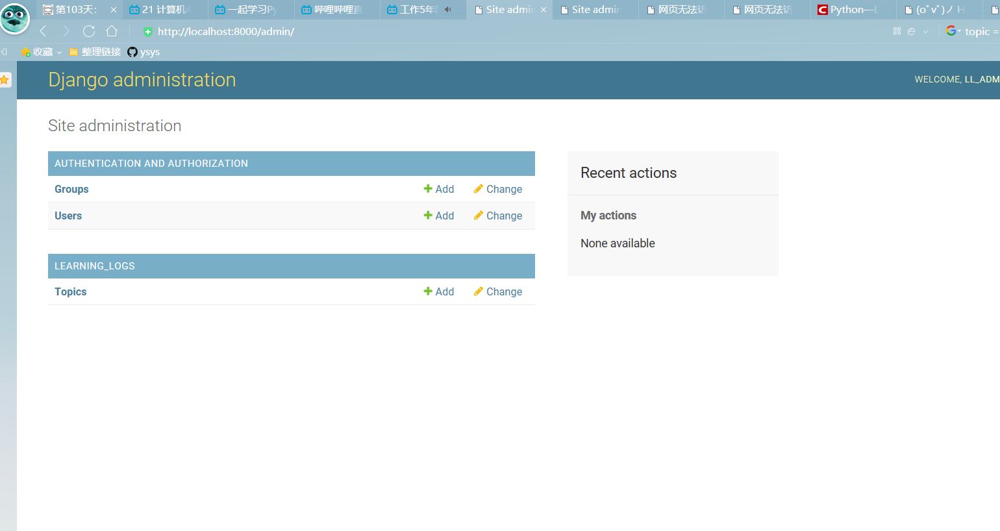
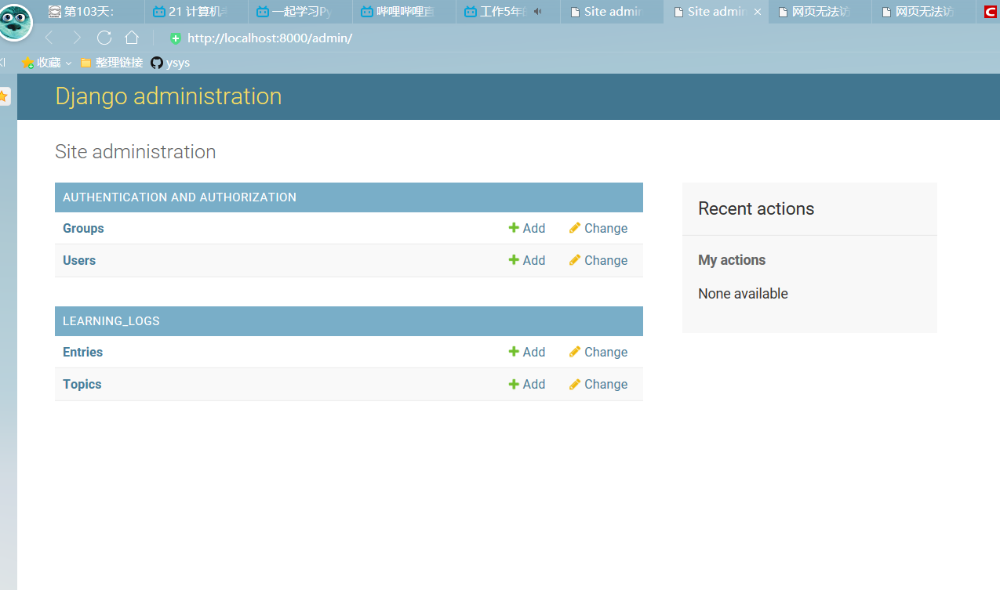

[toc]

# 第18章 Django 入门

**document support**

ysys

**date**

2020-10-03

**label**

python,《Python编程：从入门到实践》

**level**

middle


## 概览

​	如何使用Django来开发一个名为"学习笔记"的项目


## 18.1 建立项目

​	建立项目时，首先需要以规范的方式对项目进行描述，再建立虚拟环境，以便在其中创建项目。

### 18.1.1 制定规范


### 18.1.2 建立虚拟环境

为项目创建一个目录learning_log

```
python -m venv ll_env
```


### 18.1.3 安装virtualenv

​	

### 18.1.4 激活虚拟环境

windows环境下

```
ll_env\Scripts\activate
```

### 18.1.5 安装Django

```
(ll_env) D:\data\python_work\learning_log> pip install Django -i http://mirrors.aliyun.com/pypi/simple/ --trusted-host mirrors.aliyun.com
```


### 18.1.6 在Django中创建项目

 window 执行

```
(ll_env) D:\data\python_work\learning_log>django-admin startproject learning_log .
```

### 18.1.7 创建数据库

```
(ll_env) D:\data\python_work\learning_log>python manage.py migrate

```

### 18.1.8 查看项目

```
(ll_env) D:\data\python_work\learning_log>python manage.py runserver


```





## 18.2 创建应用程序

​	执行`ll_env\Scripts\activate`进入到

```
(ll_env) D:\data\python_work\learning_log>  
(ll_env) D:\data\python_work\learning_log>python manage.py startapp learning_logs
```

```
(ll_env) D:\data\python_work\learning_log>cd learning_logs

(ll_env) D:\data\python_work\learning_log\learning_logs>dir
 驱动器 D 中的卷是 DATA
 卷的序列号是 5036-50E9

 D:\data\python_work\learning_log\learning_logs 的目录

2020/10/03  15:59    <DIR>          .
2020/10/03  15:59    <DIR>          ..
2020/10/03  15:59                66 admin.py
2020/10/03  15:59               105 apps.py
2020/10/03  15:59    <DIR>          migrations
2020/10/03  15:59                60 models.py
2020/10/03  15:59                63 tests.py
2020/10/03  15:59                66 views.py
2020/10/03  15:59                 0 __init__.py
               6 个文件            360 字节
```


### 18.2.1 定义模型

models.py

```
from django.db import models

# Create your models here.

```

```
from django.db import models

# Create your models here.

class Topic(models.Model):
	text = models.CharField(max_length=200)
	date_added = models.DateTimeField(auto_now_add=True)
	
	def __str__(self):
		return self.text

```


### 18.2.2 激活模型

​	在learning_log中settings.py中添加`'learning_logs',`

```
INSTALLED_APPS = [
    'django.contrib.admin',
    'django.contrib.auth',
    'django.contrib.contenttypes',
    'django.contrib.sessions',
    'django.contrib.messages',
    'django.contrib.staticfiles',
    'learning_logs',
]
```

```
>python manage.py makemigrations learning_logs
Migrations for 'learning_logs':
  learning_logs\migrations\0001_initial.py
    - Create model Topic

>python manage.py migrate
Operations to perform:
  Apply all migrations: admin, auth, contenttypes, learning_logs, sessions
Running migrations:
  Applying learning_logs.0001_initial... OK
```

### 18.2.3 Django管理网站

- 创建超级用户

```
>python manage.py createsuperuser
Username (leave blank to use 'guohui'): ll_admin
Email address: 123@123.com
Password:
Password (again):
This password is too short. It must contain at least 8 characters.
This password is too common.
This password is entirely numeric.
Bypass password validation and create user anyway? [y/N]: y
Superuser created successfully.
```

- 向管理网站注册模型

  在learning_logs的目录下创建一个admin.py的文件

```
from django.contrib import admin

from learning_logs.models import Topic
# Register your models here.

admin.site.register(Topic)

```

访问地址http://127.0.0.1:8000/admin/




- 添加主题

  在topic下创建一个主题(这一步暂时不要做)




### 18.2.4 定义模型Entry


```
from django.db import models

class Topic(models.Model):
    """A topic the user is learning about."""
    text = models.CharField(max_length=200)
    date_added = models.DateTimeField(auto_now_add=True) 

    def __str__(self):
        """Return a string representation of the model."""
        return self.text

class Entry(models.Model):
    """Something specific learned about a topic."""
    topic = models.ForeignKey(Topic,on_delete=models.CASCADE)
    text = models.TextField()
    date_added = models.DateTimeField(auto_now_add=True)
    
    class Meta:
        verbose_name_plural = 'entries'
 
    def __str__(self):
        """Return a string representation of the model."""
        return self.text[:50] + "..."


```


### 18.2.5 迁移模型Entry


```
python manage.py makemigrations learning_logs
Traceback (most recent call last):
  File "manage.py", line 22, in <module>
    main()
  File "manage.py", line 18, in main
    execute_from_command_line(sys.argv)
  File "D:\data\python_work\learning_log\ll_env\lib\site-packages\django\core\management\__init__.py", line 401, in execute_from_command_line
    utility.execute()
  File "D:\data\python_work\learning_log\ll_env\lib\site-packages\django\core\management\__init__.py", line 377, in execute
  
python manage.py migrate
Operations to perform:
  Apply all migrations: admin, auth, contenttypes, learning_logs, sessions
Running migrations:
  Applying learning_logs.0002_auto_20201003_2217... OK

```


### 18.2.6 向管理网站注册Entry


```
from django.contrib import admin
from learning_logs.models import Topic,Entry

# Register your models here.

admin.site.register(Topic)
admin.site.register(Entry)

```

​	查看admin






###  18.2.7 Django shell

```
python manage.py shell
Python 3.7.7 (tags/v3.7.7:d7c567b08f, Mar 10 2020, 10:41:24) [MSC v.1900 64 bit (AMD64)] on win32
Type "help", "copyright", "credits" or "license" for more information.
(InteractiveConsole)
>>> from learning_logs.models import Topic
>>> Topic.objects.all()
<QuerySet []>
>>>>>> from learning_logs.models import Topic
>>> Topic.objects.all()
<QuerySet []>
>>> Topic.objects.all()
<QuerySet [<Topic: jiayou,huihaoqilaide>]>
>>> topics=Topic.objects.all()
>>> for topic in topics:
...     print(topic.id,topic)
...
1 jiayou,huihaoqilaide
>>> t = Topic.objects.get(id=1)
>>> t.text
'jiayou,huihaoqilaide'
>>> t.date_added
datetime.datetime(2020, 10, 3, 14, 48, 49, 180197, tzinfo=<UTC>)
>>> t.entry_set.all()
<QuerySet [<Entry: jiayouhuilaiqilaide,jiushizhgeyagnzide...>]>
```


## 18.3 创建学习主页

​	使用Django创建网页的过程通常分为三个阶段:定义URL,编写视图和编写模版

### 18.3.1 映射URL

​	用户通过在浏览器中输入URL以及单击链接来请求网页

```

```

​	知识点后续都不太会了，而且百度google都很难找到


## link

https://blog.csdn.net/kenidi8215/article/details/94384754

https://blog.csdn.net/lt326030434/article/details/100786401

http://element-ui.cn/python/show-135088.aspx