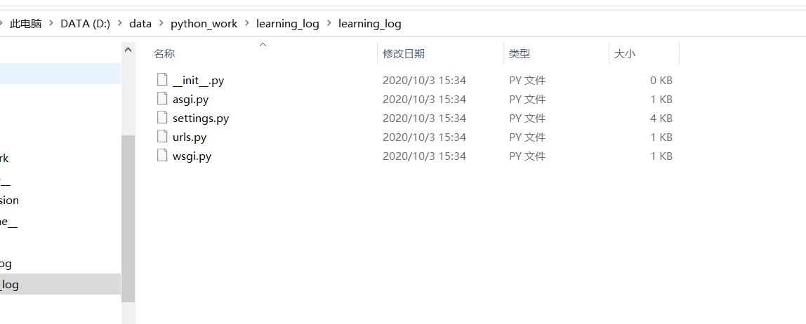

[toc]

# Question:django-admin.py startproject learning_log . not response

**document support**

ysys

**date**

2020-10-03

**label**

question,python,diango-admin.py,windows,pip


## Question

​	今天在学习一个知识点时执行命令

```
(ll_env) D:\data\python_work\learning_log>django-admin.py startproject learning_log .
```

​	在目录下没有出现任何东西，就觉得这个命令可能执行有问题,后来尝试了一下

```
(ll_env) D:\data\python_work\learning_log>django-admin startproject learning_log .
```

​	在目录下就出现了project,但是为什么



## Operation

```
原因在于：
网上的一些解决方法对应于django的安装方法在setup.py 安装，而我用的是pip安装。
So it is unexpected，and finally it is successed。
```

```
(ll_env) D:\data\python_work\learning_log>django-admin startproject learning_log .
```

​	这个原因还是不太懂

## Link

https://blog.csdn.net/XinAn_ZXY/article/details/78642639