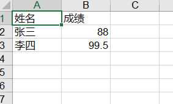

[toc]

# Python:Excel 写入

**document support**

ysys

**date**

2020-10-01

**label**

python,excel,write

**level**

simple


## Knowledge

```
pip install  xlrd xlwt xlutils
```

```
import xlwt

wb = xlwt.Workbook()

sh1 = wb.add_sheet('成绩')
sh2 = wb.add_sheet('汇总')

sh1.write(0,0,'姓名')
sh1.write(0,1,'成绩')
sh1.write(1,0,'张三')
sh1.write(1,1,88)
sh1.write(2,0,'李四')
sh1.write(2,1,99.5)

sh2.write(0,0,'总分')
sh2.write(1,0,187.5)

wb.save('test_w.xls')

```





## Link

http://www.ityouknow.com/python/2019/12/29/python-excel-103.html