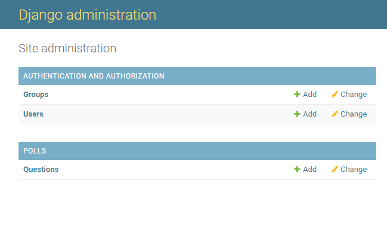
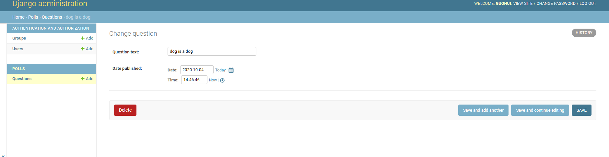
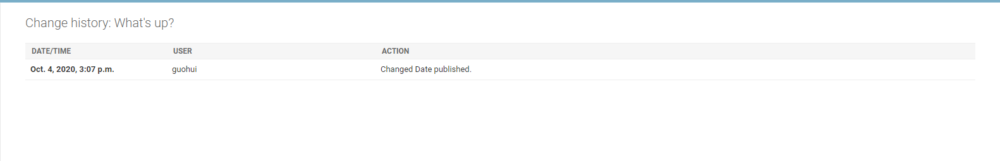

[toc]

# 官网文档:编写你的第一个Django应用,第2部分

**document support**

ysys

**date**

2020-10-04

**label**

python,django,官网文档,编写你的第一个Django应用

**level**

simple


## Background

## Summary

## Question

## Operation

​	这一部分教程,我们将建立数据库，创建第一个模型，并关注Django提供的自动生成的管理页面

###  数据库配置

​	现在打开`mysite/settings.py`，这个包含了Diango项目设置的Python模块。

​	通常，这个配置文件使用SQLite作为默认数据库。

​	想使用其他的数据库，你需要安装database bindings,然后改变配置文件中DATABASE 'default'项目中的一些键值:

- ENGINE 

```
'django.db.backends.sqlite3'，'django.db.backends.postgresql'，'django.db.backends.mysql','django.db.backends.oracle'
```

- Name

```
The name of your database. If you're using SQLite, the database will be a file on your computer; in that case, NAME should be the full absolute path, including filename, of that file. The default value, BASE_DIR / 'db.sqlite3', will store the file in your project directory.
```

​	如果不使用SQLite,则必须添加额外设置,比如USER,PASSWORD,HOST等等

​	下面是我的配置

```
DATABASES = {
    'default': {
        'ENGINE': 'django.db.backends.postgresql',
        'NAME': 'ysystest',
        'USER': 'ysys',
        'PASSWORD': 'ysys',
        'HOST': '192.168.1.103',
        'PORT': '5432',
    }
}
```

​	编辑`mysite/settings.py`文件前，先设置`TIME_ZONE`自己时区

```
TIME_ZONE = 'Asia/Shanghai'
```

​	此外，关注一下文件头部的`INSTALLED_APPS`设置项.

​	通常，`INSTALLED_APPS`默认包括了一下Django的自带应用:

- django.contrib.admin -管理员站点

- django.contrib.auth-认证授权系统

- django.contrib.contenttypes-内容类型框架

- django.contrib.sessions-会话框架

- django.contrib.messages-消息框架

- django.contrib.staticfiles-管理静态文件的框架

  默认开启的某些应用需要至少一个数据表,所以在使用它们之前需要在数据库中创建一些表

  ```
  D:\data\python_work\ysystest\mysite>python manage.py migrate
  Operations to perform:
    Apply all migrations: admin, auth, contenttypes, sessions
  Running migrations:
    Applying contenttypes.0001_initial... OK
    Applying auth.0001_initial... OK
    Applying admin.0001_initial... OK
    Applying admin.0002_logentry_remove_auto_add... OK
    Applying admin.0003_logentry_add_action_flag_choices... OK
    Applying contenttypes.0002_remove_content_type_name... OK
    Applying auth.0002_alter_permission_name_max_length... OK
    Applying auth.0003_alter_user_email_max_length... OK
    Applying auth.0004_alter_user_username_opts... OK
    Applying auth.0005_alter_user_last_login_null... OK
    Applying auth.0006_require_contenttypes_0002... OK
    Applying auth.0007_alter_validators_add_error_messages... OK
    Applying auth.0008_alter_user_username_max_length... OK
    Applying auth.0009_alter_user_last_name_max_length... OK
    Applying auth.0010_alter_group_name_max_length... OK
    Applying auth.0011_update_proxy_permissions... OK
    Applying auth.0012_alter_user_first_name_max_length... OK
    Applying sessions.0001_initial... OK
  ```

  ​	这个migrate命令检查INSTALLED_APPS设置，为其中的每个应用创建需要的数据表，至于具体创建什么，这取决与你的`mysite/settings.py`设置文件和每个应用的数据库迁移文件。

  ```
  ysystest=# \dt
                    List of relations
   Schema |            Name            | Type  | Owner 
  --------+----------------------------+-------+-------
   public | auth_group                 | table | ysys
   public | auth_group_permissions     | table | ysys
   public | auth_permission            | table | ysys
   public | auth_user                  | table | ysys
   public | auth_user_groups           | table | ysys
   public | auth_user_user_permissions | table | ysys
   public | django_admin_log           | table | ysys
   public | django_content_type        | table | ysys
   public | django_migrations          | table | ysys
   public | django_session             | table | ysys
  (10 rows)
  ```

### 创建模型

​	在Django里写一个数据库启动的Web应用的第一步就是定义模型

​	在这个投票应用中，需要创建两个模型，问题Question和选项Choice。Question模型包括问题描述和发布时间.Choice模型有两个字段，字段描述和当前描述。每个选项授予一个问题。

​	`polls/modes.py`


```
from django.db import models

# Create your models here.

class Question(models.Model):
	question_text=models.CharField(max_length=200)
	pub_date = models.DateTimeField('date published')
	
	
class Choice(models.Model):
	question = models.ForeignKey(Question,on_delete=models.CASCADE)
	choice_text = models.CharField(max_length=200)
	votes = models.IntegerField(default=0)
```

​	每个模型都被表示为django.db.models.Model类的子类，每个模型有很多变量，它们都表示模型里的一个数据库字段

​	每个字段都是Field类的实例,比如，字符字段被表示为CharField，日期字段被表示DateTimeField。这将告诉Django每个字段要处理的数据类型。

​	每个Field类实例变量的名字都是字段名，所以最好使用对机器友好的格式。


### 激活模型

​	上面的一小段可用于创建模型的代码给了Django很多信息

- 为这个应用创建数据库schema(create table)

- 创建可以与Question和Choice对象进行交互的Python数据库API

  但是首先得把polls应用安装到项目中

  为了在工程中包含这个应用，需要在配置类INSTALLED_APPS中添加设置。因为PollsConfig类写在文件polls/apps.py中，所以它的路径是`polls.apps.PollsConfig`.

  `mysite/settings.py`

  ```
  INSTALLED_APPS = [
  	'polls.apps.PollsConfig',
      'django.contrib.admin',
      'django.contrib.auth',
      'django.contrib.contenttypes',
      'django.contrib.sessions',
      'django.contrib.messages',
      'django.contrib.staticfiles',
  ]
  ```

  现在Django项目中会包含polls应用。接着运行下面命令

  ```
  D:\data\python_work\ysystest\mysite>python manage.py makemigrations polls
  Migrations for 'polls':
    polls\migrations\0001_initial.py
      - Create model Question
      - Create model Choice
  ```

  ​	通过运行makemigrations命令，Django会将册你对模型文件的修改，并且把修改的部分储存微一次迁移

  ​	迁移是Django对于模型定义的变化的存储形式，它们其实只是一些你磁盘上的文件。

  ​	Django有一个自动执行数据库迁移并同步管理你的数据库结构命令，这个命令就是`migrate`，不过首先，让我们来看看迁移命令会执行那些sql语句。

  ​	sqlmigrate命令接受一个迁移的名称，然后返回对应的SQL

  ```
  D:\data\python_work\ysystest\mysite>python manage.py sqlmigrate polls 0001
  BEGIN;
  --
  -- Create model Question
  --
  CREATE TABLE "polls_question" ("id" serial NOT NULL PRIMARY KEY, "question_text" varchar(200) NOT NULL, "pub_date" timestamp with time zone NOT NULL);
  --
  -- Create model Choice
  --
  CREATE TABLE "polls_choice" ("id" serial NOT NULL PRIMARY KEY, "choice_text" varchar(200) NOT NULL, "votes" integer NOT NULL, "question_id" integer NOT NULL);
  ALTER TABLE "polls_choice" ADD CONSTRAINT "polls_choice_question_id_c5b4b260_fk_polls_question_id" FOREIGN KEY ("question_id") REFERENCES "polls_question" ("id") DEFERRABLE INITIALLY DEFERRED;
  CREATE INDEX "polls_choice_question_id_c5b4b260" ON "polls_choice" ("question_id");
  COMMIT;
  ```

   

  现在再次运行migrate命令，在数据库里面创建新定义的模型的数据库表


```
D:\data\python_work\ysystest\mysite>python manage.py migrate
Operations to perform:
  Apply all migrations: admin, auth, contenttypes, polls, sessions
Running migrations:
  Applying polls.0001_initial... OK
```


​	这个migrate命令选中所有还没有执行过的迁移并应用在数据库上也就是将对模型的更改同步到数据库结构上。

​	迁移是非常强大的功能，它能让你在开发过程中持续的该表数据库结构而不需要重新删除和创建表，它关注于使数据库平滑升级而不会丢失数据。

​	现在只需要记住改变模型需要这三步：

- 编辑models.py文件,改变模型
- 运行python manage.py makemigrations 为模型的改变生成迁移文件
- 运行python managr.py migrate来应用数据库迁移

### 初始API

​	现在进入交互式Python命令行，尝试一下Django创建的各种API

```
python manage.py shell
Python 3.7.7 (tags/v3.7.7:d7c567b08f, Mar 10 2020, 10:41:24) [MSC v.1900 64 bit (AMD64)] on win32
Type "help", "copyright", "credits" or "license" for more information.
(InteractiveConsole)
>>> from polls.models import Choice,Question
>>> Question.objects.all()
<QuerySet []>
>>> from django.utils import timezone
>>> q = Question(question_text = "What's new?",pub_date=timezone.now())
>>> q.save()
>>> q.id
2
>>> q.question_text = "What's up?"
>>> q.save()
>>> Question.objects.all()
<QuerySet [<Question: Question object (2)>]>
```

​	<QuerySet [<Question: Question object (2)>]>对于我们了解这个对象的细节没什么帮助。

​	通过编辑Question模型的代码(polls/models.py)来修复这个问题

```
from django.db import models

# Create your models here.

class Question(models.Model):
	question_text=models.CharField(max_length=200)
	pub_date = models.DateTimeField('date published')
	
	
	def __str__(self):
		return self.question_text
		
class Choice(models.Model):
	question = models.ForeignKey(Question,on_delete=models.CASCADE)
	choice_text = models.CharField(max_length=200)
	votes = models.IntegerField(default=0)
	
	
	def __str__(self):
		return self.choice_text
```

​	给模型增加`__str__()`方法很重要的，这不仅仅能够给你命令行上使用带来方便，Django自动生成admin也是用这种方法来表示对象

```
import datetime

from django.db import models
from django.utils import timezone
# Create your models here.

class Question(models.Model):
	question_text=models.CharField(max_length=200)
	pub_date = models.DateTimeField('date published')
	
	
	def __str__(self):
		return self.question_text
	
	def was_published_recently(self):
		return self.pub_date >=timezone.now() - datetime.timedelta(days=1)
	
class Choice(models.Model):
	question = models.ForeignKey(Question,on_delete=models.CASCADE)
	choice_text = models.CharField(max_length=200)
	votes = models.IntegerField(default=0)
	
	
	def __str__(self):
		return self.choice_text

```

​	新加入的`import datetime`和`import django.utils import timzeone`分别导入饿了Pyhon的标准datetime模块和Django中和时区有关的`django.utils.timezone`工具模块。

​	保存文件通过`python manage.py shell`命令再次打开Python交互式命令行

```
D:\data\python_work\ysystest\mysite>python manage.py shell
Python 3.7.7 (tags/v3.7.7:d7c567b08f, Mar 10 2020, 10:41:24) [MSC v.1900 64 bit (AMD64)] on win32
Type "help", "copyright", "credits" or "license" for more information.
(InteractiveConsole)
>>> from polls.models import Choice,Question
>>> Question.object.all()
Traceback (most recent call last):
  File "<console>", line 1, in <module>
AttributeError: type object 'Question' has no attribute 'object'
>>> Question.objects.all()
<QuerySet [<Question: What's up?>]>
>>> Question.objects.filter(id=2)
<QuerySet [<Question: What's up?>]>
>>> Question.objects.filter(question_text__startswith='What')
<QuerySet [<Question: What's up?>]>
>>> from django.utils import timezone
>>> current_year = timezone.now().year
>>> Question.objects.get(pub_date__year=current_year)
<Question: What's up?>
>>> Question.objects.all(id=1)
Traceback (most recent call last):
  File "<console>", line 1, in <module>
TypeError: all() got an unexpected keyword argument 'id'
>>> Question.object.get(pk=2)
Traceback (most recent call last):
  File "<console>", line 1, in <module>
AttributeError: type object 'Question' has no attribute 'object'
>>> Question.objects.get(pk=2)
<Question: What's up?>
>>> q = Question.objects.get(pk=1)
Traceback (most recent call last):
  File "<console>", line 1, in <module>
  File "D:\opt\python\Python37\lib\site-packages\django\db\models\manager.py", line 85, in manager_method
    return getattr(self.get_queryset(), name)(*args, **kwargs)
  File "D:\opt\python\Python37\lib\site-packages\django\db\models\query.py", line 431, in get
    self.model._meta.object_name
polls.models.Question.DoesNotExist: Question matching query does not exist.
>>> q = Question.objects.get(pk=2)
>>> q.was_published_recently()
True

polls.models.Question.DoesNotExist: Question matching query does not exist.
>>> q = Question.objects.get(pk=2)
>>> q.choice_set.all()
<QuerySet []>
>>> q.choice_set.create(choice_text='Not much',votes=0)
<Choice: Not much>
>>> q.choice_set.create(choice_text='The sky',votes=0)
<Choice: The sky>
>>> c = q.choice_set.create(choice_text ='Jush hacking again',votes=0)
>>> c.question
<Question: What's up?>
>>> q.choice_set.all()
<QuerySet [<Choice: Jush hacking again>, <Choice: The sky>, <Choice: Not much>]>
>>> q.choice_set.count()
3
>>> Choice.objects.filter(question__pub_date__year=current_year)
<QuerySet [<Choice: Jush hacking again>, <Choice: The sky>, <Choice: Not much>]>
.filter(choice_text__startswith='Just hacking')
>>> c = q.choice_set.filter(choice_text__startswith='Just hacking')
>>> c.delete()
(0, {})
>>>

```

​	一堆操作不会了


### 创建一个管理员账号

​	创建一个管理员用户，需要执行下面命令

```
D:\data\python_work\ysystest\mysite>python manage.py createsuperuser
Username (leave blank to use 'guohui'): guohui
Email address: 123@123.com
Password:
Password (again):
This password is too short. It must contain at least 8 characters.
This password is too common.
This password is entirely numeric.
Bypass password validation and create user anyway? [y/N]: y
Superuser created successfully.
```


### 启动开发服务器

```
D:\data\python_work\ysystest\mysite>python manage.py runserver
```

登录http://127.0.0.1:8000/admin/

用户密码后进入到界面

### 进入管理站点界面


### 向管理界面中加入投票应用

​	`polls/admin.py`

```
from django.contrib import admin
from .models import Question

# Register your models here.

admin.site.register(Question)

```






注意事项：

- 这个表单是从问题 `Question` 模型中自动生成的
- 不同的字段类型会生成对应的 HTML 输入控件。每个类型的字段都知道它们该如何在管理页面里显示自己。
- 每个日期时间字段 `DateTimeField` 都有 JavaScript 写的快捷按钮。日期有转到今天（Today）的快捷按钮和一个弹出式日历界面。时间有设为现在（Now）的快捷按钮和一个列出常用时间的方便的弹出式列表。

页面的底部提供了几个选项：

- 保存（Save） - 保存改变，然后返回对象列表。
- 保存并继续编辑（Save and continue editing） - 保存改变，然后重新载入当前对象的修改界面。
- 保存并新增（Save and add another） - 保存改变，然后添加一个新的空对象并载入修改界面。
- 删除（Delete） - 显示一个确认删除页面。

通过点击 “今天(Today)” 和 “现在(Now)” 按钮改变 “发布日期(Date Published)”。然后点击 “保存并继续编辑(Save and add another)”按钮。然后点击右上角的 “历史(History)”按钮。你会看到一个列出了所有通过 Django 管理页面对当前对象进行的改变的页面，其中列出了时间戳和进行修改操作的用户名：




## Link

https://docs.djangoproject.com/zh-hans/3.1/intro/tutorial02/