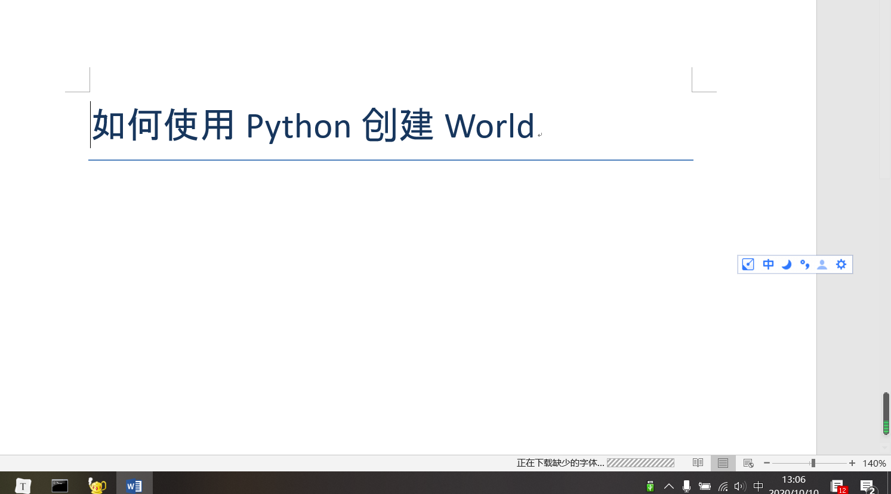
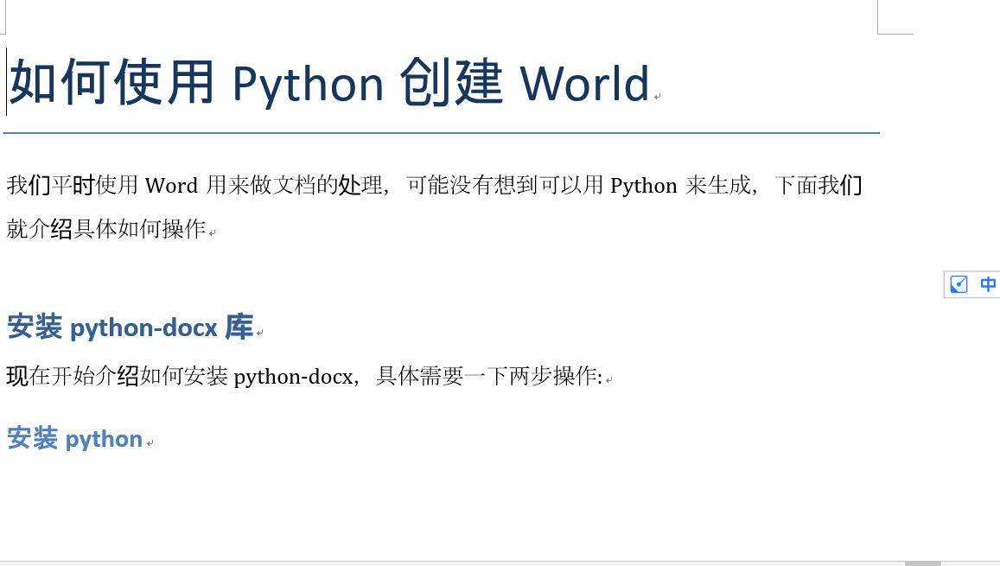
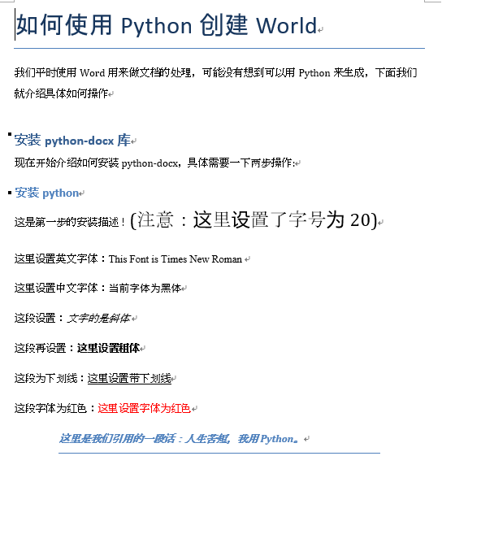
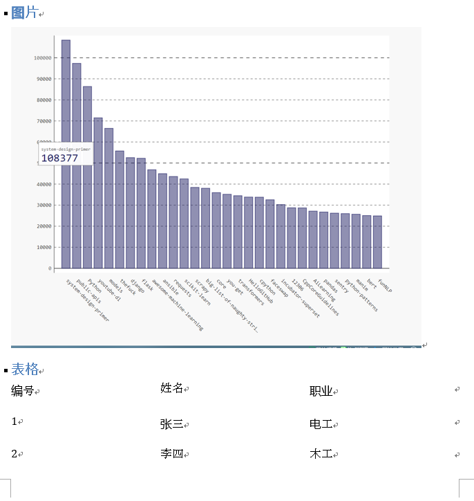

[toc]

# Python:Word 写入

**document support**

ysys

**date**

2020-10-10

**label**

python,word,docx,write


## Background


## Summary


## Question


## Operation


### 安装依赖包

```
pip install python-docx
pip install python-docx -i http://mirrors.aliyun.com/pypi/simple/ --trusted-host mirrors.aliyun.com
Looking in indexes: http://mirrors.aliyun.com/pypi/simple/
```


### 写入Word

```python
#coding=utf-8

# 导入库
from docx import Document
from docx.shared import Pt
from docx.shared import Inches
from docx.oxml.ns import qn

# 新建空白文档
doc1 = Document()

# 新增文档标题
doc1.add_heading('如何使用Python创建World',0)
doc1.save('word1.docx')

```




### 章节与段落


```python
#coding=utf-8

# 导入库
from docx import Document
from docx.shared import Pt
from docx.shared import Inches
from docx.oxml.ns import qn


# 新建空白文档
doc1 = Document()

# 新增文档标题
doc1.add_heading('如何使用Python创建World',0)
# 创建段落描述
doc1.add_paragraph('我们平时使用Word用来做文档的处理，可能没有想到可以用Python来生成，下面我们就介绍具体如何操作')

# 创建一级标题
doc1.add_heading('安装python-docx库',1)

# 创建段落描述
doc1.add_paragraph('现在开始介绍如何安装python-docx，具体需要一下两步操作:')

# 创建二级标题
doc1.add_heading('安装python',2)


doc1.save('word1.docx')

```





### 字体和引用

```
#coding=utf-8

# 导入库
from docx import Document
from docx.shared import Pt
from docx.shared import Inches
from docx.oxml.ns import qn
from docx.shared import RGBColor

# 新建空白文档
doc1 = Document()

# 新增文档标题
doc1.add_heading('如何使用Python创建World',0)
# 创建段落描述
doc1.add_paragraph('我们平时使用Word用来做文档的处理，可能没有想到可以用Python来生成，下面我们就介绍具体如何操作')

# 创建一级标题
doc1.add_heading('安装python-docx库',1)

# 创建段落描述
doc1.add_paragraph('现在开始介绍如何安装python-docx，具体需要一下两步操作:')

# 创建二级标题
doc1.add_heading('安装python',2)


# 创建段落，添加文档内容
paragraph = doc1.add_paragraph('这是第一步的安装描述！')

# 段落中增加文字，并设置字体字号
run = paragraph.add_run('(注意：这里设置了字号为20)')
run.font.size = Pt(20)

# 设置英文字体
run = doc1.add_paragraph('这里设置英文字体：').add_run('This Font is Times New Roman ')
run.font.name = 'Times New Roman'

# 设置中文字体
run = doc1.add_paragraph('这里设置中文字体：').add_run('当前字体为黑体')
run.font.name='黑体'
r = run._element
r.rPr.rFonts.set(qn('w:eastAsia'), '黑体')

# 设置斜体
run = doc1.add_paragraph('这段设置：').add_run('文字的是斜体 ')
run.italic = True

# 设置粗体
run = doc1.add_paragraph('这段再设置：').add_run('这里设置粗体').bold = True

# 设置字体带下划线
run = doc1.add_paragraph('这段为下划线：').add_run('这里设置带下划线').underline = True

# 设置字体颜色
run = doc1.add_paragraph('这段字体为红色：').add_run('这里设置字体为红色')
run.font.color.rgb = RGBColor(0xFF, 0x00, 0x00)

# 增加引用
doc1.add_paragraph('这里是我们引用的一段话：人生苦短，我用Python。', style='Intense Quote')

doc1.save('word1.docx')
```




### 项目列表

```
#coding=utf-8

# 导入库
from docx import Document
from docx.shared import Pt
from docx.shared import Inches
from docx.oxml.ns import qn
from docx.shared import RGBColor

# 新建文档

doc2 = Document()
doc2.add_paragraph('那个不是水果:')

# 增加无需列表
doc2.add_paragraph(
	'苹果',style='List Bullet'
)
doc2.add_paragraph(
	'梨子',style='List Bullet'
)
doc2.add_paragraph(
	'栗子',style='List Bullet'
)

doc2.add_paragraph('2020年度计划:')
# 增加有序列表
doc2.add_paragraph(
	'每周健身一次',style='List Number'
)
doc2.add_paragraph(
	'学习50本书',style='List Number'
)
doc2.add_paragraph(
	'减少加班时间',style='List Number'
)

doc2.save('word2.docx')

```


### 图片和表格

​	

```
#coding=utf-8

# 导入库
from docx import Document
from docx.shared import Pt
from docx.shared import Inches
from docx.oxml.ns import qn
from docx.shared import RGBColor

# 新建文档

doc2 = Document()
doc2.add_paragraph('那个不是水果:')

# 增加无需列表
doc2.add_paragraph(
	'苹果',style='List Bullet'
)
doc2.add_paragraph(
	'梨子',style='List Bullet'
)
doc2.add_paragraph(
	'栗子',style='List Bullet'
)

doc2.add_paragraph('2020年度计划:')
# 增加有序列表
doc2.add_paragraph(
	'每周健身一次',style='List Number'
)
doc2.add_paragraph(
	'学习50本书',style='List Number'
)
doc2.add_paragraph(
	'减少加班时间',style='List Number'
)


doc2.add_heading('图片',2)

# 增加图像

doc2.add_picture('2020-10-03_104745.png',width=Inches(5.5))

doc2.add_heading('表格',2)

#增加表格

table = doc2.add_table(rows=1,cols=3)
hdr_cells = table.rows[0].cells
hdr_cells[0].text='编号'
hdr_cells[1].text='姓名'
hdr_cells[2].text='职业'

# 这是表格数据
records =(
	(1,'张三','电工'),
	(2,'李四','木工'),
	(3,'王五','建筑师')
)

# 遍历数据并展现
for id,name,work in records:
	row_cells = table.add_row().cells
	row_cells[0].text=str(id)
	row_cells[1].text=name
	row_cells[2].text=work
	
# 手动增加分页	
doc2.add_page_break()

doc2.save('word2.docx')
```





## Link

http://www.ityouknow.com/python/2019/12/31/python-word-105.html