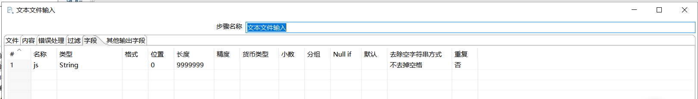

[TOC]

# Postgresql:解析json文件

**document support**

ysys

**date**

2020-02-08

**label**

kettle,postgres,json file


## background

​	昨天领导吩咐了一件事情，就是将300多个json文件入库，拿过来第一个文件，使用kettle就可以入库，随着文件的变多，数据文件本身出现了一些问题，如json中有100条数据，其中一条数据没有某个字段，导致kettle直接解析报错。

```
The data structure is not the same inside the resource! We found 99 values for json path [$..contactMan], which is different that the number returned for path [$..address] (100 values). We MUST have the same number of values for all paths.
```

​	最开始以为是某个字段中有特殊符号导致的,后面发现不是，再次研究报错，将这个文件打开,好好数了一下它的字段，确实其他的字段个数出现了100次，这个字段contactMan只有99个

​	后来想到postgresql数据库直接json弱结构,想着是否可以把某个文件内容放入到字段中，进行json转换，测试发现通过了，当然也有一些小的问题，后面会列举出来。


## solution

​	使用kettle的文本解析控件将文件导入到postgresql的数据库中



```


## 原始数据结构

{"pageNum":1,"pageSize":100,"start":1,"end":100,"pageCount":372,"total":37112,"rows":[{"certNo":"162401340166","instName":"贵州路桥集团工程试验检测有限公司","isCountryCenter":"0","professionField":"建筑工程","certEDate":"2022-01-06","address":"贵阳市云岩区中华中路117号龙港国际中心东单元16层1号","contactMan":"陈兰昌","contactTel":"18984888418","awardDate":"1899-12-31","approvUnitCode":"40288ccd433dc89101433de1d2050017","approvUnitName":"贵州省市场监督管理局","certStatusCode":"01","certStatusName":"有效"},{"certNo":"151008130049","instName":"南京佳业检测工程有限公司","isCountryCenter":"0","professionField":"机械","certEDate":"2021-08-11","address":"南京市化学工业园区云高路6号","contactMan":"施鹏飞","contactTel":"83691330","awardDate":"2015-07-19","approvUnitCode":"40288ccd433dc89101433dd29c5b000a","approvUnitName":"江苏省市场监督管理局","certStatusCode":"01","certStatusName":"有效"}],"obj":{"status":1,"msg":"查询成功"}}
filename | queryAuthDirectoryList1.json
```

当数据放入到数据库中，进行如下的转换就可以

```
select 
js::jsonb->'rows'->0->'certNo' as certNo,
js::jsonb->'rows'->0->'instName' as instName,
js::jsonb->'rows'->0->'isCountryCenter' as isCountryCenter,
js::jsonb->'rows'->0->'professionField' as professionField,
js::jsonb->'rows'->0->'certEDate'  as certEDate,
js::jsonb->'rows'->0->'address' as address,
js::jsonb->'rows'->0->'contactMan' as contactMan,
js::jsonb->'rows'->0->'contactTel' as contactTel,
js::jsonb->'rows'->0->'awardDate' as awardDate,
js::jsonb->'rows'->0->'approvUnitCode' as approvUnitCode,
js::jsonb->'rows'->0->'approvUnitName' as approvUnitName,
js::jsonb->'rows'->0->'certStatusCode' as certStatusCode,
js::jsonb->'rows'->0->'certStatusName' as certStatusName
,filename as filename    from  test_5
```

​	rows定义到rows节点，0定位到多少行，字段名就能找到对应的字段值

​	到了这里后就是要把0,1,..99,重复使用,这个比较费时间，按照这个完成后，数据存入到具体表中


## question

​	1、小批量可以，如果1个文件不给出具体有多少行，这个脚本很难做到

​	2、数据中间过程中会有`""`引号，需要对每个字段进行replace

​	3、当字段为空时，它会变为空，假如说最后一个文件只有10行，但是整个sql语句中会变为100行，这样需要检查一下非空字段变为空的情况，将其删除

​	4、数据不规范导致kettle解析入库问题，后期做数据时要注意规范。


