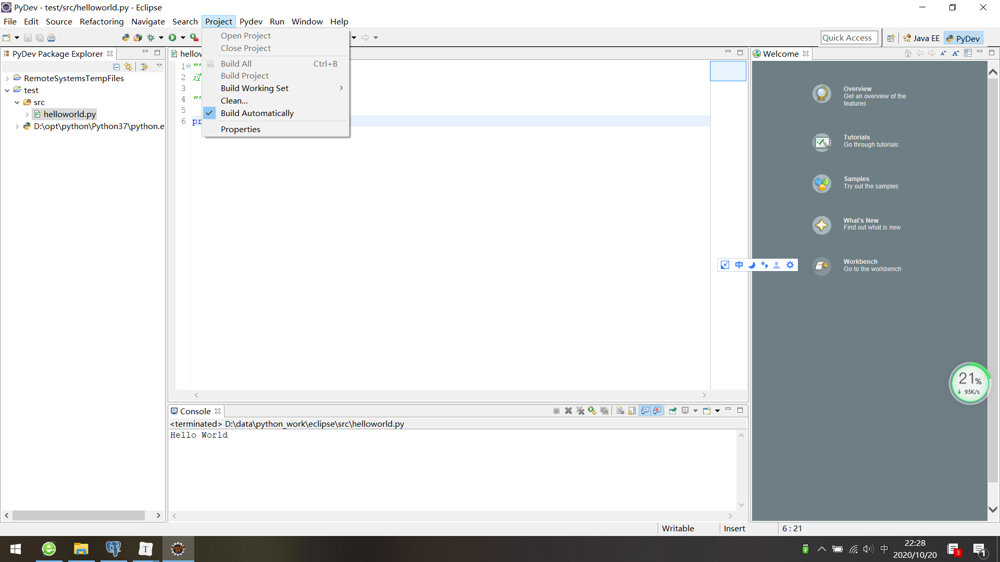
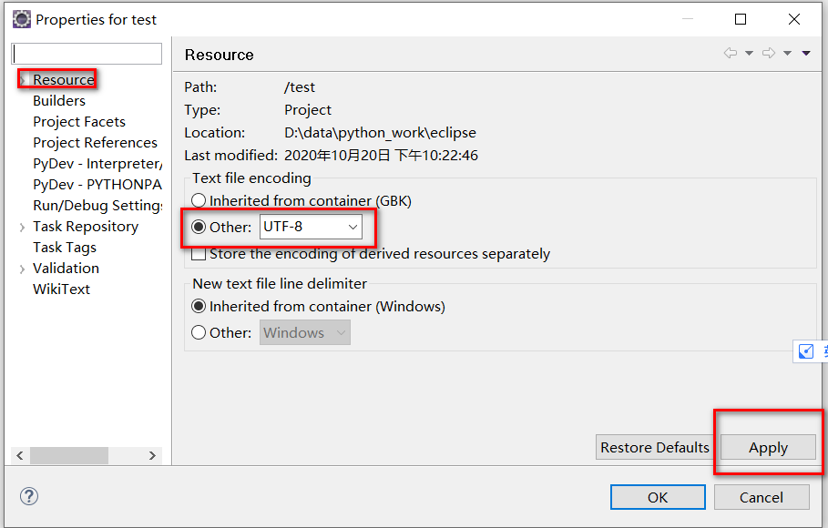

[toc]

# Question:SyntaxError: Non-UTF-8 code starting with '\xc4' in file

**document support**

ysys

**date**

2020-10-20

**label**

eclipse,python


## Question

​	在eclipse写的python脚本遇到报错

```
SyntaxError: Non-UTF-8 code starting with '\xc4' in file D:\data\python_work\eclipse\src\helloworld.py on line 3, but no encoding declared; see http://python.org/dev/peps/pep-0263/ for details
```


## Solution

在菜单栏中找到`Project`的`Properties`下



之后是`Resource`的`Other:UTF-8`



​	可能文件还要重新粘贴使用才可以

## Link

https://blog.csdn.net/weixin_42645880/article/details/81411874