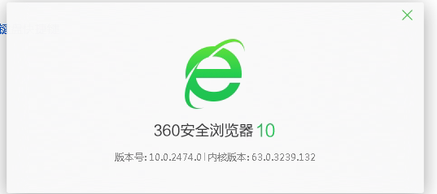
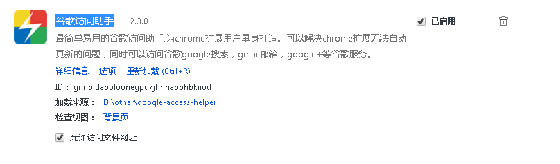
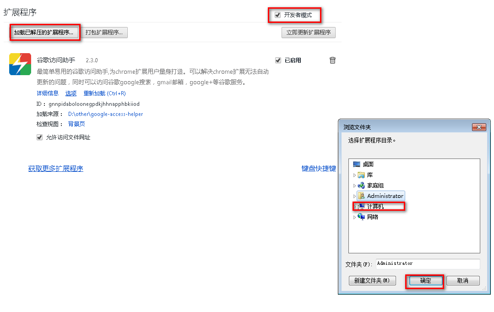
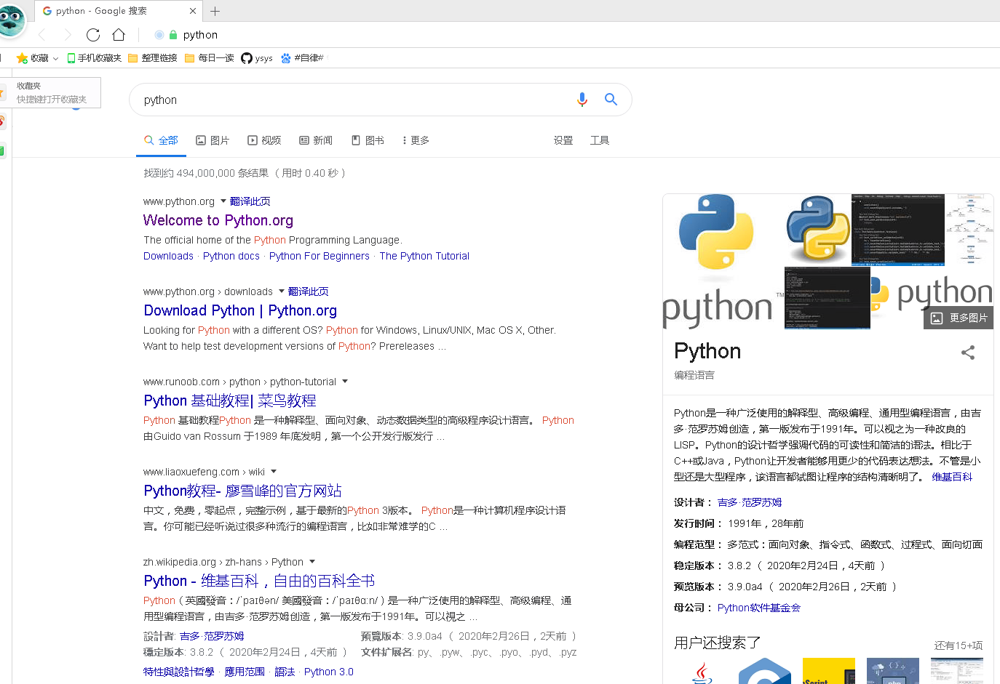

[TOC]

# 360 browser plug-in visit google

**document support**

ysys

**date**

2020-3-26

**label**

google

**level**

simple

## background

​	最近一段时间需要访问一些英文网站，但是国内的搜索引擎暂时不给力，给出的信息千差万别，就去网上找了一些文档，发现可以在360安全浏览器开发者模式下通过插件访问google

## solution

### version describe

​	当前360安全浏览器版本是10

​	当前google访问助手版本是2.3

​	分别下载这两个软件

​	google访问助手:https://chrome.zzzmh.cn/info?token=gocklaboggjfkolaknpbhddbaopcepfp

​	360安全浏览器:360官网

### 360 configure

​	先决条件:360安装后,google访问助手下载完成

#### step one:打开扩展管理中的高级管理

#### step two:选择开发者模式并且在按钮览"加载已解压的扩展程序"将文件`google-access-helper`添加进去

#### step three:现在开始访问google

## question

- google访问的速度有些慢
- google访问经常需要输入验证码
- google使用中文检索时,google搜索经常打不开

## link

https://jingyan.baidu.com/article/3c48dd34c0b1c0e10be3581c.html