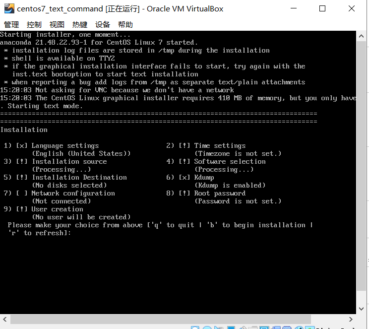
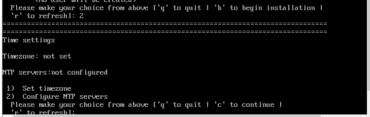
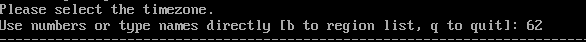
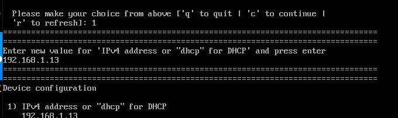
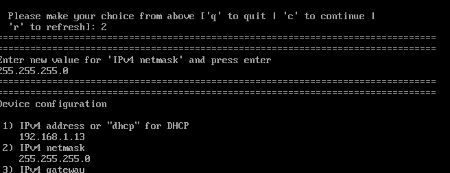
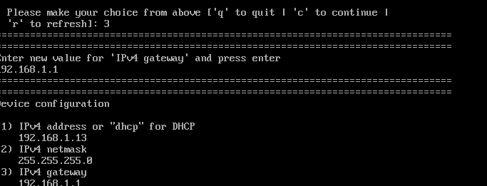

[TOC]

# linux text command install

**document support**

ysys

**date**

2020-3-3

**label**

linux,text command,install,centos 7.3

## background

​	今天上午同事给我转了一个7.3安装的报错，后来才发现对方使用的text command 安装的，现在重新还原一下类似环境

## focus

- 如何调试出来text command 安装窗口

- 如何配置网络

- 如何选择安装包

  

## text command install

**在这里说明一个问题，可能服务器的主板和显卡不匹配导致图形化界面没有出来，而在自己的虚拟机测试中，是将内存调到了400M，才保证图形化界面不出来的**

​	

​	在自己虚拟机上内存设置了400M后，进入了text command安装界面

在下面界面中有提示

`The Centos Linux graphical installed requires 410MB of memory.but you only have 384MB.Starting text mode.`

**这里面可能和redhat 7.x 系列稍微不太一样，不过区别不是很大**

​	首先介绍一下

​	1,2,3,4,5,6,7,8,9

​	1：语言设置，默认不需要调整

​	2：时区设置，需要选择 亚洲 上海时区

​	3：安装源 分别为CD/DVD,网络安装,

​    4:  安装组选择

​	5：存储环境选择

​	6：KDUMP 选择

​    7：网络设置

​	8：root 密码

​	9：创建用户

按照顺序从2..9开始

###	 2开始

​	选择`1)set timezone`>`5)Asia`>`62)上海`

​	

### 3开始

​	本次是 `3`>`1 CD/DVD`

### 4开始

​	本次是`4`->`8)GNOME Desktop`>`c`

### 5开始

​	本次是`5`->`1`->`2) Use ALL Space`>`c`

​	这个是划分磁盘使用的，要注意了自己真实的配置

### 6开始

​	略过

### 7 网络设置

​	默认服务器多网口，设置一个可以，到后期通过换网线来判定自己到底设置了哪一个

​	网络设置一般要求设置 ip,子网掩码，网关，DNS,在这里测试环境没有设置DNS,要注意设置DNS设置

​	本次是`7`->`2`->`1)IPv4 address or "dhcp" for DHCP` IP地址

​	接着设置`2)IPv4 netmask`子网掩码

​	接着设置`3)IPv4 geteway` 网关地址

​	接着设置`6)Nameservers` DNS地址

​	本次测试环境没有DNS,不过就是照着DNS地址写就可了

​	接着设置`7)Connect automatically ater reboot`回车就可以了

​	接着设置`8)Apply configuration in installer`回车就可以了

### 8 设置密码

### 9 创建用户

后面参考命令执行`begin installation`就可以了

默认安装后图形化界面未必出来，需要重新调节内存大小，调到1024M就可以了

## link

https://www.cnblogs.com/diantong/p/11464988.html

