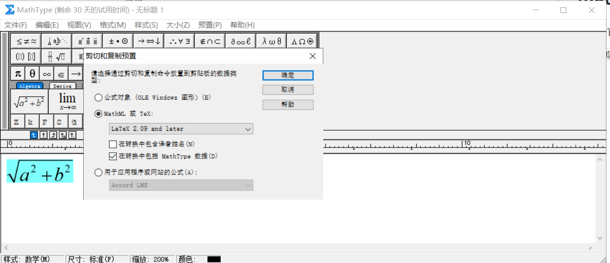

[TOC]

# MathType latex text

**document support**

ysys

**date**

2020-3-30

**label**

mathType,latex,typora


## mathType 

​	去官网下载后,安装后修改配置

`预制>剪切和复制剪切>MathML或Tex:>LaTex 2.09 and later>确定`



​	这样就可以了


​	之后就要努力学习各种写法了

如$$\sqrt {{b^2} - 4ac} $$在里面写好之后将其粘贴到新建的txt文件中

```
\[\sqrt {{b^2} - 4ac} \]
```

去除最前面的`\[`和最后的`\]`,之后粘贴到typora就可以了


## link

https://www.latex-project.org/help/

https://blog.csdn.net/zaishuiyifangxym/article/details/88327257

