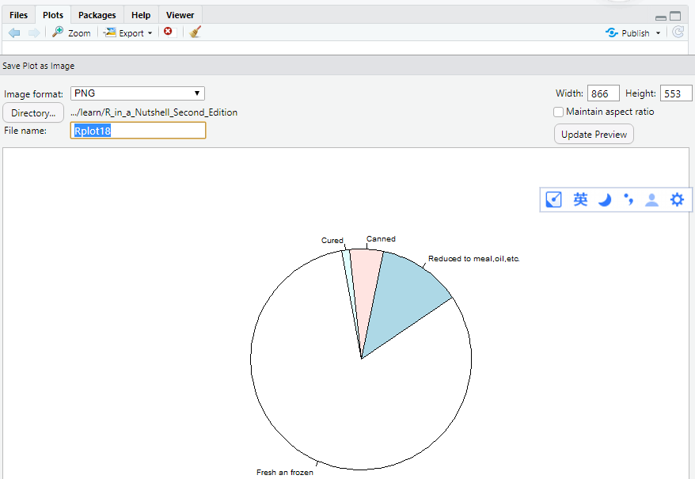

[TOC]

# R language command save png

**document support**

ysys

**date**

2020-3-31

**label**

R,Rstudio,save,png,picture


## question 

​	最近一段时间经常要导出各种图形,有个问题是每次导出图形都要打开按钮点击导出,如图所示



​	点击保存,可是对于自己来说的是不想点击保存，想找到什么命令看看


## solution

```
getwd()
setwd("D:/github/ysys/learn/R_in_a_Nutshell_Second_Edition")
help(image)
png(file="Rplot16.png")
image(yosemite,asp=253/562,ylim=c(1,0),col=sapply((0:32)/32,gray))
dev.off()
```


## link

http://www.sthda.com/english/wiki/creating-and-saving-graphs-r-base-graphs

https://blog.csdn.net/LongBless/article/details/6373291

https://shengxin.ren/article/73