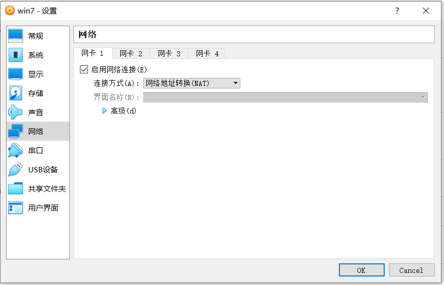
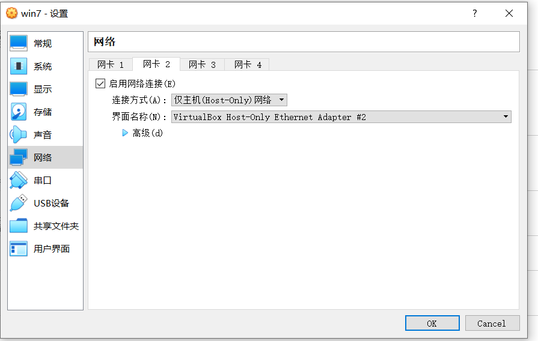
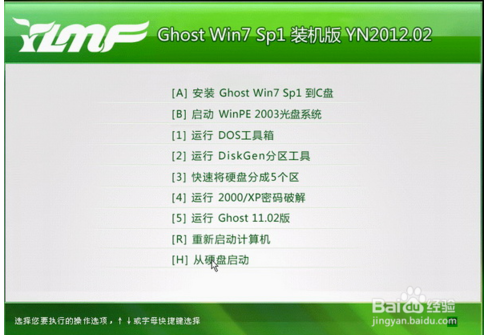
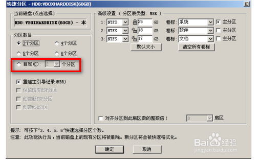

[TOC]

# virtual install win7

**document support**

ysys

**date**

2020-03-15

**label**

virtual,virtualbox,windows,win7,install

## background

​	考虑到好多软件是自己学习的，想着将一些学习软件放在另外一个系统中，这样搞坏了操作系统也没有什么关系的。就想着在虚拟机搭建一套win7操作系统	

## solution

### 1:准备环境

​	virutalbox:6.0

​	iso:YLMF_GHOST_WIN7_X64_AQWD.iso

### 2:注意点

​	不过安装前准备了两个网卡,1个是net网络,1个是host-only模式

#### 网卡

### 3 开始安装

​	找到带有**PE**的选项，选择它

​	之后选择分区工具DiskGenius 分区 快捷键是 f6,进入快速分区

​	之后找到图标是“恢复系统盘到C盘”选择就可以了

## end

​	第一个是网卡配置选择，本次希望既可以是被本地远程连接，还可以是上网，这样选择了两个网卡来实现这个目标；第二个是进入光盘系统划分分区之后安装C盘。

