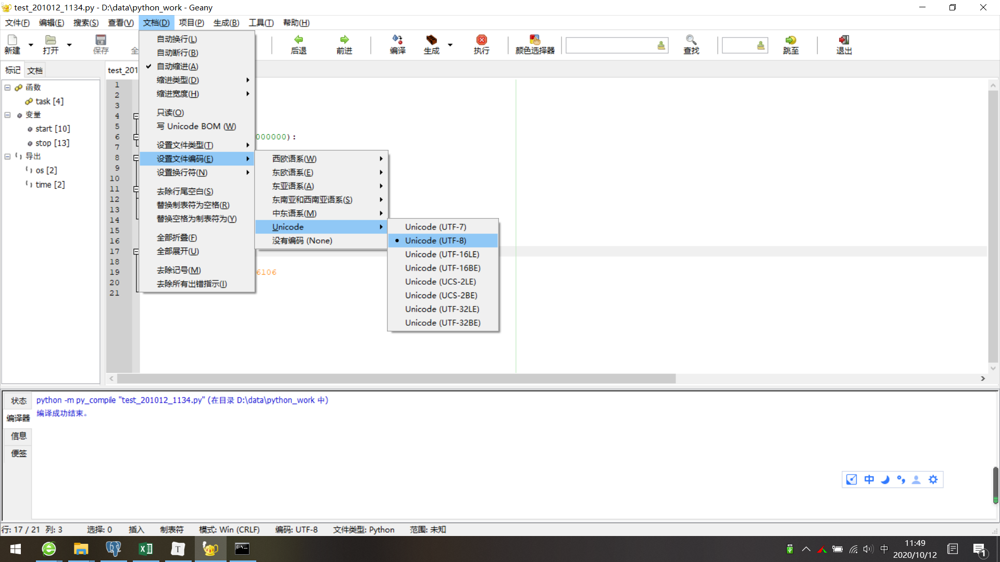

[toc]

# Question:Geany:SyntaxError: (unicode error) 'utf-8' codec can't decode byte 0xb1 in position 0: invalid start byte

**document support**

ysys

**date**

2020-10-12

**label**

python,geany,utf-8


## Background

## Summary

## Question

​	在Geany中编辑py文件，它的字符集都是ANSI,只要有个中文就可能会报错

```
SyntaxError: (unicode error) 'utf-8' codec can't decode byte 0xb1 in position 0: invalid start byte
```

## Operation

	

## Link