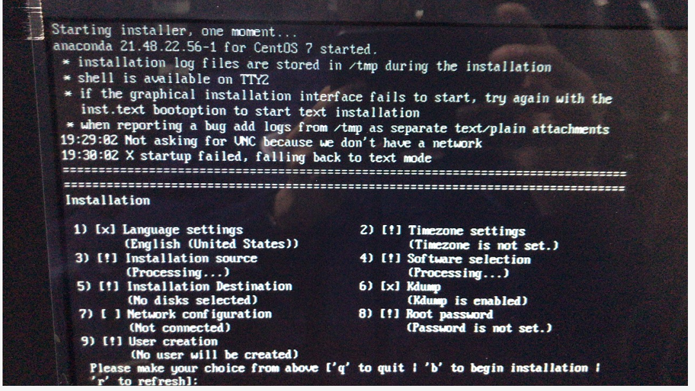

[TOC]

# linux graphics install failed and then text command install why

**document support**

ysys

**date**

2020-3-30

**label**

linux,centos,centos 7.x,install,graphics install,text command,install,why


## background

​	这一段时间，在服务器安装centos时，发现无法出现图形化界面，到底是什么原因导致这个问题的？


## solution


### condition one:memory  < 400 M 

​	为了模拟text command install 安装时， 在自己的虚拟机上设置自己的内存在400M,这样图形化界面就不能出现了

​	在下面界面中有提示

`The Centos Linux graphical installed requires 410MB of memory.but you only have 384MB.Starting text mode.`


### condition two:x startup failed,falling back to text mode

​	下面提示

```
X startup failed,falling back to text mode
```




​	分析了好几种情况，感觉可能linux系统自带的nouvean模块和显卡有兼容性问题导致 


​	处理办法

```
a、服务器从光驱启动，选择安装的界面，按tab键进如grub界面。

b、按e进入grub编辑界面。

c、在kernel所在行最后加上参数nouveau.modeset=0，然后按ctrl+X启动安装。
```

​	


## link

https://www.zhihu.com/question/266369701

https://bugzilla.redhat.com/show_bug.cgi?id=577312

https://access.redhat.com/discussions/687043

https://forums.centos.org/viewtopic.php?t=58815

https://unix.stackexchange.com/questions/367141/boot-centos7-in-graphical-mode

https://www.cnblogs.com/meizy/p/10542015.html

http://blog.sina.com.cn/s/blog_d323dd5b0102z2o3.html