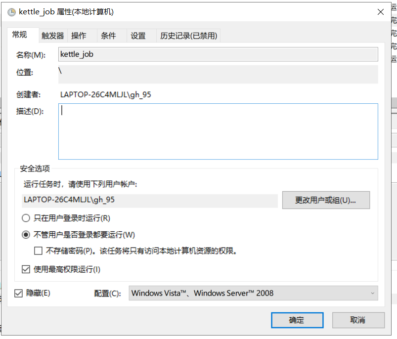
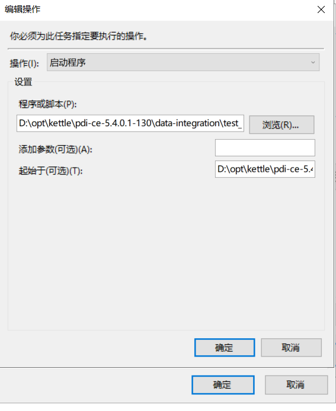

[TOC]

# windows plan invoke bat script not pop

**document support**

ysys

**date**

2020-4-2

**label**

question,windows,plan,invoke bat script,pop

## question

​	现在来说是昨天了,昨天同事问了我一个问题,就是在使用执行计划在调用bat脚本时,会默认弹出一个cmd执行窗口，考虑到windows服务器不是我方服务器，是友商的,影响正常工作不太合适。

## solution

​	之前记得在windows的计划任务中调度bat脚本时，选择隐藏好想就可以了

### try one

​	选择任务中配置"不管用户是否登录都要运行","使用最高权限运行","隐藏"

	

​	设置文件路径时最好填写执行路径,"起始于(可选)":要求到bat脚本的上一级

	

​	尝试之后发现成功.

