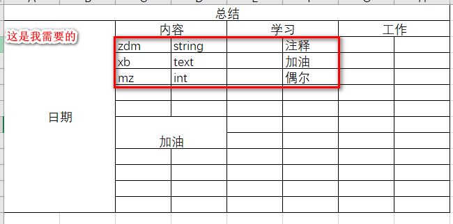

[toc]

# Python Case:Pandas 解析 不规则 Excel

**document support**

ysys

**date**

2020-10-15

**label**

python,pandas,not regular,excel


## Background

​	今天在工作中遇到一类问题，对方提供的是一类不规则的excel数据，而我需要其中一部分数据，常规的解析excel这里可能不太适合。

## Summary

## Question

## Operation

### 示例图片



​	在这里我只需要红框里的数据，前后左右可能还有其他东西


### 示例脚本

```
#coding=utf-8

import pandas as pd
"""
测试脚本解析不规则excel
"""
file_path = 'D:\\data\\python_work\\test_excel.xlsx'
excel_sheet_name = '总结'
df = pd.read_excel(file_path,sheet_name=excel_sheet_name)
print(df)

```

```
     总结  Unnamed: 1 Unnamed: 2 Unnamed: 3 Unnamed: 4 Unnamed: 5 Unnamed: 6  Unnamed: 7
0    日期         NaN         内容        NaN         学习        NaN         工作         NaN
1   NaN         NaN        zdm     string        NaN         注释        NaN         NaN
2   NaN         NaN         xb       text        NaN         加油        NaN         NaN
3   NaN         NaN         mz        int        NaN         偶尔        NaN         NaN
4   NaN         NaN        NaN        NaN        NaN        NaN        NaN         NaN
5   NaN         NaN        NaN        NaN        NaN        NaN        NaN         NaN
6   NaN         NaN         加油        NaN        NaN        NaN        NaN         NaN
7   NaN         NaN        NaN        NaN        NaN        NaN        NaN         NaN
8   NaN         NaN        NaN        NaN        NaN        NaN        NaN         NaN
9   NaN         NaN        NaN        NaN        NaN        NaN        NaN         NaN
10  NaN         NaN        NaN        NaN        NaN        NaN        NaN         NaN
11  NaN         NaN        NaN        NaN        NaN        NaN        NaN         NaN
请按任意键继续. . .
```

​	可以看出，合并单元格的数据都被放置到了该单元的第一位，其他地方都是NaN,要想获取zdm,xb,mz这一列以及后面几列。

```
print(type(df))
print(df.index)
print(df.columns)
print(df.values)
print(df.iloc[1:4,3:6])
```

```
  Unnamed: 3 Unnamed: 4 Unnamed: 5
1     string        NaN         注释
2       text        NaN         加油
3        int        NaN         偶尔
```

​	之后如何迭代出来呢？

```
for index,row in df.iloc[1:4,3:6].iterrows():
	print(row[0],row[1],row[2])
```

```
string nan 注释
text nan 加油
int nan 偶尔
```


### 最后脚本

```
#coding=utf-8

import pandas as pd
"""
测试脚本解析不规则excel
"""
file_path = 'D:\\data\\python_work\\test_excel.xlsx'
excel_sheet_name = '总结'
df = pd.read_excel(file_path,sheet_name=excel_sheet_name)
print(type(df))
print(df.index)
print(df.columns)
print(df.values)
print(df.iloc[1:4,3:6])

for index,row in df.iloc[1:4,3:6].iterrows():
	print(row[0],row[1],row[2])
	

```


## Link

https://blog.csdn.net/sinat_29675423/article/details/87972498

https://pandas.pydata.org/pandas-docs/version/0.24/reference/frame.html