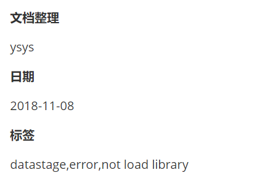

[toc]

# Python Case:修改文件内容(二)

**document support**

ysys

**date**

2020-10-17

**label**

python,copy,move,file,change


## Background

​	其实完全可以链接下方的，只不过为了更好的记录本次情况，就特意写了这篇文档，在整理历史笔记时，发现有一些文档的笔记格式是这样的



​	其实最新笔记格式就是将其转换为英文，现在要将这些文档整理成英文就可以了

## Summary


## Question


## Operation


### python script

```
#coding=utf-8
import os
import psycopg2
from shutil import copyfile
## 一定要备份
## 要备份文件


def get_support(value):
	if '**文档整理**' in value:
		label_location = value.find('**文档整理**')
		return label_location
		
def get_date(value):
	if '**日期**' in value:
		label_location = value.find('**日期**')
		return label_location


def get_label(value):
	if '**标签**' in value:
		label_location = value.find('**标签**')
		return label_location

conn=psycopg2.connect(database="postgres",user="ysys",password="ysys",host="192.168.1.103",port="5432")
cur=conn.cursor() 
cur.execute("select replace(filefull,'\','\\') from test.t_wj_fxjh_txt where filetext like '%**标签**%' and filetext like '%**文档整理**%' and filetext like '%**日期**%'")
filenames = cur.fetchall()
for filename_tuple in filenames:
	filename = str(filename_tuple[0])
	filename_next = filename+'.bak'
	copyfile(filename,filename+'.bak')
	filedata =""
	with open(filename,"r",encoding='utf-8') as f:
		for line in f:
			if get_label(line) is not None:
				old_str = '**标签**'
				new_str = '**label**'
				if old_str in line:
					line = line.replace(old_str,new_str)
			if get_support(line) is not None:
				old_str = '**文档整理**'
				new_str = '**document support**'
				if old_str in line:
					line = line.replace(old_str,new_str)
			if get_date(line) is not None:
				old_str = '**日期**'
				new_str = '**date**'
				if old_str in line:
					line = line.replace(old_str,new_str)
			filedata +=line
				
	with open(filename,"w",encoding="utf-8") as f:
		f.write(filedata)
	
	os.remove(filename_next)
	
conn.commit()
conn.close()

```


## Link

[Python Case:修改文件内容](../202001/20200125_01.md)

