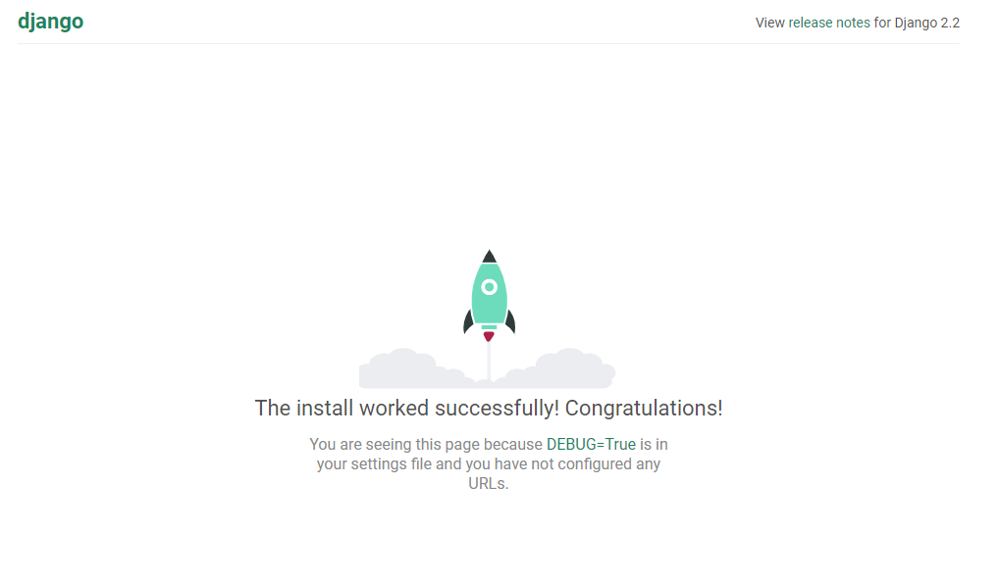
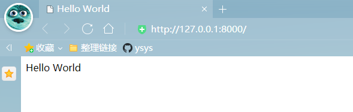

[toc]

# 第1章 Django 建站基础

**document support**

ysys

**date**

2020-10-17,2020-10-25

**label**
python,django,《Django Web 应用开发实战》


## Knowledge

​	学习开发网站必须了解网站的组成部分，网站类型，运行原理和开发流程。

​	使用Django开发网站必须掌握Django的基本操作。

### 1.1 网站的定义及组成

​	网站(Website)是指在因特网上根据一定的规则，使用HTML等工具制作并用于展示特定内容相关页面的集合。

​	目前大多数网站由域名，空间服务器，DNS域名解析，网站程序，数据库组成。

​	域名是由一串用点分隔的字母组成，通俗的讲，域名相当于一个家庭的门牌号码。

​	常见的域名后缀有以下几种

- .COM 商业性的机构或公司
- .NET 从事Internet相关的网站服务的机构或公司
- .ORG 非营利的组织，团体
- .GOV 政府部门
- .CN 中国国内域名

### 1.2 网站的分类

​	BTB

​	BTC

​	CTC

### 1.3 网站运行原理及开发工具

​	略

### 1.4 走进Django

​	Django是一个开放源代码的Web应用框架，由Python写成

​	Django采用了MTV的框架模式，即模型，模版，视图，三者之间各自负责不同的职责

- 模型:数据存取层
- 模版:表现层
- 视图:业务逻辑层


### 1.5 Django 2的新特性

​	略

### 1.6 安装Django

​	当前Python版本是Python 3.7.7

​	当前Django版本是Django-2.2.1

​	目前Django版本最新的3.x

### 1.7 创建项目

​	一个项目可以理解为一个网站，创建Django项目可以在命令提示符窗口输入创建指令完成。

​	打开这个命令提示窗口，将当前的路径切换到D:\data\python_work\并输入项目创建指令:

```
C:\Users\guohui>D:

D:\>cd data\python_work

D:\data\python_work>django-admin startproject MyDjango
```

​	到D:\data\python_work路径下查找是否有这个MyDjango文件夹和其他一些文件

​	项目各个文件说明如下

- manage.py:命令行工具，内置多种方式与项目进行交互，在命令提示窗口下，将路径切换到MyDjango项目并输入python manage.py help,可以查看该工具的指令信息

  ```
  python manage.py help
  
  Type 'manage.py help <subcommand>' for help on a specific subcommand.
  
  Available subcommands:
  
  [auth]
      changepassword
      createsuperuser
  
  [contenttypes]
      remove_stale_contenttypes
  
  [django]
      check
      compilemessages
      createcachetable
      dbshell
      diffsettings
      dumpdata
      flush
      inspectdb
      loaddata
      makemessages
      makemigrations
      migrate
      sendtestemail
      shell
      showmigrations
      sqlflush
      sqlmigrate
      sqlsequencereset
      squashmigrations
      startapp
      startproject
      test
      testserver
  
  [sessions]
      clearsessions
  
  [staticfiles]
      collectstatic
      findstatic
      runserver
  
  ```

- `__init__.py`:初始化文件，一般情况下无需更改

- `settings.py`项目的配置文件，项目的所有功能都需要在该文件中进行配置，配置说明会在下一张详细讲述

- `urls.py`:项目的路由设置，设置网站的具体网址内容

- `wsgi.py`:Python服务器网关接口，是Python应用与Web服务器之间的接口，用于Django项目在服务器上的部署和上线，一般不需要修改

  完成项目的创建后，接着创建项目应用，项目应用简称为APP,相当于网站功能，每个APP代表网站的一个功能。App的创建由文件manage.py实现，创建命令如下

```
python manage.py startapp index
```

​	在新创建出来的index文件夹中，其可作为网站首页。

​	在index文件夹下可以看到由多个.py文件和migrations文件夹，说明如下：

- migrations:用于生成数据迁移文件，通过数据迁移文件可自动在数据库里生成对应的数据表
- `__init__.py`:index文件夹的初始化文件
- `admin.py`:用于设置当前APP的后台管理功能
- `models.py`:定义数据库的映射类，每个类可以关联一张数据表，实现数据持久化
- `apps.py`:当前App的配置信息
- `tests.py`:自动化测试的模块，用于实现单元测试
- `views.py`:视图文件，处理功的业务逻辑

   完成项目和APP之后，可以启动服务了

```
python manage.py runserver 8080
```

```
...
Starting development server at http://127.0.0.1:8080/
Quit the server with CTRL-BREAK.
```

​	使用浏览器查看`http://127.0.0.1:8080/`

  

### 1.8 PyCharm 创建项目

​	略

### 1.9 Django入门基础

#### 1.9.1 Django的操作指令

| 指令                      | 说明                                                         |
| ------------------------- | ------------------------------------------------------------ |
| changepassword            | 修改内置用户表的用户密码                                     |
| createsuperuser           | 为内置用户表创建超级管理员账号                               |
| remove_stale_contenttypes | 删除数据库中已不使用的数据表                                 |
| check                     | 检测整个项目是否存在异常问题                                 |
| compilemessages           | 编译语言文件，用于项目的区域语言设置                         |
| createcachetable          | 创建缓存数据表，为内置的缓存机制提供存储功能                 |
| dbshell                   | 进入Django数据库，可执行数据库的SQL语句                      |
| diffsettings              | 显示当前settings.py的配置信息与默认的差异                    |
| dumpdata                  | 导出数据表的数据并以JSON格式存储，如python manage.py dumpdata index > data.json,这是index的模型所对应的数据导出，并保存在data.json文件中 |
| flush                     | 清空数据表的数据信息                                         |
| inspectdb                 | 获取所有模型的定义过程                                       |
| loaddata                  | 将数据文件导入数据表，如python manage.py loaddatadata.json   |
| makemessage               | 创建语言文件，用于项目的区域语言设置                         |
| makemigrations            | 从模型对象创建数据迁移文件并保存在App的migrations文件夹      |
| migrate                   | 根据迁移文件的内容，在数据表里生成相应的数据表               |
| sendtestemail             | 向指定的收件人发送测试的电子邮件                             |
| shell                     | 进入Django的Shell模式，用于调试项目功能                      |
| showmigrations            | 查看当前项目的所有迁移文件                                   |
| sqlflush                  | 查看清空数据库的SQL语句脚本                                  |
| sqlmigrate                | 根据迁移文件内容输出相应的SQL语句                            |
| sqlsequencereset          | 重置数据表递增字段的索引值                                   |
| squashmigrations          | 对迁移文件进行压缩处理                                       |
| startapp                  | 创建项目应用App                                              |
| startproject              | 创建新的Django项目                                           |
| test                      | 运行App里面的测试程序                                        |
| testserver                | 新建测试数据库并使用该数据库运行项目                         |
| clearsessions             | 清楚会话Session数据                                          |
| collectstatic             | 收集所有静态文件                                             |
| findstatic                | 查找静态文件的路径信息                                       |
| runserver                 | 在本地计算机上启动Django项目                                 |

#### 1.9.2 开启HelloWorld之旅

​	在MyDjango的根目录下创建templates

​	之后再templates文件夹下创建index.html文件

​	然后在配置文件settings.py(MyDjango文件夹下的settings.py)，找到配置属性INSTALLED_APPS和TEMPLATES,分别将项目应用index和模块文件夹templates添加到相对应的配置属性，其配置如下:

```

INSTALLED_APPS = [
    'django.contrib.admin',
    'django.contrib.auth',
    'django.contrib.contenttypes',
    'django.contrib.sessions',
    'django.contrib.messages',
    'django.contrib.staticfiles',
    # 添加项目应用 index
    'index'
]

TEMPLATES = [
    {
        'BACKEND': 'django.template.backends.django.DjangoTemplates',
        # 配置templates
        'DIRS': [os.path.join(BASE_DIR,'templates')],
        'APP_DIRS': True,
        'OPTIONS': {
            'context_processors': [
                'django.template.context_processors.debug',
                'django.template.context_processors.request',
                'django.contrib.auth.context_processors.auth',
                'django.contrib.messages.context_processors.messages',
            ],
        },
    },
]
```

​	最后在项目的urls.py(MyDjango文件夹下的urls.py),views.py(index的views.py)和index.html(tmplates文件夹的index.html)文件里编写相应的代码，即可实现简单的Hello World网页，代码如下

```
# MyDjango的urls.py
from django.contrib import admin
from django.urls import path

# 导入项目应用index
from index import.views import index

urlpatterns = [
    path('admin/', admin.site.urls),
    path('',index)
]

# index的views.py

from django.shortcuts import render

# Create your views here.

def index(request):
    return render(request,'index.html')
    
# templates的index.html

<!DOCTYPE html>
<html lang="en">
<head>
	<meta charset="UTF-8">
	<title>Hello World</title>
</head>
<body>
	<span>Hello World</span>
</body>
</html>
```

​	当用户在浏览器访问网址的时候，该网址在项目所设置的路由(urls.py)里找到相应的路由信息

​	然后从路由信息里找到对应的视图函数(views.py)，由视图函数处理用户请求

​	视图函数将处理结果床底到模板文件(index.html)，由模版文件生成网页内容，并在浏览器里展现。

​	

### 1.10 调试Django项目

​	略

### 1.11 本章小结

