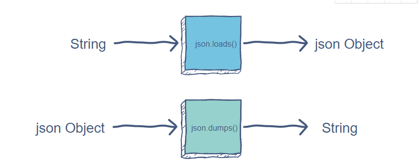
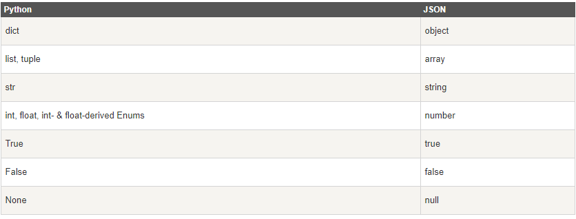
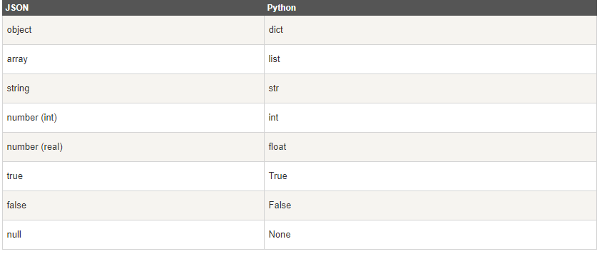

[toc]

# Python:JSON 数据解析

**document support**

ysys

**date**

2020-10-18

**label**

python,python 3,json,菜鸟教程,Python 3 教程


## Background


## Summary


## Question


## Knowledge

​	JSON(JavaScript Object Nation)是一种轻量级的数据交换格式。如果还不了解JSON,可以先阅读JSON教程，Python3中可以使用json模块来对JSON数据进行编解码，它包含了两个函数:

- json.dumps():对数据进行编码
- json.loads():对数据进行解码



​	在json的编解码过程中,Python的原始类型与json类型会相互转换,具体的转化对照如下:

### Python编码JSON类型转换对应表



### JSON解码为Python类型转换对应表



### json.dumps与json.loads实例

```
#coding=utf-8

import json

data = {
    'no' : 1,
    'name' : 'Runoob',
    'url' : 'http://www.runoob.com'
}

json_str = json.dumps(data)

print("Python 原始数据:" , repr(data))
print("JSON 对象:",json_str)

```

```
Python 原始数据: {'no': 1, 'name': 'Runoob', 'url': 'http://www.runoob.com'}
JSON 对象: {"no": 1, "name": "Runoob", "url": "http://www.runoob.com"}
```

```
data2 = json.loads(json_str)
print ("data2['name']: ", data2['name'])
print ("data2['url']: ", data2['url'])
```

```
data2['name']:  Runoob
data2['url']:  http://www.runoob.com
```

​	如果你要处理的是文件而不是字符串，你可以使用 **json.dump()** 和 **json.load()** 来编码和解码**JSON数据**

```
# 写入 JSON 数据
with open('data.json', 'w') as f:
    json.dump(data, f)
 
# 读取数据
with open('data.json', 'r') as f:
    data = json.load(f)
```


## Link

https://www.runoob.com/python3/python3-json.html

https://docs.python.org/3/library/json.html