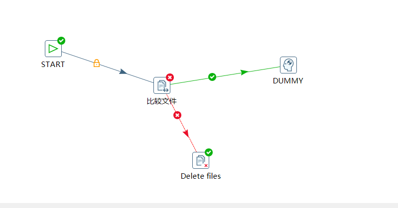
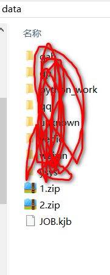
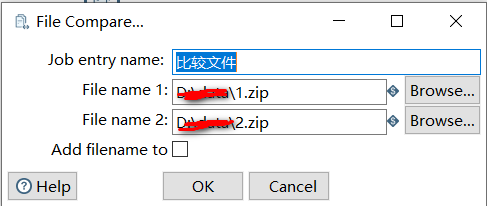
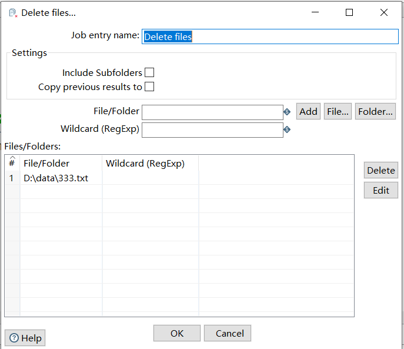

[TOC]

# kettle plug-in file compare

**document support**

ysys

**date**

2020-4-26

**label**

kettle,file compare


## background

​	这两天同事接到一个ftp下载，判断文件是否发生变化的问题。具体是对方不知道什么时候提供数据，提供的文件名可能发生变化，但是文件内容可能保持不便。

​	如果每次都要数据库解析入库的话，数据库压力太大了，不太现实，想着kettle有个插件file compare,中文名比较文件。测试发现效果非常好用。


## test

kettle示例




介绍一下比较文件(file compare)

```
You can use the File compare job entry to compare the contents of 2 files and control the flow of the job by it. When the contents of the files are the same the success outgoing hop will be followed, else the failure hop will be followed.
```

​	大致的意思是当两个文件相同时进入下一步，当两个文件不相同，报错进入到报错的记录中


在某个路径下创建测试文件,如果两个文件系统，什么也不错，如果两个文件不同删除某个文件



file compare configuration




delete files comparation



​	经过测试发现，当两个文件相同时，就会进入到下一步操作，而当文件不相同时，则会报错，进入到报错处理阶段


​	那么问题来了，它是通过比较什么来判断文件是否一致的呢？

​	网上并没有找到这个控件是采用什么方式来判断两个文件是否一致的。

​	


## link

<https://wiki.pentaho.com/display/EAI/File+compare> 

<https://wiki.jikexueyuan.com/project/shell-learning/file-comparing-cmp-diff-patch.html> 