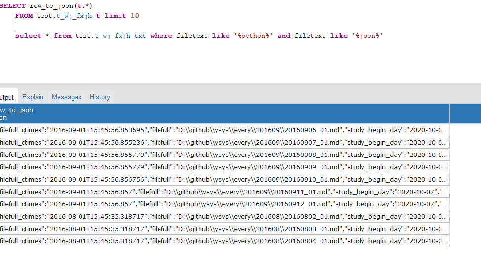

[toc]

# Postgresql Case:将sql数据转换json格式

**document support**

ysys

**date**

2020-10-18

**label**

postgresql,sql,json,row_to_json


## Background

​	之前想着使用python 将sql 结果数据转换为json数据存入作为后期删除数据之前，现将一些表的历史数据存到表中，python可以做到，但是它要将每个表的字段信息进行标注，比较麻烦，现在使用postgresql自带的row_to_json来完成

## Summary

## Question

## Operation


```
SELECT row_to_json(t.*)
	FROM test.t_wj_fxjh t limit 10
```



​	这样只需要传递一些表名差不过就可以将每张表获取出来了

## Link

