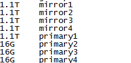

[TOC]

# Greenplum:gprecoverseg 恢复成功案例

**document support**

ysys

**date**

2020-04-30,20200-12-02

**label**

greenplum,4.3,gprecoverseg,failed


## 背景

​	同事今天给我发了一个greenplum数据库数据倾斜的一个情况，让他检查了一下数据库状态。数据库多个节点down，现在整理一下处理的整体流程，以备后面使用。


## 情况说明

​	数据库某个节点服务器数据情况




 	数据库状态

​	gpstate -m

​	gpstate -e

```
[gpadmin@zhmp225 ~]$ gpstate -m
20201202:14:43:38:020242 gpstate:zhmp225:gpadmin-[INFO]:-Starting gpstate with args: -m
20201202:14:43:38:020242 gpstate:zhmp225:gpadmin-[INFO]:-local Greenplum Version: 'postgres (Greenplum Database) 4.3.9.0 build 1'
20201202:14:43:38:020242 gpstate:zhmp225:gpadmin-[INFO]:-master Greenplum Version: 'PostgreSQL 8.2.15 (Greenplum Database 4.3.9.0 build 1) on x86_64-unknown-linux-gnu, compiled by GCC gcc (GCC) 4.4.2 compiled on Aug  8 2016 05:36:26'
20201202:14:43:38:020242 gpstate:zhmp225:gpadmin-[INFO]:-Obtaining Segment details from master...
20201202:14:43:39:020242 gpstate:zhmp225:gpadmin-[INFO]:--------------------------------------------------------------
20201202:14:43:39:020242 gpstate:zhmp225:gpadmin-[INFO]:--Current GPDB mirror list and status
20201202:14:43:39:020242 gpstate:zhmp225:gpadmin-[INFO]:--Type = Group
20201202:14:43:39:020242 gpstate:zhmp225:gpadmin-[INFO]:--------------------------------------------------------------
20201202:14:43:39:020242 gpstate:zhmp225:gpadmin-[INFO]:-   Mirror    Datadir                     Port    Status              Data Status       
20201202:14:43:39:020242 gpstate:zhmp225:gpadmin-[WARNING]:-zhmp227   /opt/data/mirror1/gpseg0    50000   Failed                                <<<<<<<<
20201202:14:43:39:020242 gpstate:zhmp225:gpadmin-[INFO]:-   zhmp227   /opt/data/mirror2/gpseg1    50001   Acting as Primary   Change Tracking
20201202:14:43:39:020242 gpstate:zhmp225:gpadmin-[WARNING]:-zhmp227   /opt/data/mirror3/gpseg2    50002   Failed                                <<<<<<<<
20201202:14:43:39:020242 gpstate:zhmp225:gpadmin-[INFO]:-   zhmp227   /opt/data/mirror4/gpseg3    50003   Acting as Primary   Change Tracking
20201202:14:43:39:020242 gpstate:zhmp225:gpadmin-[INFO]:-   zhmp228   /opt/data/mirror1/gpseg4    50000   Acting as Primary   Change Tracking
20201202:14:43:39:020242 gpstate:zhmp225:gpadmin-[INFO]:-   zhmp228   /opt/data/mirror2/gpseg5    50001   Acting as Primary   Change Tracking
20201202:14:43:39:020242 gpstate:zhmp225:gpadmin-[WARNING]:-zhmp228   /opt/data/mirror3/gpseg6    50002   Failed                                <<<<<<<<
20201202:14:43:39:020242 gpstate:zhmp225:gpadmin-[WARNING]:-zhmp228   /opt/data/mirror4/gpseg7    50003   Failed                                <<<<<<<<
20201202:14:43:39:020242 gpstate:zhmp225:gpadmin-[INFO]:-   zhmp229   /opt/data/mirror1/gpseg8    50000   Acting as Primary   Change Tracking
20201202:14:43:39:020242 gpstate:zhmp225:gpadmin-[INFO]:-   zhmp229   /opt/data/mirror2/gpseg9    50001   Acting as Primary   Change Tracking
20201202:14:43:39:020242 gpstate:zhmp225:gpadmin-[INFO]:-   zhmp229   /opt/data/mirror3/gpseg10   50002   Acting as Primary   Change Tracking
20201202:14:43:39:020242 gpstate:zhmp225:gpadmin-[INFO]:-   zhmp229   /opt/data/mirror4/gpseg11   50003   Acting as Primary   Change Tracking
20201202:14:43:39:020242 gpstate:zhmp225:gpadmin-[WARNING]:-zhmp226   /opt/data/mirror1/gpseg12   50000   Failed                                <<<<<<<<
20201202:14:43:39:020242 gpstate:zhmp225:gpadmin-[INFO]:-   zhmp226   /opt/data/mirror2/gpseg13   50001   Acting as Primary   Change Tracking
20201202:14:43:39:020242 gpstate:zhmp225:gpadmin-[INFO]:-   zhmp226   /opt/data/mirror3/gpseg14   50002   Acting as Primary   Change Tracking
20201202:14:43:39:020242 gpstate:zhmp225:gpadmin-[INFO]:-   zhmp226   /opt/data/mirror4/gpseg15   50003   Acting as Primary   Change Tracking
20201202:14:43:39:020242 gpstate:zhmp225:gpadmin-[INFO]:--------------------------------------------------------------
20201202:14:43:39:020242 gpstate:zhmp225:gpadmin-[WARNING]:-11 segment(s) configured as mirror(s) are acting as primaries
20201202:14:43:39:020242 gpstate:zhmp225:gpadmin-[WARNING]:-5 segment(s) configured as mirror(s) have failed
20201202:14:43:39:020242 gpstate:zhmp225:gpadmin-[WARNING]:-11 mirror segment(s) acting as primaries are in change tracking
[gpadmin@zhmp225 ~]$ gpstate -e
20201202:14:43:43:020436 gpstate:zhmp225:gpadmin-[INFO]:-Starting gpstate with args: -e
20201202:14:43:43:020436 gpstate:zhmp225:gpadmin-[INFO]:-local Greenplum Version: 'postgres (Greenplum Database) 4.3.9.0 build 1'
20201202:14:43:43:020436 gpstate:zhmp225:gpadmin-[INFO]:-master Greenplum Version: 'PostgreSQL 8.2.15 (Greenplum Database 4.3.9.0 build 1) on x86_64-unknown-linux-gnu, compiled by GCC gcc (GCC) 4.4.2 compiled on Aug  8 2016 05:36:26'
20201202:14:43:43:020436 gpstate:zhmp225:gpadmin-[INFO]:-Obtaining Segment details from master...
20201202:14:43:43:020436 gpstate:zhmp225:gpadmin-[INFO]:-Gathering data from segments...
. 
20201202:14:43:44:020436 gpstate:zhmp225:gpadmin-[INFO]:-----------------------------------------------------
20201202:14:43:44:020436 gpstate:zhmp225:gpadmin-[INFO]:-Segment Mirroring Status Report
20201202:14:43:44:020436 gpstate:zhmp225:gpadmin-[INFO]:-----------------------------------------------------
20201202:14:43:44:020436 gpstate:zhmp225:gpadmin-[INFO]:-Segments with Primary and Mirror Roles Switched
20201202:14:43:44:020436 gpstate:zhmp225:gpadmin-[INFO]:-   Current Primary   Port    Mirror    Port
20201202:14:43:44:020436 gpstate:zhmp225:gpadmin-[INFO]:-   zhmp227           50001   zhmp226   40001
20201202:14:43:44:020436 gpstate:zhmp225:gpadmin-[INFO]:-   zhmp227           50003   zhmp226   40003
20201202:14:43:44:020436 gpstate:zhmp225:gpadmin-[INFO]:-   zhmp228           50000   zhmp227   40000
20201202:14:43:44:020436 gpstate:zhmp225:gpadmin-[INFO]:-   zhmp228           50001   zhmp227   40001
20201202:14:43:44:020436 gpstate:zhmp225:gpadmin-[INFO]:-   zhmp229           50000   zhmp228   40000
20201202:14:43:44:020436 gpstate:zhmp225:gpadmin-[INFO]:-   zhmp229           50001   zhmp228   40001
20201202:14:43:44:020436 gpstate:zhmp225:gpadmin-[INFO]:-   zhmp229           50002   zhmp228   40002
20201202:14:43:44:020436 gpstate:zhmp225:gpadmin-[INFO]:-   zhmp229           50003   zhmp228   40003
20201202:14:43:44:020436 gpstate:zhmp225:gpadmin-[INFO]:-   zhmp226           50001   zhmp229   40001
20201202:14:43:44:020436 gpstate:zhmp225:gpadmin-[INFO]:-   zhmp226           50002   zhmp229   40002
20201202:14:43:44:020436 gpstate:zhmp225:gpadmin-[INFO]:-   zhmp226           50003   zhmp229   40003
20201202:14:43:44:020436 gpstate:zhmp225:gpadmin-[INFO]:-----------------------------------------------------
20201202:14:43:44:020436 gpstate:zhmp225:gpadmin-[INFO]:-Primaries in Change Tracking
20201202:14:43:44:020436 gpstate:zhmp225:gpadmin-[INFO]:-   Current Primary   Port    Change tracking size   Mirror    Port
20201202:14:43:44:020436 gpstate:zhmp225:gpadmin-[INFO]:-   zhmp226           40000   1.84 GB                zhmp227   50000
20201202:14:43:44:020436 gpstate:zhmp225:gpadmin-[INFO]:-   zhmp227           50001   1.61 GB                zhmp226   40001
20201202:14:43:44:020436 gpstate:zhmp225:gpadmin-[INFO]:-   zhmp226           40002   1.53 GB                zhmp227   50002
20201202:14:43:44:020436 gpstate:zhmp225:gpadmin-[INFO]:-   zhmp227           50003   4.91 GB                zhmp226   40003
20201202:14:43:44:020436 gpstate:zhmp225:gpadmin-[INFO]:-   zhmp228           50000   4.56 GB                zhmp227   40000
20201202:14:43:44:020436 gpstate:zhmp225:gpadmin-[INFO]:-   zhmp228           50001   1.70 GB                zhmp227   40001
20201202:14:43:44:020436 gpstate:zhmp225:gpadmin-[INFO]:-   zhmp227           40002   1.94 GB                zhmp228   50002
20201202:14:43:44:020436 gpstate:zhmp225:gpadmin-[INFO]:-   zhmp227           40003   1.55 GB                zhmp228   50003
20201202:14:43:44:020436 gpstate:zhmp225:gpadmin-[INFO]:-   zhmp229           50000   128 bytes              zhmp228   40000
20201202:14:43:44:020436 gpstate:zhmp225:gpadmin-[INFO]:-   zhmp229           50001   128 bytes              zhmp228   40001
20201202:14:43:44:020436 gpstate:zhmp225:gpadmin-[INFO]:-   zhmp229           50002   128 bytes              zhmp228   40002
20201202:14:43:44:020436 gpstate:zhmp225:gpadmin-[INFO]:-   zhmp229           50003   128 bytes              zhmp228   40003
20201202:14:43:44:020436 gpstate:zhmp225:gpadmin-[INFO]:-   zhmp229           40000   128 bytes              zhmp226   50000
20201202:14:43:44:020436 gpstate:zhmp225:gpadmin-[INFO]:-   zhmp226           50001   1.26 GB                zhmp229   40001
20201202:14:43:44:020436 gpstate:zhmp225:gpadmin-[INFO]:-   zhmp226           50002   1.71 GB                zhmp229   40002
20201202:14:43:44:020436 gpstate:zhmp225:gpadmin-[INFO]:-   zhmp226           50003   1.90 GB                zhmp229   40003
```


## 相关操作


### 进入gpadmin 主机环境检查postgresql相关进程是否存在，是否可以进入gpadmin数据库环境

ps -ef|grep postgresql

psql -d postgres

```
$ ps -ef|grep postgresql
gpadmin  17254 17220  0 14:34 pts/1    00:00:00 grep postgresql
[gpadmin@zhmp225 ~]$ ps -ef|grep postgres
gpadmin   6577     1  0 Jul23 ?        00:16:06 /opt/data/greenplum-db-4.3.7.1/bin/postgres -D /opt/data/master/gpseg-1 -p 5432 -b 1 -z 16 --silent-mode=true -i -M master -C -1 -x 0 -E
gpadmin   6578  6577  0 Jul23 ?        07:47:17 postgres: port  5432, master logger process                                                                                             
gpadmin   6581  6577  0 Jul23 ?        00:00:26 postgres: port  5432, stats collector process                                                                                           
gpadmin   6582  6577  0 Jul23 ?        00:07:36 postgres: port  5432, writer process                                                                                                    
gpadmin   6583  6577  0 Jul23 ?        00:01:09 postgres: port  5432, checkpoint process                                                                                                
gpadmin   6584  6577  0 Jul23 ?        00:00:24 postgres: port  5432, seqserver process                                                                                                 
gpadmin   6585  6577  0 Jul23 ?        00:05:54 postgres: port  5432, ftsprobe process                                                                                                  
gpadmin   6587  6577  0 Jul23 ?        00:01:19 postgres: port  5432, sweeper process                                                                                                   
gpadmin   6588  6577  0 Jul23 ?        00:02:27 postgres: port  5432, stats sender process                                                                                              
gpadmin   7529  6577  0 14:09 ?        00:00:00 postgres: port  5432, gphlbe hlbedb 26.9.113.118(58127) con2313049 26.9.113.118(58127) cmd7 idle                                        
gpadmin   7617  6577  0 14:09 ?        00:00:00 postgres: port  5432, gphlbe postgres 26.9.113.118(58136) con2313055 26.9.113.118(58136) cmd9 idle                                      
gpadmin   7709  6577  0 14:09 ?        00:00:00 postgres: port  5432, gphlbe hlbedb 26.9.113.118(58143) con2313062 26.9.113.118(58143) cmd11 idle                                       
gpadmin   7797  6577  0 14:09 ?        00:00:00 postgres: port  5432, gphlbe gpperfmon 26.9.113.118(58153) con2313068 26.9.113.118(58153) cmd11 idle                                    
gpadmin   7897  6577  0 14:10 ?        00:00:00 postgres: port  5432, gphlbe postgres 26.9.113.118(58178) con2313082 26.9.113.118(58178) cmd16 idle                                     
gpadmin   7898  6577  0 14:10 ?        00:00:00 postgres: port  5432, gphlbe postgres 26.9.113.118(58179) con2313457 26.9.113.118(58179) cmd2 idle                                      
gpadmin  11925  6577  0 Jul24 ?        00:02:13 postgres: port  5432, gphlbe hlbedb 26.84.2.23(55039) con17410 26.84.2.23(55039) idle                                                   
gpadmin  11936  6577  0 Jul24 ?        00:02:14 postgres: port  5432, gphlbe hlbedb 26.84.2.23(55040) con17411 26.84.2.23(55040) idle                                                   
gpadmin  11940  6577  0 Jul24 ?        00:02:14 postgres: port  5432, gphlbe hlbedb 26.84.2.23(55041) con17412 26.84.2.23(55041) idle                                                   
gpadmin  11944  6577  0 Jul24 ?        00:02:16 postgres: port  5432, gphlbe hlbedb 26.84.2.23(55042) con17413 26.84.2.23(55042) idle                                                   
gpadmin  11948  6577  0 Jul24 ?        00:02:15 postgres: port  5432, gphlbe hlbedb 26.84.2.23(55043) con17414 26.84.2.23(55043) idle                                                   
gpadmin  11951  6577  0 Jul24 ?        00:02:14 postgres: port  5432, gphlbe hlbedb 26.84.2.23(55044) con17415 26.84.2.23(55044) idle                                                   
gpadmin  11955  6577  0 Jul24 ?        00:02:14 postgres: port  5432, gphlbe hlbedb 26.84.2.23(55045) con17416 26.84.2.23(55045) idle                                                   
gpadmin  11959  6577  0 Jul24 ?        00:02:16 postgres: port  5432, gphlbe hlbedb 26.84.2.23(55046) con17417 26.84.2.23(55046) idle                                                   
gpadmin  11963  6577  0 Jul24 ?        00:02:15 postgres: port  5432, gphlbe hlbedb 26.84.2.23(55047) con17418 26.84.2.23(55047) idle                                                   
gpadmin  11967  6577  0 Jul24 ?        00:02:19 postgres: port  5432, gphlbe hlbedb 26.84.2.23(55048) con17419 26.84.2.23(55048) cmd3538 idle                                           
gpadmin  13240  6577  0 Aug28 ?        00:01:42 postgres: port  5432, gpadmin hlbedb 26.84.2.23(37158) con637397 26.84.2.23(37158) cmd2 idle                                            
gpadmin  13242  6577  0 Aug28 ?        00:01:39 postgres: port  5432, gpadmin hlbedb 26.84.2.23(37159) con637398 26.84.2.23(37159) idle                                                 
gpadmin  16370  6577  0 Jul24 ?        00:02:15 postgres: port  5432, gpadmin hlbedb 26.84.2.24(40939) con17426 26.84.2.24(40939) idle                                                  
gpadmin  16372  6577  0 Jul24 ?        00:02:14 postgres: port  5432, gpadmin hlbedb 26.84.2.24(40940) con17427 26.84.2.24(40940) idle                                                  
gpadmin  16374  6577  0 Jul24 ?        00:02:14 postgres: port  5432, gpadmin hlbedb 26.84.2.24(40941) con17428 26.84.2.24(40941) idle                                                  
gpadmin  16376  6577  0 Jul24 ?        00:02:15 postgres: port  5432, gpadmin hlbedb 26.84.2.24(40942) con17429 26.84.2.24(40942) idle                                                  
gpadmin  16378  6577  0 Jul24 ?        00:02:15 postgres: port  5432, gpadmin hlbedb 26.84.2.24(40943) con17430 26.84.2.24(40943) idle                                                  
gpadmin  16380  6577  0 Jul24 ?        00:02:17 postgres: port  5432, gpadmin hlbedb 26.84.2.24(40944) con17431 26.84.2.24(40944) idle                                                  
gpadmin  16382  6577  0 Jul24 ?        00:02:18 postgres: port  5432, gpadmin hlbedb 26.84.2.24(40945) con17432 26.84.2.24(40945) idle                                                  
gpadmin  16384  6577  0 Jul24 ?        00:02:15 postgres: port  5432, gpadmin hlbedb 26.84.2.24(40946) con17433 26.84.2.24(40946) idle                                                  
gpadmin  16386  6577  0 Jul24 ?        00:02:15 postgres: port  5432, gpadmin hlbedb 26.84.2.24(40947) con17434 26.84.2.24(40947) cmd3 idle                                             
gpadmin  16388  6577  0 Jul24 ?        00:02:58 postgres: port  5432, gpadmin hlbedb 26.84.2.24(40948) con2312759 26.84.2.24(40948) idle                                                
gpadmin  16398  6577  0 Jul24 ?        00:02:13 postgres: port  5432, gpadmin hlbedb 26.84.2.24(40959) con17437 26.84.2.24(40959) idle                                                  
gpadmin  16400  6577  0 Jul24 ?        00:02:14 postgres: port  5432, gpadmin hlbedb 26.84.2.24(40960) con17438 26.84.2.24(40960) idle                                                  
gpadmin  16402  6577  0 Jul24 ?        00:02:16 postgres: port  5432, gpadmin hlbedb 26.84.2.24(40961) con17439 26.84.2.24(40961) idle                                                  
gpadmin  16404  6577  0 Jul24 ?        00:02:14 postgres: port  5432, gpadmin hlbedb 26.84.2.24(40962) con17440 26.84.2.24(40962) idle                                                  
gpadmin  16406  6577  0 Jul24 ?        00:02:15 postgres: port  5432, gpadmin hlbedb 26.84.2.24(40963) con17441 26.84.2.24(40963) idle                                                  
gpadmin  16408  6577  0 Jul24 ?        00:02:14 postgres: port  5432, gpadmin hlbedb 26.84.2.24(40964) con17442 26.84.2.24(40964) idle                                                  
gpadmin  16410  6577  0 Jul24 ?        00:02:15 postgres: port  5432, gpadmin hlbedb 26.84.2.24(40965) con17443 26.84.2.24(40965) idle                                                  
gpadmin  16412  6577  0 Jul24 ?        00:02:14 postgres: port  5432, gpadmin hlbedb 26.84.2.24(40966) con17444 26.84.2.24(40966) idle                                                  
gpadmin  16414  6577  0 Jul24 ?        00:02:21 postgres: port  5432, gpadmin hlbedb 26.84.2.24(40967) con17445 26.84.2.24(40967) idle                                                  
gpadmin  16416  6577  0 Jul24 ?        00:02:18 postgres: port  5432, gpadmin hlbedb 26.84.2.24(40968) con17446 26.84.2.24(40968) cmd3550 idle                                          
gpadmin  16543  6577  0 Jul24 ?        00:02:15 postgres: port  5432, gphlbe hlbedb 26.84.2.23(55086) con17466 26.84.2.23(55086) idle                                                   
gpadmin  16545  6577  0 Jul24 ?        00:02:14 postgres: port  5432, gphlbe hlbedb 26.84.2.23(55087) con17467 26.84.2.23(55087) idle                                                   
gpadmin  16547  6577  0 Jul24 ?        00:02:21 postgres: port  5432, gphlbe hlbedb 26.84.2.23(55088) con17468 26.84.2.23(55088) idle                                                   
gpadmin  16549  6577  0 Jul24 ?        00:02:15 postgres: port  5432, gphlbe hlbedb 26.84.2.23(55089) con17469 26.84.2.23(55089) idle                                                   
gpadmin  16551  6577  0 Jul24 ?        00:02:16 postgres: port  5432, gphlbe hlbedb 26.84.2.23(55090) con17470 26.84.2.23(55090) idle                                                   
gpadmin  16553  6577  0 Jul24 ?        00:02:16 postgres: port  5432, gphlbe hlbedb 26.84.2.23(55091) con17471 26.84.2.23(55091) idle                                                   
gpadmin  16555  6577  0 Jul24 ?        00:02:17 postgres: port  5432, gphlbe hlbedb 26.84.2.23(55092) con17472 26.84.2.23(55092) idle                                                   
gpadmin  16557  6577  0 Jul24 ?        00:02:15 postgres: port  5432, gphlbe hlbedb 26.84.2.23(55093) con17473 26.84.2.23(55093) idle                                                   
gpadmin  16559  6577  0 Jul24 ?        00:02:14 postgres: port  5432, gphlbe hlbedb 26.84.2.23(55094) con17474 26.84.2.23(55094) idle                                                   
gpadmin  16561  6577  0 Jul24 ?        00:02:21 postgres: port  5432, gphlbe hlbedb 26.84.2.23(55095) con17475 26.84.2.23(55095) cmd3466 idle                                           
gpadmin  17256 17220  0 14:34 pts/1    00:00:00 grep postgres

[gpadmin@zhmp225 ~]$ psql -d postgres
psql (8.2.15)
Type "help" for help.

postgres=# \l
                  List of databases
   Name    |  Owner  | Encoding |  Access privileges  
-----------+---------+----------+---------------------
 gpperfmon | gpadmin | UTF8     | gpadmin=CTc/gpadmin 
                                : =c/gpadmin
 hlbedb    | gphlbe  | UTF8     | 
 postgres  | gpadmin | UTF8     | 
 template0 | gpadmin | UTF8     | =c/gpadmin          
                                : gpadmin=CTc/gpadmin
 template1 | gpadmin | UTF8     | =c/gpadmin          
                                : gpadmin=CTc/gpadmin
(5 rows)

postgres=# \q
```

### 执行gprecoverseg命令(gprecoverseg 断点恢复)

```
[gpadmin@zhmp225 ~]$ gprecoverseg 
20201202:14:43:01:019634 gprecoverseg:zhmp225:gpadmin-[INFO]:-Starting gprecoverseg with args: 
20201202:14:43:02:019634 gprecoverseg:zhmp225:gpadmin-[INFO]:-local Greenplum Version: 'postgres (Greenplum Database) 4.3.9.0 build 1'
20201202:14:43:02:019634 gprecoverseg:zhmp225:gpadmin-[INFO]:-master Greenplum Version: 'PostgreSQL 8.2.15 (Greenplum Database 4.3.9.0 build 1) on x86_64-unknown-linux-gnu, compiled by GCC gcc (GCC) 4.4.2 compiled on Aug  8 2016 05:36:26'
20201202:14:43:02:019634 gprecoverseg:zhmp225:gpadmin-[INFO]:-Checking if segments are ready to connect
20201202:14:43:02:019634 gprecoverseg:zhmp225:gpadmin-[INFO]:-Obtaining Segment details from master...
20201202:14:43:02:019634 gprecoverseg:zhmp225:gpadmin-[INFO]:-Obtaining Segment details from master...
20201202:14:43:04:019634 gprecoverseg:zhmp225:gpadmin-[CRITICAL]:-gprecoverseg failed. (Reason='error 'can't start transaction' in 'BEGIN'') exiting...

```

发现一个报错信息`gprecoverseg failed. (Reason='error 'can't start transaction' in 'BEGIN'') exiting...`

这个报错信息自己觉得当前环境已经无法进入到整体一个数据库的情况，因此后面就是自己后续挖坑的操作


### 查询关闭命令进行关闭操作

gpstop -M fast

```
[gpadmin@zhmp225 ~]$ gpstop --help
COMMAND NAME: gpstop

Stops or restarts a Greenplum Database system.


*****************************************************
SYNOPSIS
*****************************************************

gpstop [-d <master_data_directory>] [-B <parallel_processes>] 
       [-M smart | fast | immediate] [-t <timeout_seconds>]
       [-r] [-y] [-a] [-l <logfile_directory>] [-v | -q]

gpstop -m [-d <master_data_directory>] [-y] [-l <logfile_directory>] 
       [-v | -q]

gpstop -u [-d <master_data_directory>] [-l <logfile_directory>] 
          [-v | -q] 

gpstop --version

gpstop -? | -h | --help


*****************************************************
DESCRIPTION
*****************************************************

The gpstop utility is used to stop the database servers that 
comprise a Greenplum Database system. When you stop a Greenplum 
Database system, you are actually stopping several postgres 
database server processes at once (the master and all of the 
segment instances). The gpstop utility handles the shutdown 
of the individual instances. Each instance is shutdown in parallel. 

By default, you are not allowed to shut down Greenplum Database 
if there are any client connections to the database. Use 
the -M fast option to roll back and terminate any connections 
before shutting down. If there are any transactions in progress, 
the default behavior is to wait for them to commit before 
shutting down. Use the -M fast option to roll back open 
transactions.

With the -u option, the utility uploads changes made to the 
master pg_hba.conf file or to runtime configuration parameters 
in the master postgresql.conf file without interruption of 
service. Note that any active sessions will not pickup the 
changes until they reconnect to the database.

*****************************************************
OPTIONS
*****************************************************

-a (do not prompt)

 Do not prompt the user for confirmation.


-B <parallel_processes>

 The number of segments to stop in parallel. If not specified, 
 the utility will start up to 64 parallel processes depending 
 on how many segment instances it needs to stop.


-d <master_data_directory>

 Optional. The master host data directory. If not specified, 
 the value set for $MASTER_DATA_DIRECTORY will be used.


-l <logfile_directory>

 The directory to write the log file. Defaults to ~/gpAdminLogs.


-m (master only)

 Optional. Shuts down a Greenplum master instance that was 
 started in maintenance mode.


-M fast (fast shutdown - rollback)

 Fast shut down. Any transactions in progress are interrupted 
 and rolled back. 


-M immediate (immediate shutdown - abort)

 Immediate shut down. Any transactions in progress are aborted. This 
 shutdown mode is not recommended, and in some circumstances can cause 
 database corruption requiring manual recovery. 

 This mode kills all postgres processes without allowing the database 
 server to complete transaction processing or clean up any temporary or 
 in-process work files. 


-M smart (smart shutdown - warn)
 
 Smart shut down. If there are active connections, this command 
 fails with a warning. This is the default shutdown mode.


-q (no screen output)

 Run in quiet mode. Command output is not displayed on the 
 screen, but is still written to the log file.


-r (restart)

 Restart after shutdown is complete.

-t <timeout_seconds>

 Specifies a timeout threshold (in seconds) to wait for a 
 segment instance to shutdown. If a segment instance does not 
 shutdown in the specified number of seconds, gpstop displays 
 a message indicating that one or more segments are still in 
 the process of shutting down and that you cannot restart 
 Greenplum Database until the segment instance(s) are stopped. 
 This option is useful in situations where gpstop is executed 
 and there are very large transactions that need to rollback. 
 These large transactions can take over a minute to rollback 
 and surpass the default timeout period of 600 seconds.


-u (reload pg_hba.conf and postgresql.conf files only)

 This option reloads the pg_hba.conf files of the master and 
 segments and the runtime parameters of the postgresql.conf files 
 but does not shutdown the Greenplum Database array. Use this 
 option to make new configuration settings active after editing 
 postgresql.conf or pg_hba.conf. Note that this only applies to 
 configuration parameters that are designated as runtime parameters.


-v (verbose output)

 Displays detailed status, progress and error messages output 
 by the utility.


--version (show utility version)

 Displays the version of this utility.


-y (do not stop standby master)

 Do not stop the standby master process. The default is to stop 
 the standby master.


-? | -h | --help (help)

 Displays the online help.


*****************************************************
EXAMPLES
*****************************************************

Stop a Greenplum Database system in smart mode:

  gpstop

Stop a Greenplum Database system in fast mode:

  gpstop -M fast


Stop all segment instances and then restart the system:

  gpstop -r


Stop a master instance that was started in maintenance mode:

  gpstop -m


Reload the postgresql.conf and pg_hba.conf files after 
making runtime configuration parameter changes but do not 
shutdown the Greenplum Database array:

  gpstop -u


*****************************************************
SEE ALSO
*****************************************************

gpstart

[gpadmin@zhmp225 ~]$ gpstop -M fast
20201202:14:47:40:021422 gpstop:zhmp225:gpadmin-[INFO]:-Starting gpstop with args: -M fast
20201202:14:47:40:021422 gpstop:zhmp225:gpadmin-[INFO]:-Gathering information and validating the environment...
20201202:14:47:40:021422 gpstop:zhmp225:gpadmin-[INFO]:-Obtaining Greenplum Master catalog information
20201202:14:47:40:021422 gpstop:zhmp225:gpadmin-[INFO]:-Obtaining Segment details from master...
20201202:14:47:41:021422 gpstop:zhmp225:gpadmin-[INFO]:-Greenplum Version: 'postgres (Greenplum Database) 4.3.9.0 build 1'
20201202:14:47:41:021422 gpstop:zhmp225:gpadmin-[INFO]:---------------------------------------------
20201202:14:47:41:021422 gpstop:zhmp225:gpadmin-[INFO]:-Master instance parameters
20201202:14:47:41:021422 gpstop:zhmp225:gpadmin-[INFO]:---------------------------------------------
20201202:14:47:41:021422 gpstop:zhmp225:gpadmin-[INFO]:-   Master Greenplum instance process active PID   = 6577
20201202:14:47:41:021422 gpstop:zhmp225:gpadmin-[INFO]:-   Database                                       = template1
20201202:14:47:41:021422 gpstop:zhmp225:gpadmin-[INFO]:-   Master port                                    = 5432
20201202:14:47:41:021422 gpstop:zhmp225:gpadmin-[INFO]:-   Master directory                               = /opt/data/master/gpseg-1
20201202:14:47:41:021422 gpstop:zhmp225:gpadmin-[INFO]:-   Shutdown mode                                  = fast
20201202:14:47:41:021422 gpstop:zhmp225:gpadmin-[INFO]:-   Timeout                                        = 120
20201202:14:47:41:021422 gpstop:zhmp225:gpadmin-[INFO]:-   Shutdown Master standby host                   = Off
20201202:14:47:41:021422 gpstop:zhmp225:gpadmin-[INFO]:---------------------------------------------
20201202:14:47:41:021422 gpstop:zhmp225:gpadmin-[INFO]:-Segment instances that will be shutdown:
20201202:14:47:41:021422 gpstop:zhmp225:gpadmin-[INFO]:---------------------------------------------
20201202:14:47:41:021422 gpstop:zhmp225:gpadmin-[INFO]:-   Host      Datadir                      Port    Status
20201202:14:47:41:021422 gpstop:zhmp225:gpadmin-[INFO]:-   zhmp226   /opt/data/primary1/gpseg0    40000   u
20201202:14:47:41:021422 gpstop:zhmp225:gpadmin-[INFO]:-   zhmp227   /opt/data/mirror1/gpseg0     50000   d
20201202:14:47:41:021422 gpstop:zhmp225:gpadmin-[INFO]:-   zhmp227   /opt/data/mirror2/gpseg1     50001   u
20201202:14:47:41:021422 gpstop:zhmp225:gpadmin-[INFO]:-   zhmp226   /opt/data/primary2/gpseg1    40001   d
20201202:14:47:41:021422 gpstop:zhmp225:gpadmin-[INFO]:-   zhmp226   /opt/data/primary3/gpseg2    40002   u
20201202:14:47:41:021422 gpstop:zhmp225:gpadmin-[INFO]:-   zhmp227   /opt/data/mirror3/gpseg2     50002   d
20201202:14:47:41:021422 gpstop:zhmp225:gpadmin-[INFO]:-   zhmp227   /opt/data/mirror4/gpseg3     50003   u
20201202:14:47:41:021422 gpstop:zhmp225:gpadmin-[INFO]:-   zhmp226   /opt/data/primary4/gpseg3    40003   d
20201202:14:47:41:021422 gpstop:zhmp225:gpadmin-[INFO]:-   zhmp228   /opt/data/mirror1/gpseg4     50000   u
20201202:14:47:41:021422 gpstop:zhmp225:gpadmin-[INFO]:-   zhmp227   /opt/data/primary1/gpseg4    40000   d
20201202:14:47:41:021422 gpstop:zhmp225:gpadmin-[INFO]:-   zhmp228   /opt/data/mirror2/gpseg5     50001   u
20201202:14:47:41:021422 gpstop:zhmp225:gpadmin-[INFO]:-   zhmp227   /opt/data/primary2/gpseg5    40001   d
20201202:14:47:41:021422 gpstop:zhmp225:gpadmin-[INFO]:-   zhmp227   /opt/data/primary3/gpseg6    40002   u
20201202:14:47:41:021422 gpstop:zhmp225:gpadmin-[INFO]:-   zhmp228   /opt/data/mirror3/gpseg6     50002   d
20201202:14:47:41:021422 gpstop:zhmp225:gpadmin-[INFO]:-   zhmp227   /opt/data/primary4/gpseg7    40003   u
20201202:14:47:41:021422 gpstop:zhmp225:gpadmin-[INFO]:-   zhmp228   /opt/data/mirror4/gpseg7     50003   d
20201202:14:47:41:021422 gpstop:zhmp225:gpadmin-[INFO]:-   zhmp229   /opt/data/mirror1/gpseg8     50000   u
20201202:14:47:41:021422 gpstop:zhmp225:gpadmin-[INFO]:-   zhmp228   /opt/data/primary1/gpseg8    40000   d
20201202:14:47:41:021422 gpstop:zhmp225:gpadmin-[INFO]:-   zhmp229   /opt/data/mirror2/gpseg9     50001   u
20201202:14:47:41:021422 gpstop:zhmp225:gpadmin-[INFO]:-   zhmp228   /opt/data/primary2/gpseg9    40001   d
20201202:14:47:41:021422 gpstop:zhmp225:gpadmin-[INFO]:-   zhmp229   /opt/data/mirror3/gpseg10    50002   u
20201202:14:47:41:021422 gpstop:zhmp225:gpadmin-[INFO]:-   zhmp228   /opt/data/primary3/gpseg10   40002   d
20201202:14:47:41:021422 gpstop:zhmp225:gpadmin-[INFO]:-   zhmp229   /opt/data/mirror4/gpseg11    50003   u
20201202:14:47:41:021422 gpstop:zhmp225:gpadmin-[INFO]:-   zhmp228   /opt/data/primary4/gpseg11   40003   d
20201202:14:47:41:021422 gpstop:zhmp225:gpadmin-[INFO]:-   zhmp229   /opt/data/primary1/gpseg12   40000   u
20201202:14:47:41:021422 gpstop:zhmp225:gpadmin-[INFO]:-   zhmp226   /opt/data/mirror1/gpseg12    50000   d
20201202:14:47:41:021422 gpstop:zhmp225:gpadmin-[INFO]:-   zhmp226   /opt/data/mirror2/gpseg13    50001   u
20201202:14:47:41:021422 gpstop:zhmp225:gpadmin-[INFO]:-   zhmp229   /opt/data/primary2/gpseg13   40001   d
20201202:14:47:41:021422 gpstop:zhmp225:gpadmin-[INFO]:-   zhmp226   /opt/data/mirror3/gpseg14    50002   u
20201202:14:47:41:021422 gpstop:zhmp225:gpadmin-[INFO]:-   zhmp229   /opt/data/primary3/gpseg14   40002   d
20201202:14:47:41:021422 gpstop:zhmp225:gpadmin-[INFO]:-   zhmp226   /opt/data/mirror4/gpseg15    50003   u
20201202:14:47:41:021422 gpstop:zhmp225:gpadmin-[INFO]:-   zhmp229   /opt/data/primary4/gpseg15   40003   d

Continue with Greenplum instance shutdown Yy|Nn (default=N):
> y
20201202:14:47:45:021422 gpstop:zhmp225:gpadmin-[INFO]:-There are 48 connections to the database
20201202:14:47:45:021422 gpstop:zhmp225:gpadmin-[INFO]:-Commencing Master instance shutdown with mode='fast'
20201202:14:47:45:021422 gpstop:zhmp225:gpadmin-[INFO]:-Master host=zhmp225
20201202:14:47:45:021422 gpstop:zhmp225:gpadmin-[INFO]:-Detected 48 connections to database
20201202:14:47:45:021422 gpstop:zhmp225:gpadmin-[INFO]:-Switching to WAIT mode
20201202:14:47:45:021422 gpstop:zhmp225:gpadmin-[INFO]:-Will wait for shutdown to complete, this may take some time if
20201202:14:47:45:021422 gpstop:zhmp225:gpadmin-[INFO]:-there are a large number of active complex transactions, please wait...
20201202:14:47:45:021422 gpstop:zhmp225:gpadmin-[INFO]:-Commencing Master instance shutdown with mode=fast
20201202:14:47:45:021422 gpstop:zhmp225:gpadmin-[INFO]:-Master segment instance directory=/opt/data/master/gpseg-1
20201202:14:47:46:021422 gpstop:zhmp225:gpadmin-[INFO]:-Attempting forceful termination of any leftover master process
20201202:14:47:46:021422 gpstop:zhmp225:gpadmin-[INFO]:-Terminating processes for segment /opt/data/master/gpseg-1
20201202:14:47:46:021422 gpstop:zhmp225:gpadmin-[ERROR]:-Failed to kill processes for segment /opt/data/master/gpseg-1: ([Errno 3] No such process)
20201202:14:47:46:021422 gpstop:zhmp225:gpadmin-[INFO]:-No standby master host configured
20201202:14:47:46:021422 gpstop:zhmp225:gpadmin-[INFO]:-Commencing parallel primary segment instance shutdown, please wait...
20201202:14:47:46:021422 gpstop:zhmp225:gpadmin-[INFO]:-0.00% of jobs completed
20201202:14:47:56:021422 gpstop:zhmp225:gpadmin-[INFO]:-100.00% of jobs completed
20201202:14:47:56:021422 gpstop:zhmp225:gpadmin-[INFO]:-Commencing parallel mirror segment instance shutdown, please wait...
20201202:14:47:56:021422 gpstop:zhmp225:gpadmin-[INFO]:-0.00% of jobs completed
20201202:14:48:06:021422 gpstop:zhmp225:gpadmin-[INFO]:-100.00% of jobs completed
20201202:14:48:06:021422 gpstop:zhmp225:gpadmin-[INFO]:-----------------------------------------------------
20201202:14:48:06:021422 gpstop:zhmp225:gpadmin-[INFO]:-   Segments stopped successfully                              = 32
20201202:14:48:06:021422 gpstop:zhmp225:gpadmin-[INFO]:-   Segments with errors during stop                           = 0
20201202:14:48:06:021422 gpstop:zhmp225:gpadmin-[INFO]:-   
20201202:14:48:06:021422 gpstop:zhmp225:gpadmin-[WARNING]:-Segments that are currently marked down in configuration   = 16   <<<<<<<<
20201202:14:48:06:021422 gpstop:zhmp225:gpadmin-[INFO]:-            (stop was still attempted on these segments)
20201202:14:48:06:021422 gpstop:zhmp225:gpadmin-[INFO]:-----------------------------------------------------
20201202:14:48:06:021422 gpstop:zhmp225:gpadmin-[INFO]:-Successfully shutdown 32 of 32 segment instances 
20201202:14:48:06:021422 gpstop:zhmp225:gpadmin-[INFO]:-Database successfully shutdown with no errors reported
20201202:14:48:06:021422 gpstop:zhmp225:gpadmin-[INFO]:-Cleaning up leftover gpmmon process
20201202:14:48:06:021422 gpstop:zhmp225:gpadmin-[INFO]:-No leftover gpmmon process found
20201202:14:48:06:021422 gpstop:zhmp225:gpadmin-[INFO]:-Cleaning up leftover gpsmon processes
20201202:14:48:06:021422 gpstop:zhmp225:gpadmin-[INFO]:-No leftover gpsmon processes on some hosts. not attempting forceful termination on these hosts
20201202:14:48:06:021422 gpstop:zhmp225:gpadmin-[INFO]:-Cleaning up leftover shared memory
[gpadmin@zhmp225 ~]$ gpstart -a
20201202:14:48:32:021581 gpstart:zhmp225:gpadmin-[INFO]:-Starting gpstart with args: -a
20201202:14:48:32:021581 gpstart:zhmp225:gpadmin-[INFO]:-Gathering information and validating the environment...
20201202:14:48:32:021581 gpstart:zhmp225:gpadmin-[INFO]:-Greenplum Binary Version: 'postgres (Greenplum Database) 4.3.9.0 build 1'
20201202:14:48:32:021581 gpstart:zhmp225:gpadmin-[INFO]:-Greenplum Catalog Version: '201310150'
20201202:14:48:32:021581 gpstart:zhmp225:gpadmin-[INFO]:-Starting Master instance in admin mode
20201202:14:48:33:021581 gpstart:zhmp225:gpadmin-[INFO]:-Obtaining Greenplum Master catalog information
20201202:14:48:33:021581 gpstart:zhmp225:gpadmin-[INFO]:-Obtaining Segment details from master...
20201202:14:48:33:021581 gpstart:zhmp225:gpadmin-[INFO]:-Setting new master era
20201202:14:48:33:021581 gpstart:zhmp225:gpadmin-[INFO]:-Master Started...
20201202:14:48:33:021581 gpstart:zhmp225:gpadmin-[INFO]:-Shutting down master
20201202:14:48:35:021581 gpstart:zhmp225:gpadmin-[WARNING]:-Skipping startup of segment marked down in configuration: on zhmp227 directory /opt/data/mirror1/gpseg0 <<<<<
20201202:14:48:35:021581 gpstart:zhmp225:gpadmin-[WARNING]:-Skipping startup of segment marked down in configuration: on zhmp226 directory /opt/data/primary2/gpseg1 <<<<<
20201202:14:48:35:021581 gpstart:zhmp225:gpadmin-[WARNING]:-Skipping startup of segment marked down in configuration: on zhmp227 directory /opt/data/mirror3/gpseg2 <<<<<
20201202:14:48:35:021581 gpstart:zhmp225:gpadmin-[WARNING]:-Skipping startup of segment marked down in configuration: on zhmp226 directory /opt/data/primary4/gpseg3 <<<<<
20201202:14:48:35:021581 gpstart:zhmp225:gpadmin-[WARNING]:-Skipping startup of segment marked down in configuration: on zhmp227 directory /opt/data/primary1/gpseg4 <<<<<
20201202:14:48:35:021581 gpstart:zhmp225:gpadmin-[WARNING]:-Skipping startup of segment marked down in configuration: on zhmp227 directory /opt/data/primary2/gpseg5 <<<<<
20201202:14:48:35:021581 gpstart:zhmp225:gpadmin-[WARNING]:-Skipping startup of segment marked down in configuration: on zhmp228 directory /opt/data/mirror3/gpseg6 <<<<<
20201202:14:48:35:021581 gpstart:zhmp225:gpadmin-[WARNING]:-Skipping startup of segment marked down in configuration: on zhmp228 directory /opt/data/mirror4/gpseg7 <<<<<
20201202:14:48:35:021581 gpstart:zhmp225:gpadmin-[WARNING]:-Skipping startup of segment marked down in configuration: on zhmp228 directory /opt/data/primary1/gpseg8 <<<<<
20201202:14:48:35:021581 gpstart:zhmp225:gpadmin-[WARNING]:-Skipping startup of segment marked down in configuration: on zhmp228 directory /opt/data/primary2/gpseg9 <<<<<
20201202:14:48:35:021581 gpstart:zhmp225:gpadmin-[WARNING]:-Skipping startup of segment marked down in configuration: on zhmp228 directory /opt/data/primary3/gpseg10 <<<<<
20201202:14:48:35:021581 gpstart:zhmp225:gpadmin-[WARNING]:-Skipping startup of segment marked down in configuration: on zhmp228 directory /opt/data/primary4/gpseg11 <<<<<
20201202:14:48:35:021581 gpstart:zhmp225:gpadmin-[WARNING]:-Skipping startup of segment marked down in configuration: on zhmp226 directory /opt/data/mirror1/gpseg12 <<<<<
20201202:14:48:35:021581 gpstart:zhmp225:gpadmin-[WARNING]:-Skipping startup of segment marked down in configuration: on zhmp229 directory /opt/data/primary2/gpseg13 <<<<<
20201202:14:48:35:021581 gpstart:zhmp225:gpadmin-[WARNING]:-Skipping startup of segment marked down in configuration: on zhmp229 directory /opt/data/primary3/gpseg14 <<<<<
20201202:14:48:35:021581 gpstart:zhmp225:gpadmin-[WARNING]:-Skipping startup of segment marked down in configuration: on zhmp229 directory /opt/data/primary4/gpseg15 <<<<<
20201202:14:48:35:021581 gpstart:zhmp225:gpadmin-[INFO]:-Commencing parallel primary and mirror segment instance startup, please wait...
... 
20201202:14:48:38:021581 gpstart:zhmp225:gpadmin-[INFO]:-Process results...
20201202:14:48:38:021581 gpstart:zhmp225:gpadmin-[ERROR]:-No segment started for content: 9.
20201202:14:48:38:021581 gpstart:zhmp225:gpadmin-[INFO]:-dumping success segments: ['zhmp228:/opt/data/mirror1/gpseg4:content=4:dbid=22:mode=c:status=u', 'zhmp228:/opt/data/mirror2/gpseg5:content=5:dbid=23:mode=c:status=u', 'zhmp227:/opt/data/mirror2/gpseg1:content=1:db
id=19:mode=c:status=u', 'zhmp227:/opt/data/primary3/gpseg6:content=6:dbid=8:mode=c:status=u', 'zhmp227:/opt/data/primary4/gpseg7:content=7:dbid=9:mode=c:status=u', 'zhmp227:/opt/data/mirror4/gpseg3:content=3:dbid=21:mode=c:status=u', 'zhmp226:/opt/data/mirror2/gpseg13:content=13:dbid=31:mode=c:status=u', 'zhmp226:/opt/data/primary1/gpseg0:content=0:dbid=2:mode=c:status=u', 'zhmp226:/opt/data/mirror4/gpseg15:content=15:dbid=33:mode=c:status=u', 'zhmp226:/opt/data/mirror3/gpseg14:content=14:dbid=32:mode=c:status=u', 'zhmp226:/opt/data/primary3/gpseg2:content=2:dbid=4:mode=c:status=u', 'zhmp229:/opt/data/mirror1/gpseg8:content=8:dbid=26:mode=c:status=u']20201202:14:48:38:021581 gpstart:zhmp225:gpadmin-[INFO]:-----------------------------------------------------
20201202:14:48:38:021581 gpstart:zhmp225:gpadmin-[INFO]:-DBID:29  FAILED  host:'zhmp229' datadir:'/opt/data/mirror4/gpseg11' with reason:'PG_CTL failed.'
20201202:14:48:38:021581 gpstart:zhmp225:gpadmin-[INFO]:-DBID:14  FAILED  host:'zhmp229' datadir:'/opt/data/primary1/gpseg12' with reason:'PG_CTL failed.'
20201202:14:48:38:021581 gpstart:zhmp225:gpadmin-[INFO]:-DBID:27  FAILED  host:'zhmp229' datadir:'/opt/data/mirror2/gpseg9' with reason:'PG_CTL failed.'
20201202:14:48:38:021581 gpstart:zhmp225:gpadmin-[INFO]:-DBID:28  FAILED  host:'zhmp229' datadir:'/opt/data/mirror3/gpseg10' with reason:'PG_CTL failed.'
20201202:14:48:38:021581 gpstart:zhmp225:gpadmin-[INFO]:-----------------------------------------------------


20201202:14:48:38:021581 gpstart:zhmp225:gpadmin-[INFO]:-----------------------------------------------------
20201202:14:48:38:021581 gpstart:zhmp225:gpadmin-[INFO]:-   Successful segment starts                                            = 12
20201202:14:48:38:021581 gpstart:zhmp225:gpadmin-[WARNING]:-Failed segment starts                                                = 4    <<<<<<<<
20201202:14:48:38:021581 gpstart:zhmp225:gpadmin-[WARNING]:-Skipped segment starts (segments are marked down in configuration)   = 16   <<<<<<<<
20201202:14:48:38:021581 gpstart:zhmp225:gpadmin-[INFO]:-----------------------------------------------------
20201202:14:48:38:021581 gpstart:zhmp225:gpadmin-[INFO]:-
20201202:14:48:38:021581 gpstart:zhmp225:gpadmin-[INFO]:-Successfully started 12 of 16 segment instances, skipped 16 other segments <<<<<<<<
20201202:14:48:38:021581 gpstart:zhmp225:gpadmin-[INFO]:-----------------------------------------------------
20201202:14:48:38:021581 gpstart:zhmp225:gpadmin-[WARNING]:-Segment instance startup failures reported
20201202:14:48:38:021581 gpstart:zhmp225:gpadmin-[WARNING]:-Failed start 4 of 16 segment instances <<<<<<<<
20201202:14:48:38:021581 gpstart:zhmp225:gpadmin-[WARNING]:-Review /home/gpadmin/gpAdminLogs/gpstart_20201202.log
20201202:14:48:38:021581 gpstart:zhmp225:gpadmin-[INFO]:-----------------------------------------------------
20201202:14:48:38:021581 gpstart:zhmp225:gpadmin-[WARNING]:-****************************************************************************
20201202:14:48:38:021581 gpstart:zhmp225:gpadmin-[WARNING]:-There are 16 segment(s) marked down in the database
20201202:14:48:38:021581 gpstart:zhmp225:gpadmin-[WARNING]:-To recover from this current state, review usage of the gprecoverseg
20201202:14:48:38:021581 gpstart:zhmp225:gpadmin-[WARNING]:-management utility which will recover failed segment instance databases.
20201202:14:48:38:021581 gpstart:zhmp225:gpadmin-[WARNING]:-****************************************************************************
20201202:14:48:38:021581 gpstart:zhmp225:gpadmin-[INFO]:-Commencing parallel segment instance shutdown, please wait...
.. 
20201202:14:48:40:021581 gpstart:zhmp225:gpadmin-[ERROR]:-gpstart error: Do not have enough valid segments to start the array.


```


### 执行gprecoverseg操作，继续报错

​	这个报错是自己给自己挖的大坑，有可能修复不好了，心里很慌

```
[gpadmin@zhmp225 ~]$ gprecoverseg 
20201202:14:48:46:021673 gprecoverseg:zhmp225:gpadmin-[INFO]:-Starting gprecoverseg with args: 
20201202:14:48:46:021673 gprecoverseg:zhmp225:gpadmin-[INFO]:-local Greenplum Version: 'postgres (Greenplum Database) 4.3.9.0 build 1'
20201202:14:48:46:021673 gprecoverseg:zhmp225:gpadmin-[CRITICAL]:-gprecoverseg failed. (Reason='could not connect to server: Connection refused
	Is the server running on host "localhost" (127.0.0.1) and accepting
	TCP/IP connections on port 5432?
') exiting...
[gpadmin@zhmp225 ~]$ psql -d postgres
psql: could not connect to server: 没有那个文件或目录
	Is the server running locally and accepting
	connections on Unix domain socket "/tmp/.s.PGSQL.5432"?
[gpadmin@zhmp225 ~]$ ps -ef|grep postgres
gpadmin  21700 17220  0 14:49 pts/1    00:00:00 grep postgres
[gpadmin@zhmp225 ~]$ ps -ef|grep postgres
gpadmin  21706 17220  0 14:50 pts/1    00:00:00 grep postgres
[gpadmin@zhmp225 ~]$ 
```


### 检查一下数据库文件系统存储空间

​	数据库某些节点空间已经接近满格

```
[gpadmin@zhmp225 ~]$ source /opt/data/greenplum-db/greenplum_path.sh
[gpadmin@zhmp225 ~]$ gpssh -f /opt/data/seg_hosts -e 'df -Th'
[zhmp229] df -Th
[zhmp229] Filesystem                    Type   Size  Used Avail Use% Mounted on
[zhmp229] /dev/mapper/VolGroup-LogVol00 ext4    99G  3.7G   90G   4% /
[zhmp229] tmpfs                         tmpfs   63G   72K   63G   1% /dev/shm
[zhmp229] /dev/sda1                     ext4   485M   40M  420M   9% /boot
[zhmp229] /dev/mapper/VolGroup-LogVol02 ext4   5.5T  5.2T   18M 100% /opt
[zhmp226] df -Th
[zhmp226] Filesystem                    Type   Size  Used Avail Use% Mounted on
[zhmp226] /dev/mapper/VolGroup-LogVol00 ext4    99G  3.7G   90G   4% /
[zhmp226] tmpfs                         tmpfs   63G   72K   63G   1% /dev/shm
[zhmp226] /dev/sda1                     ext4   485M   40M  420M   9% /boot
[zhmp226] /dev/mapper/VolGroup-LogVol02 ext4   5.5T  5.1T  160G  98% /opt
[zhmp228] df -Th
[zhmp228] df: "/root/.gvfs": 权限不够
[zhmp228] Filesystem                    Type   Size  Used Avail Use% Mounted on
[zhmp228] /dev/mapper/VolGroup-LogVol00 ext4    99G  3.7G   90G   4% /
[zhmp228] tmpfs                         tmpfs   63G   76K   63G   1% /dev/shm
[zhmp228] /dev/sda1                     ext4   485M   40M  420M   9% /boot
[zhmp228] /dev/mapper/VolGroup-LogVol02 ext4   5.5T  2.2T  3.1T  42% /opt
[zhmp227] df -Th
[zhmp227] Filesystem                    Type   Size  Used Avail Use% Mounted on
[zhmp227] /dev/mapper/VolGroup-LogVol00 ext4    99G  3.7G   90G   4% /
[zhmp227] tmpfs                         tmpfs   63G   72K   63G   1% /dev/shm
[zhmp227] /dev/sda1                     ext4   485M   40M  420M   9% /boot
[zhmp227] /dev/mapper/VolGroup-LogVol02 ext4   5.5T  4.2T  1.1T  80% /opt
```

​	检查一下数据库的postgres

```
[gpadmin@zhmp225 ~]$ gpssh -f /opt/data/seg_hosts -e 'ps -ef|grep postgres'
[zhmp229] ps -ef|grep postgres
[zhmp229] gpadmin   2419  2394  0 15:27 pts/1    00:00:00 grep postgres
[zhmp227] ps -ef|grep postgres
[zhmp227] gpadmin  22361 22336  0 15:27 pts/1    00:00:00 grep postgres
[zhmp228] ps -ef|grep postgres
[zhmp228] gpadmin  21779 21754  0 15:27 pts/1    00:00:00 grep postgres
[zhmp226] ps -ef|grep postgres
[zhmp226] gpadmin  16720 16695  0 15:27 pts/2    00:00:00 grep postgres

```


### 准备重启数据库服务器(有可能崩溃)

```
reboot
```

**发现数据节点的空间并没有释放**

```
[gpadmin@zhmp225 ~]$ gpssh -f /opt/data/seg_hosts -e 'df -Th'
[zhmp228] df -Th
[zhmp228] Filesystem                    Type   Size  Used Avail Use% Mounted on
[zhmp228] /dev/mapper/VolGroup-LogVol00 ext4    99G  3.7G   90G   4% /
[zhmp228] tmpfs                         tmpfs   63G   72K   63G   1% /dev/shm
[zhmp228] /dev/sda1                     ext4   485M   40M  420M   9% /boot
[zhmp228] /dev/mapper/VolGroup-LogVol02 ext4   5.5T  2.2T  3.1T  42% /opt
[zhmp227] df -Th
[zhmp227] Filesystem                    Type   Size  Used Avail Use% Mounted on
[zhmp227] /dev/mapper/VolGroup-LogVol00 ext4    99G  3.7G   90G   4% /
[zhmp227] tmpfs                         tmpfs   63G   72K   63G   1% /dev/shm
[zhmp227] /dev/sda1                     ext4   485M   40M  420M   9% /boot
[zhmp227] /dev/mapper/VolGroup-LogVol02 ext4   5.5T  4.2T  1.1T  80% /opt
[zhmp226] df -Th
[zhmp226] Filesystem                    Type   Size  Used Avail Use% Mounted on
[zhmp226] /dev/mapper/VolGroup-LogVol00 ext4    99G  3.7G   90G   4% /
[zhmp226] tmpfs                         tmpfs   63G   72K   63G   1% /dev/shm
[zhmp226] /dev/sda1                     ext4   485M   40M  420M   9% /boot
[zhmp226] /dev/mapper/VolGroup-LogVol02 ext4   5.5T  5.1T  160G  98% /opt
[zhmp229] df -Th
[zhmp229] Filesystem                    Type   Size  Used Avail Use% Mounted on
[zhmp229] /dev/mapper/VolGroup-LogVol00 ext4    99G  3.7G   90G   4% /
[zhmp229] tmpfs                         tmpfs   63G   72K   63G   1% /dev/shm
[zhmp229] /dev/sda1                     ext4   485M   40M  420M   9% /boot
[zhmp229] /dev/mapper/VolGroup-LogVol02 ext4   5.5T  5.2T   18M 100% /opt
```


### 尝试进行数据库环境启动

​	gpstart -a

```
$ gpstart -a
20201202:15:52:28:003775 gpstart:zhmp225:gpadmin-[INFO]:-Starting gpstart with args: -a
20201202:15:52:28:003775 gpstart:zhmp225:gpadmin-[INFO]:-Gathering information and validating the environment...
20201202:15:52:28:003775 gpstart:zhmp225:gpadmin-[INFO]:-Greenplum Binary Version: 'postgres (Greenplum Database) 4.3.9.0 build 1'
20201202:15:52:28:003775 gpstart:zhmp225:gpadmin-[INFO]:-Greenplum Catalog Version: '201310150'
20201202:15:52:28:003775 gpstart:zhmp225:gpadmin-[INFO]:-Starting Master instance in admin mode
20201202:15:52:32:003775 gpstart:zhmp225:gpadmin-[INFO]:-Obtaining Greenplum Master catalog information
20201202:15:52:32:003775 gpstart:zhmp225:gpadmin-[INFO]:-Obtaining Segment details from master...
20201202:15:52:32:003775 gpstart:zhmp225:gpadmin-[INFO]:-Setting new master era
20201202:15:52:32:003775 gpstart:zhmp225:gpadmin-[INFO]:-Master Started...
20201202:15:52:32:003775 gpstart:zhmp225:gpadmin-[INFO]:-Shutting down master
20201202:15:52:34:003775 gpstart:zhmp225:gpadmin-[WARNING]:-Skipping startup of segment marked down in configuration: on zhmp227 directory /opt/data/mirror1/gpseg0 <<<<<
20201202:15:52:34:003775 gpstart:zhmp225:gpadmin-[WARNING]:-Skipping startup of segment marked down in configuration: on zhmp226 directory /opt/data/primary2/gpseg1 <<<<<
20201202:15:52:34:003775 gpstart:zhmp225:gpadmin-[WARNING]:-Skipping startup of segment marked down in configuration: on zhmp227 directory /opt/data/mirror3/gpseg2 <<<<<
20201202:15:52:34:003775 gpstart:zhmp225:gpadmin-[WARNING]:-Skipping startup of segment marked down in configuration: on zhmp226 directory /opt/data/primary4/gpseg3 <<<<<
20201202:15:52:34:003775 gpstart:zhmp225:gpadmin-[WARNING]:-Skipping startup of segment marked down in configuration: on zhmp227 directory /opt/data/primary1/gpseg4 <<<<<
20201202:15:52:34:003775 gpstart:zhmp225:gpadmin-[WARNING]:-Skipping startup of segment marked down in configuration: on zhmp227 directory /opt/data/primary2/gpseg5 <<<<<
20201202:15:52:34:003775 gpstart:zhmp225:gpadmin-[WARNING]:-Skipping startup of segment marked down in configuration: on zhmp228 directory /opt/data/mirror3/gpseg6 <<<<<
20201202:15:52:34:003775 gpstart:zhmp225:gpadmin-[WARNING]:-Skipping startup of segment marked down in configuration: on zhmp228 directory /opt/data/mirror4/gpseg7 <<<<<
20201202:15:52:34:003775 gpstart:zhmp225:gpadmin-[WARNING]:-Skipping startup of segment marked down in configuration: on zhmp228 directory /opt/data/primary1/gpseg8 <<<<<
20201202:15:52:34:003775 gpstart:zhmp225:gpadmin-[WARNING]:-Skipping startup of segment marked down in configuration: on zhmp228 directory /opt/data/primary2/gpseg9 <<<<<
20201202:15:52:34:003775 gpstart:zhmp225:gpadmin-[WARNING]:-Skipping startup of segment marked down in configuration: on zhmp228 directory /opt/data/primary3/gpseg10 <<<<<
20201202:15:52:34:003775 gpstart:zhmp225:gpadmin-[WARNING]:-Skipping startup of segment marked down in configuration: on zhmp228 directory /opt/data/primary4/gpseg11 <<<<<
20201202:15:52:34:003775 gpstart:zhmp225:gpadmin-[WARNING]:-Skipping startup of segment marked down in configuration: on zhmp226 directory /opt/data/mirror1/gpseg12 <<<<<
20201202:15:52:34:003775 gpstart:zhmp225:gpadmin-[WARNING]:-Skipping startup of segment marked down in configuration: on zhmp229 directory /opt/data/primary2/gpseg13 <<<<<
20201202:15:52:34:003775 gpstart:zhmp225:gpadmin-[WARNING]:-Skipping startup of segment marked down in configuration: on zhmp229 directory /opt/data/primary3/gpseg14 <<<<<
20201202:15:52:34:003775 gpstart:zhmp225:gpadmin-[WARNING]:-Skipping startup of segment marked down in configuration: on zhmp229 directory /opt/data/primary4/gpseg15 <<<<<
20201202:15:52:34:003775 gpstart:zhmp225:gpadmin-[INFO]:-Commencing parallel primary and mirror segment instance startup, please wait...
.... 
20201202:15:52:38:003775 gpstart:zhmp225:gpadmin-[INFO]:-Process results...
20201202:15:52:38:003775 gpstart:zhmp225:gpadmin-[INFO]:-----------------------------------------------------
20201202:15:52:38:003775 gpstart:zhmp225:gpadmin-[INFO]:-   Successful segment starts                                            = 16
20201202:15:52:38:003775 gpstart:zhmp225:gpadmin-[INFO]:-   Failed segment starts                                                = 0
20201202:15:52:38:003775 gpstart:zhmp225:gpadmin-[WARNING]:-Skipped segment starts (segments are marked down in configuration)   = 16   <<<<<<<<
20201202:15:52:38:003775 gpstart:zhmp225:gpadmin-[INFO]:-----------------------------------------------------
20201202:15:52:38:003775 gpstart:zhmp225:gpadmin-[INFO]:-
20201202:15:52:38:003775 gpstart:zhmp225:gpadmin-[INFO]:-Successfully started 16 of 16 segment instances, skipped 16 other segments 
20201202:15:52:38:003775 gpstart:zhmp225:gpadmin-[INFO]:-----------------------------------------------------
20201202:15:52:38:003775 gpstart:zhmp225:gpadmin-[WARNING]:-****************************************************************************
20201202:15:52:38:003775 gpstart:zhmp225:gpadmin-[WARNING]:-There are 16 segment(s) marked down in the database
20201202:15:52:38:003775 gpstart:zhmp225:gpadmin-[WARNING]:-To recover from this current state, review usage of the gprecoverseg
20201202:15:52:38:003775 gpstart:zhmp225:gpadmin-[WARNING]:-management utility which will recover failed segment instance databases.
20201202:15:52:38:003775 gpstart:zhmp225:gpadmin-[WARNING]:-****************************************************************************
20201202:15:52:38:003775 gpstart:zhmp225:gpadmin-[INFO]:-Starting Master instance zhmp225 directory /opt/data/master/gpseg-1 
20201202:15:52:39:003775 gpstart:zhmp225:gpadmin-[INFO]:-Command pg_ctl reports Master zhmp225 instance active
20201202:15:52:40:003775 gpstart:zhmp225:gpadmin-[INFO]:-No standby master configured.  skipping...
20201202:15:52:40:003775 gpstart:zhmp225:gpadmin-[WARNING]:-Number of segments not attempted to start: 16
20201202:15:52:40:003775 gpstart:zhmp225:gpadmin-[INFO]:-Check status of database with gpstate utility

```

​	数据库状态查看

​	gpstate -m

​	gpstate -e

```
[gpadmin@zhmp225 ~]$ gpstate -m
20201202:15:52:47:004002 gpstate:zhmp225:gpadmin-[INFO]:-Starting gpstate with args: -m
20201202:15:52:47:004002 gpstate:zhmp225:gpadmin-[INFO]:-local Greenplum Version: 'postgres (Greenplum Database) 4.3.9.0 build 1'
20201202:15:52:47:004002 gpstate:zhmp225:gpadmin-[INFO]:-master Greenplum Version: 'PostgreSQL 8.2.15 (Greenplum Database 4.3.9.0 build 1) on x86_64-unknown-linux-gnu, compiled by GCC gcc (GCC) 4.4.2 compiled on Aug  8 2016 05:36:26'
20201202:15:52:47:004002 gpstate:zhmp225:gpadmin-[INFO]:-Obtaining Segment details from master...
20201202:15:52:48:004002 gpstate:zhmp225:gpadmin-[INFO]:--------------------------------------------------------------
20201202:15:52:48:004002 gpstate:zhmp225:gpadmin-[INFO]:--Current GPDB mirror list and status
20201202:15:52:48:004002 gpstate:zhmp225:gpadmin-[INFO]:--Type = Group
20201202:15:52:48:004002 gpstate:zhmp225:gpadmin-[INFO]:--------------------------------------------------------------
20201202:15:52:48:004002 gpstate:zhmp225:gpadmin-[INFO]:-   Mirror    Datadir                     Port    Status              Data Status       
20201202:15:52:48:004002 gpstate:zhmp225:gpadmin-[WARNING]:-zhmp227   /opt/data/mirror1/gpseg0    50000   Failed                                <<<<<<<<
20201202:15:52:48:004002 gpstate:zhmp225:gpadmin-[INFO]:-   zhmp227   /opt/data/mirror2/gpseg1    50001   Acting as Primary   Change Tracking
20201202:15:52:48:004002 gpstate:zhmp225:gpadmin-[WARNING]:-zhmp227   /opt/data/mirror3/gpseg2    50002   Failed                                <<<<<<<<
20201202:15:52:48:004002 gpstate:zhmp225:gpadmin-[INFO]:-   zhmp227   /opt/data/mirror4/gpseg3    50003   Acting as Primary   Change Tracking
20201202:15:52:48:004002 gpstate:zhmp225:gpadmin-[INFO]:-   zhmp228   /opt/data/mirror1/gpseg4    50000   Acting as Primary   Change Tracking
20201202:15:52:48:004002 gpstate:zhmp225:gpadmin-[INFO]:-   zhmp228   /opt/data/mirror2/gpseg5    50001   Acting as Primary   Change Tracking
20201202:15:52:48:004002 gpstate:zhmp225:gpadmin-[WARNING]:-zhmp228   /opt/data/mirror3/gpseg6    50002   Failed                                <<<<<<<<
20201202:15:52:48:004002 gpstate:zhmp225:gpadmin-[WARNING]:-zhmp228   /opt/data/mirror4/gpseg7    50003   Failed                                <<<<<<<<
20201202:15:52:48:004002 gpstate:zhmp225:gpadmin-[INFO]:-   zhmp229   /opt/data/mirror1/gpseg8    50000   Acting as Primary   Change Tracking
20201202:15:52:48:004002 gpstate:zhmp225:gpadmin-[INFO]:-   zhmp229   /opt/data/mirror2/gpseg9    50001   Acting as Primary   Change Tracking
20201202:15:52:48:004002 gpstate:zhmp225:gpadmin-[INFO]:-   zhmp229   /opt/data/mirror3/gpseg10   50002   Acting as Primary   Change Tracking
20201202:15:52:48:004002 gpstate:zhmp225:gpadmin-[INFO]:-   zhmp229   /opt/data/mirror4/gpseg11   50003   Acting as Primary   Change Tracking
20201202:15:52:48:004002 gpstate:zhmp225:gpadmin-[WARNING]:-zhmp226   /opt/data/mirror1/gpseg12   50000   Failed                                <<<<<<<<
20201202:15:52:48:004002 gpstate:zhmp225:gpadmin-[INFO]:-   zhmp226   /opt/data/mirror2/gpseg13   50001   Acting as Primary   Change Tracking
20201202:15:52:48:004002 gpstate:zhmp225:gpadmin-[INFO]:-   zhmp226   /opt/data/mirror3/gpseg14   50002   Acting as Primary   Change Tracking
20201202:15:52:48:004002 gpstate:zhmp225:gpadmin-[INFO]:-   zhmp226   /opt/data/mirror4/gpseg15   50003   Acting as Primary   Change Tracking
20201202:15:52:48:004002 gpstate:zhmp225:gpadmin-[INFO]:--------------------------------------------------------------
20201202:15:52:48:004002 gpstate:zhmp225:gpadmin-[WARNING]:-11 segment(s) configured as mirror(s) are acting as primaries
20201202:15:52:48:004002 gpstate:zhmp225:gpadmin-[WARNING]:-5 segment(s) configured as mirror(s) have failed
20201202:15:52:48:004002 gpstate:zhmp225:gpadmin-[WARNING]:-11 mirror segment(s) acting as primaries are in change tracking
[gpadmin@zhmp225 ~]$ gpstate -e
20201202:15:52:51:004034 gpstate:zhmp225:gpadmin-[INFO]:-Starting gpstate with args: -e
20201202:15:52:51:004034 gpstate:zhmp225:gpadmin-[INFO]:-local Greenplum Version: 'postgres (Greenplum Database) 4.3.9.0 build 1'
20201202:15:52:52:004034 gpstate:zhmp225:gpadmin-[INFO]:-master Greenplum Version: 'PostgreSQL 8.2.15 (Greenplum Database 4.3.9.0 build 1) on x86_64-unknown-linux-gnu, compiled by GCC gcc (GCC) 4.4.2 compiled on Aug  8 2016 05:36:26'
20201202:15:52:52:004034 gpstate:zhmp225:gpadmin-[INFO]:-Obtaining Segment details from master...
20201202:15:52:52:004034 gpstate:zhmp225:gpadmin-[INFO]:-Gathering data from segments...
. 
20201202:15:52:53:004034 gpstate:zhmp225:gpadmin-[INFO]:-----------------------------------------------------
20201202:15:52:53:004034 gpstate:zhmp225:gpadmin-[INFO]:-Segment Mirroring Status Report
20201202:15:52:53:004034 gpstate:zhmp225:gpadmin-[INFO]:-----------------------------------------------------
20201202:15:52:53:004034 gpstate:zhmp225:gpadmin-[INFO]:-Segments with Primary and Mirror Roles Switched
20201202:15:52:53:004034 gpstate:zhmp225:gpadmin-[INFO]:-   Current Primary   Port    Mirror    Port
20201202:15:52:53:004034 gpstate:zhmp225:gpadmin-[INFO]:-   zhmp227           50001   zhmp226   40001
20201202:15:52:53:004034 gpstate:zhmp225:gpadmin-[INFO]:-   zhmp227           50003   zhmp226   40003
20201202:15:52:53:004034 gpstate:zhmp225:gpadmin-[INFO]:-   zhmp228           50000   zhmp227   40000
20201202:15:52:53:004034 gpstate:zhmp225:gpadmin-[INFO]:-   zhmp228           50001   zhmp227   40001
20201202:15:52:53:004034 gpstate:zhmp225:gpadmin-[INFO]:-   zhmp229           50000   zhmp228   40000
20201202:15:52:53:004034 gpstate:zhmp225:gpadmin-[INFO]:-   zhmp229           50001   zhmp228   40001
20201202:15:52:53:004034 gpstate:zhmp225:gpadmin-[INFO]:-   zhmp229           50002   zhmp228   40002
20201202:15:52:53:004034 gpstate:zhmp225:gpadmin-[INFO]:-   zhmp229           50003   zhmp228   40003
20201202:15:52:53:004034 gpstate:zhmp225:gpadmin-[INFO]:-   zhmp226           50001   zhmp229   40001
20201202:15:52:53:004034 gpstate:zhmp225:gpadmin-[INFO]:-   zhmp226           50002   zhmp229   40002
20201202:15:52:53:004034 gpstate:zhmp225:gpadmin-[INFO]:-   zhmp226           50003   zhmp229   40003
20201202:15:52:53:004034 gpstate:zhmp225:gpadmin-[INFO]:-----------------------------------------------------
20201202:15:52:53:004034 gpstate:zhmp225:gpadmin-[INFO]:-Primaries in Change Tracking
20201202:15:52:53:004034 gpstate:zhmp225:gpadmin-[INFO]:-   Current Primary   Port    Change tracking size   Mirror    Port
20201202:15:52:53:004034 gpstate:zhmp225:gpadmin-[INFO]:-   zhmp226           40000   1.84 GB                zhmp227   50000
20201202:15:52:53:004034 gpstate:zhmp225:gpadmin-[INFO]:-   zhmp227           50001   1.61 GB                zhmp226   40001
20201202:15:52:53:004034 gpstate:zhmp225:gpadmin-[INFO]:-   zhmp226           40002   1.53 GB                zhmp227   50002
20201202:15:52:53:004034 gpstate:zhmp225:gpadmin-[INFO]:-   zhmp227           50003   4.91 GB                zhmp226   40003
20201202:15:52:53:004034 gpstate:zhmp225:gpadmin-[INFO]:-   zhmp228           50000   4.56 GB                zhmp227   40000
20201202:15:52:53:004034 gpstate:zhmp225:gpadmin-[INFO]:-   zhmp228           50001   1.70 GB                zhmp227   40001
20201202:15:52:53:004034 gpstate:zhmp225:gpadmin-[INFO]:-   zhmp227           40002   1.94 GB                zhmp228   50002
20201202:15:52:53:004034 gpstate:zhmp225:gpadmin-[INFO]:-   zhmp227           40003   1.55 GB                zhmp228   50003
20201202:15:52:53:004034 gpstate:zhmp225:gpadmin-[INFO]:-   zhmp229           50000   128 bytes              zhmp228   40000
20201202:15:52:53:004034 gpstate:zhmp225:gpadmin-[INFO]:-   zhmp229           50001   128 bytes              zhmp228   40001
20201202:15:52:53:004034 gpstate:zhmp225:gpadmin-[INFO]:-   zhmp229           50002   128 bytes              zhmp228   40002
20201202:15:52:53:004034 gpstate:zhmp225:gpadmin-[INFO]:-   zhmp229           50003   128 bytes              zhmp228   40003
20201202:15:52:53:004034 gpstate:zhmp225:gpadmin-[INFO]:-   zhmp229           40000   128 bytes              zhmp226   50000
20201202:15:52:53:004034 gpstate:zhmp225:gpadmin-[INFO]:-   zhmp226           50001   1.26 GB                zhmp229   40001
20201202:15:52:53:004034 gpstate:zhmp225:gpadmin-[INFO]:-   zhmp226           50002   1.71 GB                zhmp229   40002
20201202:15:52:53:004034 gpstate:zhmp225:gpadmin-[INFO]:-   zhmp226           50003   1.90 GB                zhmp229   40003
```


### 尝试进行gprecoverseg恢复

```
[gpadmin@zhmp225 ~]$ gprecoverseg 
20201202:15:52:59:004111 gprecoverseg:zhmp225:gpadmin-[INFO]:-Starting gprecoverseg with args: 
20201202:15:52:59:004111 gprecoverseg:zhmp225:gpadmin-[INFO]:-local Greenplum Version: 'postgres (Greenplum Database) 4.3.9.0 build 1'
20201202:15:52:59:004111 gprecoverseg:zhmp225:gpadmin-[INFO]:-master Greenplum Version: 'PostgreSQL 8.2.15 (Greenplum Database 4.3.9.0 build 1) on x86_64-unknown-linux-gnu, compiled by GCC gcc (GCC) 4.4.2 compiled on Aug  8 2016 05:36:26'
20201202:15:52:59:004111 gprecoverseg:zhmp225:gpadmin-[INFO]:-Checking if segments are ready to connect
20201202:15:52:59:004111 gprecoverseg:zhmp225:gpadmin-[INFO]:-Obtaining Segment details from master...
20201202:15:52:59:004111 gprecoverseg:zhmp225:gpadmin-[INFO]:-Obtaining Segment details from master...
20201202:15:53:00:004111 gprecoverseg:zhmp225:gpadmin-[WARNING]:-Segments with dbid 26 ,27 ,28 ,29 ,14 in change tracking disabled state, need to run recoverseg with -F option.
20201202:15:53:00:004111 gprecoverseg:zhmp225:gpadmin-[INFO]:-Greenplum instance recovery parameters
20201202:15:53:00:004111 gprecoverseg:zhmp225:gpadmin-[INFO]:----------------------------------------------------------
20201202:15:53:00:004111 gprecoverseg:zhmp225:gpadmin-[INFO]:-Recovery type              = Standard
20201202:15:53:00:004111 gprecoverseg:zhmp225:gpadmin-[INFO]:----------------------------------------------------------
20201202:15:53:00:004111 gprecoverseg:zhmp225:gpadmin-[INFO]:-Recovery 1 of 11
20201202:15:53:00:004111 gprecoverseg:zhmp225:gpadmin-[INFO]:----------------------------------------------------------
20201202:15:53:00:004111 gprecoverseg:zhmp225:gpadmin-[INFO]:-   Synchronization mode                        = Incremental
20201202:15:53:00:004111 gprecoverseg:zhmp225:gpadmin-[INFO]:-   Failed instance host                        = zhmp227
20201202:15:53:00:004111 gprecoverseg:zhmp225:gpadmin-[INFO]:-   Failed instance address                     = zhmp227
20201202:15:53:00:004111 gprecoverseg:zhmp225:gpadmin-[INFO]:-   Failed instance directory                   = /opt/data/mirror1/gpseg0
20201202:15:53:00:004111 gprecoverseg:zhmp225:gpadmin-[INFO]:-   Failed instance port                        = 50000
20201202:15:53:00:004111 gprecoverseg:zhmp225:gpadmin-[INFO]:-   Failed instance replication port            = 51000
20201202:15:53:00:004111 gprecoverseg:zhmp225:gpadmin-[INFO]:-   Recovery Source instance host               = zhmp226
20201202:15:53:00:004111 gprecoverseg:zhmp225:gpadmin-[INFO]:-   Recovery Source instance address            = zhmp226
20201202:15:53:00:004111 gprecoverseg:zhmp225:gpadmin-[INFO]:-   Recovery Source instance directory          = /opt/data/primary1/gpseg0
20201202:15:53:00:004111 gprecoverseg:zhmp225:gpadmin-[INFO]:-   Recovery Source instance port               = 40000
20201202:15:53:00:004111 gprecoverseg:zhmp225:gpadmin-[INFO]:-   Recovery Source instance replication port   = 41000
20201202:15:53:00:004111 gprecoverseg:zhmp225:gpadmin-[INFO]:-   Recovery Target                             = in-place
20201202:15:53:00:004111 gprecoverseg:zhmp225:gpadmin-[INFO]:----------------------------------------------------------
20201202:15:53:00:004111 gprecoverseg:zhmp225:gpadmin-[INFO]:-Recovery 2 of 11
20201202:15:53:00:004111 gprecoverseg:zhmp225:gpadmin-[INFO]:----------------------------------------------------------
20201202:15:53:00:004111 gprecoverseg:zhmp225:gpadmin-[INFO]:-   Synchronization mode                        = Incremental
20201202:15:53:00:004111 gprecoverseg:zhmp225:gpadmin-[INFO]:-   Failed instance host                        = zhmp226
20201202:15:53:00:004111 gprecoverseg:zhmp225:gpadmin-[INFO]:-   Failed instance address                     = zhmp226
20201202:15:53:00:004111 gprecoverseg:zhmp225:gpadmin-[INFO]:-   Failed instance directory                   = /opt/data/primary2/gpseg1
20201202:15:53:00:004111 gprecoverseg:zhmp225:gpadmin-[INFO]:-   Failed instance port                        = 40001
20201202:15:53:00:004111 gprecoverseg:zhmp225:gpadmin-[INFO]:-   Failed instance replication port            = 41001
20201202:15:53:00:004111 gprecoverseg:zhmp225:gpadmin-[INFO]:-   Recovery Source instance host               = zhmp227
20201202:15:53:00:004111 gprecoverseg:zhmp225:gpadmin-[INFO]:-   Recovery Source instance address            = zhmp227
20201202:15:53:00:004111 gprecoverseg:zhmp225:gpadmin-[INFO]:-   Recovery Source instance directory          = /opt/data/mirror2/gpseg1
20201202:15:53:00:004111 gprecoverseg:zhmp225:gpadmin-[INFO]:-   Recovery Source instance port               = 50001
20201202:15:53:00:004111 gprecoverseg:zhmp225:gpadmin-[INFO]:-   Recovery Source instance replication port   = 51001
20201202:15:53:00:004111 gprecoverseg:zhmp225:gpadmin-[INFO]:-   Recovery Target                             = in-place
20201202:15:53:00:004111 gprecoverseg:zhmp225:gpadmin-[INFO]:----------------------------------------------------------
20201202:15:53:00:004111 gprecoverseg:zhmp225:gpadmin-[INFO]:-Recovery 3 of 11
20201202:15:53:00:004111 gprecoverseg:zhmp225:gpadmin-[INFO]:----------------------------------------------------------
20201202:15:53:00:004111 gprecoverseg:zhmp225:gpadmin-[INFO]:-   Synchronization mode                        = Incremental
20201202:15:53:00:004111 gprecoverseg:zhmp225:gpadmin-[INFO]:-   Failed instance host                        = zhmp227
20201202:15:53:00:004111 gprecoverseg:zhmp225:gpadmin-[INFO]:-   Failed instance address                     = zhmp227
20201202:15:53:00:004111 gprecoverseg:zhmp225:gpadmin-[INFO]:-   Failed instance directory                   = /opt/data/mirror3/gpseg2
20201202:15:53:00:004111 gprecoverseg:zhmp225:gpadmin-[INFO]:-   Failed instance port                        = 50002
20201202:15:53:00:004111 gprecoverseg:zhmp225:gpadmin-[INFO]:-   Failed instance replication port            = 51002
20201202:15:53:00:004111 gprecoverseg:zhmp225:gpadmin-[INFO]:-   Recovery Source instance host               = zhmp226
20201202:15:53:00:004111 gprecoverseg:zhmp225:gpadmin-[INFO]:-   Recovery Source instance address            = zhmp226
20201202:15:53:00:004111 gprecoverseg:zhmp225:gpadmin-[INFO]:-   Recovery Source instance directory          = /opt/data/primary3/gpseg2
20201202:15:53:00:004111 gprecoverseg:zhmp225:gpadmin-[INFO]:-   Recovery Source instance port               = 40002
20201202:15:53:00:004111 gprecoverseg:zhmp225:gpadmin-[INFO]:-   Recovery Source instance replication port   = 41002
20201202:15:53:00:004111 gprecoverseg:zhmp225:gpadmin-[INFO]:-   Recovery Target                             = in-place
20201202:15:53:00:004111 gprecoverseg:zhmp225:gpadmin-[INFO]:----------------------------------------------------------
20201202:15:53:00:004111 gprecoverseg:zhmp225:gpadmin-[INFO]:-Recovery 4 of 11
20201202:15:53:00:004111 gprecoverseg:zhmp225:gpadmin-[INFO]:----------------------------------------------------------
20201202:15:53:00:004111 gprecoverseg:zhmp225:gpadmin-[INFO]:-   Synchronization mode                        = Incremental
20201202:15:53:00:004111 gprecoverseg:zhmp225:gpadmin-[INFO]:-   Failed instance host                        = zhmp226
20201202:15:53:00:004111 gprecoverseg:zhmp225:gpadmin-[INFO]:-   Failed instance address                     = zhmp226
20201202:15:53:00:004111 gprecoverseg:zhmp225:gpadmin-[INFO]:-   Failed instance directory                   = /opt/data/primary4/gpseg3
20201202:15:53:00:004111 gprecoverseg:zhmp225:gpadmin-[INFO]:-   Failed instance port                        = 40003
20201202:15:53:00:004111 gprecoverseg:zhmp225:gpadmin-[INFO]:-   Failed instance replication port            = 41003
20201202:15:53:00:004111 gprecoverseg:zhmp225:gpadmin-[INFO]:-   Recovery Source instance host               = zhmp227
20201202:15:53:00:004111 gprecoverseg:zhmp225:gpadmin-[INFO]:-   Recovery Source instance address            = zhmp227
20201202:15:53:00:004111 gprecoverseg:zhmp225:gpadmin-[INFO]:-   Recovery Source instance directory          = /opt/data/mirror4/gpseg3
20201202:15:53:00:004111 gprecoverseg:zhmp225:gpadmin-[INFO]:-   Recovery Source instance port               = 50003
20201202:15:53:00:004111 gprecoverseg:zhmp225:gpadmin-[INFO]:-   Recovery Source instance replication port   = 51003
20201202:15:53:00:004111 gprecoverseg:zhmp225:gpadmin-[INFO]:-   Recovery Target                             = in-place
20201202:15:53:00:004111 gprecoverseg:zhmp225:gpadmin-[INFO]:----------------------------------------------------------
20201202:15:53:00:004111 gprecoverseg:zhmp225:gpadmin-[INFO]:-Recovery 5 of 11
20201202:15:53:00:004111 gprecoverseg:zhmp225:gpadmin-[INFO]:----------------------------------------------------------
20201202:15:53:00:004111 gprecoverseg:zhmp225:gpadmin-[INFO]:-   Synchronization mode                        = Incremental
20201202:15:53:00:004111 gprecoverseg:zhmp225:gpadmin-[INFO]:-   Failed instance host                        = zhmp227
20201202:15:53:00:004111 gprecoverseg:zhmp225:gpadmin-[INFO]:-   Failed instance address                     = zhmp227
20201202:15:53:00:004111 gprecoverseg:zhmp225:gpadmin-[INFO]:-   Failed instance directory                   = /opt/data/primary1/gpseg4
20201202:15:53:00:004111 gprecoverseg:zhmp225:gpadmin-[INFO]:-   Failed instance port                        = 40000
20201202:15:53:00:004111 gprecoverseg:zhmp225:gpadmin-[INFO]:-   Failed instance replication port            = 41000
20201202:15:53:00:004111 gprecoverseg:zhmp225:gpadmin-[INFO]:-   Recovery Source instance host               = zhmp228
20201202:15:53:00:004111 gprecoverseg:zhmp225:gpadmin-[INFO]:-   Recovery Source instance address            = zhmp228
20201202:15:53:00:004111 gprecoverseg:zhmp225:gpadmin-[INFO]:-   Recovery Source instance directory          = /opt/data/mirror1/gpseg4
20201202:15:53:00:004111 gprecoverseg:zhmp225:gpadmin-[INFO]:-   Recovery Source instance port               = 50000
20201202:15:53:00:004111 gprecoverseg:zhmp225:gpadmin-[INFO]:-   Recovery Source instance replication port   = 51000
20201202:15:53:00:004111 gprecoverseg:zhmp225:gpadmin-[INFO]:-   Recovery Target                             = in-place
20201202:15:53:00:004111 gprecoverseg:zhmp225:gpadmin-[INFO]:----------------------------------------------------------
20201202:15:53:00:004111 gprecoverseg:zhmp225:gpadmin-[INFO]:-Recovery 6 of 11
20201202:15:53:00:004111 gprecoverseg:zhmp225:gpadmin-[INFO]:----------------------------------------------------------
20201202:15:53:00:004111 gprecoverseg:zhmp225:gpadmin-[INFO]:-   Synchronization mode                        = Incremental
20201202:15:53:00:004111 gprecoverseg:zhmp225:gpadmin-[INFO]:-   Failed instance host                        = zhmp227
20201202:15:53:00:004111 gprecoverseg:zhmp225:gpadmin-[INFO]:-   Failed instance address                     = zhmp227
20201202:15:53:00:004111 gprecoverseg:zhmp225:gpadmin-[INFO]:-   Failed instance directory                   = /opt/data/primary2/gpseg5
20201202:15:53:00:004111 gprecoverseg:zhmp225:gpadmin-[INFO]:-   Failed instance port                        = 40001
20201202:15:53:00:004111 gprecoverseg:zhmp225:gpadmin-[INFO]:-   Failed instance replication port            = 41001
20201202:15:53:00:004111 gprecoverseg:zhmp225:gpadmin-[INFO]:-   Recovery Source instance host               = zhmp228
20201202:15:53:00:004111 gprecoverseg:zhmp225:gpadmin-[INFO]:-   Recovery Source instance address            = zhmp228
20201202:15:53:00:004111 gprecoverseg:zhmp225:gpadmin-[INFO]:-   Recovery Source instance directory          = /opt/data/mirror2/gpseg5
20201202:15:53:00:004111 gprecoverseg:zhmp225:gpadmin-[INFO]:-   Recovery Source instance port               = 50001
20201202:15:53:00:004111 gprecoverseg:zhmp225:gpadmin-[INFO]:-   Recovery Source instance replication port   = 51001
20201202:15:53:00:004111 gprecoverseg:zhmp225:gpadmin-[INFO]:-   Recovery Target                             = in-place
20201202:15:53:00:004111 gprecoverseg:zhmp225:gpadmin-[INFO]:----------------------------------------------------------
20201202:15:53:00:004111 gprecoverseg:zhmp225:gpadmin-[INFO]:-Recovery 7 of 11
20201202:15:53:00:004111 gprecoverseg:zhmp225:gpadmin-[INFO]:----------------------------------------------------------
20201202:15:53:00:004111 gprecoverseg:zhmp225:gpadmin-[INFO]:-   Synchronization mode                        = Incremental
20201202:15:53:00:004111 gprecoverseg:zhmp225:gpadmin-[INFO]:-   Failed instance host                        = zhmp228
20201202:15:53:00:004111 gprecoverseg:zhmp225:gpadmin-[INFO]:-   Failed instance address                     = zhmp228
20201202:15:53:00:004111 gprecoverseg:zhmp225:gpadmin-[INFO]:-   Failed instance directory                   = /opt/data/mirror3/gpseg6
20201202:15:53:00:004111 gprecoverseg:zhmp225:gpadmin-[INFO]:-   Failed instance port                        = 50002
20201202:15:53:00:004111 gprecoverseg:zhmp225:gpadmin-[INFO]:-   Failed instance replication port            = 51002
20201202:15:53:00:004111 gprecoverseg:zhmp225:gpadmin-[INFO]:-   Recovery Source instance host               = zhmp227
20201202:15:53:00:004111 gprecoverseg:zhmp225:gpadmin-[INFO]:-   Recovery Source instance address            = zhmp227
20201202:15:53:00:004111 gprecoverseg:zhmp225:gpadmin-[INFO]:-   Recovery Source instance directory          = /opt/data/primary3/gpseg6
20201202:15:53:00:004111 gprecoverseg:zhmp225:gpadmin-[INFO]:-   Recovery Source instance port               = 40002
20201202:15:53:00:004111 gprecoverseg:zhmp225:gpadmin-[INFO]:-   Recovery Source instance replication port   = 41002
20201202:15:53:00:004111 gprecoverseg:zhmp225:gpadmin-[INFO]:-   Recovery Target                             = in-place
20201202:15:53:00:004111 gprecoverseg:zhmp225:gpadmin-[INFO]:----------------------------------------------------------
20201202:15:53:00:004111 gprecoverseg:zhmp225:gpadmin-[INFO]:-Recovery 8 of 11
20201202:15:53:00:004111 gprecoverseg:zhmp225:gpadmin-[INFO]:----------------------------------------------------------
20201202:15:53:00:004111 gprecoverseg:zhmp225:gpadmin-[INFO]:-   Synchronization mode                        = Incremental
20201202:15:53:00:004111 gprecoverseg:zhmp225:gpadmin-[INFO]:-   Failed instance host                        = zhmp228
20201202:15:53:00:004111 gprecoverseg:zhmp225:gpadmin-[INFO]:-   Failed instance address                     = zhmp228
20201202:15:53:00:004111 gprecoverseg:zhmp225:gpadmin-[INFO]:-   Failed instance directory                   = /opt/data/mirror4/gpseg7
20201202:15:53:00:004111 gprecoverseg:zhmp225:gpadmin-[INFO]:-   Failed instance port                        = 50003
20201202:15:53:00:004111 gprecoverseg:zhmp225:gpadmin-[INFO]:-   Failed instance replication port            = 51003
20201202:15:53:00:004111 gprecoverseg:zhmp225:gpadmin-[INFO]:-   Recovery Source instance host               = zhmp227
20201202:15:53:00:004111 gprecoverseg:zhmp225:gpadmin-[INFO]:-   Recovery Source instance address            = zhmp227
20201202:15:53:00:004111 gprecoverseg:zhmp225:gpadmin-[INFO]:-   Recovery Source instance directory          = /opt/data/primary4/gpseg7
20201202:15:53:00:004111 gprecoverseg:zhmp225:gpadmin-[INFO]:-   Recovery Source instance port               = 40003
20201202:15:53:00:004111 gprecoverseg:zhmp225:gpadmin-[INFO]:-   Recovery Source instance replication port   = 41003
20201202:15:53:00:004111 gprecoverseg:zhmp225:gpadmin-[INFO]:-   Recovery Target                             = in-place
20201202:15:53:00:004111 gprecoverseg:zhmp225:gpadmin-[INFO]:----------------------------------------------------------
20201202:15:53:00:004111 gprecoverseg:zhmp225:gpadmin-[INFO]:-Recovery 9 of 11
20201202:15:53:00:004111 gprecoverseg:zhmp225:gpadmin-[INFO]:----------------------------------------------------------
20201202:15:53:00:004111 gprecoverseg:zhmp225:gpadmin-[INFO]:-   Synchronization mode                        = Incremental
20201202:15:53:00:004111 gprecoverseg:zhmp225:gpadmin-[INFO]:-   Failed instance host                        = zhmp229
20201202:15:53:00:004111 gprecoverseg:zhmp225:gpadmin-[INFO]:-   Failed instance address                     = zhmp229
20201202:15:53:00:004111 gprecoverseg:zhmp225:gpadmin-[INFO]:-   Failed instance directory                   = /opt/data/primary2/gpseg13
20201202:15:53:00:004111 gprecoverseg:zhmp225:gpadmin-[INFO]:-   Failed instance port                        = 40001
20201202:15:53:00:004111 gprecoverseg:zhmp225:gpadmin-[INFO]:-   Failed instance replication port            = 41001
20201202:15:53:00:004111 gprecoverseg:zhmp225:gpadmin-[INFO]:-   Recovery Source instance host               = zhmp226
20201202:15:53:00:004111 gprecoverseg:zhmp225:gpadmin-[INFO]:-   Recovery Source instance address            = zhmp226
20201202:15:53:00:004111 gprecoverseg:zhmp225:gpadmin-[INFO]:-   Recovery Source instance directory          = /opt/data/mirror2/gpseg13
20201202:15:53:00:004111 gprecoverseg:zhmp225:gpadmin-[INFO]:-   Recovery Source instance port               = 50001
20201202:15:53:00:004111 gprecoverseg:zhmp225:gpadmin-[INFO]:-   Recovery Source instance replication port   = 51001
20201202:15:53:00:004111 gprecoverseg:zhmp225:gpadmin-[INFO]:-   Recovery Target                             = in-place
20201202:15:53:00:004111 gprecoverseg:zhmp225:gpadmin-[INFO]:----------------------------------------------------------
20201202:15:53:00:004111 gprecoverseg:zhmp225:gpadmin-[INFO]:-Recovery 10 of 11
20201202:15:53:00:004111 gprecoverseg:zhmp225:gpadmin-[INFO]:----------------------------------------------------------
20201202:15:53:00:004111 gprecoverseg:zhmp225:gpadmin-[INFO]:-   Synchronization mode                        = Incremental
20201202:15:53:00:004111 gprecoverseg:zhmp225:gpadmin-[INFO]:-   Failed instance host                        = zhmp229
20201202:15:53:00:004111 gprecoverseg:zhmp225:gpadmin-[INFO]:-   Failed instance address                     = zhmp229
20201202:15:53:00:004111 gprecoverseg:zhmp225:gpadmin-[INFO]:-   Failed instance directory                   = /opt/data/primary3/gpseg14
20201202:15:53:00:004111 gprecoverseg:zhmp225:gpadmin-[INFO]:-   Failed instance port                        = 40002
20201202:15:53:00:004111 gprecoverseg:zhmp225:gpadmin-[INFO]:-   Failed instance replication port            = 41002
20201202:15:53:00:004111 gprecoverseg:zhmp225:gpadmin-[INFO]:-   Recovery Source instance host               = zhmp226
20201202:15:53:00:004111 gprecoverseg:zhmp225:gpadmin-[INFO]:-   Recovery Source instance address            = zhmp226
20201202:15:53:00:004111 gprecoverseg:zhmp225:gpadmin-[INFO]:-   Recovery Source instance directory          = /opt/data/mirror3/gpseg14
20201202:15:53:00:004111 gprecoverseg:zhmp225:gpadmin-[INFO]:-   Recovery Source instance port               = 50002
20201202:15:53:00:004111 gprecoverseg:zhmp225:gpadmin-[INFO]:-   Recovery Source instance replication port   = 51002
20201202:15:53:00:004111 gprecoverseg:zhmp225:gpadmin-[INFO]:-   Recovery Target                             = in-place
20201202:15:53:00:004111 gprecoverseg:zhmp225:gpadmin-[INFO]:----------------------------------------------------------
20201202:15:53:00:004111 gprecoverseg:zhmp225:gpadmin-[INFO]:-Recovery 11 of 11
20201202:15:53:00:004111 gprecoverseg:zhmp225:gpadmin-[INFO]:----------------------------------------------------------
20201202:15:53:00:004111 gprecoverseg:zhmp225:gpadmin-[INFO]:-   Synchronization mode                        = Incremental
20201202:15:53:00:004111 gprecoverseg:zhmp225:gpadmin-[INFO]:-   Failed instance host                        = zhmp229
20201202:15:53:00:004111 gprecoverseg:zhmp225:gpadmin-[INFO]:-   Failed instance address                     = zhmp229
20201202:15:53:00:004111 gprecoverseg:zhmp225:gpadmin-[INFO]:-   Failed instance directory                   = /opt/data/primary4/gpseg15
20201202:15:53:00:004111 gprecoverseg:zhmp225:gpadmin-[INFO]:-   Failed instance port                        = 40003
20201202:15:53:00:004111 gprecoverseg:zhmp225:gpadmin-[INFO]:-   Failed instance replication port            = 41003
20201202:15:53:00:004111 gprecoverseg:zhmp225:gpadmin-[INFO]:-   Recovery Source instance host               = zhmp226
20201202:15:53:00:004111 gprecoverseg:zhmp225:gpadmin-[INFO]:-   Recovery Source instance address            = zhmp226
20201202:15:53:00:004111 gprecoverseg:zhmp225:gpadmin-[INFO]:-   Recovery Source instance directory          = /opt/data/mirror4/gpseg15
20201202:15:53:00:004111 gprecoverseg:zhmp225:gpadmin-[INFO]:-   Recovery Source instance port               = 50003
20201202:15:53:00:004111 gprecoverseg:zhmp225:gpadmin-[INFO]:-   Recovery Source instance replication port   = 51003
20201202:15:53:00:004111 gprecoverseg:zhmp225:gpadmin-[INFO]:-   Recovery Target                             = in-place
20201202:15:53:00:004111 gprecoverseg:zhmp225:gpadmin-[INFO]:----------------------------------------------------------

Continue with segment recovery procedure Yy|Nn (default=N):
> Y
20201202:15:53:03:004111 gprecoverseg:zhmp225:gpadmin-[INFO]:-11 segment(s) to recover
20201202:15:53:03:004111 gprecoverseg:zhmp225:gpadmin-[INFO]:-Ensuring 11 failed segment(s) are stopped
 
20201202:15:53:04:004111 gprecoverseg:zhmp225:gpadmin-[INFO]:-Ensuring that shared memory is cleaned up for stopped segments
updating flat files
20201202:15:53:10:004111 gprecoverseg:zhmp225:gpadmin-[INFO]:-Updating configuration with new mirrors
20201202:15:53:10:004111 gprecoverseg:zhmp225:gpadmin-[INFO]:-Updating mirrors
. 
20201202:15:53:11:004111 gprecoverseg:zhmp225:gpadmin-[INFO]:-Starting mirrors
20201202:15:53:11:004111 gprecoverseg:zhmp225:gpadmin-[INFO]:-Commencing parallel primary and mirror segment instance startup, please wait...
.. 
20201202:15:53:13:004111 gprecoverseg:zhmp225:gpadmin-[INFO]:-Process results...
20201202:15:53:13:004111 gprecoverseg:zhmp225:gpadmin-[INFO]:-Updating configuration to mark mirrors up
20201202:15:53:13:004111 gprecoverseg:zhmp225:gpadmin-[INFO]:-Updating primaries
20201202:15:53:13:004111 gprecoverseg:zhmp225:gpadmin-[INFO]:-Commencing parallel primary conversion of 11 segments, please wait...
..............................................................................................................................................................................................................................................................................
................................................................................................................................................................................................................................................................................................................................................................................................................................................................................................................................................................................................................................................................................................................................................................................................................................................................................................................................................................................................................................................................................ 20201202:16:15:04:004111 gprecoverseg:zhmp225:gpadmin-[INFO]:-Process results...
20201202:16:15:04:004111 gprecoverseg:zhmp225:gpadmin-[INFO]:-Done updating primaries
20201202:16:15:04:004111 gprecoverseg:zhmp225:gpadmin-[INFO]:-******************************************************************
20201202:16:15:04:004111 gprecoverseg:zhmp225:gpadmin-[INFO]:-Updating segments for resynchronization is completed.
20201202:16:15:04:004111 gprecoverseg:zhmp225:gpadmin-[INFO]:-For segments updated successfully, resynchronization will continue in the background.
20201202:16:15:04:004111 gprecoverseg:zhmp225:gpadmin-[INFO]:-
20201202:16:15:04:004111 gprecoverseg:zhmp225:gpadmin-[INFO]:-Use  gpstate -s  to check the resynchronization progress.
20201202:16:15:04:004111 gprecoverseg:zhmp225:gpadmin-[INFO]:-******************************************************************

```

​	

### 数据库状态异常，但是可以正常访问，建议备库后重新恢复

​	一定要先备份之后再去进行其他操作