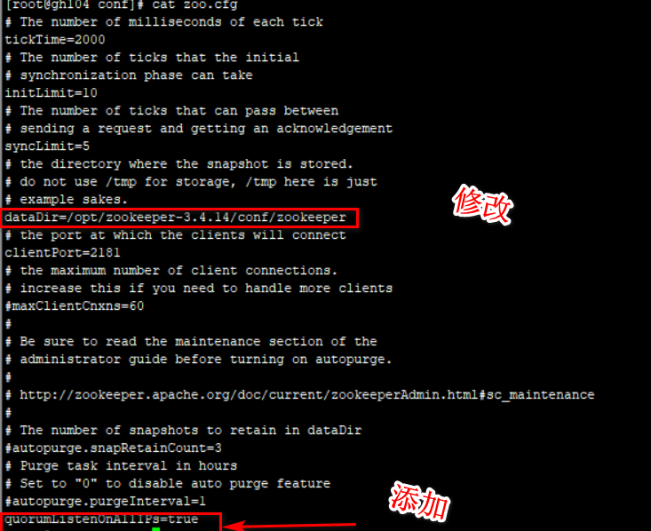

[toc]

# Redhat install kafka

**document support**

ysys

**date**

2020-5-3

**label**

redhat,redhat 7.3,kafka,kafka 2.11-0.8.2.2,virtualbox


## background

​	最近需要使用kettle,kafka,greenplum来测试整体数据传输,所以在本地安装一个kafka

## software

| 序号 | 软件      | 版本                           |
| ---- | --------- | ------------------------------ |
| 1    | operation | CentOS-7.3-x86_64-DVD-1611.iso |
| 2    | kafka     | kafka_2.12-2.3.0.tgz           |
| 3    | zookeeper | zookeeper-3.4.14.tar.gz        |


## machine

| 序号 | IP地址        | 主机  | 内存(G) | 空间大小(G) |
| ---- | ------------- | ----- | ------- | ----------- |
| 1    | 192.168.1.104 | kafka | 2       | 12          |

## installation

- 上传安装包到/software
- 解压安装包

```
# tar -xvf zookeeper-3.4.14.tar.gz -C /opt
# tar -xvf kafka_2.12-2.3.0.tgz -C /opt
```

### zookeeper configuration

- 修改配置文件zoo.cfg(conf目录下),如果没有这个文件进行 `cp zoo_sample.cfg zoo.cfg`

```
# vim zoo.cfg
```



`quorumListenOnAllIPs=true` 所有IP都可以连接

- 启动zookeeper

```
../bin/zkServer.sh start
```


### kafka configuration

- 将目录名修改一下

```
# mv kafka_2.12-2.3.0 kafka
```

- 修改server.properties

```
# vim server.peroperties
```


- 启动kafka

```
# ./kafka-server-start.sh ../config/server.properties &
```

- 测试生产和销售

```
# ./kafka-console-producer.sh --topic Test --broker-list localhost:9092
>ceshi20200831
[2020-08-31 03:12:04,796] WARN [Producer clientId=console-producer] Error while fetching metadata with correlation id 3 : {Test=LEADER_NOT_AVAILABLE} (org.apache.kafka.clients.NetworkClient)
[2020-08-31 03:12:04,902] WARN [Producer clientId=console-producer] Error while fetching metadata with correlation id 4 : {Test=LEADER_NOT_AVAILABLE} (org.apache.kafka.clients.NetworkClient)
[2020-08-31 03:12:05,019] WARN [Producer clientId=console-producer] Error while fetching metadata with correlation id 5 : {Test=LEADER_NOT_AVAILABLE} (org.apache.kafka.clients.NetworkClient)
[2020-08-31 03:12:05,268] WARN [Producer clientId=console-producer] Error while fetching metadata with correlation id 6 : {Test=LEADER_NOT_AVAILABLE} (org.apache.kafka.clients.NetworkClient)
[2020-08-31 03:12:05,378] WARN [Producer clientId=console-producer] Error while fetching metadata with correlation id 7 : {Test=LEADER_NOT_AVAILABLE} (org.apache.kafka.clients.NetworkClient)
[2020-08-31 03:12:05,524] WARN [Producer clientId=console-producer] Error while fetching metadata with correlation id 8 : {Test=LEADER_NOT_AVAILABLE} (org.apache.kafka.clients.NetworkClient)
>qqqqq
>guohiu
>ssfdfa;
>dddd
>{json:date}

# ./kafka-console-consumer.sh  --bootstrap-server localhost:9092 --topic Test --from-beginning
ceshi20200831
qqqqq
guohiu
ssfdfa;
dddd
{json:date}
```

## link

https://blog.csdn.net/haitianxueyuan521/article/details/88651281