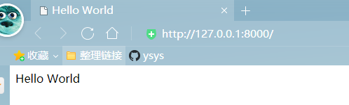
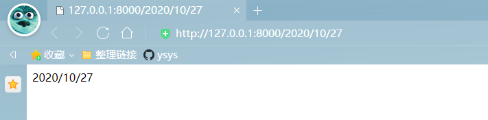
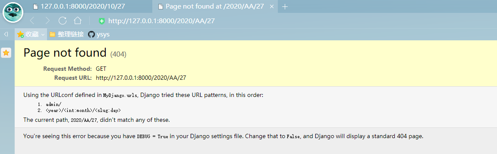
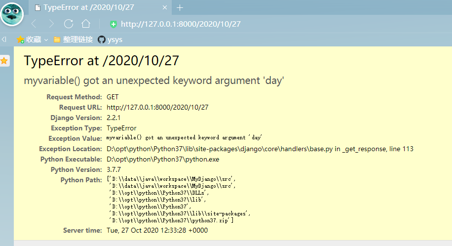
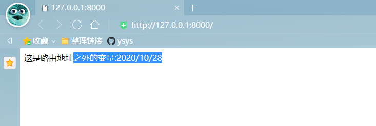
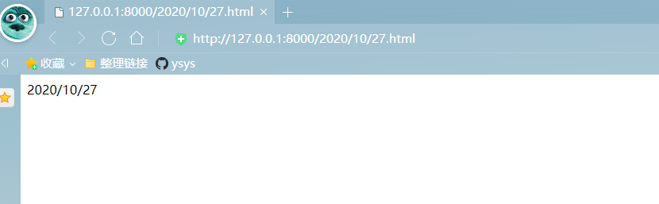
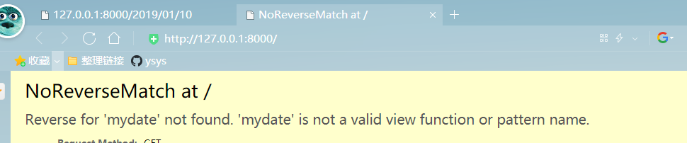
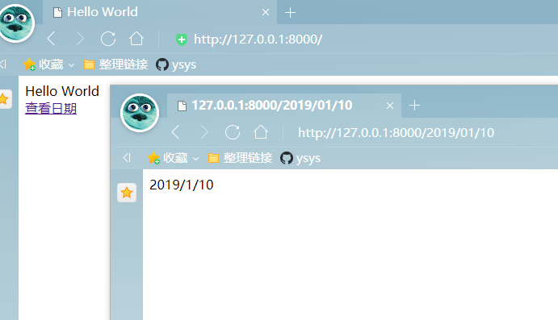
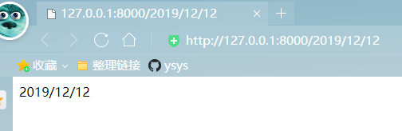

[toc]

# 第3章 初探路由

**document support**

ysys

**date**

2020-10-21

**label**
python,django,《Django Web 应用开发实战》,not final


## Knowledge

​	一个完整的路由包含:路由地址，视图函数，可选变量和路由命名。

​	路由定义规则，命名区间与路由命名，路由的使用方式。


## 3.1 路由定义规则

​	路由成为URL(Uniform Resource Loactor,统一资源定位符)，也可以称为URLconf，是对可以从互联网上得到的资源位置和访问方法的一种简洁的表示，是互联网上标准资源的地址。互联网上的每个文件都有第一个唯一的路由，用来指定网站文件的路径地址。简单来说，路由可视为我们常说的网址，每个网址代表不同的网页。


### 3.2.1 Django 2.x路由定义

​	完整的路由包含：路由地址，视图函数，可选变量和路由命名。其中基本的信息必须有：路由地址和视图函数，路由地址即我们常说的网址，视图函数（或者视图类）即App的views.py文件所定义的函数或类。

​	在讲解路由定义规则之前，需对MyDjango项目的目录进行调整，使其更符合开发规范性。在项目的index文件夹里添加一个空白的py文件，命名为urls.py.

​	在App(index文件夹)里添加urls.py是将所有属于App的路由都写入该文件中，这样更容易和区分每个App的路由地址，而MyDjango文件夹的urls.py是将每个App的urls.py统一管理。这种路由设计模式是Django常用的，其工作原理如下：

1）运行MyDjango项目，Django从MyDjango文件夹的urls.py找到各个app所定义的路由信息，生成完整的路由列表

2）当用户在浏览器上访问某个路由地址时，Django就会收到该用户的请求信息。

3）Django从当前请求信息获取路由地址，并在路由列表里匹配相应的路由信息，再执行路由信息锁执行的视图函数，从而完成整个请求响应过程。

​	在这种路由设计模式下，MyDjango文件夹的urls.py代码如下

```
from django.contrib import admin
from django.urls import path,include
urlpatterns = [
    path('admin/', admin.site.urls),
    # 指向index的路由文件urls.py
    path('',include('index.urls')),
]
```

​	MyDjango文件夹的urls.py定义两条路由信息，分别是Admin站点管理和首页地址(index),其中，Admin站点管理在创建项目时已经自动生成，一般情况下不需要修改，首页地址是指index文件夹的urls.py.

​	MyDjango文件夹的urls.py的代码解释如下：

- from django.contrib import admin:导入内置的Admin功能模块

- from django.urls import path,include：导入Django的路由函数模块

- urlpatterns：代表项目的路由集合，以列表格式表示，每个元素代表一条路由信息。

- path('admin/', admin.site.urls):设置Admin的路由信息，‘admin’代表127.0.0.1:8000/admin的路由地址，admin后面的斜杠是路径分隔符，其作用等同于计算机中文件目录的斜杠符号；admin.site.urls指向内置Admin功能所自定义的路由信息，可以在Python目录Lib\site-packages\django\contrib\admin\sites.py找到具体定义过程

-  path('',include('index.urls')）:路由地址为'\\',即127.0.0.1:8000,通常是网站的首页，路由函数include是将该路由信息分发到indexde urls.py处理

  由于首页地址分发给Index的urls.py处理，因此下一步需要对index的urls.py编写路由信息，代码如下：

```
from django.urls import path

from . import views

urlpatterns = [
               path('',views.index)          
               ]
```

​	index的urls.py编写规则与MyDjango文件夹的urls.py大致相同，这是最为简单的定义方法，此外还可以参考内置的Admin功能路由定义方法

​	在index的urls.py返回index的views.py文件，该文件用于编写视图函数或视图类，主要用于处理当前请求信息并返回响应内容给用户，路由信息path('',views.index)的views.index是指视图函数index处理网站首页的用户请求和响应过程。因此，在index的views.py中编写index的函数过程，代码如下

```
from django.shortcuts import render

# Create your views here.

def index(request):
    value = 'This is test!'
    print(value)
    return render(request,'index.html')
```

​	index函数必须设置一个参数，参数命名不规定，但常以request进行命名，代表当前用户的请求对象，该对象包含当前请求的用户名，请求内容和请求方式等。

​	视图函数执行完成后必须使用return将结果返回，否则程序会抛出异常信息，启动MyDjango项目，在浏览器中访问127.0.0.1:8000



​	从上述例子中可以看出，当启动MyDjango项目时，Django会从配置文件settings.py读取属性ROOT_URLCONF的值，默认值为MyDjango.urls，其代表MyDjango文件夹的urls.py文件，然后根据ROOT_URLCONF的值来生成整个项目的路由列表。

​	路由文件urls.py的路由定义规则是相对固定的，路由列表由urlpatterns表示，每个列表元素代表一条路由，路由是有Django的path函数定义的，该函数第一个参数是路由地址，第二个参数是路由所对应的处理函数，这两个参数是路由定义的必选参数。


### 3.1.2 Django 1.X 路由定义

​	略


### 3.1.3 路由变量的设置

​	在日常的开发过程中，有时一个路由可以代表多个不同的页面，如编写带有日期的路由，若根据前面的编写方式，按照一年来计算则需要开发者编写365个不同的路由才能实现，这种做法明显是不可取的，因此，在Django定义路由时，可以对路由设置变量值，使路由具有多样性。

​	路由的变量类型有字符类型，整形，slug和uuid，最为常用的是字符类型和整形，各个类型说明如下：

- 字符类型：匹配任何非空字符串，但不包含斜杠，如果没有指定类型，就使用默认该类型。

- 整形：匹配0和正整数

- slug：可理解为注释，后缀或附属等概念，常作为路由的解释性字符。可匹配任何ASCII字符以及连接符和下划线，能是路由更加清晰易懂。

- uuid：匹配一个uuid对象。字母小写，必须使用“-”

  根据上述变量类型,在MyDjango项目的index文件夹的urls.py里重新定义路由，并且带有字符类型，整形和slug的变量

```
from django.urls import path

from . import views

urlpatterns = [
               # 添加带有字符类型，整形，slug路由
               path('<year>/<int:month>/<slug:day>',views.myvariable)
               ]
```

​	在路由中，使用变量符号"<>"可以设置路由设置变量。在括号里面以冒号划分两部分，冒号前面代表的是变量的数据类型，冒号后面代表的是变量名，变量名可以自行命名，如果没有设置变量的数据类型，就默认为字符类型，上述代码设置了3个变量，分别是`<year>`

,`<int:month>`,`<slug:day>`,变量说明如下：

- `<year>`:变量名为year,数据格式是字符类型
- `<int:month>`:变量名为month，数据格式为整形
- `<slug:day>`:变量名为day,数据格式为slug

在上述新增的路由中，路由的处理函数为myvariable,因此在index的views.py中编写视图myvariable的处理过程，代码如下

```
from django.http import HttpResponse
# Create your views here.


def myvariable(request,year,month,day):
    return HttpResponse(str(year)+'/'+str(month)+'/'+str(day))
```

​	视图函数myvariable有4个参数，其中参数year，month,day参数值分别来自所设置的变量`<year>`,`<int:mounth>`,和`<slug:day>`。启动项目，在浏览器上执行`http://127.0.0.1:8000/2020/10/27`



​	从上述例子可以看出，路由地址所设置的变量可在试图函数里以参数的形式使用，视图函数的myvariable将路由地址的变量值作为响应内容(2020/10/27)输出的网页上，如果浏览器输入的路由地址与变量类型不相符，Django就会提示Page not found，比如路由地址的10改为AA，如下图所示




​	路由的变量和视图函数的参数要一一赌赢，如果试图函数的参数与路由的变量对应不上，那么程序就会抛出参数不相符的报错信息。比如路由地址设置了三个变量，而视图函数myvariable仅仅设置了来个那个路由变量的参数year和month,当再次访问网页的内容的时候，浏览器就会提示报错信息




​	除了在路由地址设置变量外，Django还支持在路由地址外设置变量（路由的可选变量).在Index的urls.py和views.py分别增加路由和视图函数，代码如下

```
# index的views.py
#coding=utf-8
from django.shortcuts import render
from django.http import HttpResponse
# Create your views here.
def index(request,month):
    return HttpResponse('这是路由地址之外的变量:'+month)

def myvariable(request,year,month,day):
    return HttpResponse(str(year)+'/'+str(month)+'/'+str(day))


# index的urls.py
from django.urls import path

from . import views

urlpatterns = [
               # 添加带有字符类型，整形，slug路由
               path('<year>/<int:month>/<slug:day>',views.myvariable),
               # 添加路由地址外的变量month
               path('',views.index,{'month':'2020/10/28'})
               ]

```

​	从上述代码可以看出，路由参数path的第三个参数是{'month':'2020/10/28'}，该参数的设置规则如下：

- 参数只能以字典的形式表示
- 设置的参数只能在视图函数中读取和使用
- 字典的一个键值对代表一个参数，键值对的键代表参数名，键值对的值代表参数值
- 参数值没有数据格式限制，可以为某个实例对象，字符串或列表等




### 3.1.4 正则表达式的路由定义

​	为了更好的规范日期格式，可以使用正则笔导师限制路由地址边爱那个的取值范围

​	在Index文件夹的urls.py里使用正则表达式定义路由地址，代码如下

```
#coding=utf-8
from django.urls import re_path

from . import views

urlpatterns = [
               re_path('(?P<year>[0-9]{4})/(?P<month>[0-9]{2})/(?P<day>[0-9]{2}).html',views.mydate),
               ]

```

​	路由的正则表达式是由路由函数re_path定义的，其作用就是将路由变量进行截取和判断，正则表达式是以小括号为单位的，每个小括号的前后都可以使用斜杠或者其他字符将其分隔与结束。

- ?P是固定格式，字母P必须是大写
- `<year>`为变量名
- [0-9]{4}是正则表达式的匹配模式，代表变量的长度为4，只是允许取出0-9的值

​	还需要在index的views.py中编写视图函数mydate

```
from django.http import HttpResponse
# Create your views here.
def mydate(request,year,month,day):
    return HttpResponse(str(year)+'/'+str(month)+'/'+str(day))
```





## 3.2 命名空间和路由命名

​	网站规模越大，其网页的数量就会越多，如果网站的网址过多，在管理和维护上就会有一定的难度，Django为了更好的管理和使用路由，可以为每条路由设置命名空间或路由命名。


### 3.2.1 命名空间 namespace

​	在MyDjango项目里创建新的项目应用user，并且在user文件夹里创建urls.py文件，然后在配置文件settings.py的INSTALLED_APPS里添加项目应用user，使得Django在运行的时候能够识别项目应用user.

​	在MyDjango文件夹的urls.py中重新定义路由信息，分别指向Index文件夹的urls.py和user文件夹下的urls.py

```
from django.contrib import admin
from django.urls import path,include


urlpatterns = [
               # 指向内置Admin后台系统的路由文件sites.py
               path('admin/',admin.site.urls),
               # 指向index的路由文件
               path('',include(('index.urls','index'),namespace='index')),
               # 指向user的路由文件urls.py
               path('user/',include(('user.urls','user'),namespace='user')),
               ]
```

​	上述代码中，新增的路由使用Django路由函数include并且分别执行index文件夹的urls.py和user文件夹的urls.py。在函数include里设置了可选参数namespace,该参数是函数include特有的参数，这就是Django设置路由的命名空间。

​	路由函数include设有参数arg和namespace,参数args指向项目应用app和urls.py文件，其数据格式以元组或字符串表示，可选参数namespace是路由的命名空间。

​	若要对路由设置参数namespace，则参数arg必须以元组格式表示，并且元组的长度必须为2，元组的元素说明如下：

- 第一个元素为项目应用的urls.py文件，比如('index.urls','index')的‘index.urls’,这是代表项目应用index的urls.py文件
- 第二个元素可以自行命名，但不能为空，一般情况下施以项目应用的名称进行命名，如`'index.urls','index'`的`index`是以项目应用index进行命名的


​	如果路由设置参数namespace并且参数arg为字符串或元组长度不足2的时候，在运行MyDjango的时候，Django就会提示错误信息，

```
 File "D:\data\java\workspace\MyDjango\src\MyDjango\urls.py", line 29, in <module>
    path('',include(('index.urls'),namespace='index')),
  File "D:\opt\python\Python37\lib\site-packages\django\urls\conf.py", line 39, in include
    'Specifying a namespace in include() without providing an app_name '
```

​	下一步是分析路由函数include的作用，它是将当前路由分配到某个应用项目的urls.py文件，而项目应用的urls.py文件可以设置多条路由，这种情况类似计算机上的文件夹A，并且该文件夹下包含多个子文件夹，而Django的命名空间namespace相当于对文件夹A进行命名。

​	假设项目路由设计为：在MyDjango文件夹的urls.py新定义4条路由，每条路由都使用函数include,并分别命名为A,B,C,D,每条路由对应某个项目应用的urls.py文件，并且每个项目应用的urls.py文件里定义若干条路由。

​	根据上述的路由设计模式，将MyDjango文件夹的urls.py视为计算机上的D盘，在D盘上有4个文件夹，分别命名A,B,C,D每个项目应用的urls.py所定义的若干条路由可视为这4个文件夹里面的文件，在这种情况下，Django的命名空间namespace等同于文件夹A,B,C,D的文件名。

​	Django的命名空间namepsace可以为我们快速定位某个项目应用的urls.py再结合路由命名name就能快速从项目应用的urls.py找到某条路由的具体信息，这样就能有效管理整个项目的路由列表。有关路由函数的include定义过程，可以在Python安装目录下找到源代码进行解读(`\Lib\site-packages\django\urls\conf.py`)


### 3.2.2 路由命名name

​	在MyDjango文件夹的urls.py重新定义路由，两条路由都使用路由函数include并且指向index文件夹的urls.py和user文件夹的urls.py，命名空间namespace分别为index和user.在此基础上，在index文件夹的urls.py和user文件夹的urls.py中重新定义路由

```
# index的urls.py
#coding=utf-8
from django.urls import re_path,path

from . import views

urlpatterns = [
               re_path('(?P<year>[0-9]{4})/(?P<month>[0-9]{2})/(?P<day>[0-9]{2}).html',views.mydate),
               path('',views.index,name='index'),
               ]
               
# user文件夹的urls.py               
#coding=utf-8

from django.urls import path
from . import views
urlpatterns = [
               path('index',views.index,name='index'),
               path('login',views.userLogin,name='userLogin')

               ]               
```

​	每个项目应用的urls.py都定义了两条路由，每个路由都是由相应的视图函数进行处理，因此在index文件夹的views.py和user文件夹的views.py中定义视图函数

```
# index的views.py
#coding=utf-8
from django.shortcuts import render
from django.http import HttpResponse
# Create your views here.
def mydate(request,year):
    return HttpResponse(str(year))
def index(request):
    return render(request,'index.html')


# user的views.py
from django.shortcuts import render
from django.http import HttpResponse
# Create your views here.

def index(request):
    return HttpResponse('This is userIndex')

def userLogin(request):
    return HttpResponse('This is userLogin')
```

​	项目应用index和user的urls.py所定义的路由都设置了参数name,这是对路由进行命名，它是由路由函数path或re_path的可选参数。从3.2.1小节中的例子得知，项目应用的urls.py所定义的若干条路由可视为D盘下的某个文件夹里的文件，而文件夹的每个文件的命名是唯一的，路由命名name的作用等同于文件夹的文件名。

​	如果路由函数里使用路由函数include,就可以对该路由设置参数name，因为路由的命名空间namespace是路由函数include的可选参数，而路由命名name是路由函数path或re_path的可选参数，两者隶属不同的路由函数，因此可在同一路由里共存。一帮情况下，使用路由函数include就没有必要在对路由设置参数name,尽管设置了参数name，但在实际开发中没有实质的作用。

​	从index的urls.py和user的urls.py的路由可以看出，不同项目应用的路由命名是可以重复的，比如项目应用index和user皆设置了名为index的路由，这种命名方式是合理的。

​	综上所述，Django的路由命名设置name是对路由进行命名的，其作用是在开发过程中可以在视图或者模块等其他功能模块里使用路由命名name来生成路由地址。

​	在实际开发过程中，我们支持使用路由命名，因为网站更新或防止爬虫程序往往需要频繁修改路由地址，倘若在视图或模块等其他功能模块里使用路由地址，当路由地址发生更新变换时，这些模块里所使用的路由地址也要随之修改。这样就不利于版本的变更和维护；相对而言，如果在这些功能模块里使用路由命名来生成路由地址，就能避免路由地址的更新维护问题。


## 3.3 路由的使用方式

​	路由为网站开发定义了具体的网址，不仅如此，他还能被其他模块使用，比如截图，模块，模型，Admin后台或表单等，本节将讲述如何在其他功能模块下优雅的使用路由。


### 3.3.1 在模块中使用路由

​	通过前面的学习，相信读者对Django 的路由定义规则有了一定的掌握，路由经常在模块或者视图中频繁使用，举个例子(原书是爱奇艺)，我们在访问哔哩哔哩的时候，网页上会有各种各样的连接，单击这些链接地址可以访问其他网页，如下图所示


​	如果将上图当成一本书，bilibili首页可以看出书的目录，通过书的目录就能快速找到要阅读的内容，同理，网站首页的功能也是如此，它的作用是将网站所有的网址一并显示。

​	从网站开发的角度分析，网址代表路由，若想将项目定义的路由显示在网页上，则要在模块上使用模版语法来生成路由地址。Django内置了一套模版语法，它能将Python的语法转换成HTML语言，然后通过浏览器解析HTML语言并生成相应的网页内容。

​	打开MyDjango项目，该项目仅有一个项目应用文件夹index和模块文件夹templates,在index文件夹和模块templates文件夹中分别添加urls.py和index.html，切勿忘记在settings.py添加Index文件夹和templates文件夹的配置信息。

​	项目环境搭建陈工后，在MyDjango文件中的urls.py中使用路由函数path和include定义项目应用文件夹index的路由。

```
from django.contrib import admin
from django.urls import path,include


urlpatterns = [
               # 指向内置Admin后台系统的路由文件sites.py
               path('admin/',admin.site.urls),
               # 指向index的路由文件
               path('',include('index.urls')),     
               ]

```

​	在项目应用index里，分别在urls.py和views.py文件中定义路由和视图函数；并且在模块文件夹templates的index.html文件中编写模块内容，代码如下：

```
# index文件urls.py
#coding=utf-8
from django.urls import re_path,path

from . import views

urlpatterns = [
               path('<year>/<int:month>/<slug:day>',views.mydate,name='mydate'),
               path('',views.index),
               ]
          
 
# index文件views.py

#coding=utf-8
from django.shortcuts import render
from django.http import HttpResponse
# Create your views here.
def mydate(request,year,month,day):
    return HttpResponse(str(year)+'/'+str(month)+'/'+str(day))
def index(request):
    return render(request,'index.html')
    
    
    
# 根路径templates的index.html

```

​	项目应用index的urls.py和views.py文件的路由和视图函数定义过程不再详细讲述。我们分析index.html的模版内容，模版使用Django内置的模版语法url来生成路由地址，模版语法url里设有4个不同的参数，其说明如下

- mydate:代表命名为mydate的路由，即index的urls.py设有字符型，整形和slug的路由。
- 2019:代表路由地址变量year,它与mydate之间使用空格隔开
- 01:代表路由地址变量month，它与2019之间使用空格隔开
- 10:代表路由地址变量day,它与01之间使用空格隔开


​	模板语法url的参数设置与路由定义是相互关联的，具体说明如下：

- 若路由地址存在变量，则模版语法url需要设置相应的参数值，参数值之间使用空格隔开
- 若路由地址不存在变量，则模板语法url只需要设置路由命名name即可，无需设置额外的参数
- 若路由地址的变量与模板信息url的参数数量不相同，则在浏览器访问网页的时候会提示NoReverseMath at的错误信息



​	从路由定义与模版的url使用对比发现，路由所设置的变量month与模版语法url的参数，'01'是不同的数据类型，这种写法是允许的的



​	上述例子中，MyDjango文件夹的urls.py在使用函数include定义路由时并没有设置命名空间namespace.若设置了命名空间namespace,则模板里使用路由的方式有多变换。

```
#MyDjango文件夹下urls.py
from django.contrib import admin
from django.urls import path,include


urlpatterns = [
               # 指向内置Admin后台系统的路由文件sites.py
               path('admin/',admin.site.urls),
               # 指向index的路由文件
               #path('',include('index.urls')),  
               path('',include(('index.urls','index'),namespace='index')),   
               ]


# 根路径templates的index.html
<!DOCTYPE html>
<html lang="en">
<head>
	<meta charset="UTF-8">
	<title>Hello World</title>
</head>
<body>
	<span>Hello World</span>
	<br>
	{#<a href="">查看日期</a>#}
	<a href="">查看日期</a>
</body>
</html>
```

​	从模板文件index.html可以看出，若项目应用的路由设有命名空间namespace，则模版语法url在使用路由时，需要在命名路由name前面添加命名空间namespace并且使用冒号隔开，如`namespace:name`.如路由在定义过程中使用命名空间namespace，而模版语法url没有添加命名空间namespace，则在访问网页时，Django会提示上面的报错


### 3.3.2 反向解析reverse和resolve

​	路由除了在模板里使用之外，还可以在视图里使用。我们知道Django的请求生命周期是指用户在浏览器访问网页时，Django根据网址在路由列表里查找相应的路由，再从路由里找到试图函数或视图类进行处理，将处理结果作为响应内容返回浏览器并生成网页内容。这个生命周期是不逆的，而在视图里使用路由这一过程被称为反向解析。

​	Django的反向解析主要是由函数reverse和resolve实现；函数reverse是通过路由命名或可调用视图对象来生成路由地址的，函数resolve是通过路由地址来获取路由对象信息的。

```
# MyDjango文件夹的urls.py
from django.contrib import admin
from django.urls import path,include


urlpatterns = [
               # 指向内置Admin后台系统的路由文件sites.py
               path('admin/',admin.site.urls),
               # 指向index的路由文件
               #path('',include('index.urls')),  
               path('',include(('index.urls','index'),namespace='index')),   
               ]
               
# index文件及的urls.py

#coding=utf-8
from django.urls import re_path,path

from . import views

urlpatterns = [
               path('<year>/<int:month>/<slug:day>',views.mydate,name='mydate'),
               path('',views.index,name='index'),
               ]
               
```

​	由于反向解析函数reverse和resolve常用于视图(views.py)，模型（models.py)等

```
# index文件夹views.py
#coding=utf-8
from django.shortcuts import render
from django.http import HttpResponse
from django.shortcuts import reverse
from django.urls import resolve
# Create your views here.
def mydate(request,year,month,day):
    args = ['2019','12','12']
    result = resolve(reverse('index:mydate',args=args))
    print('kwars:',result.kwargs)
    print('url_name:',result.url_name)
    print('namespace:',result.namespace)
    print('view_name:',result.view_name)
    print('app_name:',result.app_name)
    return HttpResponse(str(year)+'/'+str(month)+'/'+str(day))
def index(request):
    kwargs = {'year':2019,'month':2,'day':10}
    args = ['2019','12','12']
    print(reverse('index:mydate',args=args))
    print(reverse('index:mydate',kwargs=kwargs))
    return render(request,'index.html')

```

​	函数index主要使用反向解析函数reverse来生成路由mydate的路由地址

```

def reverse(viewname, urlconf=None, args=None, kwargs=None, current_app=None):
    if urlconf is None:
        urlconf = get_urlconf()
        ...
```

​	函数reverse设有必选函数viewname,其他参数是可选参数，各个参数说明如下

- viewname:代表路由命名或可调用视图对象，一般情况下是以路由命名name来生成路由地址的。
- urlconf:设置参详解析的URLconf模块，默认情况下，使用配置文件settings.py的ROOT_URLCONF属性
- args:以列表方式传递路由地址变量，列表元素顺序和数量应与路由地址变量的顺序和数量一致。
- kwargs:以字典方式传递路由地址变量，字典的键必须对应路由地址变量名，字段的键值对数量与变量的数量一致。
- current_app:提示当前正在执行的视图所在的项目应用，主要起到提示作用，在功能上并无实质的作用


​	一般情况下只需要设置函数reverse的参数viewname即可，如果路由地址设有变量，那么自行选择args或kwargs设置路由地址的变量值。参数args和kwargs不能同时设置，否则会提示ValueError报错信息。

​	运行MyDjano项目，在浏览器访问127.0.0.1:8000,当前请求将有视图函数index处理，该函数使用reverse来获取路由命名mydate的路由地址并显示在网页上

```
/2019/12/12
```

​	从网页内容得知，路由地址`/2019/12/12`是一个相对路径，在Django里，所有路由地址皆以相对路径表示，地址路径首个斜杠`/`代表域名`127.0.0.1:8000`

​	接下里分析视图函数mydate，它在函数reverse的基础上使用函数resolve，打开resolve源码文案金

```
def resolve(path, urlconf=None):
    if urlconf is None:
        urlconf = get_urlconf()
    return get_resolver(urlconf).resolve(path)
```

​	函数resolve设有两个参数，参数path为必选参数,urlconf是可选参数

- path:代表路由地址，通常路由地址来获取对应的路由对象信息

- urlconf:设置反向解析的URLconf模块，默认情况下，使用配置文件settings.py的ROOT_URLCONF属性

  函数resolve是对路有对象作为返回值的


​	

| 函数方法   | 说明                                     |
| ---------- | ---------------------------------------- |
| func       | 路由的视图函数对象或视图类对象           |
| args       | 以列表形式来获取路由的变量信息           |
| kwargs     | 以字典格式获取路由的变量信息             |
| url_name   | 获取路由名称name                         |
| app_name   | 获取路由函数include参数arg的第二个元素值 |
| app_names  | 与app_name一致，列表展示                 |
| namespace  | 路由的命名空间                           |
| namespaces | namespaces列表格式表示                   |
| view_name  | 获取整个路由的名称，包括命名空间         |


​	运行MyDjango项目，在浏览器访问127.0.0.1:8000/2019/12/12

```
kwars: {'year': '2019', 'month': 12, 'day': '12'}
url_name: mydate
namespace: index
view_name: index:mydate
app_name: index
```

​	综上所述，函数reverse和resolve主要是对路由进行反向没戏，通过路由命名或路由地址来获取路由信息。


### 3.3.3 路由重定向

​	重定向称为HTTP协议重定向，也称为网页跳转，他对应的HTTP状态为301,302,303,304,307,308.简单来说，网页重定向就在浏览器访问某个网页的时候，这个网页不提供响应内容，而是自动跳转到其他网址，由其他网址来生成相应内容。

​	Django的网页重定向有两种方式：第一种方式是路由重定向；第二种方式是自定义视图的重定向。两种重定向方式各有特点，前者是使用Django内置的视图类RedirectView实现的，默认支持HTTP的GET请求；后者是在自定义视图的响应状态设置重定向，能让开发这实现多方面的开发需求。

​	

```
#coding=utf-8
from django.urls import re_path,path
from django.views.generic import RedirectView
from . import views

urlpatterns = [
               path('<year>/<int:month>/<slug:day>',views.mydate,name='mydate'),
               path('',views.index,name='index'),
               path('trunTo',RedirectView.as_view(url='/'),name='trunTo'),
               ]
```

​	

```
#coding=utf-8
from django.http import HttpResponse
from django.shortcuts import reverse
from django.shortcuts import redirect
# Create your views here.
def mydate(request,year,month,day):
    return HttpResponse(str(year)+'/'+str(month)+'/'+str(day))
def index(request):
    print(reverse('index:trunTo'))
    return redirect(reverse('index:mydate',args=[2019,12,12]))

```


​	运行MyDjango项目，在浏览器中输入`127.0.0.1:8000/trunTo`




## 3.4 本章小结

