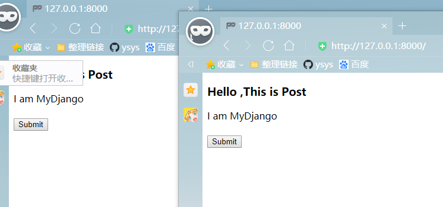

[toc]

# 第5章 探究CBV视图

**document support**

ysys

**date**

2020-10-21

**label**
python,django,《Django Web 应用开发实战》,not final


##  探究CBV视图

​	视图类是通过定义和声明类的形式来实现的，根据用途划分3个部分，数据显示视图，数据操作视图，日期筛选视图


## 5.1 数据显示视图

- RedirectView用于实现HTTP重定向，默认情况下只定义GET请求的处理方法
- TemplateView是视图类的基础视图，可将数据传递到HTML模块，默认情况下只是定义了GET请求的处理方法
- ListView是在TemplateView的基础上将数据以列表显示，通常将某个数据表的数据以列表表示
- DetailView是在TemplateVIew的基础上将数据详细显示，通常获取数据表的单条数据


### 5.1.1 重定向视图RedirectView

​	视图类RedirectView实现了HTTP重定向功能，即网页跳转功能，在Django的源码里可以看到视图类的ReirectView的定义过程

```
class RedirectView(View):
    """Provide a redirect on any GET request."""
    permanent = False
    url = None
    pattern_name = None
    query_string = False

    def get_redirect_url(self, *args, **kwargs):
        """
        Return the URL redirect to. Keyword arguments from the URL pattern
        match generating the redirect request are provided as kwargs to this
        method.
        """
        if self.url:
            url = self.url % kwargs
        elif self.pattern_name:
            url = reverse(self.pattern_name, args=args, kwargs=kwargs)
        else:
            return None

        args = self.request.META.get('QUERY_STRING', '')
        if args and self.query_string:
            url = "%s?%s" % (url, args)
        return url

    def get(self, request, *args, **kwargs):
        url = self.get_redirect_url(*args, **kwargs)
        if url:
            if self.permanent:
                return HttpResponsePermanentRedirect(url)
            else:
                return HttpResponseRedirect(url)
        else:
            logger.warning(
                'Gone: %s', request.path,
                extra={'status_code': 410, 'request': request}
            )
            return HttpResponseGone()

    def head(self, request, *args, **kwargs):
        return self.get(request, *args, **kwargs)

    def post(self, request, *args, **kwargs):
        return self.get(request, *args, **kwargs)

    def options(self, request, *args, **kwargs):
        return self.get(request, *args, **kwargs)

    def delete(self, request, *args, **kwargs):
        return self.get(request, *args, **kwargs)

    def put(self, request, *args, **kwargs):
        return self.get(request, *args, **kwargs)

    def patch(self, request, *args, **kwargs):
        return self.get(request, *args, **kwargs)

```

​	视图类RedirectView继承了View，类View是所有视图类的底层功能类，视图类RedirectView定义了4个属性和8个方法，分别说明

- permanent:根据属性值的真假来选择重定向方式，若为True,则HTTP状态码为302，否则HTTP状态码为301
- url:代表重定向的路由地址
- pattern_name:代表重定向的路由命名，如何已设置参数url，则无须设置该参数，否则提示异常信息
- query_string:是否将当前路由地址的请求参数传递到重定向的路由地址
- get_redirect_url():根据属性pattern_name所指向的路由命令来生成相应的路由地址
- get():触发HTTP的GET请求所执行的响应处理
- 剩余的类方法head(),post(),options(),delete(),put()和patch()是HTTP的不同的请求方式。它们都是由get()方法完成响应处理

```python

# index的urls.py
from django.urls import path
from .views import *

urlpatterns = [
    # 定义首页路由
    path('',index,name='index'),
    path('trunTo',trunTo.as_view(),name='trunTo'),
]


# index的views.py
#coding=utf-8
from django.views.generic.base import RedirectView
from django.shortcuts import render

def index(request):
    return render(request,'index.html')

class trunTo(RedirectView):
    # 设置属性
    permanent = True
    url = None
    pattern_name = 'index:index'
    query_string = True
    
    # 重写get_redirect_url
    def get_redirect_url(self, *args, **kwargs):
        print('This is get_redirect_url')
        return super().get_redirect_url(*args, **kwargs)
    
    # 重写get
    def get(self, request, *args, **kwargs):
        print('This is get')
        print(request.META.get('HTTP_USER_AGNET'))
        return super().get(request, *args, **kwargs)
        
        
        
# templates的index.html

<!DOCTYPE html>
<html>
<body>
<h3>Hello World</h3>
<a href="?k=1">trunTo</a>
</body>
</html>
```


### 5.1.2 基础视图TemplateView

​	视图类TemplateView是所有视图类里最基础的应用视图类，开发者可以直接调用应用视图类，他继承了多个类,TemplateResponseMixin,ContextMixin,View

```
class TemplateView(TemplateResponseMixin, ContextMixin, View):
    """
    Render a template. Pass keyword arguments from the URLconf to the context.
    """
    def get(self, request, *args, **kwargs):
        context = self.get_context_data(**kwargs)
        return self.render_to_response(context)
```

​	从视图类TemplateVIew源码看到，它只是定义了类方法get(),该方法分别到用函数get_context_data()和render_to_response()，从而完成HTTP请求的响应过程。

​	视图类TemplateView的get()所调用的函数说明如下

- 视图类ContextMixin的get_context_data()方法用于获取模版的上下文内容，模板上下文是将视图里的数据传递到模板文件，再由模板引擎将数据转换成HTML网页数据

- 视图类TemplateResponseMixin的render_to_response()用于实现响应处理，由响应类TemplateResponse完成。

  视图类TemplateResponseMixin的定义过程，该类设置了4个属性和两个类方法，这些属性和类方法说明如下

- template_name:设置模板文件的文件名

- template_engine:设置解析模板文件的模板引擎

- response_class:设置HTTP请求的响应类，默认值为响应类TemplateResponse

- content_type:设置响应内容的数据格式，一般情况下使用默认值即可

- render_to_response():实现响应处理，由响应类TemplateResponse完成

- get_template_names():获取属性template_name的值

```
# index的urls.py

from django.urls import path
from .views import *

urlpatterns = [
    # 定义首页路由
    path('',index.as_view(),name='index'),
    
]

# index的views.py
#coding=utf-8
from django.views.generic.base import TemplateView


class index(TemplateView):
    template_name = 'index.html'
    template_engine = None
    content_type = None
    extra_context = {'title':'This is Get'}
    
    
    # 重新设置模板上下文的获取方式
    def get_context_data(self, **kwargs):
        context = super().get_context_data(**kwargs)
        context['value']='I am MyDjango'
        return context
    
    # 定义HTTP的Post请求处理方法
    # 参数request代表HTTP的请求信息
    # 若路由设有变量，则可以从参数kwargs里获取
    def post(self,request,*args,**kwargs):
        self.extra_context = {'title':'This is Post'}
        context = self.get_context_data(**kwargs)
        return self.render_to_response(context)
        
        
# templates的index.html
<!DOCTYPE html>
<html>
<body>
<h3>Hello ,{{ title }}</h3>
<div>{{ value }}</div>
<br>
<form action="" method="post">
 
 <input type="submit" value="Submit">
</form>
</body>
</html>
```

​	自定义视图类index继承视图类TemplateView，并重设了4个属性，重写了两个类方法

- template_name:将模板文件index.html作为网页文件
- template_engine:设置解析模板文件的模板引擎，默认值为None,即默认使用配置文件settings.py的TEMPLATES所设置的模板引擎BACKEND
- content_type:设置响应内容的数据格式,默认值为None,即代表数据格式为text/html
- extra_context:为模板文件的上下文设置的变量值，可将数据转换微网页数据展示在浏览器上。
- get_context_data():继承并重写了TemplateView的类方法，在变量context里新增value
- post():自定义POST请求的处理方法，当触发POST请求时，将会重设属性extra_context的值，并调用get_context_data()将属性extra_context重新写入，从而实现动态改变模板上下文的数据内容


​	在模板文件index.html里看到模板上下文{{title}}和{{value}},它们的数据来源于get_context_date()的返回值。当访问127.0.0.1:8000的时候，上下文title位“This is Get”，当单击"Submit"按钮的时候，上下文title的值改为"This is Post"




### 5.1.3 列表视图ListView

​	视图可以连接路由和模板，除此之外，还可以连接模型。简单来说，模型是指Django通过一定的规则来映射数据库，从而方便实现交互。这个交互是在视图里完成的。

​	Django定义了视图类ListView，该视图类是将数据库表的数据以列表的形式显示，常用于数据的查询和展现。

​	视图类ListView的底层类是由TemplateResponseXmin,ContextMimin和View组成的。

```python
# index的models.py
class PersonInfo(models.Model):
    id = models.AutoField(primary_key=True)
    name = models.CharField(max_length=20)
    age = models.IntegerField()
    
# 生成相关的.py文件
python manage.py makemigrations
# 创建表
python manage.py migrate
```


```python

# index的views.py

class index(ListView):
    # 设置模板文件
    template_name = 'index.html'
    # 设置模型外的数据
    extra_context = {'title':'人员信息表'}
    # 查询模型PersonInfo
    queryset = PersonInfo.objects.all()
    # 每页展示一条数据
    paginate_by = 1
    

# templates的index.html
<!DOCTYPE html>
<html>
<head>
    <title>{{ title }}</title>
</head>    
<body>
    <h3>{{ title }}</h3>
    <table border="1">
      
          <tr>
            <th>{{ i.name }}</th>
            <th>{{ i.age }}</th>
          </tr>
      
    </table>
    <br>
    
    <div class="pagination">
        <span class="page-links">
            
                <a href="/?page={{ page_obj.previous_page_number }}">上一页</a>
            
            
                <a href="/?page={{ page_obj.next_page_number }}">下一页</a>
            
            <br>
            <br>
            <span class="page-current">
                第{{ page_obj.number }}页,共{{ page_obj.paginator.num_pages }}页。
            </span>
        </span>
    </div>
    
</body>
</html>
```

​	视图类index继承父类ListView,并且仅设置了4个属性就能完成模型数据的展示。视图ListView虽然定义了三个属性和方法，但是大部分的属性和方法已有默认的值和处理过程，这些就能满足日常开发需求。

### 5.1.4 详细视图DetailView

```
# index 的urls.py
from django.urls import path
from .views import *

urlpatterns = [
    # 定义首页路由
    path('<pk>/<age>.html',index.as_view(),name='index'),
    
]


# index 的views.py

#coding=utf-8
from django.views.generic import DetailView
from .models import PersonInfo

class index(DetailView):
    # 设置模板文件
    template_name = 'index.html'
    # 设置模型外的数据
    extra_context = {'title':'人员信息表'}
    # 设置模型的查询字段
    slug_field = 'age'
    # 设置路由的变量名,与属性slug_field实现模型的查询操作
    slug_url_kwarg = 'age'
    pk_url_kwarg = 'pk'
    # 设置查询模型PersonInfo
    model= PersonInfo
    
    
# templates 的index.html

<!DOCTYPE html>
<html>
<head>
    <title>{{ title }}</title>
<body>
    <h3>{{ title }}</h3>
    <table border="1">
      <tr>
        <th>{{ personinfo.name }}</th>
        <th>{{ personinfo.age }}</th>
      </tr>
    </table>
    <br>
</body>
</html>
```


## 5.2 数据操作视图

​	数据操作视图是对模型进行操作，如增，删，改，从而实现Django与数据库的数据交互

- FormView 内置的表单功能
- CreateView 数据新增功能
- UpdateView 数据修改功能
- DeleteVIew 数据删除功能


### 5.2.1 表单视图FormVIew


```python
# index的form.py

#coding=utf-8

from django import forms
from .models import PersonInfo

class PersonInfoForm(forms.ModelForm):
    class Meta:
        model = PersonInfo
        fields = '__all__'

#　index的urls.py
from django.urls import path
from .views import *

urlpatterns = [
    # 定义首页路由
    path('',index.as_view(),name='index'),
    path('result',result,name='result'),
]

# index的views.py

#coding=utf-8
from django.views.generic.edit import FormView
from .form import PersonInfoForm
from django.http import HttpResponse

def result(request):
    return HttpResponse('Success')

class index(FormView):
    initial = {'name': 'Betty', 'age': 20}
    template_name = 'index.html'
    success_url = '/result'
    form_class = PersonInfoForm
    extra_context = {'title': '人员信息表'}

# templates 的index.html
<!DOCTYPE html>
<html>
<head>
    <title>{{ title }}</title>
<body>
    <h3>{{ title }}</h3>
    <form method="post">
    
    {{ form.as_p }}
    <input type="submit" value="确定">
    </form>
    <br>
</body>
</html>
```


### 5.2.2 新增视图CreateView

